---

copyright:

  years:  2016, 2019

lastupdated: "2019-05-22"

subcollection: vmware-solutions

---

# 体系结构概述
{: #vcsiks-arch-overview}

{{site.data.keyword.vmwaresolutions_full}} 产品提供了自动化功能，可将 VMware 技术组件部署到全球范围的 {{site.data.keyword.CloudDataCents_notm}} 中。该体系结构包含一个云区域，并支持扩展到其他地理位置中的更多云区域或扩展到同一数据中心内的其他 {{site.data.keyword.cloud_notm}} pod 中。

您可以将 {{site.data.keyword.icpfull_notm}} 和 Cloud Automation Manager (CAM) 产品手动部署到内部部署虚拟化平台中，从而支持通过内部部署位置进行云管理。或者，{{site.data.keyword.icpfull_notm}} 和 CAM 可借助自动化功能，作为服务扩展提供给现有或新的 VMware vCenter Server on {{site.data.keyword.cloud_notm}} 部署，从而支持通过 {{site.data.keyword.cloud_notm}} 进行云管理。

{{site.data.keyword.icpfull_notm}} 是一种用于开发和管理内部部署容器化应用程序的应用程序平台。{{site.data.keyword.icpfull_notm}} 是用于管理容器的集成环境，包括容器编排器 Kubernetes、专用映像存储库、管理控制台和监视框架。

IBM Multi-Cluster Manager 在各种云和集群中提供用户可视性、以应用程序为中心的管理（策略、部署、运行状况和操作）以及基于策略的合规性。通过 IBM Multi-Cluster Manager，您可以控制 Kubernetes 集群。您可以确保集群是安全的、在高效运行，并提供应用程序所需的服务级别。

{{site.data.keyword.cloud_notm}} Automation Manager 是在 {{site.data.keyword.cloud_notm}} Private 上运行的多云自助服务管理平台，支持开发者和管理者满足其业务需求。Cloud Automation Manager Service Composer 支持您在 IBM Cloud Private 目录中公开混合云服务。

## IBM Cloud 端云管理平台
{: #vcsiks-arch-overview-ibm-cloud-side}

下图显示在 {{site.data.keyword.cloud_notm}} 基础架构中部署的 {{site.data.keyword.icpfull_notm}} 和 CAM，连接到 {{site.data.keyword.cloud_notm}} 上部署的内部部署 vCenter 和 {{site.data.keyword.containerlong_notm}} 服务。用户可以将虚拟机 (VM) 内部部署和 VM 部署到 vCenter Server 实例，并将容器部署到 {{site.data.keyword.icpfull_notm}} 和 {{site.data.keyword.containerlong_notm}} 集群。

在该图中，CAM 在逻辑上创建与 vCenter、云提供者、{{site.data.keyword.icpfull_notm}} 和 {{site.data.keyword.containerlong_notm}} 环境的云连接。{{site.data.keyword.icpfull_notm}} 集群必须部署到每个数据中心或云环境，其中 MCM 提供将 {{site.data.keyword.icpfull_notm}} 集群连接到单个管理视图的机制。

可以使用 NSX-V 或 NSX-T 组件来部署 {{site.data.keyword.icpfull_notm}}。通过使用 NSX-V 的 {{site.data.keyword.icpfull_notm}}，支持 {{site.data.keyword.icpfull_notm}} VM 在 VXLAN 网络上运行，并使用 Kubernetes Calico 内部联网。 

通过使用 NSX-T 的 {{site.data.keyword.icpfull_notm}}，用户可以在中央 UI (NSX T Manager) 中控制和配置联网、子网和策略。有关 NSX-V 和 NSX-T 之间的差异的信息，请参阅 [{{site.data.keyword.cloud_notm}} VCS 联网参考体系结构](/docs/services/vmwaresolutions?topic=vmware-solutions-vcsnsxt-intro#vcsnsxt-intro)。

## 内部部署云管理平台
{: #vcsiks-arch-overview-on-premises}

下图显示内部部署基础架构中部署的 {{site.data.keyword.icpfull_notm}} 和 CAM，连接到 {{site.data.keyword.cloud_notm}} 上部署的 vCenter 和 {{site.data.keyword.containerlong_notm}}。用户可以内部部署 VM 和容器，将 VM 部署到 vCenter Server 实例中，并将容器部署到 {{site.data.keyword.containerlong_notm}} 集群中。

strongSwan VPN 用于与部署的 {{site.data.keyword.containerlong_notm}} 容器建立连接。strongSwan 最终可能会被替换为 Direct Link 连接。

在该图中，CAM 在逻辑上创建与 vCenter、云提供者、{{site.data.keyword.icpfull_notm}} 和 {{site.data.keyword.containerlong_notm}} 环境的云连接。{{site.data.keyword.icpfull_notm}} 集群必须部署到每个数据中心或云环境，其中 MCM 提供将 {{site.data.keyword.icpfull_notm}} 集群连接到单个管理视图的机制。

## 相关链接
{: #vcsiks-arch-overview-related}

* [vCenter Server on {{site.data.keyword.cloud_notm}} with Hybridity Bundle 概述](/docs/services/vmwaresolutions?topic=vmware-solutions-vcs-hybridity-intro#vcs-hybridity-intro)
