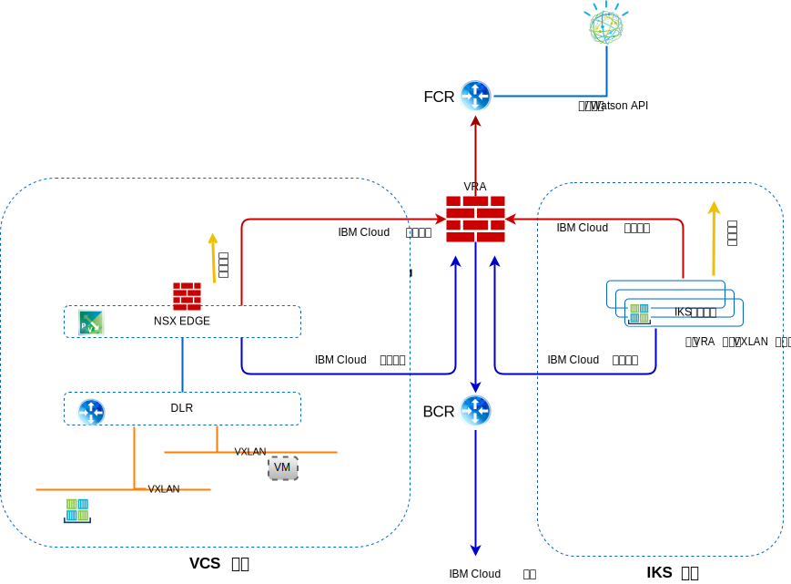

---

copyright:

  years:  2016, 2019

lastupdated: "2019-08-05"

subcollection: vmware-solutions

---

# 联网、备份、灾难恢复和可扩展性
{: #vcsiks-overview-network}

了解有关联网、备份、灾难恢复 (DR) 和可扩展性注意事项的信息。

## 联网
{: #vcsiks-overview-network-networking}

{{site.data.keyword.cloud}} 有两个网络。公用网络支持通过因特网访问服务器，而专用网络支持所有 {{site.data.keyword.CloudDataCents_notm}} 中的服务器通过高速主干相互通信。

缺省情况下，{{site.data.keyword.containerlong_notm}} 将集群设置为有权访问公用 VLAN 和专用 VLAN。
- 每个工作程序节点的公共 IP 地址，用于为工作程序节点提供公用网络接口。
  - 所有工作程序节点支持所有出站网络流量。
  - 入站网络流量被阻止（少数端口除外）。打开这些端口是为了使 IBM 可以监视网络流量，并自动为 Kubernetes 主节点安装安全性更新。
- 每个工作程序节点的专用 IP 地址，用于为工作程序节点提供专用网络接口。
- 所有工作程序节点和主节点之间的自动、安全的 OpenVPN 连接。

### IBM Cloud Kubernetes Service 与 vCenter Server 集成
{: #vcsiks-overview-network-iks-vcs-integration}

目前，以下方案可用于集成 {{site.data.keyword.containerlong_notm}} 与 VMware vCenter Server on {{site.data.keyword.cloud_notm}} 联网：
- **VRA 路由** - 此方案需要 {{site.data.keyword.containerlong_notm}} 工作程序节点部署到与 vCenter Server 实例相同的 VLAN 上。这允许通过 VRA 使 ESG 成为 BGP 的同级，并支持从覆盖网络路由到 vCenter Server 和 {{site.data.keyword.containerlong_notm}} 之间的底层网络。每个 VXLAN 网络的 {{site.data.keyword.containerlong_notm}} 工作程序节点上都需要一个静态路由，用于将这些请求路由回 BCR/VRA，从而实现正确路由。
- **strongSwan VPN** - 此方案使用标准 {{site.data.keyword.containerlong_notm}} 到企业连接解决方案。strongSwan 容器为集群提供 VPN 网关，用于将包通过远程网关的 IPSec 隧道转发到远程网络。此远程网关是 vCenter Server 实例上的 ESG。在网关上，路由会配置为将所有集群和服务 IP 范围发送到 StrongSwan 容器，并将所有 vCenter Server BYOIP 地址发送到 ESG。网关的目标 IP 地址是分配给 strongSwan 容器的 LoadBalancer 服务的专用可移植 IP 地址，以及 ESG 的专用可移植 IP 地址。

#### IBM Cloud Kubernetes Service 联网 VLAN
{: #vcsiks-overview-network-iks-vlans}

以下信息适用于公用 VLAN 子网：
- 主公用子网确定在集群创建期间分配给工作程序节点的公用 IP 地址。同一 VLAN 上的多个集群可以共享一个主公用子网。
- 可移植公用子网仅绑定到一个集群，并为集群提供 8 个公共 IP 地址。其中 3 个 IP 保留用于网络功能。1 个 IP 由缺省公共 Ingress ALB 使用，另外 4 个 IP 用于创建公共负载均衡器联网服务。
- 可移植公共 IP 是永久的固定 IP 地址，用于通过因特网访问 LoadBalancer 服务。

以下信息适用于专用 VLAN 子网：
- 主专用子网确定在集群创建期间分配给工作程序节点的专用 IP 地址。同一 VLAN 上的多个集群可以共享一个主专用子网。
- 可移植专用子网仅绑定到一个集群，并为集群提供 8 个专用 IP 地址。其中 3 个 IP 保留用于网络功能。1 个 IP 由缺省专用 Ingress ALB 使用，另外 4 个 IP 用于创建专用负载均衡器联网服务。
- 可移植专用 IP 是永久的固定 IP 地址，用于通过因特网访问 LoadBalancer 服务。

#### Calico 网络插件
{: #vcsiks-overview-network-calico}

每个 Kubernetes 集群都会设置为使用称为 Calico 的网络插件。

设置的缺省网络策略可保护 {{site.data.keyword.containerlong_notm}} 中每个工作程序节点的公用网络接口。如果您具有独特的安全性需求，或者具有启用了 VLAN 生成或虚拟路由和转发 (VRF) 的多专区集群，那么可以使用 Calico 和 Kubernetes 为集群创建网络策略。通过 Kubernetes 网络策略，可以指定要允许或阻止进出集群中 pod 的网络流量。

要设置更高级的网络策略（例如阻止入站（流入）流量流至 LoadBalancer 服务），请使用 Calico 网络策略。

Kubernetes 网络策略指定了 pod 如何与其他 pod 以及公用网络服务端点进行通信。还可以根据 pod 和名称空间标签对流量进行过滤。Kubernetes 网络策略使用 kubectl 命令或 Kubernetes API 进行应用。应用这些策略后，这些策略将自动转换成 Calico 网络策略，随后 Calico 会强制实施这些策略。

适用于 Kubernetes 的 Calico 网络策略是 Kubernetes 网络策略的超集，使用 calicoctl 命令进行应用。

Calico 策略会添加以下功能：
- 允许或阻止特定网络接口上的网络流量，而不考虑 Kubernetes pod 源或目标 IP 地址或 CIDR。
- 允许或阻止跨名称空间的 pod 的网络流量。
- 阻止入站（流入）流量流至 LoadBalancer 或 NodePort Kubernetes 服务。

Calico 通过在 Kubernetes 工作程序节点上设置 Linux iptables 规则来强制实施这些策略，包括自动转换成 Calico 策略的任何 Kubernetes 网络策略。iptables 规则充当工作程序节点的防火墙，用于定义网络流量必须满足才能转发到目标资源的特征。

### 流量流
{: #vcsiks-overview-network-traffic-flows}

#### 从因特网上的外部用户到 IBM Cloud Kubernetes Service 的容器中托管的 Web 层
{: #vcsiks-overview-network-web-tier-iks}

1. 外部用户使用 URL 向 Web 层发出请求。
2. 使用 DNS 确定 IP 地址。此 IP 地址是可移植子网上已分配给 ALB 或 Ingress 服务的 {{site.data.keyword.cloud_notm}} 公共地址。
3. 公用网络自动将请求转发到托管 ALB 或 Ingress 服务的工作程序节点。
4. 工作程序节点将请求转发到 ALB 或 Ingress 服务的内部集群 IP 地址和端口号。此内部集群 IP 地址仅在集群内可访问。
5. 在工作程序节点中，kube-proxy 将请求路由到 ALB 或 Ingress 服务。
6. 如果应用程序位于同一工作程序节点上，那么将使用 iptables 来确定哪个内部接口用于转发请求。如果应用程序位于其他工作程序节点上，那么仅当该工作程序节点位于不同子网上时，Calico vRouter 才会使用 IP-in-IP 封装来路由到适用的工作程序节点。

#### 从 IBM Cloud Kubernetes Service 的容器中托管的 Web 层到 vCenter Server 的虚拟机中托管的数据库层
{: #vcsiks-overview-network-web-tier-vm}

将创建详细描述外部数据库虚拟机 (VM) 的端点资源，包括 mysql 数据库 VM 的 NAT IP 地址和端口号，等等。

- kind: Endpoints
- apiVersion: v1
- metadata:
  - name: mysqldb
- subsets:
  - addresses:
      - ip: 10.x.x.x
  - ports:
      - port: 3306

端点资源可以具有列出的多个地址，Kubernetes 会循环使用这些地址。  

服务资源用于在 kube-dns 中为服务创建 IP 和 DNS 名称：

- kind: Service
- apiVersion: v1
- metadata:
  - name: mysqldb
- labels:
  - name: mysqldb
- spec:
  - ports:
    - protocol: TCP
    - port: 3306

#### 流程
{: #vcsiks-overview-network-flow}

1. 在 {{site.data.keyword.containerlong_notm}} 的容器中运行的 Web 层通过调用 mysqldb，向在 vCenter Server 实例中的 VM 上运行的数据库发出请求。Kubernetes 会将此名称解析为 IP 地址，然后将此请求与数据库服务器经过 NAT 处理的 IP 的目标 IP 地址 (10.x/26) 和工作程序节点的源 IP (10.x/26) 发送到集群外部。
2. 由于目标 IP 地址与工作程序节点不在同一子网上，因此会将其转发到 {{site.data.keyword.cloud_notm}} BCR。
3. BCR 路由该请求，并将其放置在连接了 customer-nsx-edge 的**专用 A** VLAN（客户工作负载子网）上。

此 NSX Edge 具有：
- 允许此连接的防火墙规则。
- 将目标 IP 地址从 10.x 地址更改为用于数据库服务器的 192.168 地址的 DNAT 规则。
4. ESG 随后将该请求转发到 DLR。
5. DLR 将请求置于所需的 VXLAN 上。
6. 数据库 VM 收到请求。

## 备份和 DR
{: #vcsiks-overview-network-backup-dr}

### vCenter Server 备份
{: #vcsiks-overview-network-vcs-backup}

Veeam 备份软件是 {{site.data.keyword.vmwaresolutions_short}} 的一部分，可使用 VMware 集群外部的 {{site.data.keyword.cloud_notm}} 耐久性存储器选择性部署在 {{site.data.keyword.cloud_notm}} 虚拟服务器实例 (VSI) 上。此软件的用途是备份此解决方案中的管理组件。

### NSX 备份
{: #vcsiks-overview-network-nsx-backup}

妥善备份所有 NSX 组件至关重要，这样才能在发生故障时将系统复原到其正常运行状态。但是光备份 NSX VM 是不够的。必须利用 NSX Manager 中的 NSX 备份功能才能实现妥善备份。此备份需要将 FTP 或 SFTP 服务器指定为 NSX 备份数据的存储库。NSX Manager 备份包含所有 NSX 配置，包括控制器、逻辑交换和路由实体、安全性、防火墙规则，以及在 NSX Manager UI 或 API 中配置的其他所有项。vCenter 数据库以及虚拟交换机等相关元素会单独备份。NSX 配置必须与 vCenter 备份一起备份。

### IBM Cloud Kubernetes Service 的备份和 DR
{: #vcsiks-overview-network-backup-dr-iks}

作为受管服务的一部分，会向客户提供 etcd 数据库的备份，但任何应用程序数据都必须由您自行备份。

## 可扩展性
{: #vcsiks-overview-network-scalability}

### vCenter Server 可扩展性
{: #vcsiks-overview-network-vcs-scalability}

部署初始主机后，用户可以在 {{site.data.keyword.vmwaresolutions_short}} 门户网站中扩展计算容量。这种环境扩展操作采用以下三种方法中的一种：
- 添加由单独 vCenter Server 管理的新站点。
- 添加新集群。
- 向现有集群添加新主机。

#### 多站点部署
{: #vcsiks-overview-network-multi-site}

VMware on {{site.data.keyword.cloud_notm}} 可以使用 IBM Cloud 遍布全球的数据中心和集成网络主干，支持部署并运行各种跨地理位置的用例，所用时间只是从头开始构建此类基础架构所需时间的零头。

#### 利用新集群扩展
{: #vcsiks-overview-network-scale-out-new-cluster}

用户还可以通过在控制台中创建新集群并订购主机来扩展计算容量，新主机会自动添加到新集群。此选项将在环境中创建一个额外的集群，并使用户能够在物理和逻辑上将管理工作负载与应用程序工作负载相隔离，能够根据其他特征（例如，Microsoft SQL 数据库集群）来隔离工作负载，并且能够采用高可用性拓扑部署应用程序。

#### 扩展现有集群
{: #vcsiks-overview-network-scale-out-existing-cluster}

用户可以通过在控制台中订购主机来扩展现有集群，新主机会自动添加到该集群。用户可能需要根据其预留需求来调整集群的 HA 预留策略。

### IBM Cloud Kubernetes Service 扩展
{: #vcsiks-overview-network-iks-expansion}

用户可以通过 {{site.data.keyword.cloud_notm}} 门户网站来供应 {{site.data.keyword.containerlong_notm}} 环境，以扩展或使用容器环境。可通过以下方式将应用程序部署到 {{site.data.keyword.containerlong_notm}}：
  - {{site.data.keyword.containerlong_notm}} 连接和服务在 CAM 中开发，然后发布到 {{site.data.keyword.icpfull_notm}} 目录。
  - 多云管理器未来会有管理 {{site.data.keyword.containerlong_notm}} 实例的增强功能。
  - Helm 命令行界面。
  - 使用多专区集群来提升高可用性。

[规划集群和工作程序节点设置](/docs/containers?topic=containers-plan_clusters#plan_clusters)说明了用于设计解决方案以满足需求的选项和过程。

## 安全性与合规性
{: #vcsiks-overview-network-sec-compliance}

在满足严格的行业准则方面，{{site.data.keyword.cloud_notm}} 已经为您完成了相关工作，可实现真正的一致性。[{{site.data.keyword.cloud_notm}} 上的一致性](https://www.ibm.com/cloud/compliance)提供了有关安全性和隐私的特定一致性证书、全球法规、路线和框架的详细信息。[{{site.data.keyword.containerlong_notm}} 的安全性](/docs/containers?topic=containers-security#security)详细描述了 {{site.data.keyword.containerlong_notm}} 的安全功能。
