---

copyright:

  years:  2016, 2018

lastupdated: "2018-11-16"

---

# 系统上下文

图 1. 系统上下文

核心组件如下：

- **内部部署虚拟化** - 此组件是在客户机的内部部署或第三方位置上托管的 VMware 环境，当前托管的是运行要现代化的应用程序的虚拟机 (VM)。内部部署虚拟化是 VM 迁移的源环境，通过 VMware Hybridity (HCX) 松散耦合到 {{site.data.keyword.cloud}} 实例。
- **vCenter Server** - VMware vCenter Server on {{site.data.keyword.cloud_notm}} 是一个 {{site.data.keyword.cloud_notm}} for VMware Services 实例，作为内部部署环境中已迁移 VM 的目标。它与内部部署虚拟化环境一起构成混合环境，支持 VM 从一个站点移至另一个站点。
- **{{site.data.keyword.cloud_notm}} Kubernetes Service** - IKS 将 Kubernetes 用作容器编排解决方案。在工作程序节点部署到客户管理的基础架构期间，IBM 会对 Kubernetes 主节点进行操作和管理。IBM 为操作系统补丁部署、Docker 引擎升级和新 Kubernetes 版本提供了多种管理工具。IKS 提供了一个隔离的安全平台，用于管理可移植、可扩展且在故障转移时可自我复原的容器。
- **{{site.data.keyword.cloud_notm}} Private** - ICP 是用于开发和管理容器化应用程序的应用程序平台。ICP 是一个集成环境，包含容器编排器 Kubernetes、专用映像存储库、管理控制台、监视框架和图形用户界面，该界面提供了一个集中位置来部署、管理、监视和扩展应用程序。
- **{{site.data.keyword.cloud_notm}} Automation Manager** - CAM 是一种企业就绪型基础架构即代码 (IaC) 平台，它提供了一个窗格，可供应基于 VMware 的工作负载以及基于 Kubernetes 的工作负载。对虚拟机、容器及其基础架构必备软件自动供应工作负载通过 CAM 启用。
- **IBM Multi Cloud Manager** - MCM 为用户提供了云和集群上的可视性、以应用程序为中心的管理（策略、部署、运行状况和操作）以及基于策略的合规性。通过 MCM，您可以控制 Kubernetes 集群。
- **{{site.data.keyword.cloud_notm}} 服务** - {{site.data.keyword.cloud_notm}} 服务是种类丰富的可使用服务，包括 Analytics、AI 和 IoT 产品。

## 参与者

表 1. 参与者

参与者|描述
--|--
系统管理员|VMware vSphere 技能熟练的资源，使用 vCenter Server 管理内部部署虚拟化和 vCenter Server 实例。
开发者|容器技能熟练的资源，使用 IKS (CLI / Kubectl) 控制台来创建和管理容器。开发者可在应用程序现代化过程中创建新服务。
客户|使用企业中服务的外部参与者。对于 Acme Skateboards，客户是要购买滑板产品的滑板手。客户需要对目录的安全因特网访问。
IBM IKS|IBM 资源，管理服务的 IKS 主节点。

## 系统

表 2. 系统

参与者|描述
--|--
vCenter Server|系统管理员用于管理 vCenter Server 实例中的内部部署 VM 和 {{site.data.keyword.cloud_notm}} VM 的主界面。
内部部署 VM|用于托管旨在迁移到 {{site.data.keyword.cloud_notm}} 的应用程序的虚拟化服务器。最初迁移为 VM，然后从 VM 重构为容器以用于应用程序现代化。
{{site.data.keyword.cloud_notm}} VM|用于托管从内部部署数据中心迁移的应用程序的虚拟化服务器。对于此参考体系结构和 Acme Skateboards，其中一个 {{site.data.keyword.cloud_notm}} VM 是数据库服务器，这是联机在线工作负载的一部分。
企业内容目录|用于在集群中浏览和安装软件包的集中位置。该目录包含若干用于创建容器以及访问 Helm 图表的 IBM 软件包。Helm 是用于管理 Kubernetes 图表的工具。图表是预配置的 Kubernetes 资源的软件包，用于对容器部署轻松执行版本控制、打包、发布、部署、删除、升级甚至是回滚操作。Helm 是 Kubernetes 本机软件包管理系统，用于 ICP 集群内的应用程序管理。
核心操作服务|ICP 包括若干工具，可用于收集、存储和查询日志和度量值。这些工具为所有日志和度量值提供集中存储，并在访问和查询日志和度量值时提高性能和增加稳定性。
管理控制台|通过 ICP 管理控制台，您可以在一个集中、安全的管理控制台中对应用程序和集群进行管理、监视和故障诊断。
Terraform|处理使用 VMware vSphere、{{site.data.keyword.cloud_notm}}、Microsoft Azure、Amazon Web Services、Google Cloud Platform 和 OpenStack 等提供者的云和基础架构资源的供应。
HELM|Kubernetes 的软件包管理器。Helm 图表用于定义 Kubernetes 资源并部署应用程序。
Chef|负责配置管理和合规性自动化。Chef 在 Terraform 完成初始供应后，部署和配置中间件和应用程序。
服务|代表服务组合器，管理员在其中编写和设计基于 Kubernetes 资源以及一个或多个 VM 构造的服务。
容器化应用程序|完成应用程序现代化之旅并且现在作为容器运行的应用程序。对于此参考体系结构和 Acme Skateboards，其中一个容器化应用程序是 Web 服务器，这是联机在线工作负载的一部分。
Watson|对于此参考体系结构和 Acme Skateboards，Watson 表示“概念车”体系结构中使用的 AI 服务。

应用程序迁移、联网和安全性通常是应用程序现代化中最难对付的方面。VMware vCenter Server on {{site.data.keyword.cloud_notm}}、VMware Hybridity、VMware NSX、{{site.data.keyword.cloud_notm}} Private 和 {{site.data.keyword.cloud_notm}} Kubernetes Service 能应对这些困难，并支持您构建弹性、安全和稳健的现代应用程序。

### 相关链接

* [vCenter Server on {{site.data.keyword.cloud_notm}} with Hybridity Bundle 概述](../vcs/vcs-hybridity-intro.html)
