---

copyright:

  years:  2016, 2019

lastupdated: "2019-05-08"

subcollection: vmware-solutions

---

# 应用程序现代化概述
{: #vcsnsxt-appmod}

下图显示了 Acme Skateboards 部署的应用程序现代化参考体系结构，在此系列文档中对该体系结构进行了深入描述。

此混合体系结构支持 Acme Skateboards 实现：
- 将 VMware 虚拟机 (VM) 从内部部署迁移到 {{site.data.keyword.cloud}}，几乎或完全没有停机时间，也无需重新配置应用程序。
-	通过允许专注于对更简单的 Web 界面和中间件进行容器化，同时还允许更复杂的数据库保留为 VM，从而开始应用程序现代化之旅。
-	使用 Cloud Automation Manager (CAM) 来编写基础架构即代码 (IaC) 的脚本，以编写和编排通过 VM 和容器创建的服务，从而与其 DevOps 工具链及其 ITSM 解决方案集成。

参考体系结构侧重于网络体系结构，具有以下关键组件：
- **内部部署虚拟化** - 当前托管 Acme Skateboards VM 的 VMware 集群。要现代化的正是当前托管应用程序的这些 VM。此集群需要满足 [VMware HCX on {{site.data.keyword.cloud_notm}} 解决方案体系结构](/docs/services/vmwaresolutions/services?topic=vmware-solutions-hcx-archi-intro#hcx-archi-intro)文档中所述的先决条件，以支持客户将 VM 迁移到在 {{site.data.keyword.cloud_notm}} 上运行的 VMware vCenter Server on {{site.data.keyword.cloud_notm}} 实例中，并支持根据需要迁移回原来的位置。
- **VMware vCenter Server on IBM Cloud** - vCenter Server 提供自动部署 VMware 软件定义的数据中心 (SDDC) 解决方案所需的基本 VMware 构建块：vSphere、vCenter Server、NSX-V 和存储选项（包括 vSAN 或 {{site.data.keyword.cloud_notm}} 耐久性存储器）。此 VMware 集群是所迁移 VM 的目标以及在 {{site.data.keyword.icpfull_notm}} 中托管的容器中某些现代化应用程序的目标。

体系结构的关键组件包括：
- **NSX-V** - NSX-V 在 vCenter 中提供网络虚拟化层，用于为 Acme Skateboards VM 提供网络覆盖。NSX-V 支持 BYOIP，并使工作负载网络与 {{site.data.keyword.cloud_notm}} 网络相隔离。NSX-V 由 HCX 编程为创建 Acme Skateboards 将从内部部署扩展的网络。
- **{{site.data.keyword.icpfull_notm}}** - {{site.data.keyword.icpfull_notm}} 是一种用于开发和管理容器化应用程序的应用程序平台。这是一个集成环境，包含容器编排器 Kubernetes、专用映像存储库、管理控制台、监视框架和图形用户界面，该界面提供了一个集中位置供 Acme Skateboards 部署、管理、监视和扩展其应用程序。vCenter Server 实例托管 {{site.data.keyword.icpfull_notm}} 组件、主节点和工作程序节点等，并将这些项作为 VM 运行。
- **IBM Cloud Automation Manager** - CAM 是一种企业就绪型基础架构即代码 (IaC) 平台，它提供了一个窗格，可使用模板来供应基于虚拟机的工作负载以及基于 Kubernetes 的工作负载。CAM 是一种 Docker 容器化应用程序，在 {{site.data.keyword.icpfull_notm}} 安装上运行，并紧密集成以用于授权、RBAC 和其他功能。
- **{{site.data.keyword.containerlong_notm}}** - {{site.data.keyword.containerlong_notm}} 支持 Acme Skateboards 将其现代化应用程序部署到在 Kubernetes 集群中运行的 Docker 容器中。主节点由 IBM 完全管理，而工作程序池中的工作程序节点将部署到与其 vCenter Server 实例相同的 {{site.data.keyword.cloud_notm}} 帐户中。工作程序节点可以是裸机、公共或专用虚拟服务器实例。Calico 将在 {{site.data.keyword.containerlong_notm}} 中自动安装和配置。Calico 为容器提供安全网络连接，在 {{site.data.keyword.containerlong_notm}} 中配置为使用 IP-in-IP 封装，以封装在子网之间传输的包。Calico 将 NAT 用于容器的传出连接。
- **Direct Link** - {{site.data.keyword.cloud_notm}} Direct Link 使用 Acme Skateboards 的 WAN 提供者将其数据中心连接到 {{site.data.keyword.cloud_notm}}，以提供可靠、安全、等待时间短的网络连接。此连接提供：
  - 企业用户对云托管的应用程序的访问。
  - 内部部署 VM 与云 VM 之间的 VM 间流量。
  - 内部部署数据中心内的遗留系统与云 VM 之间的流量。

## Acme Skateboards 的主要优点
{: #vcsnsxt-appmod-benefits}

- 通过将采购资源、构建资源体系结构、实施和部署资源所需的时间从数周甚至数月缩短到数小时，加速向开发者和业务线交付 IT 项目。对于客户需要等待联网或安全团队能够订购负载均衡器、防火墙、交换机和路由器等服务的情况，这可缩短应用程序的价值实现时间。
- 通过托管的私有云中的专用裸机服务器来增强安全性，包括将专用网络服务端点部署到 {{site.data.keyword.cloud_notm}} 服务（例如，{{site.data.keyword.containerlong_notm}} 和 KMIP）。
- 通过提供对虚拟化管理的全面管理访问权，对部署的混合云进行一致管理和监管，从而保护现有 VMware 工具、脚本和训练投资。
- 通过遍布全球 30 多家 {{site.data.keyword.CloudDataCents_notm}} 的 IBM 专业和受管服务来利用全球范围的 VMware 专业知识。

向云本机应用程序平台（如 {{site.data.keyword.icpfull_notm}} 和 {{site.data.keyword.containerlong_notm}}）迁移的客户可专注于速度和创新，而不必时刻关注安全性和联网。

此参考体系结构显示了 VCS、{{site.data.keyword.icpfull_notm}} 和 {{site.data.keyword.containerlong_notm}} 如何在应用程序现代化的旅程中安全地迁移 Acme Skateboards。

## 相关链接
{: #vcsnsxt-appmod-related}

* [vCenter Server on {{site.data.keyword.cloud_notm}} with Hybridity Bundle 概述](/docs/services/vmwaresolutions/services?topic=vmware-solutions-vcs-hybridity-intro#vcs-hybridity-intro)
