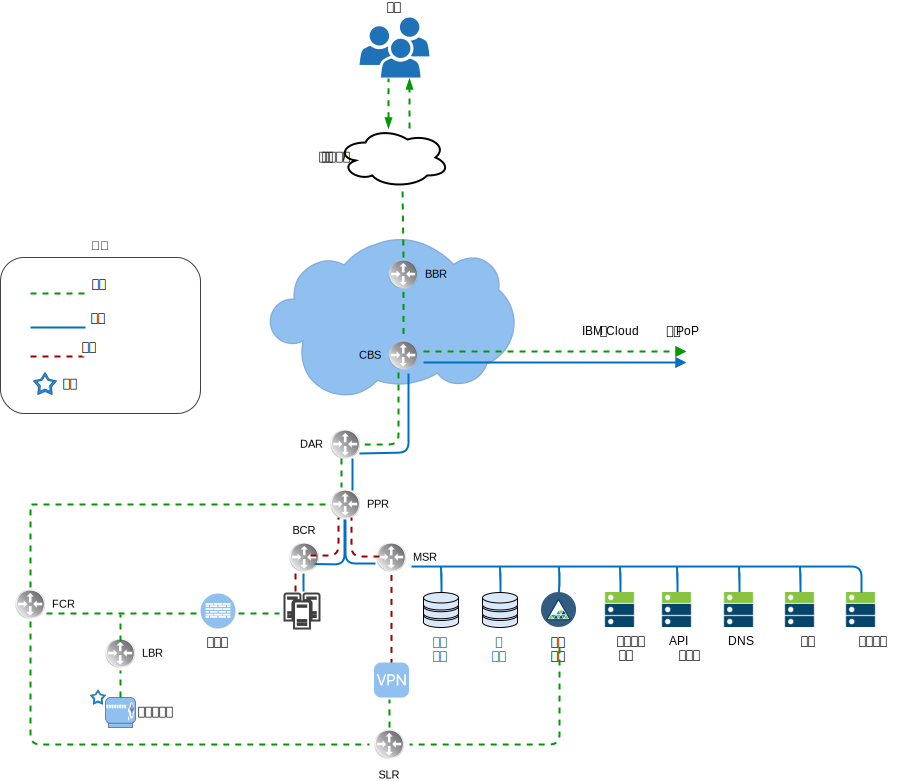
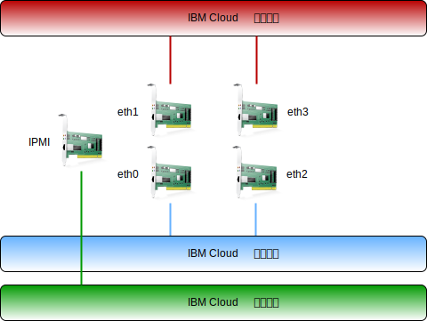

---

copyright:

  years:  2016, 2019

lastupdated: "2019-03-19"

subcollection: vmwaresolutions

---

# IBM Cloud 联网概述
{: #vcsnsxt-overview-ic4vnetwork}

{{site.data.keyword.cloud}} 可处理物理联网。以下信息描述 {{site.data.keyword.cloud_notm}} 提供的物理网络以及与先前描述的物理主机关联的物理主机连接（VLAN 和 MTU）。

{{site.data.keyword.cloud_notm}} 的物理网络分为三种不同的网络：公用网络、专用网络和管理网络。

图 1. {{site.data.keyword.cloud_notm}} 高级别网络视图

## 公用网络
{: #vcsnsxt-overview-ic4vnetwork-public-net}

{{site.data.keyword.CloudDataCents_notm}} 和网络存在点 (PoP) 具有多个 1 Gbps 或 10 Gbps 连接，用于连接到顶层传输和对等网络运营商。来自世界任何地方的网络流量都会连接到离得最近的网络 PoP，并通过该网络直接传输到其数据中心，从而最大程度地减少提供者之间的网络中继段数和切换次数。在数据中心内部，通过一对同级聚集的前端客户交换机 (FCS)，为各个服务器提供 1 Gbps 或 10 Gbps 的网络带宽。这些聚集的交换机会连接到一对单独的路由器（即前端客户路由器 (FCR)）来进行 L3 联网。通过此多层设计，网络可以在 {{site.data.keyword.CloudDataCent_notm}} 内跨机架、机柜行和 pod 进行扩展。

## 专用网络
{: #vcsnsxt-overview-ic4vnetwork-private-net}

所有 {{site.data.keyword.CloudDataCents_notm}} 和 PoP 均通过专用网络主干进行连接。此专用网络独立于公用网络，支持连接到全球的 {{site.data.keyword.CloudDataCents_notm}} 中的服务。在数据中心之间移动数据是使用与专用网络的多个 10 Gbps 或 40 Gbps 连接完成的。与公用网络类似，专用网络也是多层的，其中服务器和其他基础架构连接到聚集的后端客户交换机 (BCS)。这些聚集的交换机会连接到一对单独的路由器（即后端客户路由器 (BCR)）来进行 L3 联网。专用网络还支持使用巨型帧 (MTU 9000) 进行物理主机连接的功能。

## 管理网络
{: #vcsnsxt-overview-ic4vnetwork-mgmt-net}

除了公用和专用网络之外，每个 {{site.data.keyword.cloud_notm}} 服务器还会连接到一个频带外管理网络。此管理网络可通过 VPN 进行访问，支持经由智能平台管理接口 (IPMI) 来对服务器（与其 CPU、固件和操作系统无关）进行访问，以进行维护和管理。

## 主 IP 块和可移植 IP 块
{: #vcsnsxt-overview-ic4vnetwork-ip-blocks}

{{site.data.keyword.cloud_notm}} 会分配要在 {{site.data.keyword.cloud_notm}} 基础架构中使用的两种类型的 IP 地址：
* 主 IP 地址，分配给由 {{site.data.keyword.cloud_notm}} 供应的设备、裸机和虚拟服务器。用户不应分配这些块中的任何 IP 地址。
* 可移植 IP 地址，供用户根据需要进行分配和管理。

在帐户配置为虚拟路由和转发 (VRF) 帐户时，主 IP 地址或可移植 IP 地址可以设置为可路由到客户帐户内的任何 VLAN。

## 虚拟路由和转发
{: #vcsnsxt-overview-ic4vnetwork-vrf}

{{site.data.keyword.cloud_notm}} 帐户还可以配置为虚拟路由和转发 (VRF) 帐户。VRF 帐户支持帐户内子网 IP 块之间的自动全局路由。具有“直接链路”连接的所有帐户都必须转换为或创建为 VRF 帐户。

## 物理主机连接
{: #vcsnsxt-overview-ic4vnetwork-host-connect}

此设计中的每个物理主机都有两对冗余的 10 Gbps 以太网连接，用于连接到每个 {{site.data.keyword.cloud_notm}} 机顶接入 (ToR) 交换机（公共和专用）。适配器设置为独立连接（未绑定），共有 4 个 10 Gbps 连接。这允许每个网络接口卡 (NIC) 连接彼此独立工作。

图 2. 物理主机连接
 

## VLAN
{: #vcsnsxt-overview-ic4vnetwork-vlans}

VMware on {{site.data.keyword.cloud_notm}} 产品设计为在部署时分配三个 VLAN（一个公用 VLAN 和两个专用 VLAN）。公用 VLAN 分配给 eth1 和 eth3，而专用连接分配给 eth0 和 eth2。务必注意的是，缺省情况下，未标记此设计中创建和分配的公用 VLAN 和第一个专用 VLAN。稍后，另一个专用 VLAN 在物理交换机端口上中继，并在使用这些子网的 VMware 端口组中进行标记。

如上所述，在此设计中，专用网络由两个 VLAN 组成。有三个子网分配给其中的第一个 VLAN（在此指定为“专用 VLAN A”）。第一个子网是 {{site.data.keyword.cloud_notm}} 分配给物理主机的主专用 IP 子网范围。第二个子网用于管理虚拟机（例如，vCenter Server Appliance 和 Platform Services Controller）。第三个子网用于通过 NSX Manager 分配给每个主机的 VXLAN 隧道端点 (VTEP)。

除了“专用 VLAN A”外，还存在另一个专用 VLAN（在此指定为“专用 VLAN B”），用于支持 vSAN 和 vMotion 等 VMware 功能，以及用于连接到网络连接的存储器 (NAS)。因此，该 VLAN 分成两个或三个可移植子网。第一个子网分配给用于 vMotion 流量的内核端口组。其余子网用于存储流量，使用 vSAN 时，一个子网将分配给用于 vSAN 流量的内核端口组。使用 NAS 时，一个子网将分配给专用于 NFS 流量的端口组。在 vCenter Server 自动化部署过程中配置的所有子网都使用 {{site.data.keyword.cloud_notm}} 管理的范围。这是为了确保如果现在或未来需要，任何 IP 地址都可以路由到 {{site.data.keyword.cloud_notm}} 帐户中的任何数据中心。

表 1. VLAN 和子网摘要

VLAN|子网类型|描述
---|---|---
公用|主|分配给物理主机以用于公用网络访问。在初始部署时未使用。
公用|可移植|分配供 customer-nsx-esg 上的上行链路和 NAT 使用。
公用|可移植|分配供 mgmt-nsx-esg 上的上行链路 NAT 使用。
公用|可移植|分配供 hcx-mgmt-esg 上的上行链路 NAT 使用（如果选择了 Hybridity Bundle）。
专用 A|主|分配给由 {{site.data.keyword.cloud_notm}} 分配的物理主机。通过管理接口用于 vSphere 管理流量。
专用 A|可移植|分配给作为管理组件运行的虚拟机。
专用 A|可移植|分配给 NSX VTEP。
专用 A|可移植|分配给 HCX 供内部使用（如果选择了 Hybridity Bundle）。
专用 A|可移植|分配供 customer-nsx-esg 上的上行链路使用。
专用 A|可移植|分配给 HCX（如果选择了 Hybridity Bundle）。
专用 B|主|在初始部署时未使用。
专用 B|可移植|分配用于 vSAN（如果在使用 vSAN）。
专用 B|可移植|分配用于 NAS（如果在使用 NAS）。
专用 B|可移植|分配用于 vMotion。

在实现此设计时，VLAN 上的物理主机和虚拟系统实例 (VSI) 都配置为指向作为缺省路径的 {{site.data.keyword.cloud_notm}} BCR（后端“专用网络”客户路由器）。但 vCenter Server 实例支持使用软件定义的联网。由 NSX 创建的任何网络覆盖（包括到 VLAN 子网的路由）对于 {{site.data.keyword.cloud_notm}} 管理的路由器来说都是未知的，因此您可能需要创建静态路由、防火墙规则和 NAT 规则来正确管理网络流。

专用网络连接配置为使用 MTU 大小为 9000 的巨型帧，这将提高存储和 vMotion 等大型数据传输的性能。这是 VMware 和 {{site.data.keyword.cloud_notm}} 中允许的最大 MTU。公用网络连接使用标准以太网 MTU，即 1500。必须保留此设置不变，因为对此设置的任何更改都可能导致因特网上发生包分段。

## 相关链接
{: #vcsnsxt-overview-ic4vnetwork-related}

* [vCenter Server on {{site.data.keyword.cloud_notm}} with Hybridity Bundle 概述](/docs/services/vmwaresolutions/archiref/vcs?topic=vmware-solutions-vcs-hybridity-intro)
