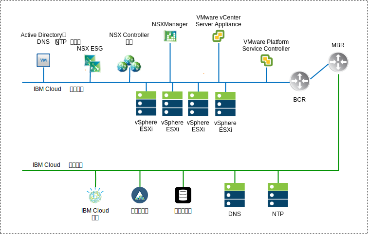
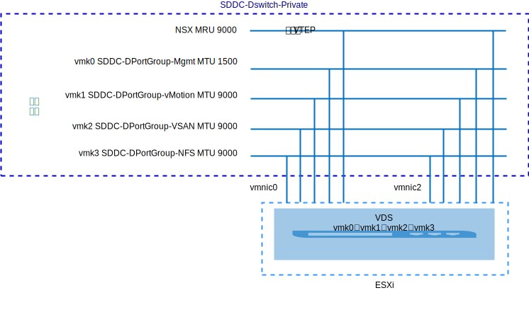

---

copyright:

  years:  2016, 2019

lastupdated: "2019-02-15"

---

# NSX-V 概述
{: #vcsnsxt-overview-ic4vnsxv}

网络虚拟化提供了存在于虚拟层中的网络覆盖。NSX-V 为体系结构提供了快速供应、部署、重新配置和销毁随需应变虚拟网络等功能。此设计使用 vSphere 分布式交换机 (vDS) 和 VMware NSX for vSphere 来实现虚拟联网。

在此设计中，NSX Manager 会部署在初始集群上。将从指定用于管理组件的专用可移植地址块中为 NSX Manager 分配支持 VLAN 的 IP 地址，并且 NSX Manager 还配置为使用先前所述的 DNS 和 NTP 服务器。

表 1. NSX-V Manager 虚拟设备规范

属性|规范
---|---
NSX
Manager|虚拟设备
vCPU 数量|4
内存|16 GB
磁盘|管理 NFS 共享上 60 GB
磁盘类型|自动精简配置
网络|指定用于管理组件的**专用 A** 可移植子网

以下 NSX-V Manager 网络概览图显示了 NSX Manager 相对于此体系结构中其他组件的位置。

图 1. NSX-V Manager 网络概览图

初始部署后，{{site.data.keyword.cloud}} 自动化会在初始集群中部署三个 NSX Controller。将从指定用于管理组件的**专用 A** 可移植子网中为控制器分配 IP 地址。创建了 VM-VM 反亲缘关系规则，以便控制器在集群中的各个主机之间分隔开。初始集群至少部署有三个节点，以确保控制器的高可用性。

除了控制器之外，{{site.data.keyword.cloud_notm}} 自动化还会为部署的 vSphere 主机准备 NSX VIBS，以支持通过 VXLAN 隧道端点 (VTEP) 使用虚拟化网络 (VXLAN)。从为 VTEP 指定的**专用 A** 可移植子网的 IP 地址范围中为 VTEP 分配 IP 地址。VXLAN 流量位于未标记的 VLAN 上，并且分配给专用虚拟分布式交换机 (vDS)。然后，将分配分段标识池，并且将集群中的主机添加到传输专区。由于在 {{site.data.keyword.cloud_notm}} 中未配置 IGMP 监听，因此在传输专区中仅使用单点广播。

随后将部署 NSX Edge 服务网关 (ESG) 对。对于所有部署，都会使用一个网关对来处理位于专用网络中的自动化组件的出站流量。VMware vCenter Server on {{site.data.keyword.cloud_notm}} 实例包含另一个网关（称为客户管理的 Edge），该网关部署并配置为使用上行链路连接到公用网络，还会配置一个分配给专用网络的接口。管理员可以配置任何必需的 NSX 组件，例如分布式逻辑路由器 (DLR)、逻辑交换机和防火墙。

## 分布式交换机设计
{: #vcsnsxt-overview-ic4vnsxv-distributed-switch}

该设计使用最少数量的虚拟分布式交换机 (vDS)。集群中的主机会连接到公用和专用网络。这些主机均配置有两个虚拟分布式交换机。两个交换机的使用遵循 {{site.data.keyword.cloud_notm}} 中实施的公用和专用网络的物理网络分隔。

总共配置了两个分布式交换机。第一个用于公用网络连接 (SDDC-Dswitch-Public)，第二个用于专用网络连接 (SDDC-Dswitch-Private)。需要分隔不同类型的流量，以减少争用和等待时间。此外，需要分隔的网络，以实现访问安全性。VLAN 用于对物理网络功能进行分段。此设计使用三个 VLAN。两个用于专用网络流量，一个用于公用网络流量。

表 2. VLAN 流量映射

VLAN|名称|流量类型
---|---|---
VLAN1|公用|可用于因特网访问
VLAN2|专用 A|ESXi 管理、管理、VXLAN (VTEP)
VLAN3|专用 B|vSAN、NFS 和 vMotion

来自工作负载的流量将在 NSX 逻辑交换机上传输。vSphere 集群将两个 vSphere 分布式交换机 (vDS) 用于融合集群。

表 3. 融合集群分布式交换机

vSphere 分布式交换机名称|功能|网络 I/O 控制|负载均衡方式|物理 NIC 端口|MTU
---|---|---|---|---|---
SDDC-Dswitch-Private|ESXi 管理 虚拟 SAN vSphere vMotion VXLAN 隧道端点 (VTEP) NFS|已启用|基于显式故障转移进行路由（vSAN 和 vMotion）。 发起虚拟端口（其他所有）|2|9,000（巨型帧）
SDDC-Dswitch-Public|外部管理流量（南北）|已启用|基于发起虚拟端口进行路由|2|1,500（缺省值）

表 4. 分布式交换机端口组的组队和故障转移设置

参数|设置
---|---
负载均衡|基于发起虚拟端口进行路由 \*
故障转移检测|仅链接状态
通知交换机|已启用
故障恢复|已启用
故障转移顺序|活动上行链路：Uplink1 或 Uplink2 \* 

\* vSAN 端口组使用采用活动或备用方式的显式故障转移，因为它不支持对 vSAN 存储器流量进行负载均衡。
{:note}

图 2. 集群 VM 内核接口端口组映射

表 5. 集群虚拟交换机端口组、VLAN 和组队策略

vSphere 分布式交换机|端口组名称|组队|上行链路|VLAN 标识
---|---|---|---|---
SDDC-Dswitch-Private|SDDC-DPortGroup-Mgmt|发起虚拟端口|活动：0、1|VLAN1
SDDC-Dswitch-Private|SDDC-DPortGroup-vMotion|发起虚拟端口|活动：0、1|VLAN2
SDDC-Dswitch-Private|SDDC-DPortGroup-VSAN|显式故障转移|活动：0 备用：1|VLAN2
SDDC-Dswitch-Private|SDDC-DPortGroup-NFS|发起虚拟端口|活动：0、1|VLAN2
SDDC-Dswitch-Private|由 NSX 自动生成|发起虚拟端口|活动：0、1|VLAN1
SDDC-Dswitch-Public|SDDC-DPortGroup-External|发起虚拟端口|活动：0、1|VLAN3

## NSX-V
{: #vcsnsxt-overview-ic4vnsxv-nsx-v}

此设计指定 NSX 组件的配置，但不会应用任何网络覆盖组件配置。由客户来决定根据自己的需求设计网络覆盖。

配置了以下组件：
-	安装管理服务器和控制器，并将其集成到 vCenter Web 用户界面中。
-	安装 ESXi 代理程序，并且为每个 ESXi 主机配置 VTEP IP 地址。
-	VTEP 配置、控制器配置和 VXLAN 配置（传输专区）。
-	NSX Edge 服务网关 (ESG) 设备，供管理组件使用。
-	（仅限 vCenter Server）NSX Edge 服务网关 (ESG) 设备，供客户使用。

未配置的内容：
-	虚拟分布式路由器。
-	微分段。
-	VXLAN。
-	将 NSX Management 链接到其他 VMware 实例。

### NSX-V 安全性
{: #vcsnsxt-overview-ic4vnsxv-nsx-v-security}

通过 NSX for vSphere，组织能够将数据中心划分为不同的安全分段，可一直向下划分到单个工作负载的级别，而与运行工作负载的位置无关。IT 团队可以根据应用程序和用户上下文为每个工作负载定义策略，这将确保即时响应数据中心内部的威胁并强制向下实施到应用程序。

下面是一些关键 NSX 组件：
-	NSX 分布式有状态防火墙嵌入在系统管理程序内核中，每个系统管理程序主机最多 20 Gbps 的防火墙容量。通过 NSX Edge 提供南北防火墙能力。
-	NSX 支持创建动态安全组和关联的策略（不仅仅针对 IP 地址和 MAC）。这些策略包括 vCenter 对象和标记、操作系统类型和第 7 层应用程序信息，以根据应用程序的上下文来启用微分段。
-	基于身份的策略使用来自 VM、Active Directory 和 Mobile Device Management 集成的登录信息，支持基于用户的安全性，包括远程和虚拟桌面环境中的会话级别安全性。
- 应用程序规则管理器和端点监视支持一直到第 7 层的端到端网络流量流可视化，允许应用程序团队识别数据中心内和数据中心间的端点，并通过创建相应的安全规则进行响应。
- 支持与第三方供应商集成管理、控制平面和数据平面，例如，下一代防火墙、IDS/IPS、无代理程序的防病毒软件、交换、高级安全性等。

下图显示了如何通过创建安全组来实现 NSX-V 的一些微分段功能的高级别图。在此示例中，“生产”和“开发”是安全组，并且基于这些组来分配安全规则。

图 3. NSX-V 安全性

## 相关链接
{: #vcsnsxt-overview-ic4vnsxv-related}

* [vCenter Server on {{site.data.keyword.cloud_notm}} with Hybridity Bundle 概述](/docs/services/vmwaresolutions/archiref/vcs?topic=vmware-solutions-vcs-hybridity-intro)
