---

copyright:

  years:  2016, 2018

lastupdated: "2018-11-06"

---

# IBM Kubernetes Service

## IKS 概述

IBM Kubernetes Service (IKS) 提供了一种用于管理容器的隔离的安全平台。此平台可移植、可扩展且在故障转移时可自我复原。

体系结构包含以下关键组件：
-	**{{site.data.keyword.cloud}} 帐户** - 工作程序节点会部署到 {{site.data.keyword.cloud_notm}} 帐户中。主节点部署在由 IBM 管理的中央云帐户中。
-	**集群** - Kubernetes 集群包含一个或多个工作程序节点。
-	**工作程序节点** - 工作程序节点是裸机，或是在 IBM 帐户中托管的虚拟服务器实例。在供应工作程序节点时，您应确定可供在该工作程序节点上托管的容器使用的资源。工作程序节点包含 IBM 管理的 Docker 引擎、不同的计算资源、联网和存储卷服务。
-	**主节点** - 工作程序节点由 Kubernetes 主节点进行管理，该主节点集中控制和监视集群中的所有 Kubernetes 资源。此主节点由 IBM 管理。

IKS 具有以下概念：
-	**服务** - 服务是一种 Kubernetes 资源，可将一组 pod 分组在一起，并提供与这些 pod 的网络连接，而无需公开每个 pod 的实际专用 IP 地址。您可以通过服务使应用程序在集群内或公用因特网中可用。
-	**部署** - 部署是一种 Kubernetes 资源，在其中可指定有关运行应用程序所需的其他资源或功能（例如服务、持久性存储器或注释）的信息。您可在配置 YAML 文件中记录部署，然后将其应用于集群。Kubernetes 主节点会配置资源，并将容器部署到具有可用容量的工作程序节点上的 pod 中。定义应用程序的更新策略，包括在滚动更新期间要添加的 pod 数，以及允许同时不可用的 pod 数。执行滚动更新时，部署将检查更新是否有效，并在检测到故障时停止应用。
-	**pod** - 集群中的每个应用程序由称为 pod 的 Kubernetes 资源进行部署、运行和管理。pod 代表 Kubernetes 集群中的小型可部署单元，用于将必须视为单个单元的容器分组在一起。在大多数情况下，每个容器会部署在其自己的 pod 中。应用程序可能需要将一个容器和其他辅助容器部署到一个 pod 中，以便可以使用相同的专用 IP 地址寻址到这些容器。
-	**应用程序** - 应用程序可能是指完整应用程序或应用程序组件。您可在单独的 pod 或单独的工作程序节点中部署应用程序的组件。

Kubernetes 未规定特定的联网解决方案。

Kubernetes 网络模型只是陈述了三种基本需求：
* 容器可以在不使用 NAT 的情况下与其他所有容器进行通信
* 节点可以在不使用 NAT 的情况下与所有容器通信（反之亦然）
* 容器本身看到的 IP 与其他人看到的 IP 相同。

### 名称空间

名称空间是容器联网的一个基本方面。名称空间是 Linux 内核的一个功能，用于对内核资源进行分区，使得一组进程看到的是某一组资源，而另一组进程看到的是另一组不同的资源。资源包括安装点、进程标识、网络堆栈、IPC 和用户标识。每个名称空间都有一组专用 IP 地址、其自己的路由表、套接字列表、连接跟踪表、防火墙和其他与网络相关的资源。

### 容器网络接口

Kubernetes 使用容器网络接口 (CNI) 作为其面向插件的联网解决方案。它包含用于编写插件以在 Linux 容器中配置网络接口的规范和库。CNI 规范为轻量级，因为它仅处理容器的网络连接以及删除容器后对资源进行垃圾回收。

在 Kubernetes 中，CNI 上下文中有两个核心定义：
- **pod** - 与 Linux 网络名称空间同义。在 Kubernetes 中，安排的单元即是 pod，本质上，这是一个或多个容器紧密耦合的集合，这些容器始终并置（作为一个单元安排到节点上）。一个 pod 不能分布在多个工作程序节点上。
- **网络** - 可相互通信的一组可唯一寻址的实体。这些实体可能是单个容器、机器，也可能是其他某个网络设备（例如，路由器）。

要使 CNI 能够将容器添加到网络，容器运行时必须首先为容器创建新的网络名称空间，然后启动一个或多个定义的插件。网络配置采用 JSON 格式，并且包含必填字段，例如名称和类型以及特定于插件类型的字段。CNI 插件应该会向接口分配 IP 地址，并设置与其相关的网络路径。IKS 将 Calico 用作 CNI 的网络插件。Calico 为每个工作负载分配一个 IP 地址。在 IKS 中，Calico 使用 IP-in-IP 隧道，以便在 {{site.data.keyword.cloud_notm}} 网络中隐藏容器网络 IP 地址。

在 IKS 中，我们将网络流量分为四种类型，如下图所示。

图 1. 容器网络流量类型

- **pod 内联网** - 也称为容器到容器通信。一个 pod 中的所有容器共享一个网络名称空间和同一 IP 地址，并可在本地主机上看到彼此。每个应用程序的流量使用不同的端口号加以区分。开发者必须确保 pod 内的容器使用的端口不会相互冲突。在 pod 中，存在一个所谓的基础架构容器。这是 kubelet 启动的第一个容器，用于获取 pod 的 IP 并设置网络名称空间。随后，pod 中的其他所有容器都会加入基础架构容器的网络和 IPC 名称空间。容器启用了网桥方式，并且 pod 中的其他所有容器均通过容器方式加入此名称空间。如果基础架构容器停止运行，那么 kubelet 会终止 pod 中的所有容器，然后重新供应，通常会使用新的 IP 地址进行供应。在本文档中，我们不会就此流量流提供任何更多详细信息。

- **pod 间联网** - 也称为“pod 到 pod”通信。有三种类型的东西流量：
  - pod 可以直接与同一子网上的其他 pod 进行通信。在 IKS 中，每个 pod 都具有从 IKS 提供的范围中分配的 IP 地址。在供应时，会为每个工作程序节点分配一个子网。对于位于同一子网和主机中的 pod，pod 到 pod 通信无需代理、隧道或 NAT 就可执行。
  - pod 可以直接与不同子网上的其他 pod 进行通信。IP-in-IP 封装在 IKS 中自动配置为仅封装在子网之间传输的包。此封装将使 pod 网络地址空间在 {{site.data.keyword.cloud_notm}} 网络中隐藏。此封装使用来自 {{site.data.keyword.cloud_notm}} 主专用子网的 IP 地址。
  - pod 可以使用服务与其他 pod 进行通信，这称为 pod 到服务通信。但是，pod 可以根据上面的两点直接与其他 pod 通信，并且 pod 是会失效的。pod 创建，然后终止运行后，即不能复活。副本集以动态方式创建和销毁 pod，例如向上或向下扩展时。虽然每个 pod 都会获得其自己的 IP 地址，但即使这些 IP 地址也会随时间流逝而变得不稳定。因此，开发者最好是使用服务构造来进行通信，服务构造使用的是可以通过 DNS 发现的稳定虚拟 IP 地址。

- **Ingress/流入** - 是指将流量从外部用户或应用程序路由到 pod。一个服务用于为一组 pod 提供稳定的虚拟 IP (vIP) 地址。虽然 pod 是临时的，但服务允许客户机使用 vIP 来可靠地发现并连接到 pod 中运行的容器。此 vIP 不是连接到网络接口的实际 IP 地址。其用途仅仅是充当稳定端点，以便将流量转发到一个或多个 pod。要从集群外部访问 pod，难度会更大。Kubernetes 旨在为服务提供高可用性、高性能的负载均衡。在 IKS 中，南北流量有三个选项：

  - **NodePort** - NodePort 服务被视为适合进行测试，或者适用于只需要短时间的公用或专用访问权的情况。NodePort 服务通过工作程序节点的专用和公共 IP 地址在工作程序节点上打开端口。如果要阻止公共或专用 IP 地址，那么必须使用 Calico DNAT 前网络策略。工作程序节点的公共和专用 IP 地址不是永久的。
  - **LoadBalancer** - 分配给负载均衡器的可移植公共 IP 地址和专用 IP 地址是永久的，并且在集群中重新创建工作程序节点时不会更改。您可以通过公开应用程序所需的任何端口来定制负载均衡器。具有可移植专用 IP 地址的 LoadBalancer 服务仍会在每个工作程序节点上打开一个公共节点端口。必须使用 Calico DNAT 前网络策略来阻止其上的公共节点端口。
  - **Ingress 服务** - ALB 使用安全的唯一公共或专用入口点将入局请求路由到应用程序。ALB 会侦听入局 HTTP、HTTPS、TCP 或 UDP 服务请求。它会根据您在 Ingress 资源中定义的规则，跨应用程序 pod 转发请求。创建集群时，将自动创建一个公共和一个专用 Ingress 应用程序负载均衡器 (ALB)。因为缺省情况下公共 ALB 已启用，而专用 ALB 已禁用，所以您必须禁用公共 ALB 并启用专用 ALB。

- **流出** - 是指调用 pod 之外的外部资源（例如，API）或使用 VM 中的资源。流出选项包括：
    - 为在集群外部运行的系统定义服务资源。这将创建用于详细描述外部系统的端点资源，还将创建 IP 地址和端口号。端点资源可以列出多个地址，Kubernetes 会循环使用这些地址，就像循环使用集群内运行的 pod 一样。然后，会使用服务资源在 kube-dns 中为服务创建集群 IP 和 DNS 名称。
    - 使用 stongSwan IPSec VPN 可以连接到集群外部的应用程序。通过使用 Helm 图表，可部署并配置 Kubernetes pod 内部的 strongSwan IPSec VPN 服务。建立 VPN 连接时，会在集群中的所有工作程序节点上自动配置路由。这些路由支持在任何工作程序节点上的 pod 与远程系统之间通过 VPN 隧道进行双向连接。如果 pod 发生故障，集群将重新启动 pod，但是，在新 pod 启动和重新建立 VPN 连接的过程中，您可能会遇到短暂的停机时间。可移植的公共或专用 IP 地址用于 strongSwan VPN 服务。local.subnet 设置可以使用集群 pod 子网、集群服务子网或者公用或专用可移植子网。重新映射集群子网可使用 localSubnetNAT 设置来实现。或者，通过将 enableSingleSourceIP 设置为 true，可以将集群 IP 地址隐藏在单个 IP 地址后面。要重新映射远程网络子网，请使用 remoteSubnetNAT 设置。
    - {{site.data.keyword.cloud_notm}} 虚拟路由器设备可以部署为 VPN 网关，以安全地连接到外部网络。公用或专用网络流量可以通过 VRA 进行路由。VRA 会创建到远程 VPN 网关的已加密 IPSec 隧道。

## IKS 组件

工作程序节点由 Kubernetes 主节点进行管理，该主节点集中控制和监视集群中的所有 Kubernetes 资源。开发者为容器部署资源时，主节点会决定要将这些资源部署到的工作程序节点，并考虑集群中的部署需求和可用容量。主节点和工作程序节点通过安全 TLS 证书和经由 {{site.data.keyword.cloud_notm}} 公用网络建立的 openVPN 连接相互通信。开发者通过因特网访问在主节点上托管的 kube-apiserver。

工作程序节点中的 kubelet 会监视主节点中的 kube-apiserver 是否有更新，并报告相应状态。kubelet 是在每个工作程序节点上运行的 pod，负责监视工作程序节点上运行的 pod 的运行状况，并负责监视 Kubernetes API 服务器发送的事件。根据事件，kubelet 会创建或除去 pod，发出活性和就绪性探测器，并向 Kubernetes API 服务器回报 pod 的状态。

从网络角度来看，以下组件会部署在工作程序节点上：

-	**openvpn-client** - OpenVPN 客户机与 OpenVPN 服务器一起运行，以安全地将主节点连接到工作程序节点。此组件在 kube-system 名称空间中运行。
-	**Calico 节点** - Calico 节点是一种容器，用于将使用 Calico 进行容器联网所需的各种组件捆绑在一起。此组件在 kube-system 名称空间中运行。
-	**Calico 策略控制器** - Calico 策略控制器用于监视入站和出站网络流量是否符合设置的网络策略。如果集群中不允许流量，那么将阻止对集群的访问。Calico 策略控制器还用于为集群创建和设置网络策略。此组件在 kube-system 名称空间中运行。
-	**Calico CNI** - Calico 容器网络接口 (CNI) 用于管理容器的网络连接，并在删除容器时除去分配的资源。
-	**Calico IPAM**- Calico IPAM 用于管理容器的 IP 地址分配。
-	**kube proxy** - Kubernetes 网络代理是在每个工作程序节点上运行的守护程序，用于对集群中运行的服务的 TCP 和 UDP 网络流量进行转发或负载均衡。此组件在 kube-system 名称空间中运行。
-	**kube DNS** - Kubernetes DNS 用于安排集群上的 DNS pod 和服务。容器在搜索其他 pod 和服务时会自动使用 DNS 服务的 IP 来解析 DNS 名称。此组件在 kube-system 名称空间中运行。
-	**Ingress ALB** - Ingress 是一种 Kubernetes 服务，可用于通过将公共或专用请求转发到集群中的多个应用程序，对集群中的网络流量工作负载进行均衡。要通过公用或专用网络来公开应用程序，必须创建 Ingress 资源来向 Ingress 应用程序负载均衡器 (ALB) 注册应用程序。然后，可以使用单个 URL 或 IP 地址来访问多个应用程序。此组件在 ibm-system 名称空间中运行。
-	**LoadBalancer** - LoadBalancer 是一种 Kubernetes 服务，可用于通过将公共或专用请求转发到应用程序，对集群中的网络流量工作负载进行均衡。此组件在 ibm-system 名称空间中运行。

### Calico

IKS 将 Calico 用作其网络提供者。Calico 使用第 3 层方法，而不使用覆盖网络。通过 CNI 插件，Calico 可与 Kubernetes 集成，以组合使用纯 IP 网络与边界网关协议（用于路径分配）的方法来提供联网。

Calico 提供 L3 光纤网解决方案；此外，Calico 不使用 vSwitch，而是在每个计算节点中使用 vRouter 功能。vRouter 使用 Linux 内核的现有 L3 转发功能。Calico 通过 vRouter 将每个工作负载直接连接到基础架构网络。vRouter 功能使用 BGP 来公布每个工作程序节点中托管的 pod 的路径。每个 vRouter 会使用 BGP 向其他所有 vRouter 通知自己所连接到的所有端点。

在 Calico 中，进出 pod 的 IP 包由工作程序节点上的 Linux 路由表和 iptables 基础架构进行路由并通过防火墙保护。

-	对于发送包的工作负载，Calico 会确保工作程序节点始终作为下一个中继段 MAC 地址返回，而与工作负载本身可能配置的任何路由无关。
-	对于寻址到工作负载的包，最后一个 IP 中继段是从目标工作负载的工作程序节点到工作负载本身。

图 2. Calico CNI

上图显示了以下 Calico 组件：
-	**calicoctl** - 命令行界面。
-	**CNI 插件**
-	**键/值存储** - 保存 Calico 的策略和网络配置状态。Calico 使用 etcd 来提供组件之间的通信，并将 etcd 用作一致的数据存储，这将确保 Calico 始终能够构建准确的网络。etcd 组件分布在整个部署中。它分为两组机器：核心集群和代理。
-	**calico/节点** - 一种“辅助”容器，用于将联网所需的各种组件捆绑在一起：
 -	**Felix** - 在托管端点的每台机器上运行的主 Calico 代理程序。该代理程序负责编程路径和 ACL 以及主机上所需的其他任何内容，以便为该主机上的端点提供所需的连接。
 - **BIRD** - BIRD 是一种开放式源代码 BGP 客户机，用于在主机之间交换路由信息。Felix 将路径插入到 Linux 内核 FIB 中时，BGP 客户机会选取这些路径，并将其分配给部署中的其他节点。这将确保流量在部署中进行高效路由。
 - **confd** - confd 模板引擎用于监视 etcd 数据存储中是否有对 BGP 配置和某些顶级全局缺省配置（例如，AS 号码、日志记录级别和 IPAM 信息）的任何更改。然后，它会根据 etcd 中的数据动态生成 BIRD 配置文件，此操作是根据对这些数据的更新自动触发的。配置文件发生更改时，confd 会触发 BIRD 以装入新文件。

由于 {{site.data.keyword.cloud_notm}} Private 网络仅转发 {{site.data.keyword.cloud_notm}} IP 寻址模式，因此需要 Calico 在 IKS 中对工作负载间流量进行 IP-in-IP 封装，以隐藏 pod 网络 IP 地址。IKS 使用 IP-in-IP 跨子网方式。

### IKS 中的 Calico

Calico 将在 IKS 中自动安装和配置。系统会创建缺省策略来保护 Kubernetes 集群，您可选择创建自己的策略来保护特定服务。IP-in-IP 封装会自动配置为仅封装在子网之间传输的包，并将 NAT 用于容器的出局连接。此外，{{site.data.keyword.cloud_notm}} Kubernetes Service 中还会自动启用“工作负载到 WAN 流量”，因此无需额外配置 Calico。

#### 使用 Calico 实现网络可扩展性

Calico 基于分布式向外扩展体系结构构建，因此能够顺利地从单个开发者笔记本扩展到大型企业部署，并使用标准 Linux 数据平面为虚拟工作负载交付裸机性能。

#### Calico 的安全性

Calico 使用一组策略来控制系统的每个组件，这些策略可以配置为仅允许服务和容器实例在需要时相互对话。Calico 使用 IP 地址来标识容器实例，并根据这些地址创建策略。Kubernetes 与 Calico 集成后可实现基础架构感知，可以根据基础架构的变化来扩展安全策略。

#### 与 Calico 集成

Calico 提供了高度可扩展的网络和网络策略解决方案，用于根据与因特网相同的 IP 联网原则来连接 Kubernetes pod。Calico 可以在没有封装或覆盖的情况下进行部署，以提供高性能、高扩展的数据中心联网。Calico 通过其分布式防火墙，为 Kubernetes pod 提供基于意图的细颗粒度网络安全策略。Calico 还可以在策略强制实施方式下与其他联网解决方案（如 Flannel，也称为 Canal）或本机 GCE 联网一起运行。

## IKS 联网

缺省情况下，IKS 通过设置以下各项，将集群设置为有权访问公用 VLAN 和专用 VLAN。
- 每个工作程序节点的公共 IP 地址，用于为工作程序节点提供公用网络接口。缺省情况下：
  -	所有工作程序节点支持所有出站网络流量。
  -	入站网络流量被阻止（少数端口除外）。打开这些端口是为了使 IBM 可以监视网络流量，并自动为 Kubernetes 主节点安装安全性更新。
-	每个工作程序节点的专用 IP 地址，用于为工作程序节点提供专用网络接口。
-	所有工作程序节点和主节点之间的自动、安全的 OpenVPN 连接。

第一次在专区中创建集群时，会在 {{site.data.keyword.cloud_notm}} 基础架构帐户中自动为您供应该专区中的公用 VLAN 和专用 VLAN。对于在该专区中创建的每个后续集群，您可以复用相同的公用 VLAN 和专用 VLAN，因为多个集群可以共享 VLAN。

工作程序节点可以同时连接到公用 VLAN 和专用 VLAN，或者仅连接到专用 VLAN。如果要仅将工作程序节点连接到专用 VLAN，那么可以使用现有专用 VLAN 的标识，或者创建专用 VLAN 并在创建集群期间使用其标识。

此外，还会自动将工作程序节点和 pod 的 IP 子网供应到 VLAN 上。子网通过向集群组件分配 IP 地址来提供与这些组件的网络连接。以下子网会在缺省公用和专用 VLAN 上自动供应：
-	**公用 VLAN 子网：**
    - 主公用子网确定在集群创建期间分配给工作程序节点的公用 IP 地址。同一 VLAN 上的多个集群可以共享一个主公用子网。
    - 可移植公用子网仅绑定到一个集群，并为该集群提供 8 个公共 IP 地址。其中 3 个 IP 保留用于网络功能。1 个 IP 由缺省公共 Ingress ALB 使用，另外 4 个 IP 可用于创建公共负载均衡器联网服务。可移植公共 IP 是永久的固定 IP 地址，可用于通过因特网访问 LoadBalancer 服务。
-	**专用 VLAN 子网：**
    - 主专用子网确定在集群创建期间分配给工作程序节点的专用 IP 地址。同一 VLAN 上的多个集群可以共享一个主专用子网。
    - 可移植专用子网仅绑定到一个集群，并为该集群提供 8 个专用 IP 地址。其中 3 个 IP 保留用于网络功能。1 个 IP 由缺省专用 Ingress ALB 使用，另外 4 个 IP 可用于创建专用负载均衡器联网服务。可移植专用 IP 是永久的固定 IP 地址，可用于通过因特网访问 LoadBalancer 服务。

### 相关链接

* [VCS Hybridity Bundle 概述](../vcs/vcs-hybridity-intro.html)
