---

copyright:

  years:  2016, 2019

lastupdated: "2019-05-08"

subcollection: vmware-solutions

---

# 系统上下文
{: #vcsnsxt-systemcontext}

系统上下文图定义了系统的关键元素、系统的边界、与系统交互的实体以及交互。这是一个高级别图，为读取者提供了系统的初始视图。

从网络角度来看，四个核心组件如下：
- **内部部署虚拟化** - 在客户的内部部署或第三方托管的 VMware 环境，当前托管的是运行要现代化的应用程序的虚拟机 (VM)。这是 VM 迁移的源环境，通过 VMware HCX 松散耦合到 {{site.data.keyword.cloud}}。
- **vCenter Server** - 一个 {{site.data.keyword.vmwaresolutions_short}} 实例，作为内部部署环境中已迁移 VM 的目标。它与内部部署虚拟化一起构成混合环境，支持 VM 从一个环境无缝移至另一个环境。
- **{{site.data.keyword.containerlong_notm}}** - 将 Kubernetes 用作容器编排解决方案。在工作程序节点部署到客户管理的基础架构期间，IBM 会对 Kubernetes 主节点进行操作和管理。IBM 为操作系统补丁部署、Docker 引擎升级和新 Kubernetes 版本提供了多种管理工具。{{site.data.keyword.containerlong_notm}} 提供了一个隔离的安全平台，用于管理可移植、可扩展且在故障转移时可自我复原的容器。
- **IBM Cloud Private** - 一种用于开发和管理容器化应用程序的应用程序平台。这是一个集成环境，包含容器编排器 Kubernetes、专用映像存储库、管理控制台、监视框架和图形用户界面，该界面提供了一个集中位置来部署、管理、监视和扩展应用程序。
- **IBM Cloud 服务** - 可通过 {{site.data.keyword.cloud_notm}} 提供的广泛的可使用服务。服务选项包括 Analytics、AI 和 IoT，等等。

## 参与者
{: #vcsnsxt-systemcontext-actors}

系统上下文图确定了以下参与者。

表 1. 参与者

参与者|描述
---|---
系统管理员|系统管理员是使用 vCenter 和 HCX 插件的企业 VMware 资源。他们确定用于迁移、延伸网络、迁移 VM 和管理 NSX-V 的候选项。他们使用 {{site.data.keyword.cloud_notm}} 控制台来供应 VMware vCenter Server on {{site.data.keyword.cloud_notm}} 实例和扩展容量。
开发者|开发者是使用 {{site.data.keyword.containerlong_notm}}、{{site.data.keyword.icpfull_notm}}、CAM 控制台和 API 来创建和管理容器的技能娴熟的企业容器资源。开发者可在应用程序现代化过程中创建新服务。
企业用户|此企业资源需要对应用程序的网络访问权才能完成业务流程（例如，更新内容）。
客户|客户是希望使用企业所提供服务的外部参与者。对于 Acme Skateboards，客户是要购买滑板产品的滑板手。客户需要对目录的安全因特网访问。
{{site.data.keyword.containerlong_notm}} |这是 IBM 资源，负责管理服务的 {{site.data.keyword.containerlong_notm}} 主节点。

## 系统
{: #vcsnsxt-systemcontext-systems}

系统上下文图确定了以下系统。

表 2. 系统

参与者|描述
---|---
vCenter|vCenter 是系统管理员用于管理内部部署 VM 和访问 HCX 插件以延伸网络和迁移 VM 的主要界面。通过 vCenter Server with Hybridity Bundle，系统管理员可以无缝地将内部部署 vSphere 网络集成到在 {{site.data.keyword.cloud_notm}} 上运行的 vCenter Server 实例中。混合联网将内部部署网络扩展到 {{site.data.keyword.cloud_notm}} 中，支持客户将自己的应用程序迁移到在 {{site.data.keyword.cloud_notm}} 上运行的 vCenter Server 实例中，并支持根据需要迁移回内部部署。有关 vCenter Server with Hybridity Bundle 的更多详细信息，请参阅 [VMware HCX on {{site.data.keyword.cloud_notm}} 解决方案体系结构](/docs/services/vmwaresolutions/services?topic=vmware-solutions-hcx-archi-intro#hcx-archi-intro)。
内部部署 VM|内部部署 VM 托管迁移到云的应用程序。最初，应用程序会迁移为 VM，然后通过应用程序现代化之旅从 VM 迁移到容器。
云上的 VM|云上的 VM 托管从内部部署迁移的应用程序。它们通过延伸的 L2 网络与内部部署应用程序进行通信。对于此参考体系结构以及此 Acme Skateboards 示例，其中一个云上 VM 是数据库服务器，这是联机在线工作负载的一部分。
NSX-V|vCenter Server 上的 NSX-V 提供软件定义的覆盖网络，该覆盖网络由系统管理员进行管理。覆盖网络是 HCX 延伸网络的目标，用于处理来自 {{site.data.keyword.icpfull_notm}} 的 VM 的流量。NSX-V 使用 vSphere 分布式交换机 (vDS) 为参考体系结构提供了部署、重新配置和销毁随需应变虚拟网络和 VMware 内微分段服务等功能。有关更多信息，请参阅 [NSX-V 概述](/docs/services/vmwaresolutions/archiref/vcsnsxt?topic=vmware-solutions-vcsnsxt-overview-ic4vnsxv)。
CAM|{{site.data.keyword.cloud_notm}} Automation Manager (CAM) 在 {{site.data.keyword.icpfull_notm}} 上运行，并提供了一个窗格，可使用模板来供应基于 VM 的工作负载以及基于 Kubernetes 的工作负载。CAM 支持开发者：  - 在 vCenter Server、{{site.data.keyword.icpfull_notm}} 或 {{site.data.keyword.containerlong_notm}} 上供应工作负载。  - 编写和编排由 VM 和容器组成的服务。  - 集成其 DevOps 工具链和 Day-2 ITSM 解决方案。
容器化应用程序|完成了应用程序现代化之旅并且现在作为容器运行的应用程序。对于此参考体系结构以及此 Acme Skateboards 示例，其中一个容器化应用程序是 Web 服务器，这是联机在线工作负载的一部分。
Watson|对于此参考体系结构以及此 Acme Skateboards 示例，Watson 表示“概念车”体系结构中使用的 AI 服务。

## 相关链接
{: #vcsnsxt-systemcontext-related}

* [vCenter Server on {{site.data.keyword.cloud_notm}} with Hybridity Bundle 概述](/docs/services/vmwaresolutions/archiref/vcs?topic=vmware-solutions-vcs-hybridity-intro)
