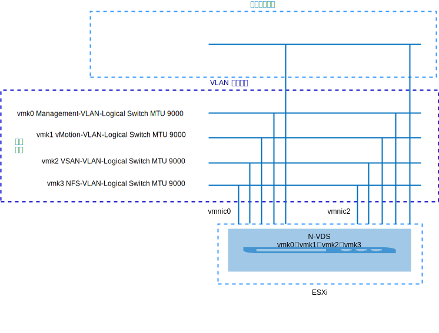
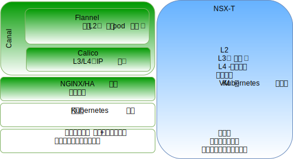
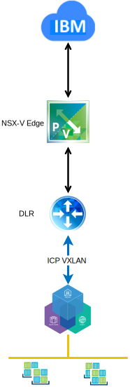
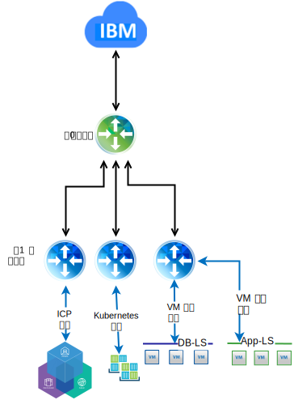

---

copyright:

  years:  2016, 2019

lastupdated: "2019-02-15"

---

# VMware vCenter Server on IBM Cloud 上的 VMware NSX-T 技术概述
{: #vcsnsxt-techpreview}

## NSX-T 概述
{: #vcsnsxt-techpreview-nsx-t-ovw}

VMware NSX-T 旨在解决具有异构端点和技术堆栈的应用程序框架和体系结构。除了 vSphere 外，这些环境还可以包含其他系统管理程序、KVM、容器和裸机。NSX-T 支持 IT 和开发团队选择最适合其应用程序的技术。NSX-T 还旨在供开发组织用于管理、操作和使用以及供 IT 组织使用。

在此设计中，NSX-T 管理基础架构部署在初始 vCenter Server 集群上，或部署到现有集群。

将从专用可移植地址块中为 NSX-T Manager 分配 IP 地址，该地址块指定用于管理组件，并配置为使用公共 DNS 和 NTP 服务器。

额外的集群会部署并用作系统管理程序传输节点，同时 vSAN 或 NFS 存储器用作工作负载数据存储。表 1 总结了中等大小的环境的需求。

表 1. NSX-T 组件规范

资源|NSX-T Manager|控制器（3 个）|边缘（2 个）|裸机边缘*
---|---|---|---|---
中等大小|虚拟设备|虚拟设备|虚拟设备|物理服务器*
vCPU 数量|4|4|4|8
内存|16 GB|16 GB|8 GB|32 GB
磁盘|140 GB vSAN 或管理 NFS 共享。|120 GB vSAN 或管理 NFS 共享。|120 GB vSAN 或管理 NFS 共享。|200 GB
磁盘类型|自动精简配置|自动精简配置|自动精简配置|物理
网络|为管理组件指定的专用 A 可移植子网。|为管理组件指定的专用 A 可移植子网。|为管理组件指定的专用 A 可移植子网。|为管理组件指定的专用 A 可移植子网。

\* **注**：检查硬件兼容性列表以了解特定需求。

图 1. NSX-V 和 NSX-T 管理组件布局

### 初始配置
{: #vcsnsxt-techpreview-init-config}

在初始 vCenter Server 集群中，部署 NSX-T Manager、包含三个控制器的控制器集群和一个边缘集群。从**专用 A** 可移植子网为所有组件分配 IP 地址。

创建 VM-VM 反亲缘关系规则，以便控制器在集群中的各个主机之间分隔开。初始集群至少部署有三个节点，以确保控制器的高可用性。

为 NSX-T Manager 再部署两个 vSphere 主机，并将 NSX-T 软件 (VIB) 安装在这两个主机上。创建主机和边缘上行链路概要文件以及 NIOC 概要文件，并定义用于隧道端点通信的 IP 池。有关更多信息，请参阅上行概要文件定义表和 NIOC 概要文件定义表。

池中定义的 IP 地址来自**专用 A** 可移植 IP 地址范围。将创建 VLAN 和覆盖传输专区，并将两个额外的 ESXi 主机配置为这两个专区的传输节点。目前，会分配等效的上行链路概要文件。在 ESXi 主机上创建 N-VDS 开关，并将其分配给 Uplink1 和 Uplink2。

此时，需要两个额外的 VLAN 来供应用于将 vmkernel 端口从 vDS 端口组迁移到 NSX 逻辑 VLAN 交换机的组队、故障转移和上行链路策略。逻辑 VLAN 交换机将使用相应的 VLAN 标识进行创建，并且会迁移 vmkernel 端口。

NSX-T 将创建 vmk10（用于封装接口）和 vmk50（用于 ESXi 主机上的第 0 层内传输子网和第 0 层-第 1 层内传输子网）。缺省情况下，169.254.0.0/28 子网用于第 0 层内传输，100.64.0.0/16 子网用于第 0 层-第 1 层内传输。

表 2. 上行链路概要文件定义

上行链路概要文件|规范
---|---
LAG|目前未定义任何内容。
组队|故障转移：活动 = Uplink1 = vmnic0，备用 = Uplink2 = vmnic2
传输 VLAN|0
MTU|9000

表 3. NIOC 概要文件定义

流量类型/流量名称|限制 (%)|共享|预留 (%)
---|---|---|---
 管理流量 |无限制|20|0
虚拟机流量|无限制|30|0
容错流量|无限制|50|0
vSphere 复制流量|无限制|50|0
iSCSI 流量|无限制|50|0
vSphere Data Protection 备份流量|无限制|50|0
vMotion 流量|无限制|50|0
NFS 流量|无限制|100|0
vSAN 流量|无限制|100|0

图 2. 从逻辑 VLAN 交换机到 vmkernel 接口

## NSX-T
{: #vcsnsxt-techpreview-nsx-t}

此设计指定 NSX-T 组件、VLAN 和覆盖传输专区的配置，但不会应用任何覆盖网络组件配置。由您来决定根据自己的需求设计网络覆盖。

配置的内容如下：
-	安装了管理服务器和控制器。
-	安装了 ESXi 代理程序，并且为传输节点配置了隧道端点 IP 地址池。
-	为 VLAN 和覆盖传输专区配置了传输节点。
-	在 ESXi 传输节点上创建了 N-VDS。
-	VMkernel 端口从 VSS/VDS 迁移到了 N-VDS。
-	第 0 层路由器由管理组件使用。

未配置的内容：
-	覆盖逻辑交换机。
-	微分段。
-	将 NSX Management 链接到其他 VMware 实例。

### 使用 NSX-V 和 NSX-T 的 vCenter Server
{: #vcsnsxt-techpreview-vcs-nsx-v-nsx-t}

原始 vCenter Server 集群包含 NSX-V 和 NSX-T 的所有管理组件以及 vCenter Server 设备。此集群中的主机已准备好用于 NSX-V，如 [NSX-V 概述](/docs/services/vmwaresolutions/archiref/vcsnsxt?topic=vmware-solutions-vcsnsxt-overview-ic4vnsxv)中所述。另一个集群中的主机已准备好用于 NSX-T，并配置为传输节点。通过该配置，客户能够选择从 NSX-V 迁移到 NSX-T。

### NSX-T 与 NSX-V
{: #vcsnsxt-techpreview-nsx-t-vs-nsx-v}

以下信息重点说明了 VMware SDN 产品 NSX-V 和 NSX-T 之间的主要差异。这两种解决方案都可在 VMware 环境中提供微分段，但 NSX-T 需要的时间更长一些，如以下部分所概述。

有关详细的体系结构差异，请参阅 [VMware NSX-T Reference Design Guide](https://communities.vmware.com/servlet/JiveServlet/download/37591-3-195840/VMware%20NSX-T%20Reference%20Design%20Guide.pdf)（下载 PDF）。

#### NSX for vSphere
{: #vcsnsxt-techpreview-nsx-vsphere}

NSX-V 仅设计用于 vSphere 部署，旨在将一个 NSX-V Manager 与一个 VMware vCenter Server 实例相关联。基本上，如果您需要 VMware 环境内的网络虚拟化，那么 NSX-V 是合适的解决方案。

NSX-V 亮点：
-	以 VMware 为中心。
-	专为 vSphere 内 SDN（vSphere 用户界面中用于网络虚拟化的一个窗格）而设计。
-	使用 VXLAN 封装协议（受大多数第三方供应商支持）。
-	NSX-V 并不拥有物理 NIC，这些 NIC 会分配给虚拟分布式交换机 (vDS) SDDC-Dswitch-Private 和 SDDC-Dswitch-Public。
-	处理东西流量的分布式逻辑路由器 (DLR) 和处理南北流量的 Edge 服务网关 (ESG) 所用的术语不同。

#### NSX Transformers
{: #vcsnsxt-techpreview-nsx-transformers}

NSX-T 是一种针对 vCenter 和 vSphere 环境的独立解决方案，同时支持 KVM、公共云和容器，并且可以集成到 {{site.data.keyword.containerlong_notm}} 和 {{site.data.keyword.icpfull_notm}}、Redhat OpenShift、Pivotal 等框架中。通过 NSX-T，您能够跨多个系统管理程序、容器和云管理 SDN。

NSX-T 亮点
-	独立产品。vCenter 不是必需的。
-	多系统管理程序支持
    - 控制器可以部署在 KVM 或 ESXi 上。
    - 边缘可部署为虚拟机或裸机。
-	容器集成（NSX-T CNI 插件）。
-	支持 OpenSwitch (OvS)。
- 多层优化的路由：
    - 在第 1 层路由器上路由公布。
    - 在第 0 层路由器上路由重新分发。
-	使用 Geneve 封装协议。
-	物理 NIC 由 NSX-T 传输节点拥有，并分配给 N-VDS。
-	处理东西流量的第 1 层逻辑路由器和处理南北流量的第 0 层逻辑路由器所用的术语不同。

## Calico
{: #vcsnsxt-techpreview-calico}

Calico 基于分布式扩展体系结构构建，因此能够顺利地从单个开发者笔记本扩展到大型企业部署，并使用标准 Linux 数据平面为虚拟工作负载交付裸机性能。Calico 由多个相互依赖的组件组成：
-	Felix，在托管端点、容器或 VM 的每个节点上运行的守护程序。Felix 负责接口管理、路径和 ACL 编程、路由到端点、端点之间的流量验证以及状态报告，主要是针对它所管理的主机的网络运行状况。
- 编排器插件，用于将编排器插件绑定到 Calico，本例中为 Kubernetes 插件，可提供从 Kubernetes 到 Calico 的 API 转换，并将来自 Calico 的有关端点网络设置失败的反馈返回给 Kubernetes。
-	etcd，用于提供组件之间的通信，并存储在一致的数据存储中，这将确保 Calico 始终能够构建准确的网络。
-	BIRD，用于在同时托管 Felix 的每个节点上提供 BGP 客户机功能。Felix 将路径插入到 Linux 内核中时，BGP 客户机会选取这些路径，并将其分配给部署中的其他节点。对于大型环境，还会部署 BGP 路由反射器，以充当中央点供 BGP 客户机连接。这样每个客户机就无需与其他各个客户机进行对话，并且会将路径分发给部署中的其他节点。

图 3. Calico 概览图

### NSX-T 和 Calico
{: #vcsnsxt-techpreview-nsx-t-calico}

#### NSX-T 组件详细信息
{: #vcsnsxt-techpreview-nsx-t-comp-details}

NSX-T 体系结构内置分隔数据平面、控制平面和管理平面的功能。通过此分隔功能，可实现多方面的优点，包括可扩展性、性能、弹性和异构性。关键体系结构亮点如下：
-	管理平面：NSX-T 管理平面从零开始设计，运用了先进的集群技术，因此支持平台处理大规模的并发 API 请求。
-	控制面板：NSX-T 控制平面用于跟踪系统的实时虚拟联网和安全状态。NSX-T 控制平面可将控制平面与中央集群控制平面 (CCP) 和本地控制平面 (LCP) 分隔开。这大大简化了 CCP 的工作，并支持平台扩展和缩放异构端点。
-	数据平面：NSX-T 数据平面引入了一个主机交换机（而不依赖于 vSwitch），这使其与计算管理器相分离，并使网络连接规范化。所有创建、读取、更新和删除 (CRUD) 操作都通过 NSX-T Manager 执行。

#### Calico 与 NSX 之间的差异
{: #vcsnsxt-techpreview-diff-calico-nsx}

Calico 是一个 Tigera 开放式源代码项目，主要由 Tigera 团队进行维护。它作为 CNI 交付，支持编排系统（如 {{site.data.keyword.icpfull_notm}} 和 {{site.data.keyword.containerlong_notm}} 都会使用的 Kubernetes）的联网和安全性。

Calico 创建并管理第 3 层平面网络，为每个工作负载分配可完全路由的 IP 地址。工作负载可以在不使用 IP 封装或网络地址转换的情况下进行通信，能实现裸机性能，更轻松地进行故障诊断，并提高互操作性。在需要覆盖的环境中，Calico 使用 IP-in-IP 隧道，也可以使用其他覆盖联网（如 Flannel）。有一个名为 Canel 的开放式源代码项目，用于同时提供 Calico 和 Fannel 安装，并提供现成的 VXLAN 联网，此外还支持您通过 Calico 策略来利用策略隔离。

Calico 由多个相互依赖的组件组成，这些组件提供端点通信、安全性、路由以及与 Kubernetes 的插件集成。这些工作全部通过命令行和配置文件完成，因此很难在混合环境中提供一致的联网和安全策略。有关 Calico 组件的更多详细信息，请参阅 [Project Calico](https://www.projectcalico.org/) 文档。

NSX-T 是一种针对 vCenter 和 vSphere 环境的独立解决方案，同时支持 KVM、公共云和容器，并且可以集成到 {{site.data.keyword.containerlong_notm}} 和 {{site.data.keyword.icpfull_notm}}、Redhat OpenShift、Pivotal 等框架中。因此，您能够跨多个系统管理程序、容器和云管理 SDN。NSX-T 在第 2 层、第 3 层和第 4 层运行，并在每层提供相应功能。

NSX-T 支持在易于理解的 Web 界面中，对整个 VM 和容器环境进行网络和安全策略管理。

图 4. NSX-T 和 Calico 组件的高级别比较

## NSX-T 和 Kubernetes
{: #vcsnsxt-techpreview-nsx-t-kube}

用于提供 Kubernetes 和 NSX Manager 之间集成的核心组件是 NSX 容器插件 (NCP)。NCP 在 Kubernetes pod 内作为容器运行，并可监视 Kubernetes API 服务器上相关对象（如名称空间和 pod）的更改。开发者在 Kubernetes 端运行任务，NCP 会看到这些更改，并通过使用针对 NSX Manager 的 API 调用集合来创建相关 NSX 对象（如逻辑交换机、逻辑路由器和防火墙对象），从而做出反应。

在下图中，提供了两个 Kubernetes 名称空间，即 Acme 和 Skateboards；对于每个名称空间，都有专用的逻辑交换机、第 1 层路由器以及用于将其连接到第 0 层逻辑路由器的 IP 分段。

图 5. Kubernetes NCP

### NSX 安全策略管理器
{: #vcsnsxt-techpreview-nsx-sec-policy-manager}

除了提供网络虚拟化外，NSX-T 还可充当高级安全平台，该平台中提供了一组丰富的功能来精简安全解决方案的部署。以下信息概述了可以跨多个平台应用的微分段功能。

要了解的主要概念包括：
-	NSX-T 分布式防火墙，用于在 vNIC 级别提供工作负载的有状态保护。在系统管理程序内核中会强制实施 DFW，以帮助实现微分段。
-	用于内部部署和云部署的统一安全策略模型，支持多系统管理程序（即 ESXi 和 KVM）和多工作负载，粒度级别一直向下到 VM 和容器属性。
-	通用计算管理，用于支持由不同计算管理器管理的系统管理程序，同时允许在跨越多个 vCenter 环境的各个系统管理程序上应用任何定义的微分段策略。
-	NSX-T Edge 防火墙，充当南北流量的集中式有状态防火墙服务。Edge 防火墙逐个逻辑路由器进行实现，并且在第 0 层和第 1 层上都受支持。从策略配置和强制实施角度而言，Edge 防火墙独立于 NSX-T DFW。
-	根据各种条件（包括标记、虚拟机名称、子网和逻辑交换机）将对象动态分组成逻辑构造（称为 NSGroup）。
-	策略强制实施的作用域可以是选择性的，并采用应用程序或工作负载粒度级别。
-	分布式网络加密 (DNE)，用于为流过网络的数据提供保密性和完整性。
-	IP 发现机制，用于动态识别工作负载寻址。
-	SpoofGuard，用于在 vNIC 级别阻止 IP 假脱机。
-	交换机安全性，用于提供风暴控制和防范未经授权流量的功能。

图 6. NSX-T 微分段

### NSX-T 与 NSX-V 之间的差异
{: #vcsnsxt-techpreview-diff-nsx-t-nsx-v}

NSX for vSphere (NSX-V) 仅设计用于 vSphere 部署，旨在将一个 NSX-V Manager 平台与一个 VMware vCenter Server 实例相关联。基本上，如果您需要 VMware 环境内的网络虚拟化，那么 NSX-V 是最可能合适的解决方案。

NSX Transformers (NSX-T) 是一种独立解决方案，可以支持多个 vCenter 和 vSphere 环境，同时支持 KVM、公共云和容器，并且可以集成到 {{site.data.keyword.containerlong_notm}} 和 {{site.data.keyword.icpfull_notm}}、Redhat OpenShift、Pivotal 等框架中。因此，您能够使用一组通用工具跨多个系统管理程序、容器和云管理 SDN。

#### 使用 NSX-V 实现网络可扩展性
{: #vcsnsxt-techpreview-net-scalability-nsx-v}

VMware NSX-V 旨在应对具有数千个端点和技术堆栈的应用程序框架和体系结构，能从具有 3 个主机的单个 vSphere 集群扩展到跨 vCenter 部署（具有 1000 台以上的主机和数千台虚拟机）。

#### 使用 NSX-T 实现网络可扩展性
{: #vcsnsxt-techpreview-net-scalability-nsx-t}

VMware NSX-T 旨在应对具有异构端点和技术堆栈的应用程序框架和体系结构，能从任何站点、任何云或任何端点设备进行扩展。这使其能够从小型数据中心扩展到多云环境。

#### 使用 NSX-V 实现安全性
{: #vcsnsxt-techpreview-sec-nsx-v}

通过 VMware NSX-V，可以定义在整个环境中一致定义的安全策略，而不管应用程序的类型或它在 VMware 基础架构中的部署位置。部署新的工作负载时，这些工作负载会自动继承安全策略，并在工作负载整个生命周期内始终与这些工作负载在一起，无论工作负载在哪里供应或移至哪里。NSX 使安全策略与静态网络属性（如 IP 地址、端口和协议）相分离，并支持根据对应用程序和基础架构的上下文了解来定义策略。NSX 还支持将高级的第三方安全服务插入到特定的微分段中，而不是通过物理设备或虚拟设备路由所有网络流量。通过这种方式，可以在正确的位置、正确的时间插入高级安全服务，从而最大程度地提高网络流量效率，同时提高安全服务本身的成效。

#### 使用 NSX-T 实现安全性
{: #vcsnsxt-techpreview-sec-nsx-t}

VMware NSX 提供的功能与 VMware vSphere 环境中 NSX-V 提供的相同。NSX-T 为在私有云和公共云环境（如 {{site.data.keyword.cloud}} Private 和 {{site.data.keyword.containerlong_notm}} 以及其他云产品）中运行的应用程序提供一致且可扩展的微分段安全性。

#### 与 NSX-V 集成
{: #vcsnsxt-techpreview-integration-nsx-v}

为了将 NSX 与 Kubernetes 集成，{{site.data.keyword.cloud_notm}} 自动化会在 vCenter Server 实例上安装 {{site.data.keyword.icpfull_notm}}。将专门为 Kubernetes 网络创建专用交换机/VXLAN、DLR 和 ESG。{{site.data.keyword.icpfull_notm}} 的 Day 1 覆盖网络是一个 192.168.20.0/24 子网，路由设置为通过 ESG 对底层网络进行访问。

图 7. NSX-V 和 Kubernetes

#### 与 NSX-T 集成
{: #vcsnsxt-techpreview-integration-nsx-t}

NSX-T 与 Kubernetes 集成是通过 NSX-T 容器插件 (NCP) 进行的。NCP 在每个 Kubernetes 节点上运行，并与 NSX Manager 和 Kubernetes 控制平面进行通信。NSX-T 插件会为 Kubernetes 集群自动创建逻辑拓扑，为每个名称空间创建单独的逻辑网络，将 Kubernetes pod 连接到逻辑网络，并分配 IP 和 MAC 地址。

NSX-T 分布式防火墙支持创建针对 Kubernetes 集群实施的网络策略。它支持流入和流出策略、标签和表达式匹配策略，并且具有负载均衡器功能，这些功能全部可应用于 Kubernetes 基础架构。

图 8. NSX-T 和 Kubernetes

## 相关链接
{: #vcsnsxt-techpreview-related}

* [VMware NSX-T Reference Design Guide](https://communities.vmware.com/servlet/JiveServlet/download/37591-3-195840/VMware%20NSX-T%20Reference%20Design%20Guide.pdf)（下载 PDF）
* [Route to Cloud NSX-T](https://www.routetocloud.com/category/nsx-t/)
* [VMware Containers and Container Networking for Network Engineers](https://www.vmware.com/content/dam/digitalmarketing/vmware/en/pdf/products/nsx/vmware-containers-and-container-networking-whitepaper.pdf)
