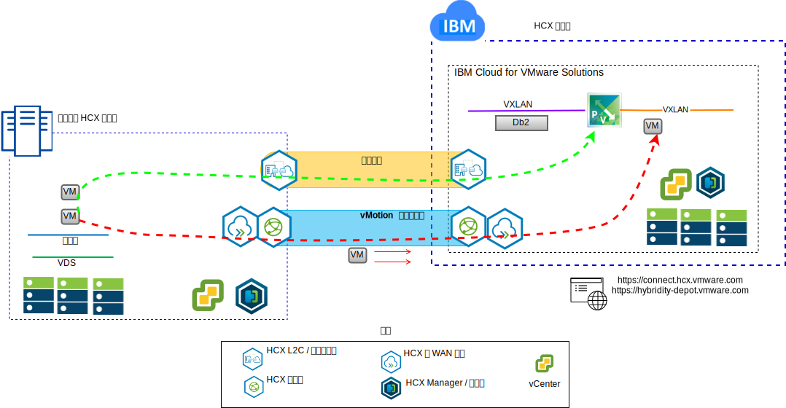

---

copyright:

  years:  2016, 2018

lastupdated: "2018-11-01"

---

# 用例

## 将 VMware 工作负载迁移到 IBM Cloud

Acme Skateboards 希望将其内部部署 VMware SDDC 实例无缝扩展到 {{site.data.keyword.cloud}} 上的 VCS 实例中。他们必须使业务保持正常运行，并尽可能减少停机时间。但将其应用程序重新配置为在云中运行并不是最佳解决方案。

{{site.data.keyword.cloud_notm}} vCenter Server with Hybridity Bundle 支持在 VCS 实例与内部部署 VMware 虚拟化数据中心之间创建无缝连接。

VMware HCX 组件（在 VCS 目标站点中部署为虚拟机 (VM)）支持建立与安装在对等内部部署源站点中的 VMware HCX 组件的连接。

图 1. VMware Hybrid Cloud Extension 服务

内部部署和 {{site.data.keyword.cloud_notm}} 之间松散耦合的互连支持多种功能，例如：
-	**简单互连** - 通过任何物理连接（包括公用因特网、专用 VPN 或直接链路）轻松建立逻辑网络连接。
-	**第 2 层扩展** - 内部部署网络扩展到云中，包括内部部署子网和 IP 寻址。
-	**加密** - 安全地加密两个站点之间的网络流量。
-	**优化的网络** - 选择最佳连接并高效处理洪流连接，以便网络流量尽快移动。
-	**数据去重** - 最高可减少 50% 的网络流量。
-	**智能路由** - 移动工作负载时，邻近路由可以更改网络路径（即，网关），以便网络流量使用目标站点网关，而不会发生“发夹”问题而返回到源站点。
-	**零停机时间迁移** - 可以使用 vMotion 将正在运行的系统移至云中或从云移回原处。
-	**安排的迁移** - 可以将任意数量的 VM 复制到目标站点，然后在该站点上的指定时间激活，以替换在源站点上运行的系统。
-	**安全策略迁移** - 如果 NSX 是以内部部署方式使用的，那么任何安全策略、防火墙等都会随工作负载一起移动。

## 混合体系结构部署

Acme Skateboards 希望在其应用程序现代化之旅中，在 {{site.data.keyword.cloud_notm}} 上部署由 vCenter Server with Hybridity Bundle (VCS) 和 {{site.data.keyword.cloud_notm}} Private (ICP) 组成的混合体系结构。其需求是在 VM 上运行其数据库，在容器中运行应用程序和 Web 接口，并希望使用一组通用工具进行网络和安全管理。

{{site.data.keyword.vmwaresolutions_short}} 提供了自动化功能，可将 VMware 技术组件部署到全球范围的 {{site.data.keyword.CloudDataCents_notm}} 中。该体系结构包含一个云区域，并支持扩展到其他地理位置和/或同一数据中心内其他 {{site.data.keyword.cloud_notm}} pod 中的更多云区域的功能。

ICP 和 Cloud Automation Manager (CAM) 产品可以手动部署到内部部署虚拟化平台中，从而支持通过内部部署位置进行云管理。或者，ICP 和 CAM 可作为服务扩展提供给现有或新的 VCS 部署，从而支持通过 {{site.data.keyword.cloud_notm}} 进行云管理。

下图表示在 VCS 实例上运行的 ICP。NSX-V 配置有专用交换机/VXLAN、分布式逻辑路由器 (DLR) 和专门针对 ICP 覆盖网络的 Edge 服务网关 (ESG)。路由设置为通过 ESG 对底层网络进行访问。

通过使用 {{site.data.keyword.cloud_notm}} 自动化，Acme Skateboards 可以供应混合解决方案，该解决方案包含 VCS（用于运行其数据库 VM）和 ICP on VCS（用于在容器中运行其应用程序和前端 Web Service）。NSX 为其提供了一组通用管理工具，用于管理覆盖网络中的联网和安全性。

有关 NSX-V 的更多信息，请参阅 [NSX-V 概述](vcsnsxt-overview-ic4vnsxv.html)。有关 VCS 和 ICP 产品的更多信息，请参阅 [vCenter Server 和 {{site.data.keyword.cloud_notm}} Private](../vcsicp/vcsicp-intro.html)。

图 2. 使用 ICP 的 VCS

这将在内部部署和 {{site.data.keyword.cloud_notm}} 之间创建松散耦合的互连，并支持以下功能：
-	**简单互连** - 通过任何物理连接（包括公用因特网、专用 VPN 或直接链路）轻松建立逻辑网络连接。
-	**第 2 层扩展** - 内部部署网络扩展到云中，包括内部部署子网和 IP 寻址。
-	**加密** - 安全地加密两个站点之间的网络流量。
-	**优化的网络** - 选择最佳连接并高效处理洪流连接，以便网络流量尽快移动。
-	**数据去重** - 最高可减少 50% 的网络流量。
-	**智能路由** - 移动工作负载时，邻近路由可以更改网络路径（即，网关），以便网络流量使用目标站点网关，而不会发生“发夹”问题而返回到源站点。
-	**零停机时间迁移** - 可以使用 vMotion 将正在运行的系统移至云中或从云移回原处。
-	**安排的迁移** - 可以将任意数量的 VM 复制到目标站点，然后在该站点上的指定时间激活，以替换在源站点上运行的系统。
-	**安全策略迁移** - 如果 NSX 是以内部部署方式使用的，那么任何安全策略、防火墙等都会随工作负载一起移动。

通过使用此解决方案，Acme Skateboards 能够成功地将其内部部署 VMware 工作负载迁移到 {{site.data.keyword.cloud_notm}}，满足了几乎或完全不发生停机时间，也无需重新配置应用程序的要求。有关 vCenter Server with Hybridity Bundle 的更多信息，请参阅 [VMware HCX on {{site.data.keyword.cloud_notm}} 解决方案体系结构](https://www.ibm.com/cloud/garage/files/HCX_Architecture_Design.pdf)。

### 相关链接

* [VCS Hybridity Bundle 概述](../vcs/vcs-hybridity-intro.html)
