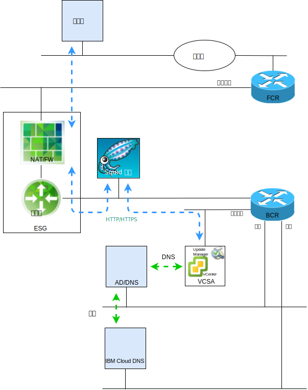

---

copyright:

  years:  2016, 2019

lastupdated: "2019-05-21"

subcollection: vmware-solutions

---

# VMware Update Manager 简介
{: #vum-intro}

本文档旨在向 {{site.data.keyword.vmwaresolutions_full}} vCenter Server 实例的系统管理者提供有关如何配置 VMware Update Manager (VUM) 以使 vCenter Server 环境保持最新的指示信息。

VUM 支持对 VMware vSphere 进行集中的自动补丁和版本管理，并允许您在 VMware vCenter Server on {{site.data.keyword.cloud_notm}} 环境中完成以下任务：
* 升级并修补 vSphere ESXi 主机。
* 在主机上安装和更新第三方软件。
* 升级虚拟机硬件、VMware Tools 和虚拟设备。

本文档还描述了维护 vCenter Server 实例的以下组件的过程：
* vCenter Server Appliance
* NSX
* vSAN

本文档描述使用基于 CentOS 和 Squid 的代理服务器实现，使 VUM 能够访问 VMware 存储库。VUM 向 VMware 的更新服务器请求资源时，会先将请求发送到代理服务器，然后代理服务器通过外部服务网关 (ESG) 将请求发送到更新服务器。代理服务器获得资源后，会将该资源发送给 VUM。

vCenter Server 当前部署的是 vSphere 6.5，这意味着现在 VUM 已集成在 vCenter Server Appliance (VCSA) 中，并且由于 VUM 客户机组件是在 vSphere Web Client 上运行的插件，在部署 VCSA 后会自动启用。但是，VUM 无权访问因特网来访问 VMware 存储库。

此记录的配置使用“一体化”连接因特网的 VUM 部署模型，该模型使用 {{site.data.keyword.cloud_notm}} 公用网络提供因特网访问权以下载升级和补丁。

需要使用替代因特网连接的客户机必须调查 VMware vSphere Update Manager Download Service (UMDS)，这并不在本出版物的范围之内。

虽然 VUM 可以配置为从共享存储库导入更新，或从压缩文件手动导入补丁和扩展，但本文档中并未讨论这些主题。

在 vSphere 6.5 中，在单独的 Windows 系统上安装 VUM 服务器期间，不再支持将 VUM 注册到 VCSA，因此无法在 vCenter Server 环境内的 VM 中部署 VUM。

本文档组织为以下部分：
* [VMware Update Manager 概述](/docs/services/vmwaresolutions/archiref/vum?topic=vmware-solutions-vum-overview) - 描述 VUM 过程，并介绍了解该工具的操作和 UI 所需的关键术语。
* **安装、配置和使用** - 描述在 vCenter Server 实例中使 VUM 正常运行所需的步骤：
  - [初始配置](/docs/services/vmwaresolutions/archiref/vum?topic=vmware-solutions-vum-init-config) - 一次性任务，用于：
      - 配置 NSX 联网，以允许代理服务器访问因特网。
      - 安装并配置代理服务器，以便为 VUM 提供因特网访问权。
      - 初始设置 VUM 以使用代理服务器。
  - [收集元数据](/docs/services/vmwaresolutions/archiref/vum?topic=vmware-solutions-vum-metadata) - VUM 通过预定义的自动过程来下载有关升级、补丁或扩展的元数据，您可以对自动过程进行修改。根据可配置的定期时间间隔，VUM 会与 VMware 或第三方来源联系，以收集有关可用升级、补丁或扩展的最新元数据。
  - [创建基线](/docs/services/vmwaresolutions/archiref/vum?topic=vmware-solutions-vum-baselines) - 使用预定义的基线和基线组或创建定制基线和基线组。然后将基线和基线组连接到库存对象。
  - [扫描和复查](/docs/services/vmwaresolutions/archiref/vum?topic=vmware-solutions-vum-scanning) - 扫描库存对象，并复查结果以确定它们与基线和基线组的一致程度。可以通过文本搜索、组选择、基线选择和一致性状态选择来过滤扫描结果。
  - [编译打包和修复](/docs/services/vmwaresolutions/archiref/vum?topic=vmware-solutions-vum-staging) - 可以选择在修复之前对补丁和扩展进行编译打包，以确保将其下载到主机。在修复期间，VUM 会将补丁、扩展和升级应用于库存对象。

本文档假定您已部署一个主 vCenter Server 实例或有多个独立的主 vCenter Server 实例。如果已部署主 vCenter Server 实例和辅助 vCenter Server 实例，并使用了 Single Sign On (SSO)，请参阅 [SSO 链接的 vCenter](/docs/services/vmwaresolutions/archiref/vum?topic=vmware-solutions-vum-updating-vcsa)。

如果是使用 vSAN 部署的 vCenter Server，请首先参阅[更新 vSAN 集群](/docs/services/vmwaresolutions/archiref/vum?topic=vmware-solutions-vum-updating-vsan)。

如果要更新 {{site.data.keyword.cloud_notm}} 基础架构管理自动化，请使用 {{site.data.keyword.vmwaresolutions_short}} 控制台。

通过 [{{site.data.keyword.vmwaresolutions_short}} 控制台](https://cloud.ibm.com/infrastructure/vmware-solutions/console)，可以执行以下操作：
*	升级许可证，例如将 NSX Base 升级到其他版本
*	启动对 vCenter Server 平台的更新，例如移至 V2.5
*	查看更新的状态
*	查看已安装的更新

此工具仅支持对 vCenter Server 实例的管理组件进行自动更新。VMware 产品更新必须通过使用本文档中详细描述的过程进行应用。

## 相关链接
{: #vum-intro-related}

* [VMware HCX on {{site.data.keyword.cloud_notm}} 解决方案体系结构](/docs/services/vmwaresolutions/services?topic=vmware-solutions-hcx-archi-intro#hcx-archi-intro)
* [VMware Solutions on {{site.data.keyword.cloud_notm}} 数字技术互动](https://ibm-dte.mybluemix.net/vmware)（演示）
