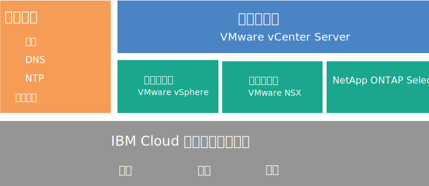
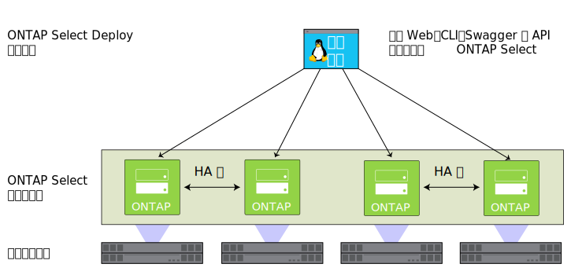

---

copyright:

  years:  2016, 2018

lastupdated: "2018-05-18"

---

# NetApp ONTAP Select 概述

查看 NetApp ONTAP Select on {{site.data.keyword.cloud}} 部署的体系结构和组件。

## NetApp ONTAP Select 体系结构

NetApp ONTAP Select on {{site.data.keyword.cloud_notm}} 产品通过提供存储虚拟化服务，完善了 vCenter Server 部署。

下图描述了 NetApp ONTAP Select on vCenter Server 部署的总体体系结构。

图 1. NetApp ONTAP Select on {{site.data.keyword.cloud_notm}} 的高级别体系结构

### 物理基础架构

此层提供要由虚拟基础架构使用的物理基础架构（计算、网络和存储资源）。

### 虚拟化基础架构（计算、网络和 NetApp ONTAP Select）

此层通过不同 VMware 产品和 NetApp ONTAP Select 产品对物理基础架构进行虚拟化：
* VMware vSphere 对物理计算资源进行虚拟化。
* VMware NSX 是网络虚拟化平台，用于提供逻辑联网组件和虚拟网络。
* NetApp ONTAP Select on {{site.data.keyword.cloud_notm}} 部署了由四个主机的四个 VM 组成的 ONTAP Select 集群。

下图描述了 NetApp ONTAP Select 部署上的组件。

图 2. NetApp ONTAP Select 组件

### 虚拟化管理

此层由 vCenter Server 虚拟设备、NSX Manager、2 个 NSX ESG、3 个 NSX Controller、Platform Services Controller (PSC) 虚拟设备、vCenter Server Appliance (vCSA) 和 IBM CloudDriver 虚拟机组成。

NetApp ONTAP Select 在 VMware 集群中运行，并对主机上的本地存储器进行虚拟化。NetApp ONTAP Select 部署在专用模型中，不应与其他工作负载共享同一集群。因此，NetApp ONTAP Select on {{site.data.keyword.cloud_notm}} 产品的硬件配置仅基于 NetApp ONTAP Select 的需求来设置大小。

<!--For details about the architecture, see the _Reference architecture_ document in the [Architecture Center](https://www.ibm.com/devops/method/content/architecture/virtVCenterServerPlatform){:new_window}.-->

## NetApp ONTAP Select 实例组件

NetApp ONTAP Select 实例中包含以下组件。

**注**：标准化配置的可用性和定价可能会因选择用于部署的 {{site.data.keyword.CloudDataCent_notm}} 而有所不同。

### 存储

* 三个选项：**高性能（中型）**、**高性能（大型）**和**高容量**
* 具有热备用的 RAID 5
* 两个 1-TB SATA 驱动器（ESXi 操作系统）- RAID 1
* 管理数据存储 - 500 GB（对于管理 VM）

### 预设置配置

四种 {{site.data.keyword.cloud_notm}}{{site.data.keyword.baremetal_short}}，配置选项如下：
* **高性能（中型）**- 高级许可证 / 双 Intel Xeon E5-2650 V4（共 24 个核心，2.2 GHz）/ 128 GB RAM / 每节点 22 个 1.9 TB SSD 驱动器容量 / 4 节点集群的有效容量 - 59 TB
* **高性能（大型）**- 高级许可证 / 双 Intel Xeon E5-2650 V4（共 24 个核心，2.2 GHz）/ 128 GB RAM / 每节点 22 个 3.8 TB SSD 驱动器容量 / 4 节点集群的有效容量 - 118 TB
* **高容量** - 标准许可证 / 双 Intel Xeon E5-2650 V4（共 24 个核心，2.2 GHz）/ 64 GB RAM / 每节点 34 个 4 TB SATA 驱动器容量 / 4 节点集群的有效容量 - 190 TB

**注**：3.8 TB SSD（固态磁盘）驱动器在数据中心内基本可用后就会受到支持。

### 硬件

* 三个 RAM 和磁盘选项：**高性能（中型）**、**高性能（大型）**和**高容量**
* 两个 1 TB SATA 驱动器（ESXi 操作系统）
* 一个 RAID 磁盘控制器
* VMware Server Virtualization 6.5

### 联网

* 10 Gbps 双公用和专用网络上行链路
* 三个 VLAN（虚拟 LAN）：一个公用 VLAN 和两个专用 VLAN
* 一个 VXLAN（虚拟可扩展 LAN），带 DLR（分布式逻辑路由器）
* 两个安全 VMware NSX Edge 服务网关

### 虚拟服务器实例

两个 VSI（虚拟服务器实例）：
* 用于 Microsoft Active Directory (AD) 和域名系统 (DNS) 服务的 VSI。
* 用于 IBM CloudBuilder 的 VSI，在完成实例部署后关闭。

### 许可证和费用

*  四个 Premium/Standard Edition NetApp ONTAP Select 许可证（用户提供）
*  VMware vSphere 6.5 Enterprise Plus Edition
*  VMware vCenter Server 6.5
*  VMware NSX Base for Service Providers 版本
*  支持和服务费用（每个节点一个许可证）

<!--For details about the components, see the _Bill of Materials_ document on the [Reference Architecture](https://www.ibm.com/cloud/garage/content/architecture/virtualizationArchitecture/reference-architecture) page.-->

**重要信息**：您只能在 {{site.data.keyword.vmwaresolutions_short}} 控制台中管理 {{site.data.keyword.cloud_notm}} 帐户中创建的 {{site.data.keyword.vmwaresolutions_short}} 组件，而不能在 {{site.data.keyword.slportal}} 中或在控制台外部通过其他任何方法来进行管理。
如果在 {{site.data.keyword.vmwaresolutions_short}} 控制台外部更改这些组件，那么这些更改与控制台不同步。

**注意**：在 {{site.data.keyword.vmwaresolutions_short}} 控制台外部管理任何 {{site.data.keyword.vmwaresolutions_short}} 组件（在订购实例时安装到 {{site.data.keyword.cloud_notm}} 帐户中）可能会使环境变得不稳定。这些管理活动包括：
*  添加、修改、返回、除去组件或关闭组件电源
*  通过添加或除去 ESXi 服务器来扩展或收缩实例容量
*  重新启动服务

   这些活动的例外情况包括在 {{site.data.keyword.slportal}} 中管理共享存储器文件共享。此类活动包括：订购、删除（如果已安装，可能会影响数据存储）、授权和安装共享存储器文件共享。

## 相关链接

* [规划 NetApp ONTAP Select 实例](np_planning.html)
* [订购 NetApp ONTAP Select 实例](np_orderinginstances.html)
* [vCenter Server 概述](../vcenter/vc_vcenterserveroverview.html)
* [NetApp ONTAP 文档中心](http://docs.netapp.com/ontap-9/index.jsp?topic=%2Fcom.netapp.doc.exp-clus-peer%2Fhome.html){:new_window}
