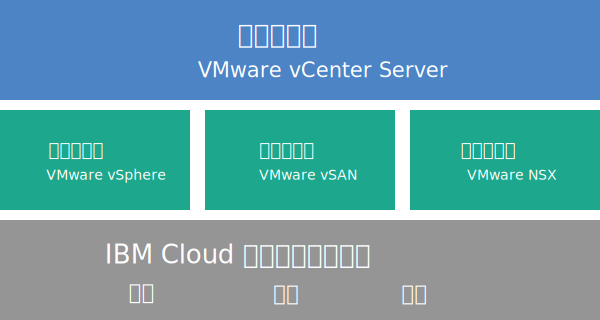

---

copyright:

  years:  2016, 2018

lastupdated: "2018-10-29"

---

{:tip: .tip}
{:note: .note}
{:important: .important}

# Cloud Foundation 概述

在 {{site.data.keyword.cloud}} 上订购 VMware Cloud Foundation 后，会自动部署整个 VMware 环境。基本部署包含预安装并配置了 VMware Cloud Foundation 堆栈的四个 {{site.data.keyword.cloud_notm}} {{site.data.keyword.baremetal_short}}，以提供统一的软件定义数据中心 (SDDC) 平台。Cloud Foundation 会以本机方式集成 VMware vSphere、VMware NSX 和 VMware 虚拟 SAN，并且基于 VMware 验证的设计进行架构设计。

## Cloud Foundation 体系结构

下图描述了 Cloud Foundation 部署的总体体系结构和组件。

图 1. Cloud Foundation 体系结构

### 物理基础架构

此层提供要由虚拟基础架构使用的物理基础架构（计算、存储和网络资源）。

### 虚拟化基础架构（计算、存储和网络）

此层通过不同 VMware 产品对物理基础架构进行虚拟化：
* VMware vSphere 对物理计算资源进行虚拟化。
* VMware 虚拟 SAN (VSAN) 基于物理服务器中的存储器提供软件定义的共享存储器。
* VMware NSX 是网络虚拟化平台，用于提供逻辑联网组件和虚拟网络。

### 虚拟化管理

此层包含 vCenter Server，表示虚拟化环境的管理层。可以使用与 vSphere API 兼容的相同的熟悉工具和脚本来管理 IBM 托管的 VMware 环境。

在 {{site.data.keyword.vmwaresolutions_short}} 控制台上，可以使用添加和除去 ESXi 服务器功能来扩展和收缩实例的容量。此外，还提供了生命周期管理功能，例如在托管环境中对 VMware 组件应用更新和升级。

有关体系结构的更多信息，请参阅[解决方案概述](../archiref/solution/solution_overview.html)。

## Cloud Foundation 实例的技术规范

Cloud Foundation 实例中包含以下组件。

发生的硬件、联网、虚拟机和存储器费用可能会因选择用于部署的 {{site.data.keyword.CloudDataCent_notm}} 不同而变化。
{:note}

### 裸机服务器

可以使用下列其中一个配置来订购 {{site.data.keyword.cloud_notm}} {{site.data.keyword.baremetal_short}}：
*  **Skylake** 或 **Broadwell**：具有所选 CPU 型号和 RAM 大小的 {{site.data.keyword.baremetal_short}}。   
   * 2 个 Intel Skylake 代 CPU（Intel Xeon 4100/5100/6100 系列）
   * 2 个 Intel Broadwell 代 CPU（Intel Xeon E5-2600 V4 系列）

   如果计划使用 vSAN 存储器，那么配置需要 4 个 {{site.data.keyword.baremetal_short}}。
   {:note}
* **预配置**：2 个 Intel Broadwell 代 CPU（Intel Xeon E5-2600 V4 系列）
  * **小型**（双 Intel Xeon E5-2650 V4 / 共 24 个核心，2.2 GHz / 128 GB RAM / 12 个磁盘）
  * **大型**（双 Intel Xeon E5-2690 V4 / 共 28 个核心，2.6 GHz / 512 GB RAM / 12 个磁盘）

### 联网

订购了以下联网组件：
* 10 Gbps 双公用和专用网络上行链路
* 三个 VLAN（虚拟 LAN）：一个公用 VLAN 和两个专用 VLAN
* 用于出站 HTTPS 管理流量的安全管理服务 VMware NSX Edge 服务网关 (ESG)，由 IBM 部署为管理联网拓扑的一部分。IBM 管理虚拟机使用此 ESG 与自动化相关的特定外部 IBM 管理组件进行通信。有关更多信息，请参阅[管理服务 NSX Edge 会构成安全风险吗？](../vmonic/faq.html#does-the-management-services-nsx-edge-pose-a-security-risk-)

  您无法访问此 ESG，也无法使用此 ESG。如果对其进行修改，那么可能无法在 {{site.data.keyword.vmwaresolutions_short}} 控制台中管理 Cloud Foundation 实例。此外，使用防火墙或禁用与外部 IBM 管理组件的 ESG 通信将导致 {{site.data.keyword.vmwaresolutions_short}} 无法使用。
{:important}

* 如果您现有的一个集群中有当前 VMware vSphere 版本支持的 ESXi 服务器，那么会自动启用 EVC (Enhanced vMotion Compatibility) 功能。EVC 通过确保集群中的所有 ESXi 服务器向虚拟机公开一组相同的 CPU 功能，从而为集群中的所有 ESXi 服务器提供 vMotion 兼容性。通过使用 EVC，即使 ESXi 服务器上的实际 CPU 可能不同，虚拟机也可以在集群中的任何 ESXi 服务器之间进行迁移。

### 虚拟服务器实例

订购了以下 VSI（虚拟服务器实例）：
* 用于 Microsoft Active Directory (AD) 和域名系统 (DNS) 服务的 VSI。多站点配置支持需要 VSI。此 VSI 的规范是：Windows 2012 R2（8 GB RAM / 2 个 CPU 核心 / 100 GB 磁盘 / 双 1 Gbps 专用上行链路）。
* 用于 IBM CloudBuilder 的 VSI，在完成实例部署后关闭。
* （如果订购了 Veeam on {{site.data.keyword.cloud_notm}}）订购了用于 Veeam 备份服务的 VSI。

### 存储

根据选择的 {{site.data.keyword.baremetal_short}} 配置，订购了以下存储器：
* 两个 1-TB SATA 引导磁盘
* 两个 960-GB SSD（固态磁盘）高速缓存磁盘
* 一个 RAID 磁盘控制器
* 仅对于 **Skylake** 和 **Broadwell** 配置，可以根据需求设置磁盘驱动器数以及磁盘类型和容量。此外，还有一个高性能 Intel Optane 选项，用于提供两个额外的容量磁盘托架，总共可容纳 10 个容量磁盘。高性能 Intel Optane 选项取决于 CPU 型号。
* 仅对于**预配置**的**小型**配置：两个 1.9 TB SSD 容量磁盘
* 仅对于**预配置**的**大型**配置：四个 3.8 TB SSD 容量磁盘

### 许可证（IBM 提供或 BYOL）和费用

* 四个 VMware vSphere Enterprise Plus 6.5u1
* 四个 VMware vCenter Server 6.5
* 四个 VMware NSX Enterprise 6.3
* 四个 VMware vSAN Advanced 或 Enterprise 6.6
* 四个 SDDC Manager 许可证（仅限 IBM 提供的许可证）
* 四个支持和服务费用

## Cloud Foundation 扩展节点的技术规范

每个 Cloud Foundation 扩展节点将在您的 {{site.data.keyword.cloud_notm}} 帐户中部署以下组件并收取相应费用。

### 扩展节点的硬件

一个 {{site.data.keyword.cloud_notm}} 裸机服务器，其配置在 [Cloud Foundation 实例的技术规范](../sddc/sd_cloudfoundationoverview.html#technical-specifications-for-cloud-foundation-instances)中提供。

### 扩展节点的许可证和费用

* 一个 VMware vSphere Enterprise Plus 6.5u1
* 一个 VMware vCenter Server 6.5
* 一个 VMware NSX Enterprise 6.3
* 一个 VMware vSAN Advanced 或 Enterprise 6.6
* 一个 SDDC Manager 许可证
* 一个支持和服务费用

您只能在 {{site.data.keyword.vmwaresolutions_short}} 控制台中管理 {{site.data.keyword.cloud_notm}} 帐户中创建的 {{site.data.keyword.vmwaresolutions_short}} 组件，而不能在 {{site.data.keyword.slportal}} 中或在控制台外部通过其他任何方法来进行管理。如果在 {{site.data.keyword.vmwaresolutions_short}} 控制台外部更改这些组件，那么这些更改与控制台不同步。
{:important}

**注意**：在 {{site.data.keyword.vmwaresolutions_short}} 控制台外部管理任何 {{site.data.keyword.vmwaresolutions_short}} 组件（在订购实例时已安装到 {{site.data.keyword.cloud_notm}} 帐户中）可能会使环境变得不稳定。这些管理活动包括：
*  添加、修改、返回或除去组件
*  通过添加或除去 ESXi 服务器来扩展或收缩实例容量
*  关闭组件电源
*  重新启动服务

   这些活动的例外情况包括在 {{site.data.keyword.slportal}} 中管理共享存储器文件共享。此类活动包括：订购、删除（如果已安装，可能会影响数据存储）、授权和安装共享存储器文件共享。

### 相关链接

* [Cloud Foundation 软件材料清单](sd_bom.html)
* [规划 Cloud Foundation 实例](sd_planning.html)
* [订购 Cloud Foundation 实例](sd_orderinginstance.html)
* [VMware vSphere 文档中心](https://pubs.vmware.com/vsphere-60/index.jsp){:new_window}
* [VMware NSX 6 文档中心](https://pubs.vmware.com/NSX-6/index.jsp){:new_window}
* [EVC 和 CPU 兼容性常见问题](https://kb.vmware.com/s/article/1005764)
