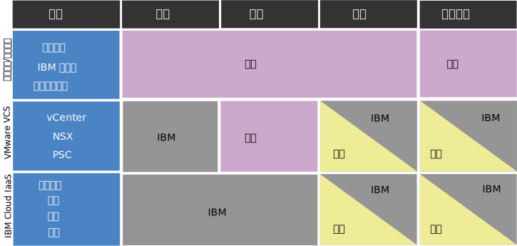

---

copyright:

  years:  2016, 2019

lastupdated: "2019-06-28"

keywords: vCenter Server Hybridity compliance, compliance info Hybridity, vCenter Server Hybridity policy

subcollection: vmware-solutions

---

{:external: target="_blank" .external}

# vCenter Server with Hybridity Bundle 实例的合规性信息
{: #vc_hybrid_compl_info}

请查看以下信息，以获取有关 VMware vCenter Server with Hybridity Bundle 实例合规性的详细信息。

## vCenter Server IBM Cloud with Hybridity Bundle 的客户责任和 IBM 责任
{: #vc_hybrid_compl_info-responsibility}

下图提供了有关合规性活动的客户（您）责任和 IBM 责任的详细信息。

## 健康数据限制
{: #vc_hybrid_compl_info-health-data-restrictions}

本部分中的条款适用于整个 {{site.data.keyword.vmwaresolutions_full}} 产品服务组合。

### HIPAA
{: #vc_hybrid_compl_info-hipaa}

尽管此 Cloud Service 的数据表中包含有关《1996 年健康信息可移植性和责任法案》（“HIPAA”）的信息，并且允许将健康信息和健康数据用作此 Cloud Service 的个人数据类型和/或特殊类别个人数据（统称为“健康数据”），但将健康数据用于此 Cloud Service 仍须遵守以下限制和条件：

{{site.data.keyword.vmwaresolutions_short}}

仅当客户事先通知 IBM 自己要将健康数据用于 Cloud Service，并且 IBM 以书面方式确认将针对健康数据使用来供应 Cloud Service 时，才能供应上面列出的产品，以实现 HIPAA 隐私和安全规则控制以用于健康数据。因此，Cloud Service 不得用于依据 HIPAA 受保护的任何健康数据的传输、存储或用于其他用途，除非 (i) 客户向 IBM 提供此类通知，(ii) IBM 与客户签订了一份适用的业务关联协议，并且 (iii) IBM 向客户提供明确的书面确认，表明 Cloud Service 可与健康数据共同使用。根据 HIPAA 的规定，在任何情况下，Cloud Service 都不得作为医疗保健信息交流中心来处理 PHI。

如果发生系统故障，第三方服务提供者可能会请求调试客户的工件（日志、核心内存转储等）。收集这些工件并将其传输给第三方提供者完全是客户的责任。IBM 支持团队可通过提供文档链接或通过屏幕共享会话提供指导来提供帮助。但是，客户须负责清理任何 PHI 的数据，并确保在传输之前对其进行适当加密。此外，在发送数据之前，评估是否需要与第三方提供者签订 BAA 也是客户的责任。

## 个人信息和受管控数据
{: #vc_hybrid_compl_info-personal-info-and-regulated-data}

此 Cloud Service 并非旨在满足任何受管控内容（例如，个人信息或敏感的个人信息）的特定安全要求。客户负责确定在自己使用的与 Cloud Service 有关的内容类型方面，此 Cloud Service 是否符合其需求。

## 用于访问客户实例的策略
{: #vc_hybrid_compl_info-policy-for-access-client-inst}

VMware vCenter Server 环境作为 {{site.data.keyword.vmwaresolutions_short}} 交付，用于为客户提供 VMware 管理平台层来管理虚拟化功能。在 IBM Cloud for VMware 产品和服务的整个生命周期中，可能需要 IBM 支持人员来帮助确保这些产品和服务成功使用。在大多数情况下，IBM 支持人员的干预是客户请求（即，支持凭单）的结果。但是，在极少数情况下，IBM 支持人员可能会主动提供帮助，而无需客户的书面支持凭单，目的是预防未来发生进一步的问题。此类访问通过 IBM Cloud 内部支持网络执行，通过 IBM 支持人员开具的支持凭单进行记录，并由 IBM Cloud SOC 持续监控。在任何情况下，IBM 支持人员都不会未经客户同意就修改实例配置。访问的对象是 VMware 管理组件和/或 IBM Cloud 管理组件，永远不会访问客户的虚拟机或应用程序。

## 主动支持
{: #vc_hybrid_compl_info-proactive-support}

### 主动支持初始供应
{: #vc_hybrid_compl_info-proactive-support-for-initial-provision}

* 在初始订购和供应实例或服务期间，IBM 支持人员可能会在未事先通知客户的情况下访问客户实例和信息，目的是为了确保正确执行订单。
* 除了订购、供应和安装过程外，IBM 支持人员还会主动监视实例生命周期内的操作（例如，添加新主机）。
* 为了解决已经出现或未来可能出现的问题，IBM 支持人员可能会执行若干操作，包括但不限于：复查客户订单详细信息、重新启动自动化作业、执行操作系统重装操作或使用为客户提供的 IBM Cloud 用户名和 API 密钥来开具 IBM Cloud 凭单。

### 主动支持稳态运行
{: #vc_hybrid_compl_info-proactive-support-for-steady-state-operations}

* 在极少数情况下，IBM 支持人员可能需要在稳态运行期间访问客户的实例，以主动对实例问题进行故障诊断或验证所供应的服务或组件的功能。
* 此类访问通过 IBM Cloud 内部支持网络执行。在任何情况下，IBM 支持人员都不会未经客户同意就修改实例配置。
* 访问的对象是 VMware 管理组件和/或 IBM Cloud 管理组件，永远不会访问客户的虚拟机或应用程序。

### 支持凭单
{: #vc_hybrid_compl_info-support-tickets}

* IBM 不会主动监视 vCenter Server 环境，并且 IBM 支持人员也不会在没有客户书面支持凭单的情况下，进入正常运行的 VMware 管理层。
* 客户针对实例、服务或供应问题开具支持凭单后，该凭单会迅速分配给相应的 IBM 支持团队，他们将是负责解决该问题的主要参与方。
* 由于在团队级别维护高级技术专业知识所需的专业水平，有时需要多个支持团队参与解决特定软件问题。这一点可轻松得到解决，因为我们的支持团队全部联网在一起，可以作为一个整体通力合作来解决出现的任何问题。
* 为了调查问题，IBM 可能需要访问您系统上与故障相关的信息，或者可能需要再现故障以获取其他信息。
* 客户生成的支持凭单用作确认，表明客户同意 IBM 支持人员访问 VMware 管理层进行调查、调试和分类。如果需要维护中断或对环境进行更改，IBM 支持人员将要求客户通过凭单进行额外书面确认，以将此作为变更管理流程的一部分。
* 有关支持凭单的更多信息，请参阅 [IBM Support Guide](https://www-01.ibm.com/support/docview.wss?uid=ibm10733923){:external} 和[联系 IBM 支持人员](/docs/services/vmwaresolutions/vmonic?topic=vmware-solutions-trbl_support)。

## 客户责任
{: #vc_hybrid_compl_info-client-responsibilities}

* 虽然我们建议客户采取措施加强其环境的安全性，但应该注意的是，某些做法可能会对 IBM Cloud for VMware 的有效性产生负面影响。
* 客户负责自己创建的防火墙以及因此对 IBM Cloud for VMware 组件之间的通信所施加的限制。这些防火墙还可能影响 IBM 支持人员访问客户实例和解决问题的能力。
* 客户完全负责对其系统中的数据进行加密。
* 初始部署时，产品的自动化和客户的帐户是分开的。允许并鼓励客户更改 IBM 在门户网站中提供的所有密码。
* vCenter 访问权和凭证在初始部署期间创建，并提供给客户。作为产品需求的一部分，IBM 支持人员必须保留对管理层的完全访问权，以提供生命周期管理以及对客户的支持。
* 如果在任何时间更改了凭证（例如，密码），那么 IBM 支持人员可能无法再帮助客户恢复丢失或遗忘的凭证，或者甚至无法对客户的环境进行故障诊断。
* 有关此问题和相关问题的重要性的更多信息，请参阅[关于更改 NSX 组件密码时的注意事项](/docs/services/vmwaresolutions/vcenter?topic=vmware-solutions-vc_networkingonvcenterserver#vc_networkingonvcenterserver-change-nsx-component-password-considerations)和[关于更改 vCenter Server 工件的注意事项](/docs/services/vmwaresolutions/vcenter?topic=vmware-solutions-vcenter_chg_impact)。

### 沟通和故障诊断
{: #vc_hybrid_compl_info-communication-troubleshooting}

* IBM 不保证我们的产品没有缺陷，但我们会努力修复这些缺陷以确保产品按设计运行。客户在这方面发挥了很大的作用。
* 虽然 IBM 支持人员可以在产品的整个生命周期内提供帮助，但支持工作可能受到客户提供的信息和访问权的限制。
* 客户负责在发生故障时提供深入的文档，并在需要进一步澄清时，及时响应 IBM 支持人员。
* 客户还负责遵循本文档中规定的准则，以同意主动支持。
* 如果客户拒绝同意或未遵循所提供的准则，那么因客户与支持团队之间的沟通延迟而导致问题解决延迟的责任，由客户自行承担。
* 客户应做好准备，执行本该由 IBM 支持人员执行的其他技术故障诊断。IBM 将在必要时提供适当的文档和帮助。

### 安全措施
{: #vc_hybrid_compl_info-security-measures}

* Cloud Service 的管理：客户负责应用程序（包括底层中间件）的管理、操作、维护和安全性。
* 服务完整性和可用性：IBM 将向客户转发针对此 Cloud Service 检测到的所有网络入侵通知。客户须负责确定报告的每个通知的影响。客户将收到硬件故障通知。监视和响应操作系统或软件故障是客户的责任，但可根据需要联系 IBM 支持人员参与。
* 活动日志记录：客户负责根据需要对操作系统/系统和数据库/应用程序进行活动日志记录。
* 加密：客户负责根据需要配置和管理所有加密（针对静态数据和动态数据）。
* 业务连续性和灾难恢复：客户负责根据需要配置和管理所有业务连续性和灾难恢复过程。

### 第三方服务
{: #vc_hybrid_compl_info-third-party-services}

* 某些 IBM 产品中随附或捆绑有第三方软件或代码。这些代码是为了方便起见而包含的，但不能将其视为 IBM 程序的一部分。
* 这些非 IBM 程序由其提供者直接许可。客户同意依据提供者的条款和条件来使用这些非 IBM 程序。这些条款和条件在购买 IBM 产品时随附的 IBM 许可协议中提供。
* IBM 会进行测试，以确保第三方产品能与 IBM 程序和功能相应地配合使用。
* IBM 软件支持人员将利用我们的 IBM 产品如何与第三方软件配合使用的知识来诊断与客户问题相关的问题。一旦认定 IBM 程序工作正常，但该问题仍然存在，IBM 必须向客户推荐第三方供应商以做进一步诊断。
* 有关第三方软件或代码的客户责任的进一步信息，请参阅 [IBM Support Guide](https://www-01.ibm.com/support/docview.wss?uid=ibm10733923){:external}。

## 同意访问客户环境
{: #vc_hybrid_compl_info-consent-to-access-client-environment}

* IBM 支持人员需要访问客户的实例，以确保它们得到正确供应和维护。客户负责控制和提供所需的访问权。
* 客户的书面支持凭单用作确认，表明客户同意 IBM 支持人员访问客户实例，以解决在该支持凭单中描述的问题。
* 客户负责遵循本文档中规定的准则，以同意主动支持。如果客户拒绝同意或未遵循所提供的准则，那么因客户与支持团队之间沟通延迟而导致问题确定和解决延迟的责任
以及其他可能的技术故障诊断责任，由客户自行承担。

## 初始供应
{: #vc_hybrid_compl_info-initial-provision}

* 在初始供应和订购时，将向客户提供此文档。
* 通过提交订单，即表示客户同意这些条款，也因此同意 IBM 支持人员随时访问其实例而无需事先通知，以便迅速解决与环境相关的问题或预防未来发生故障。
* 此同意适用于当前订购的所有实例的整个生命周期。未来供应的实例和实例组件可能需要额外的同意。

## 稳态运行
{: #vc_hybrid_compl_info-steady-state-operations}

如果客户在初始供应和订购时未同意对实例进行主动支持，那么客户在未来开具的任何服务凭单中，必须包含明确同意（如果需要）。同意声明必须遵循规定的准则，否则将被视为无效。

## 相关链接
{: #vc_hybrid_compl_info-related}

* [vCenter Server with Hybridity Bundle 概述](/docs/services/vmwaresolutions/vcenter?topic=vmware-solutions-vc_hybrid_overview)
* [联系 IBM 支持人员](/docs/services/vmwaresolutions/vmonic?topic=vmware-solutions-trbl_support)
