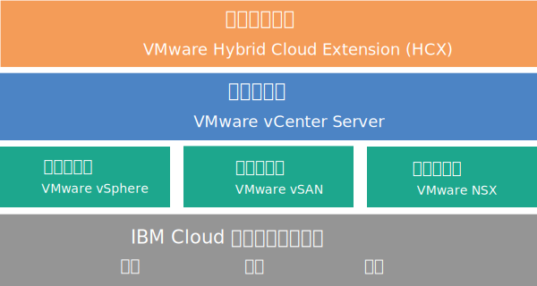

---

copyright:

  years:  2016, 2018

lastupdated: "2018-06-07"

---

# vCenter Server with Hybridity Bundle 概述

vCenter Server with Hybridity Bundle 是可用于 V2.3 和更高发行版的实例。

VMware vCenter Server on {{site.data.keyword.cloud}} with Hybridity Bundle 是一种托管的专用云，可将 VMware vSphere 堆栈作为服务交付。VMware 环境基于四个 {{site.data.keyword.cloud_notm}} {{site.data.keyword.baremetal_short}} 而构建，该环境中包含作为专用存储器的 VMware vSAN，还可以自动部署并配置基于 VMware NSX 技术的易于管理的逻辑边缘防火墙，并且包含 VMware HCX on {{site.data.keyword.cloud_notm}} 服务。

在许多情况下，整个环境可以在一天内供应完，而裸机基础架构可根据需要，快速、弹性地向上和向下扩展计算容量。

<!--Post-deployment, you can increase shared storage by ordering additional NFS (Network File System) file shares from the  {{site.data.keyword.slportal}} and manually attach them across all ESXi servers in a cluster. If you require dedicated storage, [NetApp ONTAP Select on IBM Cloud](../netapp/np_netappoverview.html) is offered in both high-performance (all SSD) and high-capacity (all SATA) configurations.-->

要增大 vSAN 集群的基于 vSAN 的存储容量，可以在部署后添加更多 ESXi 服务器。

可以将 VMware NSX Advanced Edition 升级到 Enterprise Edition，并且可以购买其他 VMware 组件，例如 VMware vRealize Operations。

如果要卸载虚拟化、访客操作系统或应用程序层的日常操作和维护，可以添加 IBM 受管服务。另外还有 IBM Cloud 专业服务团队可通过迁移、实施、规划和上线服务，帮助您加速迁移到云。

## vCenter Server with Hybridity Bundle 体系结构

下图描绘了三节点 vCenter Server with Hybridity Bundle 部署的高级别体系结构和组件。

图 1. vCenter Server with Hybridity Bundle 高级别体系结构

### 物理基础架构

此层提供要由虚拟基础架构使用的物理基础架构（计算、存储和网络资源）。

### 虚拟化基础架构（计算、存储和网络）

此层通过不同 VMware 产品对物理基础架构进行虚拟化：
* VMware vSphere 对物理计算资源进行虚拟化。
* VMware 虚拟 SAN (vSAN) 基于物理服务器中的存储器提供软件定义的共享存储器。
* VMware NSX 是网络虚拟化平台，用于提供逻辑联网组件和虚拟网络。

### 虚拟化管理

此层由 vCenter Server Appliance (vCSA)、NSX Manager、两个 NSX ESG、三个 NSX Controller、Platform Services Controller (PSC) 虚拟设备和 IBM CloudDriver 虚拟机 (VM) 组成。

基本产品随 vCenter Server Appliance 一起部署，后者的大小设置为支持具有最多 400 个主机和最多 4000 个 VM 的环境。可以使用与 vSphere API 兼容的相同工具和脚本来管理 IBM 托管的 VMware 环境。

基本产品总计需要 38 个 vCPU 和 67 GB vRAM，这些均保留用于虚拟化管理层。VM 的其余主机容量取决于若干因素，例如超额预订比率、VM 大小设置和工作负载性能需求。

有关部署 HCX on {{site.data.keyword.cloud_notm}} 服务时的其他管理资源需求，请参阅 [HCX on {{site.data.keyword.cloud_notm}} 概述](../services/hcx_considerations.html)。

### 基础架构混合

此层提供内部部署站点和 {{site.data.keyword.cloud_notm}} 站点之间资源的抽象，以便您可以安全、轻松地来回移动工作负载，而无需更改 VM 特征（例如，其 IP 地址）。

基于 VMware Hybrid Cloud Extension (HCX)，您可以在内部部署和 IBM Cloud 站点之间创建松散耦合的互连，以支持批量迁移 VM 或对 VM 执行实时 vMotion，而不会产生停机时间。

## vCenter Server with Hybridity Bundle 技术规范

vCenter Server with Hybridity Bundle 实例中包含以下组件：

**注**：标准化硬件配置的可用性和定价可能会因选择用于部署的 {{site.data.keyword.CloudDataCent}} 而有所不同。

### 裸机服务器

vCenter Server with Hybridity Bundle 实例订购中随附四个定制的 {{site.data.keyword.baremetal_short}}。提供了以下 CPU 型号：
  * 2 个 Intel Broadwell 代 CPU（Intel Xeon E5-2600 V4 系列）
  * 2 个 Intel Skylake 代 CPU（Intel Xeon 4100/5100/6100 系列）

<!--For NFS storage configuration, the recommended number of {{site.data.keyword.baremetal_short}} is set to the default of three.

**Note:** If you select vSAN storage, the configuration requires four {{site.data.keyword.baremetal_short}}.-->

### 联网

订购了以下联网组件：
*  10 Gbps 双公用和专用网络上行链路
*  三个 VLAN（虚拟 LAN）：一个公用 VLAN 和两个专用 VLAN
*  一个 VXLAN（虚拟可扩展 LAN），带 DLR（分布式逻辑路由器），用于处理连接到第 2 层 (L2) 网络的本地工作负载之间的潜在东-西通信。VXLAN 部署为样本路由拓扑，可以基于该拓扑进行构建，或者进行修改或将其除去。还可以通过将其他 VXLAN 连接到 DLR 上的新逻辑接口来添加安全区域。
*  两个 VMware NSX Edge 服务网关：
  * 用于出站 HTTPS 管理流量的安全管理服务 VMware NSX Edge 服务网关 (ESG)，由 IBM 部署为管理联网拓扑的一部分。IBM 管理 VM 使用此 ESG 来与自动化相关的特定外部 IBM 管理组件进行通信。有关更多信息，请参阅[配置网络以使用客户管理的 ESG](../vcenter/vc_esg_config.html#configuring-your-network-to-use-the-customer-managed-nsx-esg-with-your-vms)。

    **重要信息**：此 ESG 对您不可访问，因此您无法使用此 ESG。如果对其进行修改，那么可能无法在 {{site.data.keyword.vmwaresolutions_short}} 控制台中管理 vCenter Server with Hybridity Bundle 实例。此外，请注意，使用防火墙或禁用与外部 IBM 管理组件的 ESG 通信将导致 {{site.data.keyword.vmwaresolutions_short}} 无法使用。
  * 用于出站和入站 HTTPS 工作负载流量的客户管理的安全 VMware NSX Edge 服务网关，由 IBM 部署为模板，您可修改此模板来提供 VPN 访问或公共访问。有关更多信息，请参阅[客户管理的 NSX Edge 会构成安全风险吗？](../vmonic/faq.html#does-the-customer-managed-nsx-edge-pose-a-security-risk-)。

有关部署 HCX on {{site.data.keyword.cloud_notm}} 服务时订购的联网组件的其他信息，请参阅 [HCX on {{site.data.keyword.cloud_notm}} 概述](../services/hcx_considerations.html)。

### 虚拟服务器实例

订购了以下虚拟服务器实例 (VSI)：
* 用于 IBM CloudBuilder 的 VSI，在完成实例部署后关闭。
* 可以选择在管理集群中部署单个 Microsoft Windows Server VSI for Microsoft Active Directory (AD) 或两个高可用性 Microsoft Windows VM，以帮助增强安全性和稳健性。您还可以选择使用 Veeam 服务来备份和复原 VM。

### 存储

vSAN 存储器提供定制配置，具有各种磁盘类型和数量的选项：
* 磁盘数量：2、4、6 或 8 个。
* 存储磁盘：960 GB SSD SED、1.9 TB SSD SED 或 3.8 TB SSD SED。

  此外，每个主机还会订购 2 个 960 GB 高速缓存磁盘。

### IBM 提供的许可证和费用

vCenter Server with Hybridity Bundle 实例订购中包含以下许可证。

* VMware vSphere Enterprise Plus 6.5u1
* VMware vCenter Server 6.5
* VMware NSX Service Providers Edition（Advanced 或 Enterprise）6.3
* VMware vSAN（Advanced 或 Enterprise）6.6

还可能会有其他支持和服务费用。

## vCenter Server with Hybridity Bundle 扩展节点组件

每个 vCenter Server with Hybridity Bundle 扩展节点都将在您的 {{site.data.keyword.cloud_notm}} 帐户中部署以下组件并收取相应费用。

### 扩展节点的硬件

具有定制配置的一个裸机服务器。

### 扩展节点的许可证和费用

* 一个 VMware vSphere Enterprise Plus 6.5u1
* 一个 VMware NSX Service Providers Edition（Advanced 或 Enterprise）6.3
* 一个支持和服务费用
* VMware vSAN（Advanced 或 Enterprise）6.6

**重要信息**：您只能在 {{site.data.keyword.vmwaresolutions_short}} 控制台中管理 {{site.data.keyword.cloud_notm}} 帐户中创建的 {{site.data.keyword.vmwaresolutions_short}} 组件，而不能在 {{site.data.keyword.slportal_full}} 中或在控制台外部通过其他任何方法来进行管理。如果在 {{site.data.keyword.vmwaresolutions_short}} 控制台外部更改这些组件，那么这些更改与控制台不同步。

**注意**：在 {{site.data.keyword.vmwaresolutions_short}} 控制台外部管理任何 {{site.data.keyword.vmwaresolutions_short}} 组件（在订购实例时已安装到 {{site.data.keyword.cloud_notm}} 帐户中）可能会使环境变得不稳定。这些管理活动包括：
*  添加、修改、返回或除去组件
*  通过添加或除去 ESXi 服务器来扩展或收缩实例容量
*  关闭组件电源
*  重新启动服务

   这些活动的例外情况包括在 {{site.data.keyword.slportal}} 中管理共享存储器文件共享。此类活动包括：订购、删除（如果已安装，可能会影响数据存储）、授权和安装共享存储器文件共享。

## 相关链接

* [vCenter Server 软件材料清单](vc_bom.html)
* [针对 vCenter Server with Hybridity Bundle 实例的需求和规划](vc_hybrid_planning.html)
* [订购 vCenter Server with Hybridity Bundle 实例](vc_hybrid_orderinginstance.html)
* [HCX on {{site.data.keyword.cloud_notm}} 概述](../services/hcx_considerations.html)
* [联系 IBM 支持](../vmonic/trbl_support.html)
