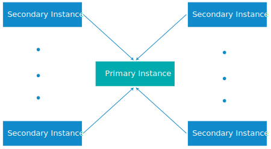

---

copyright:

  years:  2016, 2019

lastupdated: "2019-01-25"

---

{:tip: .tip}
{:note: .note}
{:important: .important}

# vCenter Server on IBM Cloud 实例的多站点配置

{{site.data.keyword.vmwaresolutions_full}} 支持将实例部署在不同位置，在短时间内让这些实例启动并开始运行。

* 仅 V2.0 和更高版本的实例支持 vCenter Server 实例的多站点配置。
* 无法在多站点配置中将 VMware Cloud Foundation 与 VMware vCenter Server 实例相链接。
{:note}

## 多站点部署组件

多站点部署由以下组件构成。

* **主实例**：主 VMware vCenter Server 实例具有以下配置：
  *  Microsoft Active Directory (AD) 和 DNS（域名系统）根域
  *  vCenter Server 子域
  *  SSO (Single Sign-On) 域
  *  SSO 站点名称
* **辅助实例**：一个或多个辅助 vCenter Server 实例，这些实例与主实例相链接，配置如下：
   *  SSO 站点名称
   *  链接到主实例上根域的 DNS 子域
   *  DNS 和 AD 复制在主实例和辅助实例上的 AD 虚拟机之间设置。
   *  对于在 V2.8 或更高版本中部署的主实例：部署并配置了具有嵌入式 Platform Services Controller (PSC) 的 vCenter Server Appliance (vCSA)。
   *  辅助实例上的 VMware vCenter 设置为以“增强链接方式”与主实例上的 vCenter 相链接。

## vCenter Server 多站点部署

多站点配置功能使用轴辐式拓扑，其中包含一个主站点和最多七个辅助站点。支持单层站点，即无法配置链接到其他辅助站点的后续站点。在跨所有实例的多站点配置中，总共可以有 128 个 ESXi 服务器。

如果配置需要具有超过 128 个 ESXi 服务器的多站点部署，请联系 IBM 支持人员以获取帮助。有关更多信息，请参阅[联系 IBM 支持人员](/docs/services/vmwaresolutions/vmonic/trbl_support.html)。
{:note}

下图描绘了 vCenter Server 多站点部署的总体视图。

图 1. vCenter Server 多站点部署

该模型包含以下层：

* **主实例**：在多站点配置中，要部署第一个实例，请在实例订购过程中将该实例定义为主实例。
* **辅助实例**：在多站点配置中，定义在订购过程中作为辅助实例连接到主实例的实例。

一次只能向主实例分配一个辅助实例。不能同时将多个辅助实例分配给主实例。要将多个辅助实例分配给主实例，必须再次完成订购过程，并将先前定义的主实例作为辅助实例的主实例。必须对要创建的所有辅助实例重复此过程。

在多站点配置中最多可以部署 8 个实例（1 个主实例和 7 个辅助实例）。

删除属于多站点配置中的 vCenter Server 实例需要特殊规划。有关更多信息，请参阅[删除多站点配置中的 vCenter Server 实例](/docs/services/vmwaresolutions/vcenter/vc_deletinginstance_multi.html)。
{:note}

### 相关链接

* [将主要角色分配给 NSX Manager](https://pubs.vmware.com/NSX-62/topic/com.vmware.nsx-cross-vcenter-install.doc/GUID-44E8AE16-BA3F-4DD9-B582-FC1E137E6CFC.html){:new_window}
* [配置辅助 NSX Manager](https://pubs.vmware.com/NSX-62/topic/com.vmware.nsx-cross-vcenter-install.doc/GUID-9E48BC57-15E3-49C7-8BC5-F94ED8918BBE.html){:new_window}
* [vCenter Single Sign-On 支持的 AD 信任](https://kb.vmware.com/kb/2064250){:new_window}
* [在 {{site.data.keyword.cloud_notm}} 中安全连接专用 VMware 工作负载](https://www.ibm.com/developerworks/library/se-securely-connect-private-vmware-workloads-ibm-cloud/index.html){:new_window}
