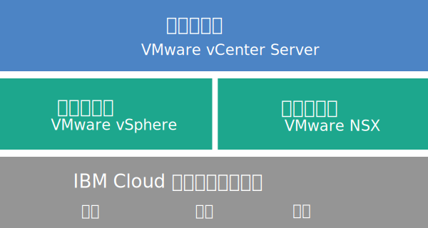

---

copyright:

  years:  2016, 2019

lastupdated: "2019-04-25"

subcollection: vmware-solutions

---

{:tip: .tip}
{:note: .note}
{:important: .important}

# vCenter Server 概述
{: #vc_vcenterserveroverview}

VMware vCenter Server on {{site.data.keyword.cloud}} 是一种托管的专用云，可将 VMware vSphere 堆栈作为服务交付。VMware 环境基于 {{site.data.keyword.cloud_notm}} {{site.data.keyword.baremetal_short}} 而构建，提供共享的网络连接存储器和专用的软件定义存储器选项，并包括自动部署和配置基于 VMware NSX 技术的易于管理的逻辑边缘防火墙。

在许多情况下，整个环境可以在一天内供应完，而裸机基础架构可根据需要，快速、弹性地向上和向下扩展计算容量。

部署后，可以通过在 {{site.data.keyword.slportal}} 中订购更多网络文件系统 (NFS) 文件共享，并手动将其连接到集群中的所有 ESXi 服务器，从而增加共享存储器。如果需要专用存储器，可使用同时在高性能（所有 SSD）和高容量（所有 SATA）配置中提供的 [NetApp ONTAP Select on {{site.data.keyword.cloud_notm}}](/docs/services/vmwaresolutions/netapp?topic=vmware-solutions-np_netappoverview)。

VMware vSAN 还可作为专用存储器选项提供。要增大 vSAN 集群的基于 vSAN 的存储容量，可以在部署后添加更多 ESXi 服务器。

如果购买了 IBM 提供的 VMware 许可，那么可以将 VMware NSX Base Edition 升级到 Advanced Edition 或 Enterprise Edition，并且可以购买更多 VMware 组件，例如 VMware vRealize Operations。

如果要卸载虚拟化、访客操作系统或应用程序层的日常操作和维护，可以添加 IBM 管理的服务。另外还有 {{site.data.keyword.cloud_notm}} 专业服务团队可通过迁移、实施、规划和上线服务，帮助您加速迁移到云。

## vCenter Server 体系结构
{: #vc_vcenterserveroverview-archi}

下图描绘了三节点 vCenter Server 部署的高级别体系结构和组件。

图 1. 三节点集群的 vCenter Server 高级别体系结构

### 物理基础架构
{: #vc_vcenterserveroverview-physical-infras}

此层提供要由虚拟基础架构使用的物理基础架构（计算、存储和网络资源）。

### 虚拟化基础架构（计算和网络）
{: #vc_vcenterserveroverview-virtualization-infras}

此层通过不同 VMware 产品对物理基础架构进行虚拟化：
* VMware vSphere 对物理计算资源进行虚拟化。
* VMware NSX 是网络虚拟化平台，用于提供逻辑联网组件和虚拟网络。

### 虚拟化管理
{: #vc_vcenterserveroverview-virtualization-mgmt}

此层由具有嵌入式 Platform Services Controller (PSC) 的 vCenter Server Appliance (vCSA)、NSX Manager、两个 NSX ESG、三个 NSX Controller 和 IBM CloudDriver 虚拟服务器实例 (VSI) 组成。对于某些操作（例如，向环境添加主机），将根据需要部署 CloudDriver VSI。

基本产品随 vCenter Server Appliance 一起部署，后者的大小设置为支持具有最多 400 个主机和最多 4000 个 VM 的环境。可以使用与 vSphere API 兼容的相同工具和脚本来管理 IBM 托管的 VMware 环境。

基本产品总计需要 38 个 vCPU 和 67 GB vRAM，这些均保留用于虚拟化管理层。VM 的其余主机容量取决于若干因素，例如超额预订比率、VM 大小设置和工作负载性能需求。

有关体系结构的更多信息，请参阅 [{{site.data.keyword.vmwaresolutions_short}} 体系结构参考](/docs/services/vmwaresolutions/archiref/solution?topic=vmware-solutions-solution_overview)。

## vCenter Server 实例的技术规范
{: #vc_vcenterserveroverview-specs}

vCenter Server 实例中包含以下组件。

标准化硬件配置的可用性和定价可能会因选择用于部署的 {{site.data.keyword.CloudDataCent_notm}} 而有所不同。
{:note}

### 裸机服务器
{: #vc_vcenterserveroverview-bare-metal}

可以使用下列其中一个配置来订购三个或更多 {{site.data.keyword.baremetal_short}}：
* **Skylake**：具有所选 CPU 型号和 RAM 大小的 2 个 CPU Intel Skylake 代服务器（Intel Xeon 4100/5100/6100 系列）。
* **SAP 认证**：具有所选 CPU 型号的 Intel Skylake 或 Intel Broadwell 代服务器（Intel Xeon 6140/E5-2690/E7-8890 系列）。
* **Broadwell**：具有所选 CPU 型号和 RAM 大小的 4 个 CPU 的 Intel Broadwell 代服务器（Intel Xeon E7-4800 系列）。

     如果计划使用 vSAN 存储器，那么配置至少需要 4 个 {{site.data.keyword.baremetal_short}}。
     {:note}

### 联网
{: #vc_vcenterserveroverview-networking}

订购了以下联网组件：
*  10 Gbps 双公用和专用网络上行链路
*  三个 VLAN（虚拟 LAN）：一个公用 VLAN 和两个专用 VLAN
*  一个 VXLAN（虚拟可扩展 LAN），带 DLR（分布式逻辑路由器），用于处理连接到第 2 层 (L2) 网络的本地工作负载之间的潜在东-西通信。VXLAN 部署为样本路由拓扑，可以基于该拓扑进行构建，或者进行修改或将其除去。还可以通过将额外的 VXLAN 连接到 DLR 上的新逻辑接口来添加安全区域。
*  两个 VMware NSX Edge 服务网关：
  * 用于出站 HTTPS 管理流量的安全管理服务 VMware NSX Edge 服务网关 (ESG)，由 IBM 部署为管理联网拓扑的一部分。IBM 管理虚拟机使用此 ESG 与自动化相关的特定外部 IBM 管理组件进行通信。有关更多信息，请参阅[配置网络以使用客户管理的 ESG](/docs/services/vmwaresolutions/vcenter?topic=vmware-solutions-vc_esg_config#configuring-your-network-to-use-the-customer-managed-nsx-esg-with-your-vms)。

    此 ESG 名为 **mgmt-nsx-edge**，您无法对其进行访问，也无法使用此 ESG。如果对其进行修改，那么可能无法在 {{site.data.keyword.vmwaresolutions_short}} 控制台中管理 vCenter Server 实例。此外，使用防火墙或禁用与外部 IBM 管理组件的 ESG 通信可能导致 {{site.data.keyword.vmwaresolutions_short}} 无法使用。
{:important}
  * 用于出站和入站 HTTPS 工作负载流量的客户管理的安全 VMware NSX Edge 服务网关。此网关由 IBM 部署为模板，您可修改此模板来提供 VPN 访问或公共访问。有关更多信息，请参阅[客户管理的 NSX Edge 会构成安全风险吗？](/docs/services/vmwaresolutions/vmonic?topic=vmware-solutions-faq#faq-customer-nsx)

### 虚拟服务器实例
{: #vc_vcenterserveroverview-vsi}

订购了以下虚拟服务器实例 (VSI)：
* 用于 IBM CloudBuilder 的 VSI，在完成实例部署后关闭。
* （对于实例 V2.2 和更高版本）可以选择在管理集群中部署单个 Microsoft Windows Server VSI for Microsoft Active Directory (AD) 或两个高可用性 Microsoft Windows VM，以帮助增强安全性和稳健性。
* （对于实例 V1.9 到 V2.1）用于 Microsoft Active Directory (AD) 的 Microsoft Windows Server VSI 已部署并且可进行查找。此 VSI 充当在其中注册主机和虚拟机的实例的 DNS。
* （对于实例 V1.8 和更低版本）用于基于快照备份管理组件的 VSI，在完成实例部署后会保持运行。

### 存储
{: #vc_vcenterserveroverview-storage}

在初始部署期间，可以选择 vSAN 或 NFS 存储器选项。

对于 V2.8 和更高版本的实例，可以将 NFS 存储共享添加到现有 NFS 或 vSAN 集群。有关更多信息，请参阅[扩展和收缩 vCenter Server 实例的容量](/docs/services/vmwaresolutions/vcenter?topic=vmware-solutions-vc_addingremovingservers#adding-nfs-storage-to-vcenter-server-instances)中的*向 vCenter Server 实例添加 NFS 存储器*部分。
{:note}

#### vSAN 存储器
{: #vc_vcenterserveroverview-vsan-storage}

vSAN 选项提供定制配置，具有各种磁盘类型、大小和数量的选项：
* 磁盘数量：2、4、6 或 8 个
* 存储磁盘：960 GB SSD SED、1.9 TB SSD SED 或 3.8 TB SSD SED。

  此外，每个主机还会订购两个 960 GB 高速缓存磁盘。

  3.8 TB SSD（固态磁盘）驱动器在数据中心内普遍可用后就会受到支持。
  {:note}
* 高性能 Intel Optane 选项，用于提供两个额外的容量磁盘托架，总共可容纳 12 个容量磁盘。此选项取决于 CPU 型号。

#### NFS 存储器
{: #vc_vcenterserveroverview-nfs-storage}

NFS 选项为工作负载提供定制的共享文件级别存储器，具有各种大小和性能的选项：
* 大小：20 GB 到 24 TB
* 性能：0.25、2、4 或 10 IOPS/GB。
* 单独配置文件共享。

  此 10 IOPS/GB 性能级别限制为每个文件共享的最大容量为 4 TB。
  {:note}

如果选择 NFS 选项，那么会为管理组件订购一个 2 TB、4 IOPS/GB 文件共享。

#### 本地磁盘存储器
{: #vc_vcenterserveroverview-local-disk-storage}

本地磁盘选项仅可用于 **SAP 认证**的四核 Intel Xeon E7-8890 V4 处理器裸机配置，提供定制配置，有各种磁盘计数和磁盘类型可供选择。

### 许可证（IBM 提供或 BYOL）和费用
{: #vc_vcenterserveroverview-license-and-fee}

* VMware vSphere Enterprise Plus 6.5u2 或 6.7u1
* VMware vCenter Server 6.5
* VMware NSX Service Providers Edition（Base、Advanced 或 Enterprise）6.4
* （对于 vSAN 集群）VMware vSAN Advanced 或 Enterprise 6.6
* 支持和服务费用（每个节点一个许可证）

## vCenter Server 扩展节点的技术规范
{: #vc_vcenterserveroverview-expansion-node-specs}

每个 vCenter Server 扩展节点将在您的 {{site.data.keyword.cloud_notm}} 帐户中部署以下组件并收取相应费用。

### 扩展节点的硬件
{: #vc_vcenterserveroverview-expansion-node-hardware}

一个裸机服务器，其配置在 [vCenter Server 实例的技术规范](/docs/services/vmwaresolutions/vcenter?topic=vmware-solutions-vc_vcenterserveroverview#vc_vcenterserveroverview-specs)中提供。

### 扩展节点的许可证和费用
{: #vc_vcenterserveroverview-expansion-node-license-and-fee}

* 一个 VMware vSphere Enterprise Plus 6.5u2 或 6.7u1
* 一个 VMware NSX Service Providers Edition（Base、Advanced 或 Enterprise）6.4
* 一个支持和服务费用
* （对于 vSAN 集群）VMware vSAN Advanced 或 Enterprise 6.6

您只能在 {{site.data.keyword.vmwaresolutions_short}} 控制台中管理在 {{site.data.keyword.cloud_notm}} 帐户中创建的 {{site.data.keyword.vmwaresolutions_short}} 组件，而不能在 {{site.data.keyword.slportal}} 中或在该控制台外部通过其他任何方法对这些组件进行管理。如果在 {{site.data.keyword.vmwaresolutions_short}} 控制台外部更改这些组件，那么这些更改与控制台不同步。在 {{site.data.keyword.vmwaresolutions_short}} 控制台外部管理任何 {{site.data.keyword.vmwaresolutions_short}} 组件（在订购实例时已安装到 {{site.data.keyword.cloud_notm}} 帐户中）可能会使环境变得不稳定。这些管理活动包括：
*  添加、修改、返回或除去组件
*  通过添加或除去 ESXi 服务器来扩展或收缩实例容量
*  关闭组件电源
*  重新启动服务
   这些活动的例外情况包括在 {{site.data.keyword.slportal}} 中管理共享存储器文件共享。此类活动包括：订购、删除（如果已安装，可能会影响数据存储）、授权和安装共享存储器文件共享。
   {:important}

## 相关链接
{: #vc_vcenterserveroverview-related}

* [vCenter Server 软件材料清单](/docs/services/vmwaresolutions/vcenter?topic=vmware-solutions-vc_bom)
* [规划 vCenter Server 实例](/docs/services/vmwaresolutions/vcenter?topic=vmware-solutions-vc_planning)
* [订购 vCenter Server 实例](/docs/services/vmwaresolutions/vcenter?topic=vmware-solutions-vc_orderinginstance)
* [vCenter Server 的连接存储器](/docs/services/vmwaresolutions/services?topic=vmware-solutions-storage-benefits#storage-benefits)
* [扩展文件共享容量](/docs/infrastructure/FileStorage?topic=FileStorage-expandCapacity#expandCapacity)
