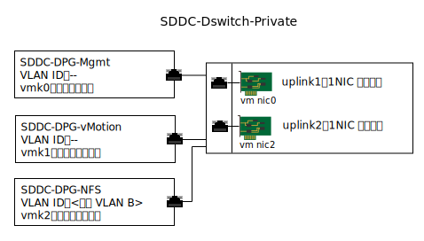

---

copyright:

  years:  2016, 2019

lastupdated: "2019-01-23"

---

{:tip: .tip}
{:note: .note}
{:important: .important}

# 連接儲存空間基礎架構管理

基礎架構管理是指管理 vSphere ESXi 基礎架構的 VMware 元件。

如需元件的相關資訊，請參閱[虛擬基礎架構設計](/docs/services/vmwaresolutions/archiref/solution/design_virtualinfrastructure.html)中的「圖 2. NSX Manager 網路概觀」。

## 虛擬網路設計

本設計所使用的網路虛擬化，是使用現有的 vSphere Distributed Switch (vDS)，其與專用網路相關聯，並指定在 [{{site.data.keyword.vmwaresolutions_full}} 架構](/docs/services/vmwaresolutions/archiref/solution/solution_overview.html)中。

## vSphere Distributed Switch

在 vCenter Server 解決方案內會建立另一個 VLAN，它用來將 NFS 裝載點連接至現有叢集中的 ESXi 主機。因為 vCenter Server 解決方案具有與專用網路相關聯的 vSphere Distributed Switch，所以會建立另一個埠群組，並用其他的 VLAN 號碼加上標籤，因為這個其他的 VLAN 不是原生 VLAN。

下表說明新埠群組的預設值。

請不要變更這些預設值。
{:important}

表 1. NFS 埠群組摘要

| 埠群組名稱 | SDDC-DPG-NFS |
|:--------------- |:------------ |
| 埠連結 | 靜態 |
| VLAN 類型 | 專用 VLAN B |
| 負載平衡           | 根據來源虛擬埠遞送 |
| 作用中的上行鏈路 | Uplink1 和 uplink2 |

除了為 NFS 儲存空間資料流量建立 vDS 埠群組之外，還會在部署期間於每個 vSphere ESXi 主機上建立 VMkernel 埠，並指派至 SDDC-DPG-NFS 埠群組。VMkernel 埠也獲指派一個來自專用可攜式子網路的 IP 位址，其與連接儲存空間 VLAN 相關聯，亦即，專用 VLAN B 及其 MTU 是設為 9000 以支援巨大訊框。

圖 1. 專用 vDS 埠群組及上行鏈路

### vSphere 主機靜態遞送

雖然 vDS 是以新的埠群組配置，且 VMkernel 埠已指派給埠群組，但該解決方案會在部署的每一部 vSphere ESXi 主機上建立靜態路徑，使所有 NFS 資料流量遍訪 VLAN 和子網路中的 NFS。靜態路徑是建立在 `/etc/rc.local.d/local.sh` 中，以便能在主機重新啟動之間持續保存。

### 相關鏈結

* [解決方案概觀](/docs/services/vmwaresolutions/archiref/solution/solution_overview.html)
