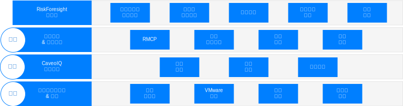

---

copyright:

  years:  2016, 2019

lastupdated: "2019-08-05"

subcollection: vmware-solutions

---

# Caveonix RiskForesight 的架構概觀
{: #caveonix-arch}

下圖顯示 Caveonix RiskForesight 架構。

{: caption="圖 1. Caveonix RiskForesight 的架構" caption-side="bottom"}

Caveonix RiskForesight 架構有四層：
-	偵測 -「偵測」模組已完全整合至 VMware 堆疊和許多公用雲端。利用外掛程式，RiskForesight 使用 vCenter 和 NSX Manager 作為「資產儲存庫」，收集虛擬機器 (VM)、網路及網路流量等詳細資料。遠端收集器會掃描工作量、作業系統及應用程式，以獲得對法規遵循及漏洞的「全面」檢視。
-	預測 -「預測」模組使用分析來識別風險資產和安全防護步驟，以降低風險模組來改進風險狀態。
-	行動 -「行動」模組會根據優先順序及自動化保護動作來實作安全防護步驟，以針對網路威脅帶來的風險，提供主動的工作負載保護。
    - RMCP -「風險管理控制平面 (RMCP)」透過在私有、公有及受管理雲端資料中心內全面監視，為工作負載提供持續的主動保護。
    - Policy Manager - 目前每個組織支援三種類型的機器學習工作：Caveo Logs、Caveo Networks、Caveo Scan。根據資料中發現的異常，使用者可以配置原則，根據使用者定義的條件採取行動；選取工作類型並配置「異常」評分的布林條件，並定義條件為 true 時的動作。例如：
        - 工作："Caveo Logs" 異常評分 > 90 時，標示「資產」進行隔離，並傳送通知至 Slack 頻道。
        - 工作："Caveo Network" 異常評分 > 95 時，隔離資產，並傳送電子郵件通知，同時傳送使用者介面通知。
- 儀表板 - 透過角色型存取，儀表板讓服務提供者（例如 IT 部門）有能力將 IT 資產配置給承租戶或業務單位。然後，業務單位再將這些 IT 資產指派給應用程式。這些應用程式把業務和 IT 服務配對，並接受「業務衝擊評量」，且受法規制度約束，例如：NIST、NESA、PCI、ISO 及 HIPAA。然後，這些應用程式會經過一些掃描（例如，漏洞、NSX 流量、軟體及日誌資料），以提高執行中內容以及應用程式相關聯之網路及法規遵循風險的能見度。透過往下探查這些儀表板，法規遵循及安全使用者可以看到一份已設定優先順序的安全防護動作清單，並在「預測」和「行動」模組中啟用可自動化的強制執行動作。RiskForesight 除了提供統一儀表板來識別混合式雲端的資產，還提供對於網路風險、法規遵循配置風險、關鍵趨勢及安全作業度量的熱圖分析。它可讓使用者快速判斷風險的本質和位置，以及決定採取什麼行動來使用功能強大的直覺式視覺化工具。這些儀表板提供：
  - 對於跨混合式雲端的網路風險與法規遵循風險提供已設定優先順序的視圖，並提供「偵測」、「預測」、「行動」儀表板視圖。
  - 讓使用者能夠以視覺化方式與資料互動，以根據風險優先順序，快速識別有風險的資產。
  - 容易使用的圖形、度量及過濾器，讓您能夠洞察所識別的風險。
  - 互動式往下探查，能夠對於跨位置、組織、應用程式及資產的應用程式資料流程、漏洞或配置問題，掌握更深入的資訊。
  - 讓使用者能夠對作業堆疊有全面的瞭解，包含基礎架構、平台、應用程式及資料。
  - 能夠以視覺化呈現及施行跨混合式雲端的網路、虛擬機器或應用程式的區隔原則。

## 區域
{: #caveonix-arch-zones}

Caveonix RiskForesight 有區域的概念：

{: caption="圖 2. Caveonix RiskForesight 區域" caption-side="bottom"}

-	管理或服務提供者區域 - 管理或服務提供者區域包括下列元件：
    - RiskForesight 應用程式 - 這包含多個元件，將在「應用程式元件」區段中詳細說明。
    - 中央收集器 - 從雲端提供者及承租戶區域中收集資訊。
- 雲端提供者 - 此區域提供管理應用程式所在的基礎架構：
    - 專用 - {{site.data.keyword.cloud}} 上的 VMWare，以及內部部署的 VMware 基礎架構平台。這些平台透過下列方式整合至 RiskForesight：vCenter、NSX Manager、VMware Cloud Director (vCD) 或 vRealize Automation (vRA)。
    - 公用 - 目前唯一受支援的公用雲端提供者為 AWS。即將提供 {{site.data.keyword.cloud_notm}}。
    - 容器 - 目前只支援 AWS Elastic Kubernetes Service (EKS)。即將提供 {{site.data.keyword.cloud_notm}} Private 及 {{site.data.keyword.cloud_notm}} Kubernetes Services。
-	承租戶或客戶環境區域 - 這些區域用來隔離承租戶、客戶或業務單位。這些區域中有工作負載，因此需要遠端收集器。以最小部署而言，您需要一個遠端收集器，但如果是一般部署，則每個承租戶/客戶/業務單位都需要一個遠端收集器。

## 相關鏈結
{: #caveonix-arch-related}

* [Caveonix 詳細設計](/docs/services/vmwaresolutions/archiref/caveonix?topic=vmware-solutions-caveonix-detailed)
