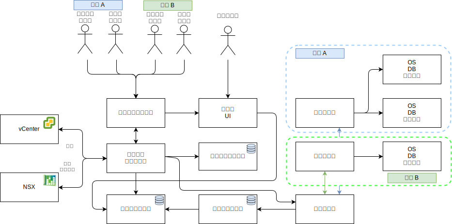

---

copyright:

  years:  2016, 2019

lastupdated: "2019-05-06"

subcollection: vmware-solutions

---

# 詳細的設計
{: #caveonix-detailed}

下圖和說明提供 RiskForesight 應用程式元件的相關資訊。

-	圖形使用者介面 - 可用來存取 RiskForesight 應用程式的 Web 介面。
-	中央收集器 - 收集不同類型來自外掛程式的資料之有效負載，並使其可用於傳訊儲存庫。RiskForesight 支援下列類型的有效負載：
    - 掃描
    - 日誌
    - Netflows
    - 軟體
    - 工作負載 meta 資料
- 中央路由器 - 管理與 VMware Orchestration 層的所有整合觸點。所有 RiskForesight 外掛程式都必須與「中央路由器」通訊，以獲得授權與 RiskForesight 生態系統通訊。
-	API 伺服器 - 可連接 GUI 及後端資料儲存庫的 REST 端點中介軟體。同時，它驗證使用者存取要求及管理 RBAC。
-	vCenter 資料收集器 - 此外掛程式會從 vCenter 擷取虛擬機器 (VM) 詳細資料。此通用外掛程式使用 VMware API 來連接 vCenter 並擷取工作負載相關資訊。有可用的資訊之後，此外掛程式會包裝有效負載，並將它傳送至「中央收集器」。
-	vCD 資料收集器 - 此外掛程式會從 VMware vCloud Director 擷取 VM 詳細資料。此通用外掛程式使用 VMware API 來連接至 VMware vCloud Director，並擷取工作負載相關資訊。有可用的資訊之後，此外掛程式會包裝有效負載，並將它傳送至「中央收集器」。
-	vCD 網路資料收集器 - 此外掛程式會從 VMware vCD 擷取 Netflow 詳細資料。此通用外掛程式使用 VMware API 來連接至 VMware NSX，並擷取「網路」、FW、「安全規則」及「安全群組」。有可用的資訊之後，此外掛程式會包裝有效負載，並將它傳送至「中央收集器」。
-	網路資料收集器 - 從 VMware vCenter 擷取 Netflow 詳細資料的外掛程式。此通用外掛程式使用 VMware API 來連接至 VMware NSX，並擷取網路、防火牆、安全規則及安全群組資訊。有可用的資訊之後，此外掛程式會包裝有效負載，並將它傳送至「中央收集器」。
-	遠端收集器 - 位於承租人環境中，或它對承租人 VM 具有網路存取權的其他位置。它會處理所有法規遵循和網路風險掃描。
-	關聯式資料儲存庫 - 維護下列類型的 meta 資料：
    - 雲端服務供應商
    - 承租戶
    - 資產
    - 掃描結果
    - 軟體
    - 每日或每週聚集資料集
- 傳訊資料儲存庫 - RiskForesight 使用持續傳訊佇列，以提供零資料流失，並將背壓卸載至元件。
- 索引資料儲存庫 - 可檢索及儲存每個承租戶的送入原始資料來進一步分析，以支援多方承租戶功能。
- 外掛程式 - 位於「應用程式遞送伺服器」中，並包括 VMWare 元件的設定與整合，藉此讓所有 VM 連同其承租戶資訊同步化。

下表顯示每一個元件所需的埠及通訊協定。

表 1. 埠及通訊協定

|元件 |通訊協定 / 埠|
|---|---|
|UI| 443 |
|API|443, 1337|
|RiskForesight|8082, 8083, 8084|
|中央收集器（叢集）|8080|
|遠端收集器|8081|
|關聯式資料儲存庫主要或次要|5432|
|傳訊資料儲存庫叢集|9092|
|索引資料儲存庫主節點|9200, 9300, 5601, 443|

下圖顯示與「專用 VLAN A」相關聯的 Caveonix 可攜式專用子網路的網路拓蹼。您負責管理此子網路的 IP 位址空間，因此您可以根據需要，透過局部分散模型，將「全功能」模型手動橫向擴充至完全分散的部署模型。

下表說明 IP 子網路、VLAN 指派。

表 2. VLAN 及子網路

|VLAN 	|子網路類型 	|說明       |
|---|---|---|
|公用 |主要  | 指派給實體主機，以進行公用網路存取。在起始部署時不會使用。|
|公用 |可攜式  |指派給 customer-nsx-esg 上的上行鏈路及 NAT 使用情形。|
|公用 |可攜式  |指派給 mgmt-nsx-esg 上的上行鏈路 NAT 使用情形。|
|公用 |可攜式  |指派給 hcx-mgmt-esg 上的上行鏈路 NAT 使用（若選取 Hybridity 組合）。|
|專用 A 	|主要  |指派給 {{site.data.keyword.cloud}} 所指派的實體主機。由管理介面用於 vSphere 管理資料流量。|
|專用 A 	|可攜式  |指派給作為管理元件的 VM。|
|專用 A 	|可攜式  |指派給 NSX VTEP。|
|專用 A 	|可攜式  |指派給 HCX 以供內部使用（若選取 Hybridity 組合）。|
|專用 A 	|可攜式  |指派給 customer-nsx-esg 上的上行鏈路使用情形。|
|專用 A 	|可攜式  |指派給 HCX（若選取 Hybridity 組合）。|
|專用 A 	|可攜式  |指派給 Zerto VRA（若選取 Zerto 選項）。|
|專用 A 	|可攜式  |指派給 Caveonix RiskForesight（若選取 Caveonix 選項）。|
|專用 B	 |主要	  |在起始部署時不會使用。|
|專用 B 	|可攜式  |指派給 vSAN（若在使用中）。|
|專用 B 	|可攜式  |指派給 NAS（若在使用中）。|
|專用 B 	|可攜式  |指派給 vMotion。|

## 相關鏈結
{: #caveonix-detailed-related}

* [VMware vCenter Server on {{site.data.keyword.cloud_notm}} with Hybridity Bundle](/docs/services/vmwaresolutions/archiref/vcs?topic=vmware-solutions-vcs-hybridity-intro)
