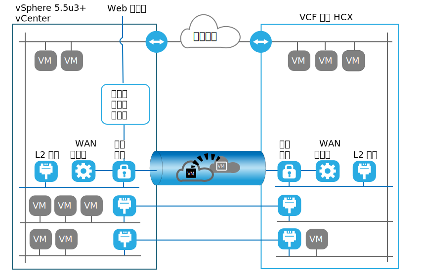

---

copyright:

  years:  2016, 2019

lastupdated: "2019-07-02"

subcollection: vmware-solutions

---
# VMware HCX on IBM Cloud 簡介
{: #hcx-archi-intro}

VMware HCX on IBM Cloud 服務可在 IBM Cloud for VMware Solutions 實例與內部部署 VMware 虛擬化資料中心之間建立無縫連線。

IBM Cloud for VMware Solutions 包括在 IBM Cloud 中以完全自動化的方式快速部署 VMware vCenter Server。這些供應項目補足內部部署基礎架構，並容許現有及未來工作負載在未轉換的情況下於 IBM Cloud 中執行，方法是使用它們在內部部署使用的相同工具、技能及處理程序。如需相關資訊，請參閱[用於延伸虛擬化專用雲端的虛擬化](https://www.ibm.com/cloud/garage/architectures/virtualizationArchitecture)。

VMware HCX on IBM Cloud 服務會將此混合帶到下一步：藉由啟用建立無縫網路延伸及雙向移轉工作負載，而混合 vCenter Server 實例與現有內部部署虛擬化資料中心。

部署為 IBM Cloud VMware 目標站台中虛擬機器的 VMware HCX on IBM Cloud 元件，能夠建立與安裝在對等節點內部部署來源站台之 VMware HCX on IBM Cloud 元件的連線。

此連線會在內部部署與 IBM Cloud 之間建立鬆散耦合的交互連線，並且啟用下列這類功能：
* 簡單交互連線 - 可透過任何實體連線（例如公用網際網路、專用 VPN 或直接鏈結），輕鬆建立邏輯網路連線。
* 第 2 層延伸 - 內部部署網路延伸至雲端。這些網路包括內部部署子網路及 IP 定址。
* 加密 - 在兩端之間安全地加密網路資料流量。
* 最佳化網路 - 選取最佳連線，並有效率地溢滿連線，讓網路資料流量儘可能地快速移動。
* 刪除重複資料 - 可讓網路資料流量減少達 50%
* 智慧型遞送 - 當工作負載移動時，鄰近遞送可以變更網路路徑（即閘道），讓網路資料流量使用目標站台閘道，而不會「回流」到起始站台。
* 運作零中斷移轉 - 可以使用 vMotion 將執行中系統移至雲端或從雲端移回。
* 排定的移轉 - 可以將任意數目的虛擬機器抄寫至目的地站台，然後在該站台上依指定時間啟動，以取代在起始站台上執行的系統。
* 安全原則的移轉 - 如果在內部部署使用 NSX，則任何安全原則或防火牆都會隨著工作負載一起移動。

## 相關鏈結
{: #hcx-archi-intro-related}

* [用於延伸虛擬化專用雲端的虛擬化](https://www.ibm.com/cloud/garage/architectures/virtualizationArchitecture)
