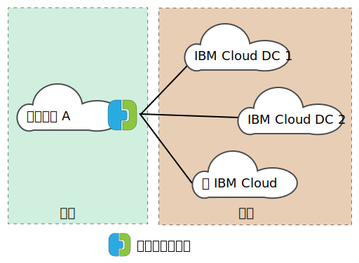
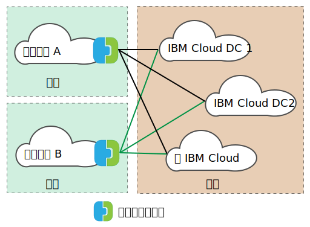

---

copyright:

  years:  2016, 2019

lastupdated: "2019-02-15"

---
# VMware HCX on IBM Cloud 概觀
{: #hcx-archi-overview}

VMware HCX on IBM Cloud 將內部部署 vSphere® vCenter™ 網路無縫整合至 IBM Cloud for VMware Solutions 部署。混合式網路將內部部署 vSphere vCenter 網路擴充至 IBM Cloud，並支援雙向虛擬機器 (VM) 行動性。

HCX 擁有來源及目的地加密和解密處理程序，以確定一致安全並提供虛擬機器移轉及網路延伸這類混合式工作流程的許可。

此供應項目建立最佳化的軟體定義 WAN 來增加延伸網路效能，以使效能達到 LAN 速度。HCX 也支援雙向工作負載和 VMware NSX® 安全原則移轉至 IBM Cloud。HCX 與 vSphere vCenter 整合，並從 vSphere Web Client 進行管理。

## 第 2 層網路延伸
{: #hcx-archi-overview-layer-2-net}

HCX 容許現有內部部署 vSphere 財產將網路從其內部部署 vCenter 安全地延伸至執行 VMware Cloud Foundation 或 vCenter Server 的 IBM Cloud 資料中心。下列項目已啟用此特性：
* HCX 提供稱為「第 2 層集中器 (L2C)」的應用裝置。
* 延伸網路鏈結至 VMware Cloud Foundation 或 vCenter Server 上所部署的 IBM Cloud NSX Edge 應用裝置。
* 可以部署多個標準第 2 層集中器，以達到可調整性並增加內部部署 vCenter 的傳輸量。
* 透過「雲端閘道」及透過延伸第 2 層移轉的虛擬機器可以保留其 IP 及 MAC 位址。

## 虛擬機器移轉
{: #hcx-archi-overview-vm-mig}

HCX 提供三種虛擬機器移動方法：低關閉時間移轉、vSphere vMotion 移轉及冷移轉。

### 低關閉時間移轉
{: #hcx-archi-overview-low-downtime-mig}

低關閉時間移轉根據「vSphere 抄寫」，這是 VMware ESX®/ESXi® Hypervisor 中所實作的分散式技術。內部部署 HCX 部署會在 IBM Cloud 中建立即時虛擬機器的抄本、執行切換以關閉來源虛擬機器的電源，以及開啟所移轉虛擬機器的電源。

移轉路徑一律是透過「雲端閘道」。傳輸可以是網際網路、第 2 層延伸網路或 Direct Connect 線路。

虛擬機器可以在任一方向多次移轉。

### vMotion 移轉
{: #hcx-archi-overview-vmotion-mig}

透過延伸至 IBM Cloud 的網路使用「vMotion 移轉」，即可傳送即時虛擬機器。vMotion 移轉也稱為零關閉時間移轉或跨雲端 vMotion。

### 冷移轉
{: #hcx-archi-overview-cold-mig}

使用冷移轉，您可以透過使用「第 2 層集中器」所建立的延伸網路，將關閉電源的 VM 傳送至 IBM Cloud。

### 一般移轉特性
{: #hcx-archi-overview-cold-mig-features}

這三種移轉類型可用的其他特性包括可增加移轉傳輸量及速度的軟體定義 WAN 最佳化。此外，移轉可以排程於指定的時間發生，並保留其主機名稱、虛擬機器名稱或兩者。

## 網路特性
{: #hcx-archi-overview-net-features}

下列網路特性會建置到「雲端閘道」及「第 2 層集中器」。

### 智慧型流程遞送
{: #hcx-archi-overview-intel-flow-routing}

此特性根據網際網路路徑自動選取最佳連線，有效率地溢出整個連線，以盡快移動工作負載。備份或抄寫這類較大的流程導致 CPU 競用時，會將較小的流程遞送至較不忙碌的 CPU，以改善互動式傳輸的效能。

### 鄰近遞送
{: #hcx-archi-overview-prox-routing}

鄰近遞送確定在內部部署及雲端連接至延伸和遞送網路之虛擬機器間的轉遞是對稱的。此特性需要在客戶內部部署與雲端之間配置具有「動態遞送」的「進階網路服務」。

使用者將其網路擴充至雲端時，會將第 2 層連線功能延伸至 IBM Cloud 網路。不過，如果沒有路徑最佳化，則第 3 層通訊要求必須回到要遞送的內部部署網路原點。此回程稱為_轉接_ 或_回流_。

轉接並不足夠，因為封包必須在網路原點與「雲端」之間來回流動，即使來源及目的地虛擬機器位於「雲端」時也是一樣。

除了不具效率之外，如果轉遞路徑還包括有狀態防火牆，或必須看到連線兩端的其他行內設備，則通訊可能會失敗。結束雲端的輸出路徑可以是延伸第 2 層網路或「組織遞送網路」時，會發生沒有路徑最佳化的虛擬機器通訊失敗。內部部署網路不知道延伸網路「捷徑」。此問題稱為非對稱遞送。此解決方案是啟用鄰近遞送，讓內部部署網路可以瞭解從 IBM Cloud 開始的路徑。

「雲端閘道」會維護雲端中的虛擬機器庫存。它也瞭解 VM 狀態，而狀態可以是下列其中一項：
* 使用 vMotion 傳送至 IBM Cloud（零關閉時間移轉）。
* 使用主機型抄寫移轉至雲端（低關閉時間移轉）。
* 建立於雲端中（在延伸網路上）。

### 安全
{: #hcx-archi-overview-sec}

「雲端閘道」提供符合「套組 B」標準的 AES-GCM，其具有 IKEv2、AES-NI 卸載及流程型許可控制。HCX 也擁有來源及目的地加密和解密處理程序，以確定虛擬機器移轉及網路延伸這類混合式工作流程的一致安全及管理。在內部部署定義且指派給虛擬機器的安全原則可以隨著虛擬機器一起移轉至 IBM Cloud。

只有在下列條件下，才能使用原則移轉：
* 內部部署資料中心必須執行 NSX 6.2.2 或更新版本。
* 在 vSphere 中，安全原則是可包含許多規則的單一「NSX 區段」。
* 可以命名 IP 位址組或 MAC 位址組來參與該原則。「MAC 組」或「IP 組」的名稱不能超過 218 個字元。
* 支援的規則將第 3 層 IP 位址或「IP 組」或是第 2 層 MAC 位址或「MAC 組」指定為來源或目的地。

## HCX 的元件
{: #hcx-archi-overview-comp-hcx}

VMware HCX on IBM Cloud 服務會部署在內部部署資料中心和 IBM Cloud 目標上安裝及配置的四個虛擬應用裝置。本節說明這四個必要的虛擬應用裝置。或者，根據實作設計，可能需要邊緣裝置。

### HCX Manager
{: #hcx-archi-overview-hcx-man}

HCX Manager 虛擬應用裝置是內部部署 vCenter 的延伸。它會部署為虛擬機器，而其檔案結構包含其他混合式服務虛擬應用裝置。HCX Manager 會監督內部部署及 IBM Cloud 內的「雲端閘道」、「第 2 層集中器」及「WAN 最佳化」虛擬應用裝置的部署和配置。

### 混合式雲端閘道
{: #hcx-archi-overview-hcg}

「混合式雲端閘道 (CGW)」會維護內部部署 vSphere 財產與 IBM Cloud 之間的安全頻道。HCX 使用高度加密來引導與 IBM Cloud 的站台對站台連線。

vSphere 與 IBM Cloud 之間的安全頻道防止網路「中程傳輸」安全問題。「雲端閘道」也會納入 vSphere 抄寫技術，以執行雙向移轉。

### WAN 最佳化
{: #hcx-archi-overview-wan-opt}

「WAN 最佳化」應用裝置是執行 WAN 調節來減少延遲效果的元件。它也納入「轉遞錯誤更正」以使封包流失情境無效，以及刪除重複的備用資料流量型樣。總而言之，這些會減少頻寬使用，並確定最佳使用可用的網路容量來加速與 IBM Cloud 之間的資料傳送。

請務必注意，虛擬機器移轉根據「雲端閘道」與「WAN 最佳化」應用裝置的組合，以達到 vSphere 內部部署與 IBM Cloud 之間的不平行行動性。此外，透過「雲端閘道」遞送資料路徑時，第 2 層延伸會獲益於 WAN 最佳化。

### 第 2 層集中器
{: #hcx-archi-overview-layer-2-conc}

第 2 層集中器 (L2C) 應用裝置容許將第 2 層網路從內部部署 vSphere 資料中心擴充至 IBM Cloud。「第 2 層集中器」有兩個介面：
* 內部幹線介面 - 使用翻譯橋接器與 IBM Cloud 中對應延伸網路的對映，處理延伸網路的虛擬機器資料流量內部部署。
* 上行鏈路介面 - HCX 使用此介面來傳送與 IBM Cloud 之間的封裝套版資料流量。應用程式資料會流過此介面。

## 部署架構 - 使用公用網際網路連接至 IBM Cloud
{: #hcx-archi-overview-connect-pub-internet}

本節說明 IBM Cloud 及用戶端內部部署的 HCX 元件佈置。在此設計中，該架構指定來源環境與 IBM Cloud 之間的集中分支模型。因此，來源財產作為連接至不同 IBM Cloud 環境的中心，如下圖所示。

圖 1. 具有單一來源的 HCX

來源也可以放在 IBM Cloud 環境；分支一律是此設計內的雲端部署，如下圖所示。

圖 2. 具有多個來源 的 HCX

### 用法概觀
{: #hcx-archi-overview-usage-ovw}

下列作業是從 vSphere Web Client 完成：
* 部署 HCX 虛擬應用裝置，以及配置軟體定義 WAN 元件。
* 將內部部署 VLAN 及 VXLAN 網路從內部部署 vCenter 擴充至「雲端」(IBM Cloud)。
* 將工作負載移轉至雲端並移轉回。

### 基礎設計相依關係
{: #hcx-archi-overview-base-design}

詳細說明元件之前，需要瞭解此設計所需的基礎部署。
* 來源環境必須包含 vCenter Server 所管理的 vSphere 實作。Hybrid Cloud Services 需要支援的 5.5U3 vCenter 或是 vCenter 6.0U2 或更新版本（含 ESXi 5.5 或更新版本）。
* 如果使用 NSX，則為 6.2.2 版或更新版本。原則移轉需要 NSX。
* 如果想要執行跨雲端 vMotion，則相同親緣性限制會套用至雲端，就像在內部部署上一樣。
* 來源環境必須有方法可連接至雲端環境。這包括公用網際網路存取或是使用 IBM Cloud Direct Link 的專用連線。不會討論與公用網際網路以外之其他雲端供應商的連線。
* 來源環境 VM 與要移轉或延伸的網路必須位在「虛擬分散式交換器」或「Cisco Nexus 1000v 虛擬分散式交換器」的埠群組上。
* IBM Cloud 必須至少包含一個 VMware Cloud Foundation 或 vCenter Server 部署實例。
* 足夠的虛擬應用裝置資源。
* 網路必須允許應用裝置同時與本端及遠端虛擬應用裝置以及其他虛擬機器進行通訊。
* 「埠存取需求（附錄 A）」列出的埠必須開啟，才能順利安裝 Hybrid Cloud Services 虛擬應用裝置。
* 獲指派「管理者 vCenter Server」系統角色的 vSphere 服務帳戶。
* 足夠安裝 Hybrid Cloud Services 及關聯服務應用裝置的磁碟空間。
* 足夠用於安裝期間所佈建之內部部署 VM 的 IP 位址。
* 如果 SSO 伺服器在遠端，則必須識別 vCenter、「外部 SSO 伺服器」或執行外部查閱服務之 Platform Services Controller (PSC) 的 URL。向 vCenter 登錄 HCX 服務時，必須提供此 URL。

## 相關鏈結
{: #hcx-archi-overview-related}

* [VMware HCX on IBM Cloud 簡介](/docs/services/vmwaresolutions/archiref/hcx-archi?topic=vmware-solutions-hcx-archi-intro)
