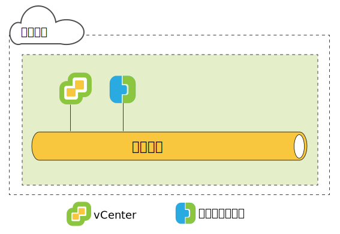
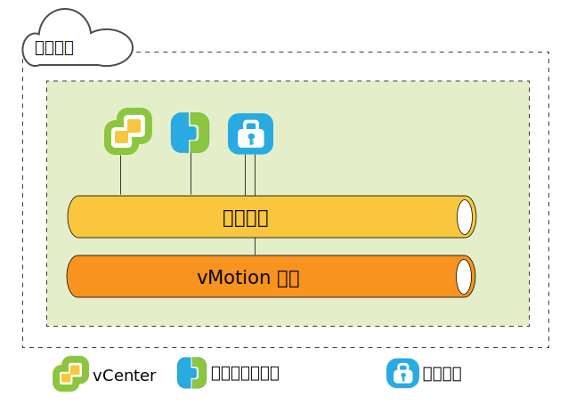
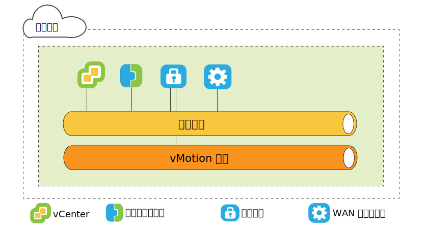
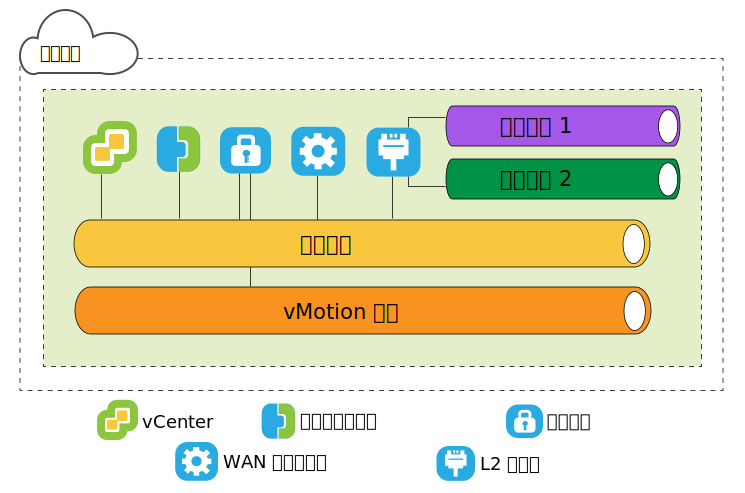

---

copyright:

  years:  2016, 2019

lastupdated: "2019-01-23"

---

{:tip: .tip}
{:note: .note}
{:important: .important}

# VMware HCX on IBM Cloud 來源端架構

本節說明來源環境中所部署之每個 HCX 元件的架構。

## HCX 簡介

HCX 技術將 vSphere vCenter 網路無縫整合至 IBM Cloud VCF 或 VCS 平台。混合式網路將內部部署 vSphere vCenter 網路擴充至 IBM Cloud，並支援雙向虛擬機器 (VM) 行動性。

此簡介彙總可完成的作業以及支援與加強移轉和網路延伸的特性。

* HCX 擁有來源及目的地加密和解密處理程序，以確定一致安全並提供虛擬機器移轉及網路延伸這類混合式工作流程的許可。
* HCX 建立最佳化的軟體定義 WAN 來增加延伸網路效能，以使效能達到 LAN 速度。
* HCX 也支援雙向工作負載和 VMware NSX 安全原則移轉至「IBM Cloud 網路」服務。
* HCX 與 vSphere vCenter 整合，並從 vSphere Web Client 進行管理。

## 第 2 層網路延伸

* 安全地將網路從 vCenter 延伸至 IBM Cloud。
* HCX 提供「高傳輸量第 2 層集中器 (HT L2C)」。
* 延伸網路鏈結至 IBM Cloud NSX Edge 應用裝置
* 可以部署多個標準第 2 層集中器，以達到可調整性並增加傳輸量。
* 透過「雲端閘道」及透過延伸第 2 層移轉的虛擬機器可以保留其 IP 及 MAC 位址。

## 虛擬機器移轉方法

### 低關閉時間移轉

低關閉時間移轉根據「vSphere 抄寫」，這是 VMware ESX/ESXi Hypervisor 中所實作的分散式技術。HCX 會建立即時虛擬機器的抄本、將它移至 IBM Cloud、執行切換以關閉來源虛擬機器的電源，以及開啟所移轉虛擬機器的電源。
* 移轉路徑一律是透過「雲端閘道」。傳輸可以是網際網路、第 2 層延伸網路或 Direct Connect 線路。
* 虛擬機器可以在任一方向多次移轉。

### vMotion 移轉

vMotion 移轉會看到 vMotion 透過延伸至 IBM Cloud 的網路傳送即時虛擬機器。vMotion 移轉也稱為零關閉時間移轉或跨雲端 vMotion。

### 冷移轉

透過延伸網路，將關閉電源的虛擬機器傳送至 IBM Cloud。

### 共用特性

* 選用性軟體定義 WAN 最佳化，如果已安裝，即可增加移轉、傳輸量及速度。
* 移轉可以排程於指定的時間發生。
* 移轉的虛擬機器可以保留其主機名稱、虛擬機器名稱或兩者。

## 網路特性

下列網路特性會建置到「雲端閘道」及「第 2 層集中器」。

### 智慧型流程遞送

根據網際網路路徑自動選取最佳連線，有效率地溢出整個連線，以盡快移動工作負載。備份或抄寫這類較大的流程導致 CPU 競用時，會將較小的流程遞送至較不忙碌的 CPU，以改善互動式傳輸的效能。

### 鄰近遞送

確定在內部部署及雲端連接至延伸和遞送網路之虛擬機器間的轉遞是對稱的。

### 安全

「雲端閘道」提供符合「套組 B」標準的 AES-GCM，其具有 IKEv2、AES-NI 卸載及流程型許可控制。

HCX 擁有來源及目的地加密和解密處理程序，以確定一致安全並提供虛擬機器移轉及網路延伸這類混合式工作流程的許可。

在內部部署 vCenter 中定義且指派給虛擬機器的安全原則可以隨著虛擬機器一起移轉。

## 瞭解 HCX

HCX 支援內部部署 vCenter 與 IBM Cloud 之間的多對多關係。支援處於「鏈結模式」的 vCenter Server。本主題所提供的進階概觀說明安裝程式如何與內部部署資料中心及 IBM Cloud 互動。

在安裝期間，HCX Manager 虛擬應用裝置會匯入並配置為內部部署 vCenter 的外掛程式。然後，會使用此外掛程式，以配置軟體定義 WAN 服務部署。自動化配置會將每個混合式服務應用裝置佈建為內部部署 vCenter 中的虛擬機器，並且在 IBM Cloud 中部署對應的虛擬機器。

成功的部署需要：
* 足夠的虛擬應用裝置資源
* 網路必須允許應用裝置同時與本端及遠端虛擬應用裝置以及其他 VM 進行通訊。

## 部署概觀

首先安裝 HCX Manager 虛擬機器，而且它管理在內部部署及雲端的任何其他服務虛擬機器應用裝置安裝。

下列是基本安裝作業的摘要：
1. 取得 Hybrid Cloud Enterprise 虛擬應用裝置 OVA 檔案。
2. 從 vSphere Web Client，在連接至 IBM Cloud 的內部部署 vCenter 中安裝 HCX Manager 服務虛擬應用裝置。
3. 從 vSphere Web Client，向 HCX 外掛程式登錄 IBM Cloud 端點。登錄會建立內部部署 HCX 與 IBM Cloud 上之 HCX 實例間的一對一關係。
4. 安裝及配置服務虛擬應用裝置。
5. 對於在內部部署安裝的每個應用裝置，安裝程式會在目標 IBM Cloud 中佈建對應的服務虛擬應用裝置。
6. 安裝之後，HCX Manager 會控制本端及遠端服務虛擬應用裝置。在 IBM Cloud 中，HCX 會將佈建的軟體定義 WAN 元件作為服務進行管理。

### 部署元件效能考量

架構規劃包括要移轉的 VM、用於虛擬機器資料流量的網路，以及要延伸的網路。本主題彙總部署元件的一些最大值及最小值。
* vSphere vCenter。HCX Manager 應用裝置必須安裝於需要混合式服務的 vCenter 上。一個 vCenter 只能有一個 HCX 部署。此限制適用於鏈結模式：HCX 管理應用裝置僅安裝於主要 vCenter 中。HCX 支援最多五個處於鏈結模式的已登錄 vCenter。
* 雲端登錄。雲端端點數目上限為 10。為了尋找端點數目，Hybrid Cloud Services 會追蹤與雲端的 vCenter 連線。

### 移轉及網路延伸次數上限

* 最大並行低關閉時間移轉作業 - 15
* 最大並行 L2C 延伸作業 - 1
* 最大並行 vMotion 移轉作業 - 1

### HCX Management Enterprise

HCX Management Enterprise OVA 部署於來源環境，並登錄為管理來源 vSphere 基礎架構之 vCenter Server 的外掛程式。然後，會使用此外掛程式，以配置啟用跨雲端移轉及 L2 網路延伸所需的移轉及網路服務。

一個 vCenter 只能有一個 HCX 部署。此限制適用於鏈結模式：HCX Manager 應用裝置僅安裝於主要 vCenter 中。HCX Manager 支援最多五個處於鏈結模式的已登錄 vCenter。
{:note}

圖 1. 來源 Hybrid Cloud Services

### HCX 虛擬應用裝置

安裝套件是包含 Hybrid Cloud Services 外掛程式的 OVA 檔案。安裝及配置此 Hybrid Cloud Services 管理應用裝置，然後使用它來配置服務應用裝置虛擬機器。
* HCX Manager
* 混合式雲端閘道
* 第 2 層集中器
* WAN 最佳化工具

### HCX Manager

HCX Manager 外掛程式僅部署在內部部署。它會管理 SD-WAN 的服務虛擬應用裝置。HCX Manager 虛擬應用裝置是來源 vCenter 的延伸，並且部署為虛擬機器。此應用裝置的檔案結構包含所有混合式服務虛擬應用裝置。HCX Manager 會監督內部部署及雲端中的「雲端閘道」、「第 2 層集中器」及「WAN 最佳化」虛擬應用裝置的部署和配置。

虛擬應用裝置可以與硬碟的精簡或完整佈建一起安裝。依預設，服務虛擬應用裝置的硬碟為精簡佈建。

在完成服務虛擬應用裝置配置及部署之後，請登入此虛擬機器以使用「Hybrid Cloud Services 管理入口網站」。

### HCX 雲端閘道

「HCX 雲端閘道」會建立及維護 vSphere 與 IBM Cloud 之間的安全頻道。

HCX 使用高度加密來引導與 IBM Cloud 的站台對站台連線。vSphere 與 IBM Cloud 之間的安全頻道可實現承租戶不知道的 vSphere 通訊協定的多方承租戶目的，並且防止網路「中程傳輸」安全問題。

「雲端閘道」也會納入 vSphere 抄寫技術，以執行雙向移轉。

圖 2. 來源雲端閘道

### WAN 最佳化工具

HCX 也提供軟體定義「WAN 最佳化」。「WAN 最佳化」應用裝置是高度建議的元件，可執行 WAN 調節來減少延遲效果。它也納入「轉遞錯誤更正」以使封包流失情境無效，以及刪除重複的備用資料流量型樣。總而言之，這些會減少頻寬使用，並確定最佳使用可用的網路容量來加速與 IBM Cloud 之間的資料傳送。

虛擬機器移轉根據「雲端閘道」與「WAN 最佳化」應用裝置的組合，以達到 vSphere 內部部署與 IBM Cloud 之間的不平行行動性。

圖 3. 來源 WAN 最佳化工具

### 第 2 層集中器

「網路延伸服務」是由「第 2 層集中器 (L2C)」所提供。它會將第 2 層網路從內部部署 vSphere 資料中心擴充至 IBM Cloud，並啟用資料中心與雲端之間的無縫移轉。需要有第 2 層集中器，才能將內部部署網路延伸至 IBM。

「第 2 層集中器」應用裝置有兩個介面：
* 內部幹線介面：使用翻譯橋接器與 IBM Cloud 中對應延伸網路的對映，處理延伸網路的虛擬機器資料流量內部部署。
* 上行鏈路介面：HCX 使用此介面來傳送與 IBM Cloud 之間的封裝套版資料流量。應用程式資料會流過此介面。

圖 4. 來源 L2 集中器

### 僅限移轉

僅執行移轉的最小配置需要 HCX Manager 及「雲端閘道」應用裝置。沒有網路延伸，也可以移轉虛擬機器。在此情況下，虛擬機器會在移轉之後使用「來賓自訂」服務來取得新的 IP 位址。

若要延伸網路以及維護原始 IP 位址，必須在內部部署 vSphere vCenter 中配置分散式虛擬交換器。

「WAN 最佳化」可以改善所說明狀況中的速度；配置「雲端閘道」使用高速線路（例如 Direct Connect），可藉由針對 WAN 最佳化資料流量提供較高頻寬的鏈結來改善速度。

將延伸網路上的虛擬機器移轉至 IBM Cloud 十分有用，因為它可減少關閉時間，而且虛擬機器上的配置不會變更。虛擬機器可以保留 IP 位址、MAC 位址、電腦名稱及虛擬機器名稱。保留這些內容可大幅簡化移轉至 IBM Cloud 的作業，並可輕鬆地返回內部部署資料中心。「網路延伸」特性需要 vSphere Distributed Switch，該版本隨 vSphere Enterprise Plus Edition 一起提供。

### IP 位址需求

若要部署 HCX，內部部署及目標 IBM Cloud 中必須有適當的 IP 位址數目。

* vMotion 位址
  維護 vMotion 的不同網路是內部部署資料中心內的一般作法。「雲端閘道」必須具有 vMotion 網路的存取權。否則，需要有額外 IP 位址，才能與 vMotion 網路通訊。

* 內部部署
  * HCX Manager 應用裝置有一個 IP 位址。
  * 一個「雲端閘道」有一個，如果有不同的 vMotion 網路，則請新增一個。
  * 一個標準「第 2 層集中器」有一個

* IBM Cloud
  * 每個連接至 IBM Cloud 的 HCX Manager 應用裝置都有兩個 IP 位址。這些位址可以用來連接至網際網路或一個以上的 Direct Connect 線路。
  * 如果有不同的 vMotion 網路連線，則請新增一個。

### 鄰近遞送

「鄰近遞送」是可在配置了「雲端閘道」時啟用的網路特性。

鄰近遞送確定在內部部署及雲端連接至延伸和遞送網路之虛擬機器間的轉遞是對稱的。此特性需要在客戶內部部署與雲端之間配置「動態遞送」。

使用者將其網路擴充至雲端時，會將第 2 層連線功能延伸至 IBM Cloud。不過，如果沒有路徑最佳化，則第 3 層通訊要求必須回到要遞送的內部部署網路原點。此回程稱為「轉接」或「回流」。

轉接並不足夠，因為封包必須在網路原點與「雲端」之間來回流動，即使來源及目的地虛擬機器位於「雲端」時也是一樣。除了不具效率之外，如果轉遞路徑還包括有狀態防火牆，或必須看到連線兩端的其他行內設備，則通訊可能會失敗。結束雲端的輸出路徑可以是延伸第 2 層網路或透過 VCS/VCF「NSX Edge 閘道」時，會發生沒有路徑最佳化的虛擬機器通訊失敗。內部部署網路不知道延伸網路「捷徑」。此問題稱為非對稱遞送。此解決方案是啟用鄰近遞送，讓內部部署網路可以瞭解從 IBM Cloud 開始的路徑。

為了防止轉接，HCX 使用智慧型路徑管理來選擇到達虛擬機器狀態的路徑。「雲端閘道」會維護雲端中的虛擬機器庫存。它也瞭解虛擬機器狀態，而狀態可能如下：
* 使用 vMotion 傳送至雲端（零關閉時間移轉）。
* 使用主機型抄寫移轉至雲端（低關閉時間移轉）。
* 建立於雲端中（在延伸網路上）。

### 使用鄰近遞送的非對稱遞送解決方案

在此圖中，左側的 N*a 元件位於內部部署資料中心內，而右側的 N*b 元件位於雲端中。

R1 是 N1-b 的預設閘道，因此，N1-b 必須回到 R1，才能透過 R2 來遞送資料流量。為了防止非對稱遞送，HCX 會將主機路徑注入至 IBM Cloud VCS/VCF 部署的 NSX 套版。如果在雲端中新建立虛擬機器，或在低關閉時間移轉時移動它，則會立即注入主機路徑。

如果已使用 vMotion 傳送虛擬機器，則除非重新啟動虛擬機器，否則不會注入路徑。等到重新啟動之後，確定內部部署有狀態裝置繼續服務現有階段作業，直到虛擬機器重新啟動為止。重新啟動之後，在內部部署及雲端中，遞送資訊會一致。

亦即，R1 可以使用遞送以透過 R2 聯繫特定虛擬機器，而非使用本端連接的延伸網路。R2 完整擁有其他網路的路徑，以在啟用「鄰近遞送」的情況下聯繫虛擬機器。

圖 5. 使用鄰近遞送的非對稱遞送解決方案

### MAC 位址保留

* 保留 MAC 位址的選項是移轉精靈中的勾選框。這僅適用於抄寫型移轉。
* 依預設，如果來源虛擬機器是延伸網路，則會啟用**保留 MAC**，但未延伸網路時，則會予以停用。如果未保留 MAC 位址，則虛擬機器會在移轉完成時取得新的位址。保留 MAC 位址或獲得新 MAC 位址的決策可能會影響移轉處理程序及後移轉網路資料流量流程。
* 基於下列原因，需要保留 MAC 位址：
  * 根據 MAC 位址的授權：部分軟體會將授權與 VM 的 MAC 位址配對。變更虛擬機器的 MAC 位址會讓授權失效。
  * Linux NIC 訂單：在 Linux 中，如果變更虛擬機器上的 MAC 位址，則「NIC 乙太網路」裝置號碼可能會在重新啟動之後變更。裝置號碼變更可以變更作業系統內的 NIC 呈現訂單，並岔斷與 NIC 訂單相依的應用程式或 Script。
  * 如果延伸網路，則關閉時間較少：如果透過延伸網路移轉虛擬機器，則啟用**保留 MAC** 可將關閉時間減到最少，因為網路不需要瞭解新的 MAC 位址。
  * 在移轉作業期間，此勾選框位於「選取目的地網路」頁面上。

### 安全原則移轉

「原則移轉」特性會將 NSX Distributed Firewall 規則從內部部署 vCenter 移至已啟用 VCF/VCS HCX 功能的「雲端」。使用低關閉時間移轉或 vMotion 以透過使用「高傳輸量第 2 層集中器」延伸的網路來移動虛擬機器時，可能會執行「原則移轉」。
* 內部部署資料中心必須執行 NSX 6.2.2 或更新版本。
* 在 vSphere 中，安全原則是可包含許多規則的單一「NSX 區段」。一個「組織 vDC」只能有一個「區段」（原則）。
* 可以識別 IP 位址組或 MAC 位址組來參與該原則。「MAC 組」或「IP 組」的名稱不能超過 218 個字元。
* 「區段」中的所有規則都必須有唯一名稱。請不要將規則名稱留白。
支援的規則將第 3 層 IP 位址或「IP 組」或是第 2 層 MAC 位址或「MAC 組」指定為來源或目的地。

不會移轉可指定來源或目的地之安全群組或應用程式群組的規則。
{:note}

任何對已移轉原則的變更都會延伸到所有使用該原則的 VM。

### 相關鏈結

* [在來源上安裝及配置](/docs/services/vmwaresolutions/archiref/hcx-archi/hcx-archi-install-cfg-src.html)
