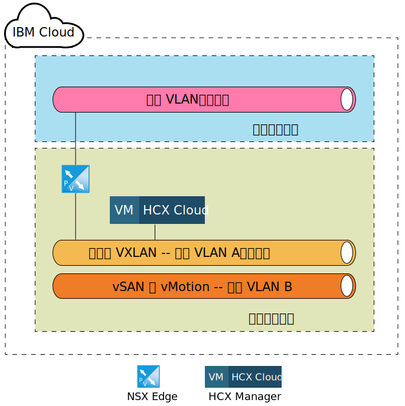
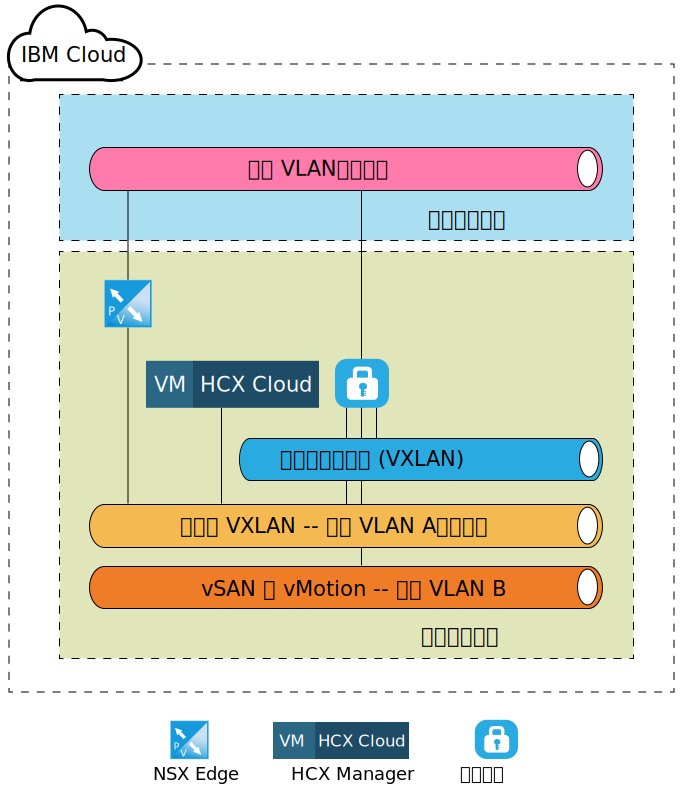
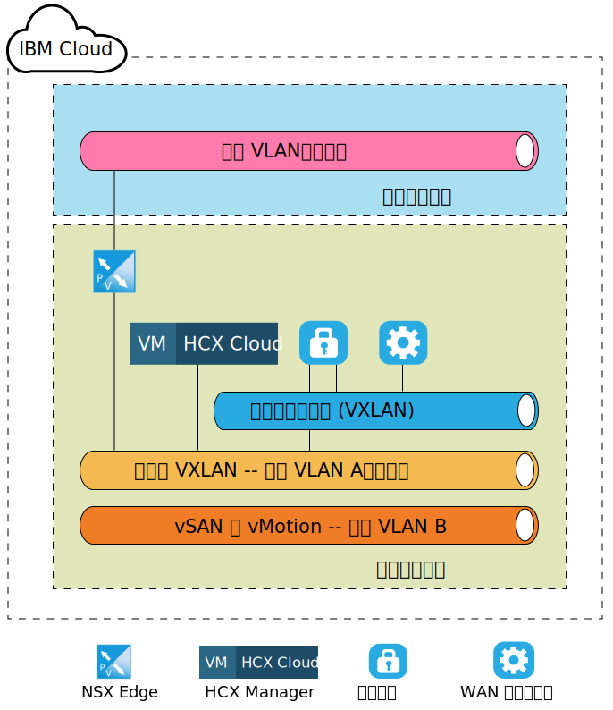
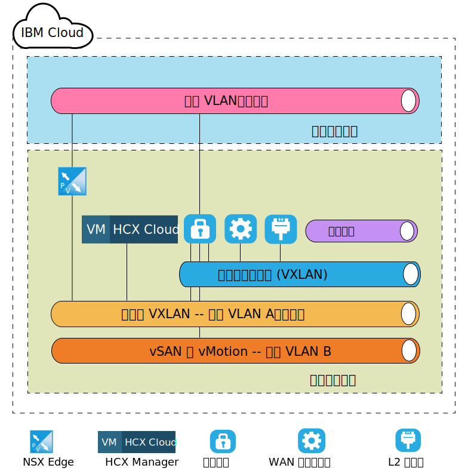

---

copyright:

  years:  2016, 2019

lastupdated: "2019-04-02"

subcollection: vmware-solutions

---
# VMware HCX on IBM Cloud 元件層次目標架構
{: #hcx-archi-target}

本節說明 IBM Cloud 環境內所部署之每個 HCX 元件的架構。討論 IBM Cloud 內的分支（目標）部署模型。

## NSX Edge
{: #hcx-archi-target-nsx-edge}

IBM Cloud 內所配置的第一個元件是 NSX Edge 虛擬機器配對。請務必注意，所有 IBM Cloud for VMware Solutions 部署都會安裝及配置 IBM CloudDriver 出埠通訊的邊緣裝置。不過，雖然此 ESG 可以重複用於 Hybrid Cloud Services 通訊，但建議部署新的配對。

NSX Edge 虛擬機器會配置為超大型 NSX Edge 裝置的「主動/被動」配對。使用公用網際網路連線，即可使用這些裝置來連接至 IBM Cloud VMware 環境。選擇超大型 NSX Edge 來用於內部環境，因為它適合下列環境：環境的負載平衡器具有數百萬個不一定需要高傳輸量的並行階段作業。在配置處理程序期間，NSX Edge 會連接至 IBM Cloud 公用 VLAN 以及指定給管理基礎架構的 IBM Cloud Private VLAN。

表 1. NSX Edge 部署

|元件                            | 配置 |
|-----------|---------------|
|CPU | 6 vCPU        |
| RAM       | 8 GB          |
| 磁碟            | 位於具有 4 GB 交換記憶體之共用儲存空間的 4.5 GB VMDK |

因為 NSX Edge 在內部或專用部署中配置為主動/被動，所以使用者必須建立「vSphere 分散式資源排程器 (DRS)」反親緣性規則，確定 NSX Edge 未在與其個別對等節點應用裝置相同的主機上執行。

表 2. NSX Edge 反親緣性規則

| 欄位     | 值  |
|-----------|---------------|
|名稱 | NSX Edge 外部閘道 |
|類型      | 個別的虛擬機器 |
| 成員   | NSX Edge 1 |
|           | NSX Edge 2 |

如果已訂購 VMware HCX on IBM Cloud 服務，則除了 IBM Cloud 內所部署的 NSX Edge 應用裝置之外，還會部署 HCX Manager 虛擬應用裝置。部署此應用裝置之後，會啟用 NSX Edge 使用負載平衡，並配置有使用憑證進行來自來源之入埠連線的應用裝置設定檔。NSX Edge 也配置了負載平衡儲存區，以指向 HCX Manager、vCenter 及 PSC 應用裝置。此外，使用透過 VIP 連接儲存區的規則，在公用介面上使用虛擬 IP 位址 (VIP) 建立虛擬伺服器。下列各表格顯示 NSX Edge 上的虛擬伺服器配置及儲存區配置範例。

表 3. NSX Edge 的 VIP 配置 - 虛擬伺服器

| 欄位     | 值  |
|-----------|---------------|
| 虛擬伺服器 ID | virtualServer-1 |
|名稱 | HCX-VIP |
|說明              | LB-VIP |
| 預設儲存區 | pool-1 |
| IP 位址 | 254 |
| 通訊協定 | https |
| 埠 | 443 |

表 4. NSX Edge 的 VIP 配置 - 虛擬伺服器詳細資料

| 欄位     | 值  |
|-----------|---------------|
|說明              | LB-VIP |
| 連線限制 | 0 |
| 服務插入狀態 | 已停用 |
| 應用程式設定檔 | applicationProfile-1 |
| 連線速率限制 | 0 |
| 加速狀態 | 已停用 |
| 服務設定檔狀態 |  |

表 5. NSX Edge 的 VIP 配置 - 規則

| 欄位     | 值  |
|-----------|---------------|
| 規則 ID | applicationRule-1 |
|名稱 | appRule1 |
| Script | acl isHibridity url_beg /hibridity     acl isWebSso url_beg /websso     acl isVCenter url_beg /vsphere-client     use_backend nspPool001 if isHybridity     use_backend vcPool001 if isVCenter     use_backend ssoPool001 if isWebSso |

表 6. NSX Edge 的儲存區配置 - 儲存區摘要

| 儲存區 ID |名稱 | 演算法   | 監視器 ID |
|---------|------------|-------------|------------|
| pool-1  | nspPool001 | ROUND-ROBIN |            |
| pool-3  | ssoPool001 | ROUND-ROBIN |            |
| pool-2  | vcPool001  | ROUND-ROBIN |            |

表 7. NSX Edge 的儲存區配置 - 儲存區詳細資料

| 欄位           | 值  |
|-----------------|-----------|
|說明       |           |
| 透通     | 已停用 |
|名稱 | HCX-CLOUD |
| 加權          |1 |
| 監視器埠    | 8443      |
| 連線數上限 | 0 |
| 連線數下限 | 0 |

## HCX Manager
{: #hcx-archi-target-hcxm}

HCX Manager 元件是在目標上配置 NSX Edge 應用裝置之後所部署的第一個應用裝置。此應用裝置用來作為來源元件之雲端環境的主要介面，並提供抽象網路使用者介面，可用來新增、編輯和刪除網路，以及設計和配置遞送，而不需要直接使用 NSX。在整合 vCenter 與 NSX 之後，HCX Manager 應用裝置會獲指派管理 VLAN 上的專用可攜式 IP 位址。

此外，也會將它配置成使用特定使用者來存取 vCenter 及 NSX。請務必注意，HCX Manager 的 IP 位址就是 NSX Edge 中用於負載平衡的相同 IP 位址。

部署及配置 HCX Manager 雲端元件之後，來源元件會透過 NSX ESG 中所配置的 VIP 位址來建立與 HCX Manager 的連線。建立此連線之後，會在 IBM Cloud 內部署雲端閘道及 WAN 最佳化工具應用裝置。

圖 1. 目標 - Hybrid Cloud Services 應用裝置

## 雲端閘道
{: #hcx-archi-target-cloud-gateway}

建立從來源到目標雲端的連線之後，會部署虛擬應用裝置。此應用裝置是「雲端閘道 (CGW)」，用來維護指定為來源之 vSphere 環境與 IBM Cloud 之間的安全頻道。IBM Cloud 內所部署之 CGW 應用裝置的大小規格列在「表 3 雲端閘道部署」中。

表 8. 雲端閘道部署

|元件                            | 配置 |
|-----------|---------------|
|CPU |8 vCPU|
| RAM       | 3 GB          |
| 磁碟            | 位於共用儲存空間的 2.0 GB VMDK |

此「雲端閘道」部署並配置成位於管理 VLAN（專用可攜式子網路）以及 IBM Cloud for VMware Solutions 部署的 vMotion VLAN（專用可攜式子網路）。此外，還會在透過公用網際網路建立之連線的「公用 VLAN（公用可攜式）」上配置另一個介面。如果有直接連線（具有專用連線），則不需要公用存取權。與「雲端閘道」相關聯的最後一個連線是在站台配對時建立及配置的邏輯交換器。

此邏輯交換器是專用、不可遞送的網路，用來作為「雲端閘道」與 4.1.4 WAN (TBD) 中所討論之「WAN 最佳化工具」之間的通訊通道。

下圖說明雲端閘道應用裝置及已指派連線的高階元件圖。

圖 2. 雲端閘道部署

## WAN 最佳化程式
{: #hcx-archi-target-wan-opt}

所部署的第二個元件是「WAN 最佳化」應用裝置。雖然「WAN 最佳化」應用裝置是選用項目，但它會執行 WAN 調節來減少延遲效果。它也納入「轉遞錯誤更正」以使封包流失情境無效，以及刪除重複的備用資料流量型樣。

總而言之，這些會減少頻寬使用，並確定最佳使用可用的網路容量來加速與 IBM Cloud 之間的資料傳送。「WAN 最佳化工具」會密集使用磁碟，並且需要足夠數量的 IOPS 才能適當地運作。因此，WAN 最佳化工具位於 vSAN 儲存空間（如果存在的話）或「耐久性」儲存空間（含 2,000 個 IOPS）上。「WAN 最佳化」應用裝置的大小規格如下表所示。

表 9. WAN 最佳化工具應用裝置大小

|元件                            | 配置 |
|-----------|---------------|
|CPU |8 vCPU|
| RAM       | 14 GB          |
| 磁碟            | 30 GB VMDK + 位於共用儲存空間的 70 GB VMDK |

與「雲端閘道」不同，「WAN 最佳化」應用裝置只會連接至邏輯交換器，以啟用它自己與「雲端閘道」之間的通訊。如果在來源環境內使用 WAN 最佳化，則需要此應用裝置。如需網路佈置的視圖，請參閱下圖。

圖 3. WAN 最佳化工具部署

## 第 2 層集中器
{: #hcx-archi-target-layer-2-conc}

第三個元件稱為「第 2 層集中器 (L2C)」，而且是「網路延伸服務」的一部分。L2C 是容許將內部部署資料中心網路擴充至 IBM Cloud 的虛擬機器。L2C 會延伸內部部署 VLAN 及（或）VXLAN。每個 L2C 最多可以延伸至 4096 個 VLAN。當每個 L2C 與其內部部署友機配對時，可以提供一個「流程」最多 1 Gbps，並且一個 VLAN（或 VXLAN）最高可達 4 Gbps 聚集。如果需要其他網路傳輸量，則支援部署其他 L2C 應用裝置。

在此設計期間，會部署 L2C 應用裝置，因此，客戶可以透過公用網際網路或是透過 Direct Link 的專用網路，將多個 VLAN 及 VLXAN 延伸至 IBM Cloud。下表列出 IBM Cloud 上 L2C 應用裝置的大小規格。

表 10. HT L2C 應用裝置大小

|元件                            | 配置 |
|-----------|---------------|
|CPU |8 vCPU|
| RAM       | 38 GB          |
| 磁碟            | 共用儲存空間上的 2 GB VMDK |

L2C 應用裝置部署於管理 VLAN 以及公用 VLAN 上。公用介面用於前往延伸網路來源的應用程式資料流量。在來源管理者將網路延伸起始至 IBM Cloud 之後，會建立延伸網路這類其他連線，並將其連接至 L2C 應用裝置。下圖說明這些網路及連線範例。

圖 4. L2 集中器部署

## 相關鏈結
{: #hcx-archi-target-related}

* [在來源上安裝及配置](/docs/services/vmwaresolutions/archiref/hcx-archi?topic=vmware-solutions-hcx-archi-source)
