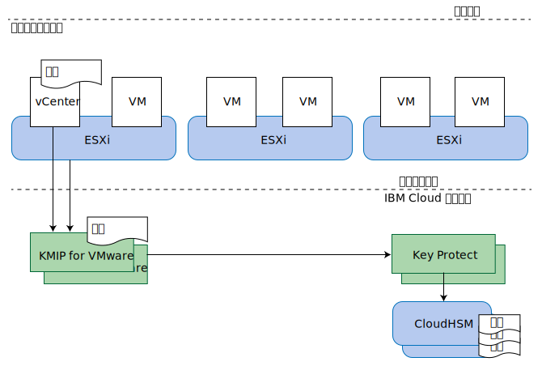

---

copyright:

  years:  2016, 2019

lastupdated: "2019-01-25"

---

{:tip: .tip}
{:note: .note}
{:important: .important}

# KMIP for VMware 設計

KMIP for VMware on {{site.data.keyword.cloud}} 提供與 VMware vSAN 加密及 VMware vSphere 加密相容的金鑰管理服務，方法是使用 [IBM Key Protect](/docs/services/key-protect/index.html) 提供主要金鑰及資料金鑰儲存空間。

**附註**：在此版本中，KMIP for VMware on {{site.data.keyword.cloud_notm}} 僅限進行 vSphere 加密。

## 儲存空間加密選項

KMIP for VMware 與 VMware vSAN 加密及 vSphere 加密相容。這兩個解決方案實作於 Hypervisor 層，但提供略為不同的功能。根據需求，會評估其功能。

### VMware vSAN 加密

VMware vSAN 加密僅適用於 vSAN 資料儲存庫。使用此解決方案，VMware vCenter 及 VMware ESXi 主機會連接至 KMIP for VMware 這類金鑰管理伺服器來取得加密金鑰。這些金鑰用來保護用於 vSAN 資料儲存庫的個別磁碟機，包括快取及容量磁碟。會以保留 vSAN 壓縮及刪除重複優點的方式，來實作 vSAN 加密。

vSAN 加密在資料儲存庫層次操作，因此其主要目標是在遺失實體磁碟機時防止資料曝光。此外，vSAN 加密完全與所有虛擬機器備份及抄寫技術相容，例如 vSphere 抄寫、跨 vCenter vMotion、VMware HCX、Zerto、Veeam 及 IBM Spectrum Protect Plus。

vSAN 加密未加密您叢集內的主機到主機 vSAN 抄寫通訊。vSAN 加密不適用於其他儲存空間解決方案，例如「{{site.data.keyword.cloud_notm}} 耐久性」檔案及區塊儲存空間。vSAN 加密需要 vSAN Enterprise 授權。
{:note}

### vSphere 加密

VMware vSphere 加密適用於所有類型的 VMware 儲存空間，包括 vSAN 儲存空間以及「{{site.data.keyword.cloud_notm}} 耐久性」檔案及區塊儲存空間。

使用此解決方案，vCenter Server 及您的 ESXi 主機會連接至 KMIP for VMware 這類金鑰管理伺服器來取得加密金鑰。根據 VM 儲存空間原則，這些金鑰用來保護個別虛擬機器 (VM) 磁碟。

vSphere 加密在虛擬機器磁碟層次操作，因此可以在遺失實體磁碟機或遺失 VM 磁碟時防止資料曝光。無法有效地備份或抄寫許多備份及抄寫技術，因為提供的資料已加密。

因此，vSphere 加密與 vSphere 抄寫、跨 vCenter vMotion、VMware HCX、Zerto 或 IBM Spectrum Protect Plus 不相容。不過，適當地配置時，Veeam Backup and Replication 與 vSphere 加密相容。

### 其他考量

在 vSphere 叢集中啟用任一類型的加密時，VMware 會建立一個額外金鑰來加密 ESXi 核心傾出，因為這些傾出可能包含金鑰管理認證、加密金鑰或已解密資料這類機密資料。您應該熟悉 [vSphere 虛擬機器加密及核心傾出](https://docs.vmware.com/en/VMware-vSphere/6.5/com.vmware.vsphere.security.doc/GUID-63728E8B-810D-418B-B1AA-6A0A2F92AABE.html)。

KMIP for VMware 與 vSAN 加密或 vSphere 加密搭配使用時，具有數層金鑰保護。

如果您計劃替換金鑰，則請檢閱可替換金鑰之層次的下列資訊：
* 您的客戶主要金鑰 (CRK) 保護所有 VMware 金鑰。在與 KMIP for VMware 實例相關聯的 IBM Key Protect 實例中，可以替換金鑰。
* KMIP for VMware 使用 CRK 來保護由它所產生並配送至 VMware 的金鑰。VMware 將這些視為「金鑰加密金鑰」(KEK)。
  * 如果您使用 vSphere 加密，則可以使用 **Set-VMEncryptionKey** PowerShell 指令來替換金鑰。
  * 如果您使用 vSAN 加密，則可以在 vSAN 使用者介面上替換金鑰。
* VMware 使用這些 KEK 來保護它用來加密磁碟機及 VM 磁碟的實際金鑰。您可以使用 VMware 稱為「深度」重設金鑰的項目，來替換這些金鑰。此作業會重新加密所有已加密資料，因此可能需要較長的時間。
  * 如果您使用 vSphere 加密，則可以使用 **Set-VMEncryptionKey** PowerShell 指令來執行深度重設金鑰。
  * 如果您使用 vSAN 加密，則可以使用 vSAN 使用者介面來執行深度重設金鑰。

## KMIP for VMware

VMware vSAN 加密及 vSphere 加密與許多金鑰管理伺服器相容。KMIP for VMware 提供 IBM 管理的金鑰管理服務，以讓您使用 IBM Key Protect 來完整控制金鑰。Cloud Object Storage 這類其他 {{site.data.keyword.cloud_notm}} 服務也整合 Key Protect，讓它成為 {{site.data.keyword.cloud_notm}} 中金鑰管理的控制中心點。

### 金鑰內的金鑰

金鑰管理系統一般使用稱為*封套加密* 的技術，以使用其他金鑰來包裝或保護金鑰。這些金鑰稱為*主要金鑰* 或*金鑰加密金鑰* (KEK)。若要存取金鑰，您需要使用金鑰的對應主要金鑰來解密或解除包裝金鑰。破壞主要金鑰是讓它所保護的所有金鑰都失效的有效方式。這些金鑰不需要儲存在主要金鑰附近。控制對主要金鑰的存取十分重要。

{{site.data.keyword.cloud_notm}} Key Protect 使用*客戶主要金鑰* (CRK) 來提供此服務。Key Protect 將 CRK 專門儲存在無法從中擷取 CRK 的 {{site.data.keyword.cloud_notm}} CloudHSM 硬體中。接著使用這些 CRK 來包裝其他加密金鑰，例如 KMIP for VMware 針對您 VMware 實例所產生的加密金鑰。

VMware 會針對其金鑰來實作這個相同概念。KMIP for VMware 會在要求時向 VMware 提供金鑰，而 VMware 接著會使用此金鑰作為 KEK 來包裝或加密用來加密 vSAN 磁碟機或虛擬機器磁碟的最終金鑰。這些最終金鑰稱為資料加密金鑰 (DEK)。

因此，我們最後有了下列加密鏈：
* 客戶主要金鑰 (CRK) 已永久儲存至 IBM Key Protect 中。
* 由 KMIP for VMware 所產生並提供給您實例中 vCenter Server 及 ESXi 主機的「金鑰加密金鑰 (KEK)」。
* 由 VMware 所產生並與 vSAN 磁碟或虛擬機器磁碟一起儲存的資料加密金鑰 (DEK)。

KMIP for VMware 會將包裝形式的 KEK 儲存至 IBM Key Protect 內。雖然 KEK 是由 CRK 所加密保護，而且不需要儲存至 HSM 內，但是如果您將它們儲存至 IBM Key Protect，則您可以看到它們的存在，而您可以在需要撤銷個別金鑰時刪除它們。

### 鑑別及授權

三個元件構成儲存空間加密解決方案：VMware 叢集、KMIP for VMware 實例及 Key Protect 實例。

VMware vCenter 及 ESXi 會向 KMIP for VMware 實例進行鑑別，方法是使用您在建立金鑰管理伺服器 (KMS) 連線時於 VMware vCenter 中安裝或產生的憑證。您可以將公用憑證安裝至 KMIP for VMware，以識別 vCenter 用戶端或容許連接的用戶端。每個用戶端都會授權給該 KMIP for VMware 實例中所儲存的所有金鑰。

KMIP for VMware 實例會授權給 Key Protect 實例，方法是使用已獲授與 Key Protect 實例存取權的 {{site.data.keyword.cloud_notm}} Identity and Access Management (IAM) 服務 ID。服務 ID 必須最少具有 Key Protect 實例的平台「檢視者」存取權及服務「管理員」存取權。KMIP for VMware 在 Key Protect 實例中使用您選擇的客戶主要金鑰 (CRK)，並以包裝形式將代表 VMware 所產生的所有 KEK 儲存至 Key Protect 實例。

### 拓蹼

圖 1. KMIP for VMware on {{site.data.keyword.cloud_notm}} 的元件

KMIP for VMware 可用於數個 IBM Cloud 多區域地區 (MZR)。如需完整清單，請參閱[訂購 KMIP for VMware](/docs/services/vmwaresolutions/services/kmip_standalone_ordering.html)。

 在每個 MZR 內，KMIP for VMware 都在 IBM Cloud Private 網路上提供兩個服務端點，以獲得高可用性。請將 vCenter 金鑰管理伺服器 (KMS) 中的這兩個端點配置都配置為 KMS 叢集。如需每個 MZR 中的端點清單及 KMIP 伺服器憑證簽章，請參閱 [KMIP for VMware 服務文件](/docs/services/vmwaresolutions/services/kmip_standalone_ordering.html)。

KMIP for VMware 也會連接至 IBM Cloud Key Protect，方法是使用公用網際網路以外的 IBM Cloud Private 網路。

若要透過專用網路存取 KMIP for VMware，必須啟用 IBM Cloud 基礎架構帳戶以進行虛擬遞送及轉遞 (VRF)，並且必須將 IBM Cloud 服務端點路徑新增至您帳戶的 VRF 路徑。如需相關資訊，請參閱[針對服務端點啟用帳戶](/docs/services/service-endpoint/enable-servicepoint.html#cs_cli_install_steps)。

### 相關鏈結

* [解決方案概觀](/docs/services/vmwaresolutions/archiref/kmip/overview.html)
* [實作及管理](/docs/services/vmwaresolutions/archiref/kmip/implementation.html)
* [IBM Key Protect](/docs/services/key-protect/index.html)
