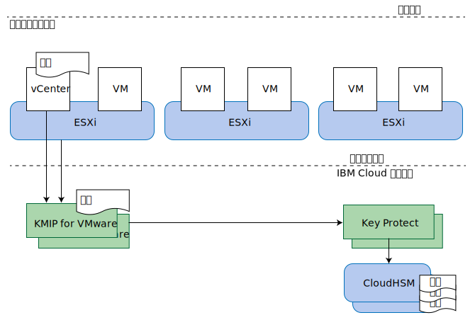

---

copyright:

  years:  2016, 2019

lastupdated: "2019-05-07"

subcollection: vmware-solutions

---

{:tip: .tip}
{:note: .note}
{:important: .important}

# KMIP for VMware 設計
{: #kmip-design}

KMIP for VMware on {{site.data.keyword.cloud}} 提供與 VMware vSAN 加密及 VMware vSphere 加密相容的金鑰管理服務，方法是使用 [IBM Key Protect](/docs/services/key-protect?topic=key-protect-getting-started-tutorial) 或 [IBM Cloud Hyper Protect Crypto Services](/docs/services/hs-crypto?topic=hs-crypto-get-started#get-started) 提供根金鑰及資料金鑰儲存空間。Key Protect 及 Hyper Protect Crypto Services 會充當此解決方案中的金鑰管理服務。

## 儲存空間加密選項
{: #kmip-design-storage-options}

KMIP for VMware 與 VMware vSAN 加密及 vSphere 加密相容。這兩個解決方案實作於 Hypervisor 層，但提供略為不同的功能。根據需求，會評估其功能。

### VMware vSAN 加密
{: #kmip-design-vsan-encrypt}

VMware vSAN 加密僅適用於 vSAN 資料儲存庫。使用此解決方案，VMware vCenter 及 VMware ESXi 主機會連接至 KMIP for VMware 這類金鑰管理伺服器來取得加密金鑰。這些金鑰用來保護用於 vSAN 資料儲存庫的個別磁碟機，包括快取及容量磁碟。會以保留 vSAN 壓縮及刪除重複優點的方式，來實作 vSAN 加密。

vSAN 加密在資料儲存庫層次操作，因此其主要目標是在遺失實體磁碟機時防止資料曝光。此外，vSAN 加密完全與所有虛擬機器備份及抄寫技術相容，例如 vSphere 抄寫、跨 vCenter vMotion、VMware HCX、Zerto、Veeam 及 IBM Spectrum Protect Plus。

**附註**：
* vSAN 加密未加密您叢集內的主機到主機 vSAN 抄寫通訊。
* vSAN 加密不適用於其他儲存空間解決方案，例如「{{site.data.keyword.cloud_notm}} 耐久性」檔案及區塊儲存空間。
* vSAN 加密需要 vSAN Enterprise 授權。
* vSAN 性能檢查可能會定期發出警告，指出它無法從您的一部以上 vSphere 主機連接至 KMS 叢集。這些警告發生的原因是 vSAN 性能檢查連線太快逾時。您可以忽略這些警告。如需相關資訊，請參閱 [因出現「SSL 信號交換逾時」錯誤，而發生 vSAN KMS 性能檢查間歇性失敗](https://kb.vmware.com/s/article/67115){:new_window}。

### vSphere 加密
{: #kmip-design-vsphere-encrypt}

VMware vSphere 加密適用於所有類型的 VMware 儲存空間，包括 vSAN 儲存空間以及「{{site.data.keyword.cloud_notm}} 耐久性」檔案及區塊儲存空間。

使用此解決方案，vCenter Server 及您的 ESXi 主機會連接至 KMIP for VMware 這類金鑰管理伺服器來取得加密金鑰。根據 VM 儲存空間原則，這些金鑰用來保護個別虛擬機器 (VM) 磁碟。

vSphere 加密在虛擬機器磁碟層次操作，因此可以在遺失實體磁碟機或遺失 VM 磁碟時防止資料曝光。無法有效地備份或抄寫許多備份及抄寫技術，因為提供的資料已加密。

因此，vSphere 加密與 vSphere 抄寫、跨 vCenter vMotion、VMware HCX、Zerto 或 IBM Spectrum Protect Plus 不相容。不過，適當地配置時，Veeam Backup and Replication 與 vSphere 加密相容。

### 其他考量
{: #kmip-design-considerations}

在 vSphere 叢集中啟用任一類型的加密時，VMware 會建立一個額外金鑰來加密 ESXi 核心傾出，因為這些傾出可能包含金鑰管理認證、加密金鑰或已解密資料這類機密資料。您應該熟悉 [vSphere 虛擬機器加密及核心傾出](https://docs.vmware.com/en/VMware-vSphere/6.5/com.vmware.vsphere.security.doc/GUID-63728E8B-810D-418B-B1AA-6A0A2F92AABE.html)。

KMIP for VMware 與 vSAN 加密或 vSphere 加密搭配使用時，具有數層金鑰保護。

如果您計劃替換金鑰，則請檢閱可替換金鑰之層次的下列資訊：
* 您的客戶根金鑰 (CRK) 保護所有 VMware 金鑰。在與 KMIP for VMware 實例相關聯的 IBM Key Protect 或 Hyper Protect Crypto Services 實例中，可以替換金鑰。
* KMIP for VMware 使用 CRK 來保護由它所產生並配送至 VMware 的金鑰。VMware 將這些視為「金鑰加密金鑰」(KEK)。
  * 如果您使用 vSphere 加密，則可以使用 **Set-VMEncryptionKey** PowerShell 指令來替換金鑰。
  * 如果您使用 vSAN 加密，則可以在 vSAN 使用者介面上替換金鑰。
* VMware 使用這些 KEK 來保護它用來加密磁碟機及 VM 磁碟的實際金鑰。您可以使用 VMware 稱為「深度」重設金鑰的項目，來替換這些金鑰。此作業會重新加密所有已加密資料，因此可能需要較長的時間。
  * 如果您使用 vSphere 加密，則可以使用 **Set-VMEncryptionKey** PowerShell 指令來執行深度重設金鑰。
  * 如果您使用 vSAN 加密，則可以使用 vSAN 使用者介面來執行深度重設金鑰。

## KMIP for VMware
{: #kmip-design-kmip-for-vmware}

VMware vSAN 加密及 vSphere 加密與許多金鑰管理伺服器相容。KMIP for VMware 提供 IBM 管理的金鑰管理服務，以讓您使用 IBM Key Protect 或 Hyper Protect Crypto Services 來完整控制金鑰。Cloud Object Storage 這類其他 {{site.data.keyword.cloud_notm}} 服務也整合 Key Protect 與 Hyper Protect Crypto Services，讓它們成為 {{site.data.keyword.cloud_notm}} 中金鑰管理的控制中心點。

### 金鑰內的金鑰
{: #kmip-design-keys}

金鑰管理系統一般使用稱為*封套加密* 的技術，以使用其他金鑰來包裝或保護金鑰。這些金鑰稱為*根金鑰* 或*金鑰加密金鑰* (KEK)。若要存取金鑰，您需要使用金鑰的對應根金鑰來解密或解除包裝金鑰。破壞根金鑰是讓它所保護的所有金鑰都失效的有效方式。這些金鑰不需要儲存在根金鑰附近。控制對根金鑰的存取十分重要。

{{site.data.keyword.cloud_notm}} Key Protect 及 Hyper Protect Crypto Services 使用*客戶根金鑰* (CRK) 來提供此服務。Key Protect 將 CRK 專門儲存在無法從中擷取 CRK 的 {{site.data.keyword.cloud_notm}} CloudHSM 硬體中；Hyper Protect Crypto Services 將金鑰儲存在 IBM zSeries HSM 中。接著使用這些 CRK 來包裝其他加密金鑰，例如 KMIP for VMware 針對您 VMware 實例所產生的加密金鑰。

VMware 會針對其金鑰來實作這個相同概念。KMIP for VMware 會在要求時向 VMware 提供金鑰，而 VMware 接著會使用此金鑰作為 KEK 來包裝或加密用來加密 vSAN 磁碟機或虛擬機器磁碟的最終金鑰。這些最終金鑰稱為資料加密金鑰 (DEK)。

因此，我們最後有了下列加密鏈：
* 客戶根金鑰 (CRK) 已永久儲存在 IBM Key Protect 或 Hyper Protect Crypto Services 中。
* 由 KMIP for VMware 所產生並提供給您實例中 vCenter Server 及 ESXi 主機的「金鑰加密金鑰 (KEK)」。
* 由 VMware 所產生並與 vSAN 磁碟或虛擬機器磁碟一起儲存的資料加密金鑰 (DEK)。

KMIP for VMware 會將包裝形式的 KEK 儲存在 IBM Key Protect 或 Hyper Protect Crypto Services 內。雖然 KEK 是由 CRK 加密保護，而且不需要儲存在 HSM 內，但是如果您將它們儲存在金鑰管理服務中，則您可以看到它們的存在，而且可以在需要撤銷個別金鑰時刪除它們。

### 鑑別及授權
{: #kmip-design-authentication}

三個元件構成儲存空間加密解決方案：VMware 叢集、KMIP for VMware 實例，以及 Key Protect 或 Hyper Protect Crypto Services 實例。

VMware vCenter 及 ESXi 會向 KMIP for VMware 實例進行鑑別，方法是使用您在建立金鑰管理伺服器 (KMS) 連線時於 VMware vCenter 中安裝或產生的憑證。您可以將公用憑證安裝至 KMIP for VMware，以識別 vCenter 用戶端或容許連接的用戶端。每個用戶端都會授權給該 KMIP for VMware 實例中所儲存的所有金鑰。

KMIP for VMware 實例會授權給 Key Protect 或 Hyper Protect Crypto Services 實例，方法是使用已獲授權存取此實例的 {{site.data.keyword.cloud_notm}} Identity and Access Management (IAM) 服務 ID。服務 ID 必須最少具有金鑰管理程式實例的平台「檢視者」存取權及服務「管理員」存取權。KMIP for VMware 會在金鑰管理程式實例中使用您選擇的客戶根金鑰 (CRK)，並以包裝形式將代表 VMware 產生的所有 KEK 儲存在金鑰管理程式實例中。

### 拓蹼
{: #kmip-design-topology}

KMIP for VMware 可用於許多個 {{site.data.keyword.cloud_notm}} 多區域地區 (MZR)。如需完整清單，請參閱[訂購 KMIP for VMware](/docs/services/vmwaresolutions/services?topic=vmware-solutions-kmip_standalone_ordering)。

在每個 MZR 內，KMIP for VMware 在 {{site.data.keyword.cloud_notm}} 專用網路上提供兩個服務端點，以取得高可用性。請將 vCenter 金鑰管理伺服器 (KMS) 中的這兩個端點配置都配置為 KMS 叢集。如需每個 MZR 中的端點清單及 KMIP 伺服器憑證簽章，請參閱 [KMIP for VMware 服務文件](/docs/services/vmwaresolutions/services?topic=vmware-solutions-kmip_standalone_ordering)。

若要透過專用網路存取 KMIP for VMware，必須針對虛擬遞送及轉遞 (VRF) 啟用您的 {{site.data.keyword.cloud_notm}} 基礎架構帳戶，而且還必須將 {{site.data.keyword.cloud_notm}} 網路服務端點新增至您帳戶的 VRF 路徑。如需相關資訊，請參閱[使用 IBM Cloud CLI，以啟用您的帳戶來使用服務端點](/docs/services/service-endpoint?topic=service-endpoint-getting-started#cs_cli_install_steps)。

KMIP for VMware 還使用 {{site.data.keyword.cloud_notm}} 專用網路而非公用網際網路來連接至 {{site.data.keyword.cloud_notm}} Key Protect。

使用 IBM Cloud Hyper Protect Crypto Services 時，您的金鑰會儲存在 IBM zSeries HSM 而非 CloudHSM 中。此外，KMIP for VMware 與 {{site.data.keyword.cloud_notm}} Hyper Protect Crypto Services 之間的連線會透過公用網路進行傳送，但受到 TLS 加密及鑑別的保護。

## 相關鏈結
{: #kmip-design-related}

* [解決方案概觀](/docs/services/vmwaresolutions/archiref/kmip?topic=vmware-solutions-kmip-overview)
* [實作及管理](/docs/services/vmwaresolutions/archiref/kmip?topic=vmware-solutions-kmip-implementation)
* [IBM Key Protect](/docs/services/key-protect?topic=key-protect-getting-started-tutorial)
