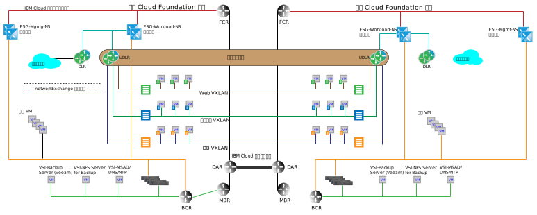

---

copyright:

  years:  2016, 2018

lastupdated: "2018-10-05"

---

# 多站台架構

{{site.data.keyword.cloud}} 與其他雲端供應項目之間的一個關鍵差異因子可以在全球佈建專用運算功能，並自動將隨需應變基礎架構連接至專用 {{site.data.keyword.cloud_notm}} 帳戶內的網路。VMware vCenter Server 及 VMware Cloud Foundation 的軟體定義網路功能與 {{site.data.keyword.cloud_notm}} 一起提供可在數天內建置的精細廣域基礎架構。下列各節說明多站台架構範例，說明如何使用 vCenter Server 或 Cloud Foundation 的現成功能達成。

## 跨 vCenter NSX 環境

跨 vCenter NSX 功能容許鏈結至最多九個 NSNX 管理程式的主要及次要關係：一個主要及八個次要。雖然在跨 vCenter NSX 能夠運作的「加強型鏈結模式 (ELM)」關係中不需要具有 vCenter Server，但提供下列好處：

* 使用「單一登入 (SSO)」認證來建立簡化的主要及次要關係
* vCenter Server 及 Cloud Foundation 自動化會為所有鏈結在一起的站台配置 DNS 名稱解析
* 跨 NSX 及一般 vCenter 功能之所有站台的單一管理畫面

## 多站台範例

下列範例會將 NSX 通用傳輸區域新增至前幾節中討論的基本管理及工作負載拓蹼，以及下列特徵：

* 通用傳輸區域跨越 {{site.data.keyword.CloudDataCent_notm}} 內的兩個 {{site.data.keyword.CloudDataCents_notm}} 或 POD。
* 新增傳輸區域之後，會新增多個 VXLAN，以及跨越新 VXLAN 的「通用分散式路由器」。
* 您必須配置這兩個站台中工作負載 ESG 的上行鏈路。此配置容許本端站台中的虛擬機器 (VM) 遍訪至其本端 ESG。
* 對於入埠資料流量，需要廣域負載平衡器。請參閱 {{site.data.keyword.cloud_notm}} 廣域負載平衡供應項目，以符合此需求。
* 此範例需要 VMware NSX Enterprise 版本。

圖 1. 多站台拓蹼

### 相關鏈結

* [{{site.data.keyword.cloud_notm}} 上的網路服務](networking_services.html)
