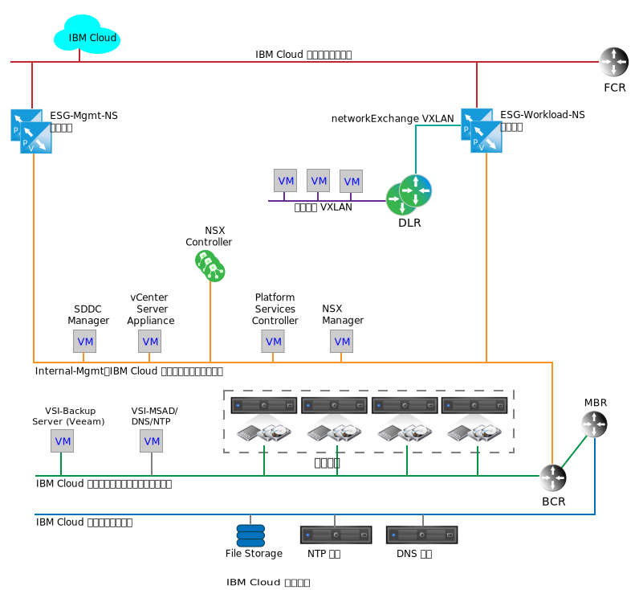
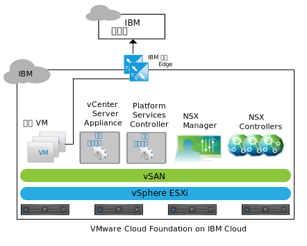
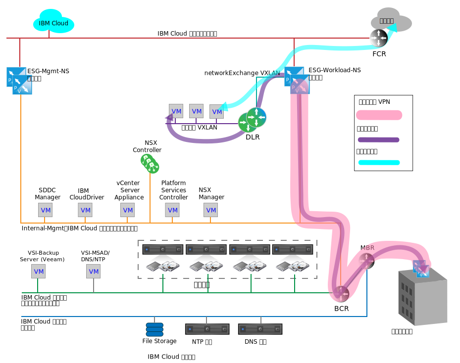

---

copyright:

  years:  2016, 2019

lastupdated: "2019-05-07"

subcollection: vmware-solutions

---

{:tip: .tip}
{:note: .note}
{:important: .important}

# IBM Cloud 上的網路服務
{: #nsx-networking_services}

{{site.data.keyword.cloud}} 上的網路服務包含兩對 VMware NSX Edge Services Gateway (ESG)，以在 {{site.data.keyword.cloud_notm}} 與公用網際網路或客戶內部部署網路之間透過「虛擬專用網路 (VPN)」進行通訊。這些 ESG 會隔離以支援內部 {{site.data.keyword.cloud_notm}} 管理功能及輸出資料流量，即客戶相關網路資料流量的入口。

下圖是簡化的網路圖，其說明管理配對及工作負載 ESG 配對。它也會顯示「NSX 分散式邏輯路由器 (DLR)」及工作負載 VXLAN。這些元件是要作為客戶工作負載的起始登入點，並不需要特定的知識，即可在 NSX 內設定它們。DLR 一般用來遞送 VMware vCenter Server 與「東西向」資料流量之間的資料流量，而「東西向」資料流量位於實例內的不同第 2 層網路之間。此行為與 ESG 相反，ESG 的運作有助於進出 vCenter Server 實例的「南北向」網路資料流量遍訪。

雖然單一 ESG 可能就足以應付管理及客戶工作負載資料流量，但是分隔管理及客戶資料流量是一種設計決策，以期防止意外地錯誤配置管理 ESG。

配置錯誤或停用管理 ESG 並不會讓 vCenter Server 實例無法發揮作用，但會停用所有入口網站管理功能。
{:note}

## IBM 管理服務 NSX Edge
{: #nsx-networking_services-mgmt-serv-nsx-edge}

IBM 管理 ESG 是僅適用於 {{site.data.keyword.cloud_notm}} 管理網路資料流量的專用 NSX Edge 叢集。它的用意並不是要讓資料流量遍訪任何不是由 vCenter Server 自動化部署及管理的元件。

管理 ESG 提供附加服務虛擬機器 (VM)（位於 vCenter Server 實例內）與「IBM 自動化」基礎架構（位於 {{site.data.keyword.cloud_notm}} 中）之間的通訊路徑，如下圖中的 vCenter Server 所示。

由於特定附加服務 VM 與其對應授權和計量系統之間的輕量通訊，會調整主動-被動高可用性 (HA) 配對之大型配置中的 NSX ESG 大小，並且將 NSX ESG 部署於 vCenter Server 叢集的管理資源儲存區上。下表提供 IBM 管理 NSX ESG 部署的摘要。

表 1. IBM 管理 NSX ESG 規格

| IBM 管理 NSX Edge | vCPU |記憶體| 磁碟大小 | 儲存空間位置 |
|:----------------------- |:---- |:------ |:--------- |:---------------- |
| IBM 管理 NSX ESG 1 |2 | 1 GB | 1 GB | 用於管理的 vSAN 資料儲存庫或共用的連接儲存空間 |
| IBM 管理 NSX ESG 2 |2 | 1 GB | 1 GB | 用於管理的 vSAN 資料儲存庫或共用的連接儲存空間 |

### 管理服務
{: #nsx-networking_services-mgmt-services}

下列服務需要出埠存取：

* Zerto Virtual Manager。如果已安裝，則 Zerto on {{site.data.keyword.cloud_notm}} 需要對網際網路的出埠存取，才能進行授權啟動及用量報告。
* Veeam 備份及抄寫。如果已安裝，則 Veeam on{{site.data.keyword.cloud_notm}} 需要對網際網路的出埠存取，才能下載產品和授權更新項目。
* FortiGate Virtual Appliance on {{site.data.keyword.cloud_notm}} 需要對網際網路的出埠存取，才能進行授權啟動及授權監視。
* F5 on {{site.data.keyword.cloud_notm}} 需要對網際網路的出埠存取，才能進行授權啟動。

### Edge 介面
{: #nsx-networking_services-edge-interfaces}

ESG 介面的配置定義了 ESG 有權存取的 L2 網路。對於 vCenter Server 生命週期管理，必須要容許放在管理 VLAN 上的特定 VM 能遍訪至公用 VLAN。以下是在部署上定義的介面：

表 2. NSX ESG 介面配置

| 介面 | 介面類型 | 已連接到 |說明              |
|:--------- |:-------------- |:------------ |:----------- |
| 公用上行鏈路 | 上行鏈路 | **SDDC-DportGroup-External** | 面向公用網際網路的介面 |
| 專用上行鏈路 | 上行鏈路 | **SDDC-DportGroup-Mgmt** |面向專用網路的內部介面|
| 內部 | 內部 | 工作負載 HA VXLAN | 用於 ESG HA 配對活動訊號的內部介面；**SDDC-Dswitch-Private** 上的埠群組 |

### 子網路
{: #nsx-networking_services-subnets}

下列子網路用於「管理 ESG」的用途：

表 3. NSX ESX IP 配置

| 介面 | 介面類型 | IPv4 子網路類型 | 範圍 |說明              |
|:--------- |:-------------- |:----------------- |:----- |:----------- |
| 公用上行鏈路 | 上行鏈路 | {{site.data.keyword.cloud_notm}} 可攜式公用 | /30 - 呈現一個可指派的 IP 位址 |面向網際網路的公用介面|
| 專用上行鏈路 | 上行鏈路 | {{site.data.keyword.cloud_notm}} 可攜式專用（現有管理）| /26 - 呈現 61 個可指派的 IP 位址 |面向專用網路的內部介面|
| 內部 | 內部 | 鏈結本端 | 169.254.0.0/16 | 用於 ESG HA 配對通訊的內部介面 |

### 網址轉換定義
{: #nsx-networking_services-nat-definitions}

「管理 ESG」上採用「網址轉換 (NAT)」，以容許網路資料流量在一個 IP 位址空間與另一個 IP 位址空間之間遍訪。這通常用來節省網際網路可遞送 IP 位址，或是基於安全理由，對公用 IP 位址隱藏內部 IP 位址。NAT 也用來容許「傳輸控制通訊協定 (TCP)」及「使用者資料封包通訊協定 (UDP)」埠重新導向。管理資料流量一律從 vCenter Server 實例內部起始，並且要求只在「管理 ESG」上定義一個來源 NAT (SNAT)。不會針對每個管理需要從實例輸出之服務的內部 VM，建立個別 SNAT。

表 4. NSX ESG NAT 配置

| 已在介面上套用 | 來源 IP 範圍 | 轉換的來源 IP |
|:-------------------- |:--------------- |:-------------------- |
| 公用上行鏈路 |「管理可攜式 /26」上的個別 IP 位址 | {{site.data.keyword.cloud_notm}} 可攜式公用 |

### 遞送
{: #nsx-networking_services-routing}

因為需要透過「管理 ESG」遍訪之 VM 內的服務，可能還需要接觸到客戶 {{site.data.keyword.cloud_notm}} 專用網路內的 {{site.data.keyword.cloud_notm}} 服務，所以需要下列配置才能達成此通訊。

雖然很難預測需要哪個目的地 IP 範圍作為面向網際網路之連線的目的地，但是任何由 {{site.data.keyword.cloud_notm}} 部署及管理的服務都會指向「管理 ESG」，以作為其預設閘道。針對需要外部網路連線的服務，需要靜態路徑以強制資料流量通過 {{site.data.keyword.cloud_notm}} BCR。

針對任何將使用管理 ESG 遍訪 vCenter Server 實例的服務，建議使用下列配置：
* 預設閘道是管理 ESG。
* 內部 {{site.data.keyword.cloud_notm}} 目的地需要靜態路徑。

如果需要服務或 VM 存取客戶 ESG，則必須在個別服務或 VM 內維護靜態路徑，並且指向客戶 ESG。

目前未針對「管理 ESG」配置任何自動遞送通訊協定。

### VXLAN 定義
{: #nsx-networking_services-vlan-definitions}

「管理 HA」配對需要有網路才能連接內部介面，這可以使用現有的 vSwitch、埠群組或 VXLAN。在此設計中，會針對「管理 ESG HA」配對的 HA 活動訊號通訊建立專用 VXLAN。

表 5. NSX ESG VXLAN 定義

| NSX ESG VXLAN 定義 | 傳輸區域 |類型      |
|:------------------------- |:-------------- |:---- |
|管理 HA| transport-1 |廣域|

### 防火牆規則
{: #nsx-networking_services-firewall-rules}

依預設，「管理 ESG」配置為拒絕所有資料流量。

**拒絕：**如果任何先前（順序較高的）規則或規則集不容許資料流量遍訪防火牆，則捨棄沒有回應的所有資料流量。選取自動規則產生，以容許通往 ESG 配對的控制資料流量。

除了自動產生的規則之外，還會設定下列防火牆規則：

表 6. NSX ESG 防火牆配置

| 服務 | 來源 | 目的地 | 通訊協定 | 動作 |
|:------- |:------ |:----------- |:-------- |:------ |
| Zerto on {{site.data.keyword.cloud_notm}} |Zerto 管理 VM| 任何 | 埠 443 | 容許 |
| Veeam on {{site.data.keyword.cloud_notm}} | Veeam 備份及抄寫 VM | 任何 | 埠 443 | 容許 |
| FortiGate Virtual Appliance on {{site.data.keyword.cloud_notm}} | 服務 VM | 任何 | 埠 443 | 容許 |
| F5 on {{site.data.keyword.cloud_notm}} | 服務 VM | 任何 | 埠 443 | 容許 |
| 任何 | 任何 | 任何 | 任何 | 拒絕 |

## IBM 工作負載 NSX Edge
{: #nsx-networking_services-wkld-nsx-edge}

IBM 工作負載 ESG 是簡單拓蹼的一部分，主要用於工作負載網路通訊。下節說明將工作負載連接至 vCenter Server 實例內網路的設計目的。這是將內部部署網路及 IP 空間連接至特定 vCenter Center 實例的起點，也是真正「混合式雲端」架構的基礎。

連接至公用及專用 {{site.data.keyword.cloud_notm}} 網路的客戶網路，能容許進出面向網際網路之資料流量的工作負載存取，但也容許從公用或專用 {{site.data.keyword.cloud_notm}} 網路建立站台對站台 VPN。這可讓您大幅減少關於連接至內部部署網路的價值實現時間，因為客戶安全需求，建立專用廣域網路 (WAN) 可能需要數個月的時間。不過，專用鏈結就緒之後，即可翻轉 VPN 以遍訪該鏈結，而不會影響 VPN 通道內或是 vCenter Server 實例內的層疊網路。完成此作業之後，如果從安全的角度來看需要的話，即可移除工作負載 ESG 的公用介面。

下圖中的拓蹼包含下列 NSX 元件：
* NSX Edge 應用裝置 (ESG)
* 分散式邏輯路由器 (DLR)
* VXLAN（L3 上的 L2）

### IBM 工作負載 NSX Edge 的 Edge 介面
{: #nsx-networking_services-edge-interfaces-workload}

與管理 ESG 相同，ESG 介面的配置定義 ESG 有權存取的 L2 網路。工作負載拓蹼的設計目的，有一部分是要達到軟體定義網路 (SDN) 層疊，以隔離工作負載與基礎的 {{site.data.keyword.cloud_notm}} 位址空間。此設計是達成 BYOIP 設計的基礎。因此，以下是在部署上定義的介面：

表 7. 工作負載 Edge 介面配置

| 介面 | 介面類型 | 已連接到 |說明              |
|:--------- |:-------------- |:------------ |:----------- |
| 公用上行鏈路 | 上行鏈路 | SDDC-DportGroup-External | 面向公用網際網路的介面 |
| 專用上行鏈路 | 上行鏈路 | SDDC-DportGroup-Mgmt | 面向內部專用網路的介面 |
| 傳輸上行鏈路 | 上行鏈路 | Workload-Trasit |「工作負載 ESG」與「工作負載 DLR」之間的傳輸 VXLAN |
| 內部 | 內部 | 工作負載 HA VXLAN | 用於 ESG HA 配對活動訊號的內部介面 |

在此設計中，採用 DLR 來容許本端工作負載連接 L2 網路之間的潛在「東西向」遞送。因為此拓蹼是用來作為簡單的範例，所以只會說明一個用於工作負載的 L2 網路。新增更多連接到 DLR 上新介面的 VXLAN，即可新增更多安全區域。下表顯示要配置的 DLR 介面：

表 8. DLR 介面

| 介面 | 介面類型 | 已連接到 |說明              |
|:--------- |:-------------- |:------------ |:----------- |
| 傳輸上行鏈路 | 上行鏈路 | Workload-Trasit |「工作負載 ESG」與「工作負載 DLR」之間的傳輸 VXLAN |
| 工作負載上行鏈路 | 上行鏈路 | 工作負載 | 用於「工作負載」連線的 VXLAN |
| 內部 | 內部 | 工作負載 HA VXLAN | 用於 ESG HA 配對活動訊號的內部介面 |

### IBM 工作負載 NSX Edge 的子網路
{: #nsx-networking_services-subnets-workload}

下列子網路用於「工作負載 ESG」的目的：

表 9. DLR 及工作負載 ESG IP 配置

| 介面 | 介面類型 | IPv4 子網路類型 | 範圍 |說明              |
|:--------- |:-------------- |:----------------- |:----- |:----------- |
| 公用上行鏈路 (ESG) | 上行鏈路 | {{site.data.keyword.cloud_notm}} 可攜式公用 | /30 - 呈現一個可指派的 IP 位址 | 面向公用網際網路的介面（客戶可以個別訂購更多 IP 位址）|
| 專用上行鏈路 (ESG) | 上行鏈路 | {{site.data.keyword.cloud_notm}} 可攜式專用（現有管理）| /26 - 呈現 61 個可指派的 IP 位址 | 面向內部專用網路的介面 |
| 內部（ESG 及 DLR）| 內部 | 鏈結本端 | 169.254.0.0/16 | 用於 ESG HA 配對通訊的內部介面 |
| 傳輸上行鏈路（ESG 及 DLR）| 上行鏈路 | 由客戶指派 | TBD | ESG 到 DLR 的傳輸網路連線 |
| 工作負載 (DLR) | 上行鏈路 | 由客戶指派 | TBD | 工作負載子網路 |

### IBM 工作負載 NSX Edge 的 NAT 定義
{: #nsx-networking_services-nat-definitions-nsx-edge}

「工作負載 ESG」上採用 NAT，以容許網路資料流量在一個 IP 位址空間與另一個 IP 位址空間之間遍訪。對於工作負載 ESG，需要 NAT 的目的，不僅在於容許與網際網路目的地的通訊，也容許與任何源自 {{site.data.keyword.cloud_notm}} 的 IP 範圍通訊。在此設計中，容許工作負載資料流量送出到網際網路，但不容許送到管理或任何 {{site.data.keyword.cloud_notm}} 網路。因此，「工作負載 ESG」上只需要定義一個 SNAT。整個工作負載可攜式子網路配置為透過 SNAT 進行遍訪。

雖然可以使用 NAT 來容許跨多個 vCenter Server 實例進行工作負載通訊，但當有許多工作負載需要跨實例連接時，這麼做會變得不切實際。如需使用進階 NSX 功能以建立跨 vCeter Server 實例之 L2 層疊傳輸網路的範例，請參閱[多站台架構](/docs/services/vmwaresolutions/archiref/nsx?topic=vmware-solutions-nsx-multi_site)。

表 10. 工作負載 ESG NAT 規則

| 已在介面上套用 | 來源 IP 範圍 | 轉換的來源 IP | 已啟用或已停用 NAT |
|:-------------------- |:--------------- |:-------------------- |:----------------------- |
| 公用上行鏈路（工作負載 ESG）|由客戶定義| {{site.data.keyword.cloud_notm}} 可攜式公用 IP |由客戶定義（預設為已停用）|

### IBM 工作負載 NSX Edge 的遞送
{: #nsx-networking_services-routing-wkld}

在此設計中，工作負載遍訪 DLR 以達到工作負載 ESG 的唯一需求就是存取網際網路。「工作負載 ESG」需要瞭解通往工作負載 VXLAN 的路徑，以及在 DLR 後面建立之任何未來工作負載 VXLAN/子網路的路徑。雖然這可以透過 ESG 上的靜態路徑來達成，但工作負載拓蹼的目的，即是所示範最佳作法設計的目的。因此，會在「工作負載 ESG」與下游 DLR 之間配置「開放最短路徑優先 (OSPF)」。

如需配置的相關資訊，請參閱 [Configure OSPF Protocol](https://pubs.vmware.com/NSX-6/index.jsp?topic=%2Fcom.vmware.nsx.admin.doc%2FGUID-6E985577-3629-42FE-AC22-C4B56EFA8C9B.html)。

表 11. 動態遞送

| 區域 | OSPF 類型 | OSPF 介面 IP | OSPF 鑑別 |
|:---- |:--------- |:----------------- |:------------------- |
| 51 | stub | 指派傳輸 RFC1918 網路上每個 DLR 及 ESG 的 IP |無   |

### IBM 工作負載 NSX Edge 的防火牆規則
{: #nsx-networking_services-firewall-wkld}

依預設，「工作負載 ESG」配置為拒絕所有資料流量。

**拒絕：**如果任何先前（順序較高的）規則或規則集不容許資料流量遍訪防火牆，則捨棄沒有回應的所有資料流量。選取自動規則產生，以容許通往 ESG 配對的控制資料流量。

除了自動產生的規則之外，還會設定下列防火牆規則。

表 12. 工作負載 ESG 防火牆規則

| 服務 | 來源 | 目的地 | 通訊協定 | 動作 |
|:------- |:------ |:----------- |:-------- |:------ |
|工作負載| 工作負載子網路 | 任何 | 任何 | 容許 |
| 任何 | 任何 | 任何 | 任何 | 拒絕 |

### IBM 工作負載 NSX Edge 的 VXLAN 定義
{: #nsx-networking_services-vxlan-definitions}

「工作負載」拓蹼 ESG 與 DLR HA 配對需要 L2 區段 (VXLAN)，以用於內部介面的連線、兩者之間的資料傳輸，以及用於工作負載。

表 13. 工作負載 ESG 內部介面

| VXLAN 名稱 | vCenter Server 傳輸區域 |類型      |
|:---------- |:------------------------------------------------- |:---- |
| 工作負載 HA | transit-1 | 廣域 |
| 工作負載傳輸 | transit-1 | 廣域 |
| 工作負載 | transit-1 | 廣域 |

### IBM 工作負載 NSX Edge 的 ESG DLR 設定
{: #nsx-networking_services-esg-dlr-sett}

依預設，會在所有新的 NSX Edge 應用裝置上啟用記載。預設記載層次為 NOTICE。

## 相關鏈結
{: #nsx-networking_services-related}

* [NSX Edge Services Gateway 設計](/docs/services/vmwaresolutions/archiref/nsx?topic=vmware-solutions-nsx_design)
* [多站台架構](/docs/services/vmwaresolutions/archiref/nsx?topic=vmware-solutions-nsx-multi_site)
