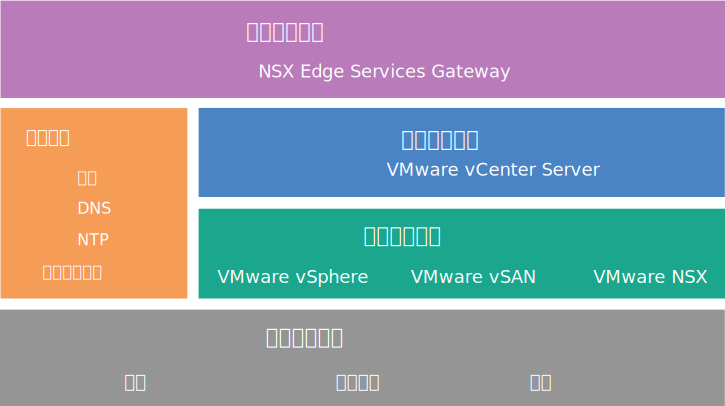

---

copyright:

  years:  2016, 2018

lastupdated: "2018-11-13"

---

{:tip: .tip}
{:note: .note}
{:important: .important}

# NSX Edge Services Gateway 設計

NSX Edge Services Gateway on {{site.data.keyword.cloud}} 解決方案提供的 VMware 技術會部署在全球各地的 {{site.data.keyword.CloudDataCents_notm}} 內。{{site.data.keyword.vmwaresolutions_short}} 提供兩個與 NSX Edge Services Gateway 相關的解決方案架構。

## 內部架構設計

內部架構指定將必要 NSX Edge 元件部署至 VMware Cloud Foundation 聚合叢集或 VMware vCenter Server 叢集的資源儲存區中。

在下圖中，VMware vSAN 是選用項目。
{:note}

圖 1. {{site.data.keyword.cloud_notm}} 上的雲端網路服務

## 專用架構設計

專用架構會將必要 NSX Edge 元件部署至專用於 NSX Edge 的個別兩節點 vSphere 叢集，並提供與實體網路基礎架構的重要互動。專用架構具有下列特徵及功能：

* 提供與實體網路的尖峰及離峰連線功能。例如，NSX Edge 虛擬應用裝置上的「南北向 L3」遞送。
* 容許與透過 NSX L2 橋接連接至實體網路中 VLAN 的實體裝置通訊，以及管理進行「分散式邏輯路由器 (DLR)」遞送的控制虛擬機器 (VM)。
* 可以具有集中式邏輯或實體服務。例如，防火牆、負載平衡器、「虛擬專用網路 (VPN)」監視元件、日誌洞察 VM。
* 使用專用 vCenter 來管理運算及邊緣資源時，可以在 Edge 叢集裡管理 NSX Controller。
* Edge 叢集資源具有反親緣性需求來保護作用中待命配置，或在失敗期間維護頻寬可用性。

## IBM Cloud 專用 IP 位址範圍及自帶 IP 位址範圍

RFC1918 專用 IP 位址範圍特別保留使用網路範圍以供組織內部使用，永不在網際網路上使用。{{site.data.keyword.cloud_notm}} 實體網路基礎架構在所有全球位置上使用特定 RFC1918 專用位址空間 10.x.x.x/8。這些 IP 位址範圍不會跨客戶帳戶或在 {{site.data.keyword.cloud_notm}} 客戶帳戶內重疊。在客戶帳戶內，任何 {{site.data.keyword.cloud_notm}} 配置的專用 IP 位址空間都可以在啟用 VLAN Spanning 的情況下遞送至任何 {{site.data.keyword.CloudDataCents_notm}} 中的任何其他 {{site.data.keyword.cloud_notm}} 專用 IP 位址範圍。

雖然這可以在您的帳戶內輕鬆地設定全球連接的基礎架構，但是如果使用相同專用位址空間作為 {{site.data.keyword.cloud_notm}}，則當您要透過遞送將資料中心擴充至 {{site.data.keyword.cloud_notm}} 時，固定 IP 位址空間可能會有問題。解決方案是使用 NSX 在 Cloud Foundation 或 vCenter Server 基礎架構上建立層疊拓蹼，讓您的「自帶 IP (BYOIP)」位址空間無法與 {{site.data.keyword.cloud_notm}} 指派的專用 IP 位址空間互動。NSX 可以提供 L2 VPN，以跨越跨外部（可能重疊）IP 位址空間之通道內的內部 BYOIP 位址空間。

### 相關鏈結

* [解決方案概觀](../solution/solution_overview.html)
