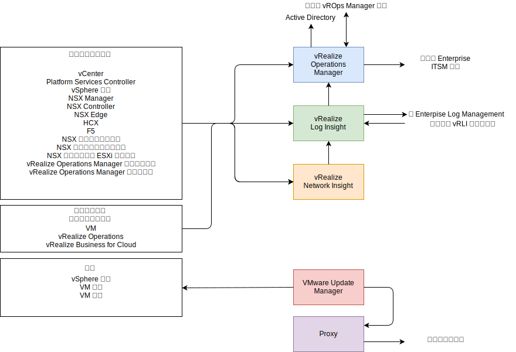

---

copyright:

  years:  2016, 2019

lastupdated: "2019-06-03"

---

# 作業管理架構概觀
{: #opsmgmt-arch}
作業管理層中的產品架構，藉由來自 {{site.data.keyword.vmwaresolutions_full}} 的記載資料而提供集中化的監視。作業管理層會即時監視實體基礎架構、虛擬基礎架構，及選用性地監視用戶端的運算工作負載。

會收集下列高階資訊：
* 拓蹼資料，例如實體和虛擬運算、網路連線及儲存空間物件。
* 監視資料，例如：
  * 度量值 - 結構化資料，例如效能和容量
  * 日誌 - 非結構化資料，例如系統事件

## 作業管理流程
{: #opsmgmt-arch-flows}

下圖顯示了作業管理工具的關鍵互動和整合。

{{site.data.keyword.vmwaresolutions_short}} 作業管理包含下列步驟：
* 監視 - vRealize Operations Manager (vROps) 會使用分析演算法來追蹤和分析 {{site.data.keyword.vmwaresolutions_short}} 架構中多個物件的作業。這些演算法協助 vROps 學習及預測這些物件的行為。系統管理者可以使用視圖、報告和儀表板來存取此資訊。

  環境中有問題時，vROps 會產生三種影響類型的警示：
    * 性能警示 - 指出影響環境性能且需要立即注意的問題。
    * 風險警示 - 指出不會有立即威脅，但需要在不久的將來處理的問題。
    * 效率警示 – 改善效能或收回資源的資訊。

  vROps 警示是指資料分析指出與正常度量值的偏差時，或其中一個受監視元件發生問題時，在受監視物件上發生的事件。vROps 警示會被指派下列其中一個種類：
    * 嚴重 - 必須立即採取行動。
    * 立即 - 必須盡快採取行動。
    * 警告 - 必須在時間容許時進行檢查。

* 記載 - vRealize Log Insight (vRLI) 提供即時日誌管理和日誌分析，具有以機器學習為基礎的智慧型分組、高效能搜尋，以及在 {{site.data.keyword.vmwaresolutions_short}} 架構中跨實體和虛擬物件進行疑難排解。vRLI 會使用 `syslog` 通訊協定從 vSphere 主機收集資料。它也會收集其他 VMware 產品（例如 vCenter Server）的事件、作業和警示資料。它會與 vROps 整合，以便傳送通知事件和啟用在環境定義中啟動。{{site.data.keyword.vmwaresolutions_short}} 架構中能夠傳送 `syslog` 資料的其他物件會指向 vRLI。（選用）用戶端可以配置能夠傳送 syslog 資料的任何系統，以將這些資料轉遞到 vRLI。

* 網路性能 - vRealize Network Insight 是著重於主動啟用下列各項的分析工具：
  * 網路性能及效能監視。
  * 端對端疑難排解。
  * 全方位可見性和分析。
  * 以微斷詞法為基礎的法規遵循管理。

* 修補及升級 - vSphere Update Manager (VUM) 為 VMware vSphere 主機及虛擬機器 (VM)（非 OS 及應用程式）提供集中式的自動化修補程式及版本管理。

## 作業管理網路
{: #opsmgmt-arch-network}

下圖顯示了網路概觀。

* 佈建了工具專用可攜式子網路，以提供用於初始佈建工具 VM 的 {{site.data.keyword.cloud_notm}} IP 位址空間。佈建之後，客戶必須負責管理 IP 位址空間，以便橫向擴充工具。這個子網路上的 VM 需要能存取「管理」和「內部管理」子網路上所管理的元件。
* 工具 VXLAN 子網路用來提供用於工具 VM 起始佈建的 BYOIP IP 位址空間，但之後客戶必須負責管理 IP 位址空間，以便橫向擴充工具。這個子網路上的 VM 需要能存取「層疊」子網路上所管理的元件。ESG 會在 {{site.data.keyword.cloud_notm}}與 BYOIP 位址空間之間提供 NAT。
* 如果客戶想要利用 vROps 來監視運算 VM，則他們會部署 vROps Remote Collector。
* vRLI Forwarder 會將層疊元件的日誌訊息轉遞到 vRLI 叢集。必要的話，客戶也可以將其運算 VM 配置為使用這些轉遞程式。
* VMware Update Manager (VUM) 提供 vSphere 主機及 VM 硬體和工具的更新。VUM 使用 Proxy 來取得網際網路儲存庫的存取權。

vROps 會從環境中的物件收集資料。收集的每條資料都稱為度量觀察或值。vROps 使用 vCenter 配接器來從 vCenter 收集原始度量值。除了它收集的度量值之外，vROps 還會計算容量度量值、徽章度量值，以及度量值，以監視系統的性能。警示定義是症狀及建議的組合，用來識別問題區域並產生那些區域的警示，供您採取行動。

## 受監視元件
{: #opsmgmt-arch-components}

### 監視 vCenter
{: #opsmgmt-arch-components-vcenter}

使用 vROps 及 VMware SDDC Health Management Pack 來達成 vCenter 的監視作業。vRLI 會從 vCenter 收集日誌資料，而 Content Pack for vSphere 會在日誌中新增特定的瞭解，然後將警示傳送至 vROps。

VMware SDDC Health Management Pack 會監視 SDDC 管理堆疊，並針對 SDDC 產品元件（包括 vCenter）之配置和法規遵循，提供性能徽章和相關警示。

### 監視 vSphere 主機
{: #opsmgmt-arch-components-hosts}

使用 vROps 並透過 vCenter，以及透過 vRLI 收集日誌，即可完成 vSphere 主機的監視。

### 監視 vSAN
{: #opsmgmt-arch-components-vsan}

為了監視 vSAN，會使用 vROps 及 vRLI。在 vCenter 中，可以使用一組額外的 vSAN 性能檢查。安裝 Management Pack for vSAN 可提供更多儀表板來協助監視 vSAN。

如果在 VMware vSAN 配接器所監視的儲存區域網路中，SDDC 產品元件發生問題，則 vROps 會產生警示。與配置規範及性能相關的警示，會透過來自 VMware vSAN Management Pack 的 VMware SDDC 性能解決方案管理套件傳遞。vSAN 是使用 vSAN 配接器，透過 vCenter 應用裝置的 vROps vSAN Management Pack 來監視。預設的收集間隔是五分鐘，而 vSAN 配接器也會從 vSphere 物件收集「性能檢查服務」及「效能服務」度量值。「性能檢查服務」間隔在 vSphere 介面中配置，且依預設為 60 分鐘。

為了確保 vSAN 配接器能收集所有效能資料，必須在 vSphere 中啟用 vSAN 效能服務。

### 監視 NSX for vSphere
{: #opsmgmt-arch-components-nsxv}

為了監視 NSX，已實作下列工具：
* vRealize Operations Manager (vROps)
* vRealize Log Insight (vRLI)
* vRealize Network Insight (vRNI)

這使系統管理者能夠對 VMware NSX 進行監視、管理和疑難排解。vROps Management Pack for VMware NSX 提供網路拓蹼的可見性。NSX 儀表板提供 NSX 環境及其元件性能的快速概觀。NSX 物件與 vSphere 物件之間的相關性可讓您輕鬆進行疑難排解。

vROps 使用管理套件來輪詢 VMware NSX 以取得配置、效能及支援資料。Management Pack 代表 vROps 將輪詢要求轉換為 REST API 呼叫，以從 NSX Manager 中擷取所需的資料。

需要配置 NSX 元件，才能將 syslog 傳送至 vRLI。

* NSX Manager - [指定 Syslog 伺服器](https://pubs.vmware.com/NSX-6/topic/com.vmware.nsx.admin.doc/GUID-EA70974C-07F8-469D-8A9D-0ED54F0C8F34.html#GUID-EA70974C-07F8-469D-8A9D-0ED54F0C8F34){:new_window}。.
* NSX Controller - [配置 NSX Controller](https://kb.vmware.com/s/article/2092228){:new_window}。
* NSX Edge - [配置遠端 Syslog 伺服器](https://pubs.vmware.com/NSX-6/topic/com.vmware.nsx.admin.doc/GUID-9C25E097-E2CC-461A-9DA6-E8118D16EE62.html#GUID-9C25E097-E2CC-461A-9DA6-E8118D16EE62){:new_window}。
* 防火牆 - 您必須針對已啟用防火牆的每個叢集，配置遠端 syslog 伺服器。遠端 syslog 伺服器是在 `Syslog.global.logHost` 屬性中指定。

NSX Flow Monitoring 可用於 NSX Manager，判斷哪些流程已核准，哪些流程遭到阻擋。如果必要，則可以為 vSphere Distributed Switch 配置埠鏡映。

### 監視 NSX-T
{: #opsmgmt-arch-components-nsxt}

為了監視 NSX-T，已實作下列工具：

* vRealize Operations Manager (vROps)
* vRealize Log Insight (vRLI)

VMware SDDC Health Management Pack 監視下列元件：
* 邏輯交換器 - 監視邏輯交換器的管理狀態。
* 控制器叢集 - 針對 HA 監視已部署的叢集節點計數，並維護仲裁。
* 控制器節點 - 監視控制器叢集和管理程式節點的節點連線功能。
* 邊緣節點 - 監視邊緣節點執行狀態，以及其與控制器叢集和管理程式節點的連線功能。
* NSX-T 管理服務。
* T0 路由器服務 - 監視靜態路徑、NAT、BGP、BFD 及路徑重新配送服務。
* T1 路由器服務 - 監視靜態路徑、NAT，以及路徑通告服務。

### 監視 vRealize Operations Manager
{: #opsmgmt-arch-components-vrops}

VMware SDDC Health Management Pack 具有下列事件的警示定義：
* 對於給定負載，vRealize Operations Manager 節點的現行大小調整不足。
* 叢集節點配置未遵循 vRealize Operations Manager 大小調整準則。
* 對於給定負載，遠端收集器的現行大小調整不足。
* 遠端收集器配置未遵循 vRealize Operations Manager 大小調整準則。
* vRealize Operations Cluster 已超出建議的分析節點數目。

### 監視 vRealize Log Insight
{: #opsmgmt-arch-components-vrli}

vRLI 支援的警示會觸發關於其性能的通知，並在發生重要的系統事件時產生通知，例如，當磁碟空間幾乎耗盡，且 vRealize Log Insight 必須開始刪除或保存舊的日誌檔時。

## 系統需求
{: #opsmgmt-arch-requirements}

設計會使用下列應用裝置數量和大小：

表 1. 作業工具摘要系統需求

||vROps|vRLI|vRNI| Proxy      |
|---|---|---|---|---|---|
|VM 數量|4 |4 |1+1|1 |
| vCPU |8|8|4 + 8|4 |
|RAM GB| 32 |16 |12 + 32| 0.5 |
|磁碟 GB| 254 |1042|158 + 1000|80|

## 軟體版本
{: #opsmgmt-arch-versions}

表 2. 作業工具軟體版本

|產品名稱|版本|
|---|---|
|VMware vRealize Operations Manager Advanced 或更高版本|7.0|
|vRealize Operations Management Pack for NSX for vSphere|3.5.2|
|vRealize Operations Management Pack for Storage Devices|7.0.0|
|vRealize Operations Management Pack for Site Recovery Manager|8.1.1|
|VMware vRealize Log Insight|4.7|
|vRealize Log Insight Content Pack for NSX for vSphere|3.8|

## 相關鏈結
{: #opsmgmt-arch-components-related}

* [vCenter Server on {{site.data.keyword.cloud_notm}} with Hybridity Bundle 概觀](/docs/services/vmwaresolutions/archiref/vcs?topic=vmware-solutions-vcs-hybridity-intro)
