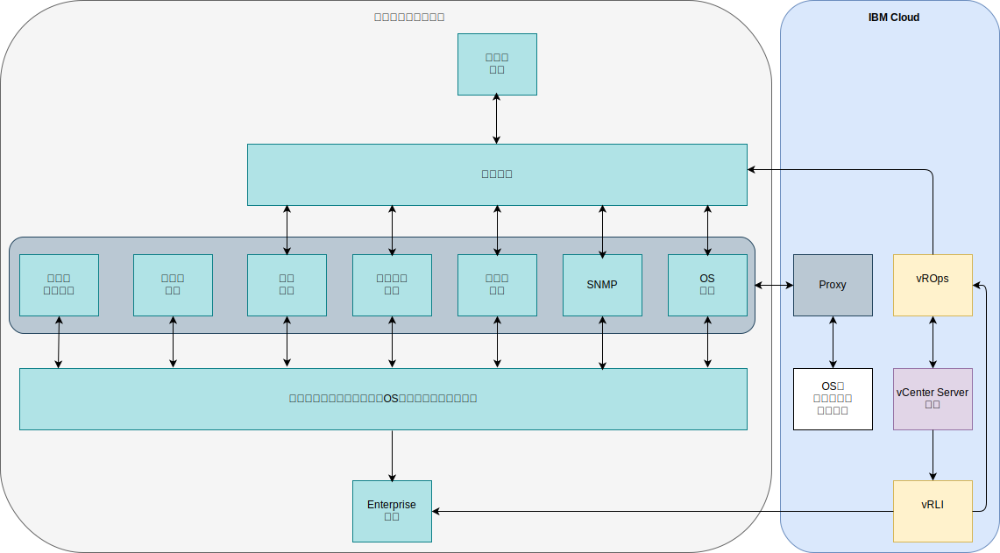

---

copyright:

  years:  2016, 2019

lastupdated: "2019-08-05"

---

# 整合
{: #opsmgmt-integration}

本主題著重於設計的「操作管理」層。但是，某些企業可能希望將此層與其服務管理整合。本節提供此整合的指引。在此設計中，vROps 是所有警示顯示的中心點。

可進行的整合種類如下：
* 北向 – 從 vROps 整合到其他工具：
  * 對 SMTP 伺服器或 Slack 或 PagerDuty 之類工具的警示通知。
  * 將問題單整合至服務中心工具，如 ServiceNow。
  * 起始 vRealize Orchestrator 工作流程，以補救由 vROps 發現的問題。
* 南向 – 從服務管理或雲端管理工具整合：
  * vRealize Automation 會在新增工作負載時配置監視。
  * 使用外部來源的事件強化來更新 vROps 物件。

vROps 提供下列出埠警示外掛程式：
* 自動化動作 – 依預設已啟用。
* 標準電子郵件 - 使用「簡易郵件傳送通訊協定 (SMTP)」將 vRealize Operations Manager 警示通知傳送給感興趣的人。
* SNMP 設陷– 在 SNMP 設陷伺服器上記載警示。
* REST 通知 - 傳送 vROps 警示給另一個啟用 REST 功能的應用程式（您已在該處建置 REST Web 服務以接受這些訊息）。
* 日誌檔 – 讓 vROps 能記載警示到每個 vRealize Operations Manager 節點上的檔案。如果您已將 vRealize Operations Manager 安裝為多節點叢集，則每個節點都會處理及記載它監視之物件的警示。每個節點都會記載它處理之物件的警示。
* Smarts SAM 通知 - 通知警示通知給 EMC Smarts Server Assurance Manager。
* 網路共用 - 傳送報告給共用位置，支援 SMB 2.0 版。

通知是在朝向北傳送至外部系統之前，符合通知規則中之過濾器準則的警示通知。通知規則已針對必要的出埠警示進行配置，以便可以在將它們傳送至選取的外部系統之前先加以過濾。通知清單會用來管理這些規則。

## 整合使用案例
{: #opsmgmt-integration-usecase}

這個使用案例範例是以企業使用的現有通用服務管理層為基礎。客戶使用「作業管理」選項佈建 vCenter Server 實例，並且他們想要將此平台整合至其服務管理平台。他們使用事件聚集系統來整合從網域特有監視工具產生的警示：

* 用來在其 UNIX、Linux 及 Windows 工作負載之間監視 OS、中介軟體及應用程式的工具集，但此工具不會監視基礎架構元件（如 VMware、網路裝置或儲存空間）。
* SNMP 管理程式，用來從網路基礎架構接收 SNMP 設陷。此工具也會收集 SNMP 度量值，以啟用效能及容量警示。
* 備份管理工具，用來管理備份。
* 儲存空間管理工具，用來管理其儲存空間陣列。
* 可用性工具，使用 ping 來測試裝置可聯繫性。

他們的服務管理層也包含：

* 伺服器容量與效能工具，用來收集度量值以提供報告。
* 修補及法規遵循伺服器，用來在這些平台上更新 OS、中介軟體及應用程式，並且測量法規遵循。
* 問題單工具，用於管理突發事件、問題和變更的問題單。此工具也是企業的「配置管理資料庫 (CMDB)」。工具能夠傳送電子郵件給作業團隊，也能傳送 SMS 訊息。
* 企業記載系統，它會從所有系統擷取日誌，並且由安全團隊管理。

既然他們擁有 vROps，他們便將藉由使用「SNMP 設陷」外掛程式的北向通知，來整合此工具。為了整合 vROps，需要剖析 vROps 傳送的設陷，使客戶的事件管理環境能夠建立警示並擴充警示。管理工具團隊已從 VMware 下載 VMware MIB，並已將其安裝在事件管理環境中。

根據客戶的原則，vRLI 已配置為將所有事件轉遞給企業記載系統。

客戶希望使用其現有作業系統、中介軟體和應用程式監視工具，因此他們在 {{site.data.keyword.cloud}} 中使用了 Proxy 來收集和轉遞度量和警示。

{: caption="圖 1. vROps 整合服務管理" caption-side="bottom"}

## 相關鏈結
{: #opsmgmt-integration-related}

* [vRealize Operations RESTful API](https://docs.vmware.com/en/vRealize-Operations-Manager/7.0/vrealize-operations-manager-70-api-guide.pdf){:new_window}
* [VMware Code API Explorer](https://code.vmware.com/apis?socv=1&numPerPage=164&sorter=pv){:new_window}
* [Postman Client Collection Tool for vRealize Operations](https://code.vmware.com/samples/4663/postman-client-collection-for-vrealize-operations-rest-apis){:new_window}
* [VMware PowerCLI 部落格](https://blogs.vmware.com/PowerCLI/2016/05/getting-started-with-powercli-for-vrealize-operations-vr-ops.html){:new_window}
* [Webhook Shims](https://blogs.vmware.com/management/2017/01/vrealize-webhooks-infinite-integrations.html){:new_window}
