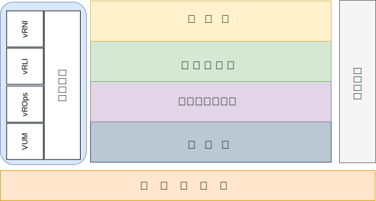

---

copyright:

  years:  2016, 2019

lastupdated: "2019-05-29"

---

# 簡介
{: #opsmgmt-intro}

此參考架構是為了引導及限制 {{site.data.keyword.vmwaresolutions_full}} 架構的實例化。

它也：
* 為各種利害關係人提供共同的語言。
* 提供技術實作的一致性，以解決問題。
* 支援針對經證明的參考架構來驗證解決方案。
* 鼓勵遵守共同的標準、規格和模式。

此參考架構的主要目標是記錄作業管理功能，以監視為用戶端部署的 {{site.data.keyword.vmwaresolutions_short}} 環境並發出警示。工具已配置最佳作法參數及臨界值，以供客戶的作業團隊使用。

設計可讓客戶完成下列作業：
* 視需要擴增或縮減。
* 依照其作業原則的規定，安裝自己的企業監視工具。
* 將工具整合至自己的企業 IT 服務管理 (ITSM) 平台。

## 作業管理
{: #opsmgmt-intro-opsmgmt}

{{site.data.keyword.vmwaresolutions_short}} 以下列架構層為基礎：

{: caption="圖 1. 架構層" caption-side="bottom"}

* 實體層 - 架構的最低層是實體層，它包含了從 {{site.data.keyword.cloud_notm}} 利用的運算、網路和儲存空間元件：
  * {{site.data.keyword.baremetal_short}}，執行管理、邊緣和運算工作負載。
  * {{site.data.keyword.cloud_notm}} 網路，包含 VLAN、子網路、前端及後端客戶路由器 (FCR/BCR)。
  * vSAN 儲存空間，這是 {{site.data.keyword.baremetal_short}} 或耐久性儲存空間內 SSD 中的合併資料儲存庫。

* 虛擬基礎架構層 - 虛擬基礎架構層在實體層元件之上執行。虛擬基礎架構層控制對於基礎實體基礎架構的存取權，並且控制和配置資源給管理和運算工作負載。管理工作負載包含虛擬基礎架構層本身的元素，以及雲端管理、服務管理、營運持續及安全等層的元素。

* 營運持續層 - 這層包含可提供資料備份、還原及災難回復的元素，以支援營運持續。如需相關資訊，請參閱 {{site.data.keyword.vmwaresolutions_short}} 備份及還原架構、Veeam、IBM Spectrum Protect Plus 及 Zerto 災難回復參考架構。

* 安全層 - 這層包含可降低風險及提高法規遵循的元素。如需相關資訊，請參閱 Fortinet、F5、NSX、HyTrust 及 Caveonix 參考架構。

本文件為 {{site.data.keyword.vmwaresolutions_short}} 架構新增了下列層：

* 作業管理 - 作業管理的架構包含管理元件，用於即時提供對實體層和虛擬層以及（選用）運算工作負載的支援。作業管理層瞭解 {{site.data.keyword.vmwaresolutions_short}} 拓蹼：實體、虛擬、運算、網路及儲存空間資源。作業管理主要包含監視及記載功能。

  會以下列形式收集資訊：
    * 度量值 - 結構化資料，例如效能和容量
    * 日誌 - 非結構化資料，例如系統事件

「作業管理層」包含下列工具：

* vRealize Operations Manager (vROps) - vROps 使用從系統資源（物件）收集的資料，來識別受監視系統元件中的問題，並且針對許多問題，建議要採取的更正動作來修正問題。對於更具挑戰性的問題，vROps 提供豐富的分析工具，可以揭露隱藏的問題、調查複雜的技術問題、識別趨勢，或往下探查，以測量單一物件的性能。
* vRealize Log Insight (vRLI) - vRLI 為任何環境中的基礎架構和應用程式提供智慧型日誌管理。這種高度可調式的日誌管理解決方案可在實體、虛擬和雲端環境之間，提供直覺式、可採取動作的儀表板、更準確的分析，以及廣泛的協力廠商延伸。
* vRealize Network Insight (vRNI) - vRNI 為軟體定義網路和安全提供智慧型作業。它會啟用跨虛擬和實體網路的可見性、提供作業視圖來管理及調整 NSX 部署，以及加速微區隔的規劃和部署。
* VMware Update Manager (VUM) - VUM 能為 VMware vSphere 啟用集中化的自動修補程式與版本管理，並提供 vSphere 主機的升級和修補、主機上協力廠商軟體的安裝與更新，以及 VM 硬體、VMware 工具及虛擬應用裝置的升級。

對於完整的企業架構，下列層可能是必要的，但位於 {{site.data.keyword.vmwaresolutions_short}} 架構外部：

* 雲端管理層 - 雲端管理層是雲端架構的最上層。這層會從使用者介面或應用程式設計介面 (API) 要求資源並編排較低的層。vRealize Automation 能在 {{site.data.keyword.cloud_notm}} 上啟用雲端自動化。如需相關資訊，請參閱 [vRealize Automation (vRA) 參考架構](https://www.ibm.com/cloud/garage/files/IBM_Cloud_for_VMware_Solutions_VRA_Architecture_v1.pdf){:new_window}。

如需如何使用 Chef 整合來延伸此架構的相關資訊，請參閱 [vRA 與 Chef 整合參考架構](https://www.ibm.com/cloud/garage/files/IBM_Cloud_for_VMware_Solutions_VRA_Chef_Integration_Architecture.pdf){:new_window}。

* 服務管理層 - 這層聚焦於 IT 環境的完整生命週期，通常是在企業層級實作，並結合 IT 作業與技術所有專業分工的輸入。這層傳統上是建構在 IT 服務管理 (ITSM) 架構上，例如 IT 基礎架構程式庫 (ITIL) 和 ISO/IEC 20000，進行架構，這些架構是透過 IT 服務生命週期的處理程序和階段而提供 IT 服務最佳作法的架構。在產品層次中，ITSM 是以中央工作流程管理系統為典型，用來處理與配置管理資料庫相連的突發事件、服務要求、問題、變更及知識。

## 相關鏈結
{: #opsmgmt-intro-related}

* [vCenter Server on {{site.data.keyword.cloud_notm}} with Hybridity Bundle 概觀](/docs/services/vmwaresolutions/archiref/vcs?topic=vmware-solutions-vcs-hybridity-intro)
