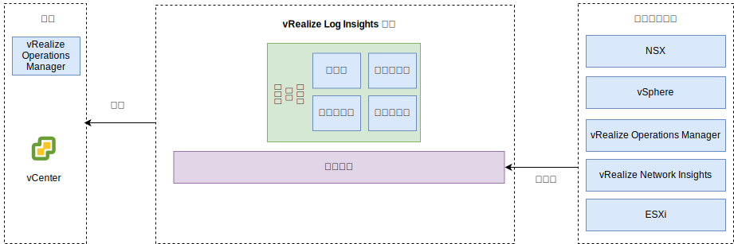

---

copyright:

  years:  2016, 2019

lastupdated: "2019-05-17"

---

# vRealize Log Insights
{: #opsmgmt-vrli}

vRealize Log Insight (vRLI) 環境包含四台虛擬機器 (VM) 以及整合負載平衡器。

此模式支援：
* 30,000 台 VM
* 每天 75 Gbs 的日誌汲取
* 每秒 5,000 個事件

vRealize Log Insight (vRLI) 能夠在 {{site.data.keyword.vmwaresolutions_full}} 環境中即時記載元件。設計會部署一個 vRLI 叢集，它包含每個實例中四個節點。此配置提供了持續可用性，並且提高日誌汲取率。

{: caption="圖 1. Log Insights 網路" caption-side="bottom"}

在此設計中，每個位置都會在「管理叢集」上部署獨立的 vRLI 叢集。vRLI 叢集是使用 {{site.data.keyword.cloud_notm}} 可攜式 IP 位址部署在工具子網路上。這有助於和所有定址於 {{site.data.keyword.cloud_notm}} RFC1918 位址空間之外的元件進行通訊。元件包括：vSphere 主機、vCenter、Platform Services Controller、NSX Manager 及 NSX Controller。vRLI 叢集包含一個「主節點」，以及至少兩個「工作者節點」和一個「整合負載平衡器」。

* 主節點 - 叢集裡的必要起始節點。主節點負責查詢及日誌汲取。主節點 Web 使用者介面是 vRealize Log Insight 叢集的單一玻璃窗格。對於資料的所有查詢都會根據配對器而導向，配對器則將工作負載分散給工作者節點。
* 工作者節點 - 必須有至少三個節點才能構成叢集，讓叢集可以新增更多工作者節點來進行橫向擴充。工作者節點會汲取日誌並將日誌儲存在本端。
* 整合負載平衡器 - 這使用專屬的負載平衡配置來提供高可用性（不需要任何外部負載平衡器）。
* Log Insight Forwarder - 此部署是為了接收來自 NSX 層疊元件的日誌。此外，如果客戶想要從運算 VM 傳送日誌，可以利用它。Log Insight Forwarder 是單一 vRealize Log Insight 主節點，用來作為遠端 syslog 聚集器，以便將警示轉遞給 vRLI 叢集。由於 VXLAN 支援的位址在 BYOIP 位址空間之外，因此必須在 NSX ESG 上實作 NAT 規則。可以使用下列大小，且已選取適當者：

 * 小 - 每秒 2000 個事件
 * 中 - 每秒 5000 個事件
 * 大 - 每秒 15000 個事件

{: caption="圖 2. Log Insights 元件" caption-side="bottom"}

vRLI 會收集日誌，以便從集中位置提供環境的相關監視資訊。

vRLI 會從下列虛擬基礎架構及雲端管理元件（記載用戶端）收集日誌事件：
* vCenter
* ESXi 主機
* NSX Manager
* NSX Controller
* NSX Edge 服務閘道
* NSX 分散式邏輯路由器實例
* NSX 通用分散式邏輯路由器
* NSX 分散式防火牆 ESXi 核心模組
* vRealize Operations Manager 分析叢集節點及遠端收集器
* 由於事件轉遞而在其他實例中的 vRLI 實例

支援下列記載用戶端，但未整合在此設計中：
* vRealize Automation Appliance
* vRealize Orchestrator（內嵌在 vRealize Automation Appliance 中）
* vRealize IaaS Web Server
* vRealize IaaS Management Server
* vRealize IaaS DEM
* vRealize IaaS Proxy Agent
* vRealize Business 伺服器
* vRealize Business 資料收集器

## 系統需求
{: #opsmgmt-vrli-requirements}

為了容納來自環境中日誌來源的所有日誌資料，vRLI 節點需要正確地調整大小。此設計是以中型應用裝置為基礎：

表 1. Log Insight 主節點及抄本節點系統設定

| 屬性            | 規格                           |
| ------------------------ | --------------------------------- |
| vCPU | 8                                 |
|記憶體    | 18 GB                             |
|磁碟（完整佈建）| 530 GB（490 GB 供事件儲存空間之用）|

每台 vRLI 虛擬應用裝置都有三個預設虛擬磁碟，且可以使用更多虛擬磁碟來進行儲存。
* 硬碟 1 - 20 GB 用於 root 檔案系統
* 硬碟 2 - 510 GB 用於中型部署且包含兩個分割區：
  * /storage/var - 用於系統日誌
  * /storage/core storage - 用於收集到的日誌（大約 475 GB 磁碟空間可用）

## 網路
{: #opsmgmt-vrli-network}

部署 vRLI 應用裝置需要來自工具專用可攜式子網路的三個 IP 位址。vRLI 需要存取：
* vCenter 應用裝置
* vRealize Log Insight 應用裝置
* NSX-V/T 應用裝置
* 工具擴充 VXLAN
* 客戶網路
* NTP 伺服器 (time.services.softlayer.com)
* {{site.data.keyword.vmwaresolutions_short}} Active Directory/DNS
* 「遠端收集器」需要 NSX ESG 上的 NAT 規則啟用與「主節點」、「主節點抄本」及「資料節點」的連線

## 埠 
{: #opsmgmt-vrli-ports}

表 2. Log Insight 埠

|說明       | 埠 | 通訊協定 |
| ------------------------------------------------------------- | ---------- | -------- |
|配置為 Forwarder 目的地的出埠 syslog 資料流量| 514        | TCP、UDP |
|透過 SSL 的 syslog 資料| 1514、6514 | TCP |
| Log Insight 汲取 API                                     |9000| TCP |
|透過 SSL 的 Log Insight 汲取 API| 9543       | TCP |
|對應用裝置的 SSH 存取| 22 | TCP |
|使用者介面|80、443| TCP |
|NTP| 123 | UDP |
| SMTP                                                          |25 GB | TCP |
|DNS| 53 | UDP |
| LDAP/LDAPS                                                    | 389、636   | TCP |
| LDAP GC                                                       | 3268/3269  | TCP |
|vCenter| 443 | TCP |
| vRealize Operations Manager 應用裝置| 443 | TCP |

## 鑑別
{: #opsmgmt-vrli-auth}

vRLI 的使用者管理需要與 Active Directory 整合的 VMware Identity Manager (vIDM)。服務帳戶用於應用程式對應用程式的通訊（從 vRealize Operations Manager 到下列配接器），以及度量值收集及拓蹼對映所需的最少許可權集。
* NSX Manager
* vCenter
* vSAN

## vRealize Log Insight 中的內容套件
{: #opsmgmt-vrli-content}

內容套件提供對於虛擬基礎架構的額外精細監視，並且讓日誌能被取得、擷取，然後剖析成為人類可閱讀的格式。如此一來，vRLI 會儲存日誌查詢及警示，而您可以使用儀表板進行有效率的監視。

依預設會安裝下列項目：
* 一般
* VMware vSphere
* VMware vSAN
* VMware vROps

此設計也會安裝：
* VMware NSX for vSphere
* vRealize Network Insight

其他內容套件可以從 [vRealize Log Insight Content Pack](https://marketplace.vmware.com/vsx/?contentType=2&listingStyle=table){:new_window} 取得。

## 相關鏈結
{: #opsmgmt-vrli-related}

* [vCenter Server on {{site.data.keyword.cloud_notm}} with Hybridity Bundle 概觀](/docs/services/vmwaresolutions/archiref/vcs?topic=vmware-solutions-vcs-hybridity-intro)
* [Sizing the vRealize Log Insight Virtual Appliance](https://docs.vmware.com/en/vRealize-Log-Insight/4.6/com.vmware.log-insight.getting-started.doc/GUID-284FC5F4-B832-47A7-912E-D407A760CAE4.html){:new_window}
* [vRealize Log Insight](https://docs.vmware.com/en/vRealize-Log-Insight/index.html){:new_window}
