---

copyright:

  years:  2016, 2019

lastupdated: "2019-08-05"

---

# vRealize Network Insight
{: #opsmgmt-vrni}

vReize Network Insight (vRNI) 環境由兩個虛擬機器 (VM)、一個平台 (使用者介面) 和一個控制器節點組成。

{: caption="圖 1. Network Insights 網路" caption-side="bottom"}

vRNI 平台應用裝置提供了分析、使用者介面和資料管理，並連接至用於從各種資料來源（例如，NSX Edge、vCenter）收集資料的控制器應用裝置。所有 vRNI 元件都利用 {{site.data.keyword.cloud}} 專用可攜式 IP 位址。vRLI 已配置為 vRNI 的 syslog 伺服器。

{: caption="圖 2. Network Insights 元件" caption-side="bottom"}

## 系統需求
{: #opsmgmt-vrni-requirements}

此架構支援 3000 個使用中等機箱大小的 VM。

表 1. Network Insight Platform 系統需求

| 屬性            | 規格                           |
|---|---|
| vCPU | 8                                   |
|記憶體|32 GB|
|磁碟（精簡佈建）|1 TB |

表 2. Network Insight Collector 系統需求

| 屬性            | 規格                           |
|---|---|
| vCPU |4 |
|記憶體| 12 GB |
|磁碟（精簡佈建）|200 GB|

## 網路
{: #opsmgmt-vrni-network}

部署 vRNI 應用裝置需要來自工具專用可攜式子網路的兩個 IP 位址。網路連線功能 vRNI 需要存取：
* vCenter 應用裝置
* vRealize Log Insight 應用裝置
* NSX-V/T 應用裝置
* 工具擴充 VXLAN
* 客戶網路
* NTP 伺服器 (`time.services.softlayer.com`)
* {{site.data.keyword.vmwaresolutions_short}} Active Directory/DNS

## 埠 
{: #opsmgmt-vrni-ports}

表 3. Network Insight 埠

|說明       | 埠 | 通訊協定 |
|---|---|---|
|vRealize Network Insight VM 之間的通訊 | 443 | HTTPS |
|需要網際網路存取的服務 svc.ni.vmware.com support2.ni.vmware.com reg.ni.vmware.com| 443 |HTTPS | Log Insight 汲取 API                                     |9000| TCP |
|透過 SSL 的 Log Insight 汲取 API| 9543       | TCP |
|使用者介面| 80、443 | TCP |
|NTP| 123 | UDP |
| SMTP                                                          |25 GB | TCP |
|DNS| 53 | UDP |
| LDAP/LDAPS                                                    | 389、636   | TCP |
|ESXi|2055| TCP |
| VMware vSphere / NSX | 443 | TCP |

## 鑑別
{: #opsmgmt-vrni-auth}

vRNI 使用者鑑別直接向 Active Directory 伺服器進行。

## 相關鏈結
{: #opsmgmt-vrni-links}

* [vRealize Network Insights](https://docs.vmware.com/en/VMware-vRealize-Network-Insight/index.html){:new_window}
