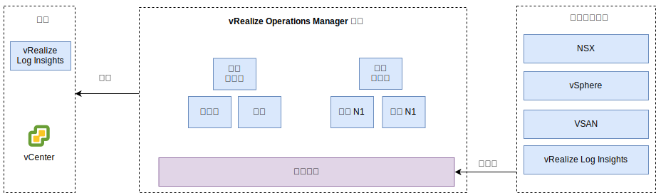

---

copyright:

  years:  2016, 2019

lastupdated: "2019-05-17"

---

# vRealize Operations Manager 設計
{: #opsmgmt-vrops}

vROps 分析叢集包含的節點，會分析及儲存來自受監視元件的資料，且在此部署中，會部署四個節點和兩個 NSX 負載平衡器。此大小容許監視最多 30,000 台 VM，以及收集最多 9,000,000 個度量值。

4 個節點的分析叢集由下列各項組成：
* 主節點 - 主節點是 vROps 叢集裡的起始節點。在大型環境中，此節點會管理所有其他節點。
* 主節點抄本 - 此節點會啟用主節點的高可用性。
* 資料節點 - 資料節點在較大環境中能啟用 vROps 的橫向擴充，在此設計中會部署兩個資料節點。

此外，設計還使用充當 Proxy/中繼伺服器的「遠端收集器節點」，以便只收集資料，並將收集的資料轉遞至主節點/資料節點。可以新增資料節點和遠端收集器，以根據環境大小進行擴增。vROps 元件放置在 VLAN/VXLAN 上的位置如下圖所示。

{: caption="圖 1. Operations Manager 網路" caption-side="bottom"}

* 主節點、主節點抄本及資料節點是使用 {{site.data.keyword.cloud_notm}} 可攜式 IP 位址部署在工具子網路上，以方便和定址在 {{site.data.keyword.cloud_notm}} RFC1918 位址空間之外的所有元件進行通訊，包括 vSphere 主機、vCenter、Platform Services Controller、NSX Manager 及 NSX Controller。NSX Load Balancer 與 VIP 搭配使用以獲得 HA。
* 當客戶工作負載使用來自 BYOIP 位址空間的 IP 定址時，這個設計會使用 VXLAN 中管理的「遠端收集器」。這些遠端收集器並未在 {{site.data.keyword.vmwaresolutions_full}} 自動化過程中配置，而且必須由客戶手動實作。

{: caption="圖 2. Operations Manager 元件" caption-side="bottom"}

vROps 分析叢集的存取方式是利用管理使用者介面或使用 API，並且它已整合至下列各項：
* vCenter
* vRealize Log Insight

如果已部署下列產品，則客戶可以手動整合至下列產品：
* vRealize Automation
* vRealize Business

vROps 會從下列項目收集資料：
* vSphere - vCenter、Platform Services Controller、vSphere 主機
* NSX - NSX Manager、NSX Controller 及 NSX Edge
* vRLI

客戶可以手動配置 vROps 以收集來自 vRealize Automation 及 vRealize Business for Cloud 的資料。

## 系統需求
{: #opsmgmt-vrops-requirements}

分析叢集包含一個主節點、一個主節點抄本節點，以及兩個資料節點，以便啟用橫向擴充和高可用性。額外的資料節點會新增以進行擴增。分析叢集可以擴充至最多 8 個中型大小的節點。

表 1. Operations Manager 主節點/抄本節點系統設定

| 屬性            | 規格                           |
|---|---|
| vCPU | 8                                   |
|記憶體|32 GB|
|磁碟（完整佈建）| 254 GB |

表 2. Operations Manager 資料節點系統設定

| 屬性            | 規格                           |
|---|---|
| vCPU | 8                                   |
|記憶體|32 GB|
|磁碟（完整佈建）| 254 GB |

如果需要監視運算 VM，客戶應該在 VXLAN 上安裝兩個遠端收集器節點。標準遠端收集器虛擬應用裝置的大小為 2 vCPU 及 4 GB 的 RAM，而預設應用裝置 VMDK 大小已足夠。遠端收集器節點會部署精簡佈建的磁碟，因為遠端收集器不會執行分析作業或儲存資料。

表 3. Operations Manager 負載平衡器設定

| 設定          |負載平衡器 1|負載平衡器 2|
|---|---|---|
|名稱 | vrops-ui | vrops-data |
|間隔| 30 | 5 |
|逾時| 5 | 15 |
|重試次數上限| 3 | |
|類型      | HTTPS | TCP |
| 方法 | Get | -- |
| URL | /suite-api/api/deployment/node/status | -- |
|接收| ONLINE | -- |
| 演算法   | ROUND-ROBIN | LEASTCONN |
|儲存區| 4 個 vROps 節點| 4 個 vROps 節點|

如需相關資訊，請參閱 [vRealize Automation Load Balancing (PDF)](https://docs.vmware.com/en/vRealize-Automation/7.5/vrealize-automation-load-balancing.pdf){:new_window}。

## 網路
{: #opsmgmt-vrops-network}

部署 vROps 應用裝置需要來自工具專用可攜式子網路的六個 IP 位址。網路連線功能 vROps 需要存取：
* vCenter 應用裝置
* vRealize Log Insight 應用裝置
* NSX-V/T 應用裝置
* 工具擴充 VXLAN
* 客戶網路
* NTP 伺服器 (time.services.softlayer.com)
* {{site.data.keyword.vmwaresolutions_short}} Active Directory/DNS
* 「遠端收集器」需要 NSX ESG 上的 NAT 規則啟用與「主節點」、「主節點抄本」及「資料節點」的連線

## 埠 
{: #opsmgmt-vrops-ports}

表 4. Operations Manager 埠

|元件| 通訊協定 | 埠 |
|---|---|---|
|vCenter| TCP | 443 |
|DNS| TCP/UDP | 53 |
| LDAP/LDAPS | TCP | 389/636 |
| LDAP GC | TCP | 3268/3269 |
|NTP| UDP | 123 |
| SMTP | TCP |25 GB |
|SNMP| UDP | 161 |

### 鑑別
{: #opsmgmt-vrops-auth}

vROps 的使用者管理需要與 Active Directory 整合的 VMware Identity Manager (vIDM)。服務帳戶用於應用程式對應用程式的通訊（從 vRealize Operations Manager 到下列配接器），以及度量值收集及拓蹼對映所需的最少許可權集：

* NSX Manager
* vCenter
* vSAN

## 管理套件
{: #opsmgmt-vrops-management}

Management Packs for vROps 會延伸 vROps 平台的作業管理功能，以提供產品特定的警示及儀表板。

依預設，下列管理套件已安裝在 vROps 中：
* Management Pack for VMware vCenter Server
* Management Pack for vRealize Log Insight
* Management Pack for vSAN
* Management Pack for vRealize Automation
* Management Pack for vRealize Business for Cloud

下列元件由 {{site.data.keyword.vmwaresolutions_short}} 安裝：
* VMware SDDC Health Management Pack
* Management Pack for NSX for vSphere
* vRealize Operations Federation Management pack
* Management Pack for Hybrid Cloud Extension (HCX)

客戶可以安裝其他管理套件。如需相關資訊，請參閱 [Management Packs at the VMware Exchange](https://marketplace.vmware.com/vsx/?contentType=1&listingStyle=table){:new_window}。

### Management Pack for VMware vCenter Server
{: #opsmgmt-vrops-management-vCenter}

這個預設的管理套件會將 vROps 的功能延伸至 vCenter，以便啟用物件、度量值及警示的收集。

### Management Pack for vRealize Log Insight
{: #opsmgmt-vrops-management-vrli}

這個預設的管理套件會將 vROps 的功能延伸至 vRLI，以便啟用 vRLI 環境的監視，以及將事件和警示從 vRLI 整合至 vROps。

### Management Pack for vSAN
{: #opsmgmt-vrops-management-vsan}

vRealize Operations Management Pack for vSAN 可讓 vSAN 特有儀表板評估、管理 vSAN 物件及啟用 vSAN 功能的物件，並且讓它們的效能達到最佳化。

### VMware SDDC Health Management Pack
{: #opsmgmt-vrops-management-sddc}

VMware SDDC Health Management Pack for vROps 可監視 SDDC 管理堆疊，並針對存在成為 SDDC 管理堆疊一部分之不同元件的性能和效率，提供彩色編碼的度量值。使用 VMware SDDC Health Management Pack 中的儀表板，您可以監視 vCenter Server 實例和管理工具的下列元件：
* vRealize Operations Manager
* NSX for vSphere/VMware NSX-T
* VMware vSAN
* vRealize Log Insight
* vCenter Server

此外，如果客戶已安裝下列各項，也可以監視它們：
* vRealize Automation
* vRealize Orchestrator
* vRealize Business for Cloud
* VMware Site Recovery Manager

VMware SDDC Health Management Pack 提供下列儀表板：
* SDDC Management Health Overview 儀表板 - 您可以使用 SDDC Management Health Overview 儀表板來檢視及分析 SDDC 元件中的應用程式特有問題。
* SDDC Health Historic Trend 儀表板 - VMware SDDC Health Management Pack 包含 SDDC Health Historic Trend 儀表板，它會顯示 SDDC 堆疊中每個元件的性能趨勢。
* SDDC vRealize Operations Manager Sizing 儀表板 - SDDC vRealize Operations Manager Sizing 儀表板提供 vRealize Operations Manager 叢集容量，以便處理物件和度量值。

VMware SDDC Health Management Pack 中的外掛程式會收集外掛程式所包含之物件類型的度量值。此管理套件會收集下列各項的性能度量值：
* vCenter Server
* Management Pack for NSX for vSphere
* vRealize Automation
* vRealize Operations Manager
* vRealize Business
* vRealize Log Insight
* VMware Site Recovery Manager
* vCenter HA
* vMware vSAN Health
* Services in vCenter Server Appliance
* vRealize Operations Manager Sizing
* vRealize Orchestrator

### Management Pack for NSX-T
{: #opsmgmt-vrops-management-nsxt}

NSX-T 管理套件會將 vROps 核心分析、相關性、預測容量及視覺化功能延伸至虛擬網路。此套件包含下列各項：
* 配置保證
* 性能
* 效能
* 容量
* NSX-T 物件的疑難排解

### Management Pack for NSX for vSphere
{: #opsmgmt-vrops-management-nsxv}

NSX for vSphere 管理套件提供對於 VMware NSX 虛擬網路技術部署的作業管理涵蓋範圍。這個管理套件會將 vROps 核心分析、相關性、預測容量及視覺化功能延伸至虛擬網路。涵蓋範圍包括了配置保證、性能、效能、容量，以及對於 NSX 邏輯交換器、邏輯路由器、邊緣服務、分散式防火牆和負載平衡器等的疑難排解。

NSX for vSphere 管理套件與 vROps 緊密整合，且 vSphere 主機資料會與在這些主機上執行的 NSX 服務產生關聯。藉由透過 vRLI 進行日誌整合，錯誤及中斷狀況（透過日誌訊息觸發）會在管理套件物件及問題視窗中收到警示。

### vRealize Operations Federation Management Pack
{: #opsmgmt-vrops-management-federation}

vRealize Operations Federation Management Pack 讓您能將多站台 vROps 部署至單一窗格。它容許部署 vROps，並且可以從 vROps 部署收到指定物件的關鍵度量值。

### Management Pack for Hybrid Cloud Extension (HCX)
{: #opsmgmt-vrops-management-hcx}

vRealize Operations Management Pack for HCX 會將 vROps 的作業管理功能延伸為 HCX 所呈現的混合式功能。使用管理套件，您可以從 HCX 收集度量值、變更事件和資源拓蹼資訊。它可在 HCX 交互連接、移轉或受保護的工作負載中，啟用效能瓶頸的監視、隔離和解決。

## 相關鏈結
{: #opsmgmt-vrops-management-links}

* [vCenter Server on {{site.data.keyword.cloud_notm}} with Hybridity Bundle 概觀](/docs/services/vmwaresolutions/archiref/vcs?topic=vmware-solutions-vcs-hybridity-intro)
* [vRealize Operations Manager 7.0 Sizing Guidelines](https://kb.vmware.com/s/article/57903){:new_window}
* [vRealize Operations Manager 說明文件](https://docs.vmware.com/en/vRealize-Operations-Manager/index.html){:new_window}
* [Management Pack for vSAN](https://marketplace.vmware.com/resources/vsx/product_files/31742/original/Management-Pack-for-vSAN-Guide6d2a8895b022a5f626a86e8e84b031b5.pdf){:new_window}
* [檢閱更新 vSAN 叢集指示](https://cloud.ibm.com/docs/services/vmwaresolutions/archiref/vum/vum-updating-vsan.html#updating-vsan-clusters){:new_window}
* [Management-Pack-for-vSAN-Guide](https://marketplace.vmware.com/resources/vsx/product_files/31742/original/Management-Pack-for-vSAN-Guide6d2a8895b022a5f626a86e8e84b031b5.pdf){:new_window}
* [vSAN Health Check Information](https://kb.vmware.com/s/article/2114803){:new_window}
* [Operationalizing VMware NSX](https://www.vmware.com/content/dam/digitalmarketing/vmware/en/pdf/products/nsx/vmware-operationalizing-nsx.pdf){:new_window}
* [NSX Operations Guide](https://communities.vmware.com/servlet/JiveServlet/previewBody/30079-102-2-40474/NSX-Operations-Guide-v6.1.pdf){:new_window}
