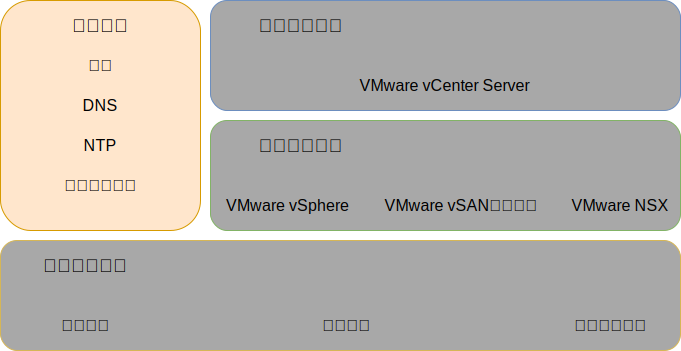
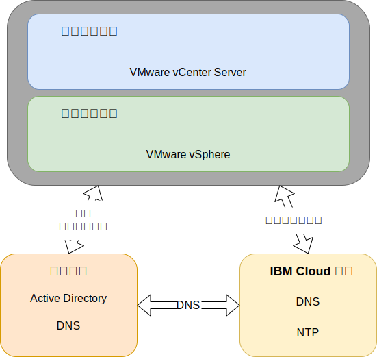

---

copyright:

  years:  2016, 2019

lastupdated: "2019-03-19"

subcollection: vmware-solutions

---

{:tip: .tip}
{:note: .note}
{:important: .important}

# 共用服務設計
{: #design_commonservice}

共用服務提供雲端管理平台中其他服務所使用的服務。解決方案的共用服務包括身分及存取服務、網域名稱服務、NTP 服務、SMTP 服務及憑證管理中心服務。

圖 1. 共用服務 

## 身分及存取服務
{: #design_commonservice-identity-access}

在此設計中，Microsoft Active Directory (MSAD) 用於「身分管理」。此設計會部署一或兩部 Active Directory 虛擬機器，作為 vCenter Server 部署自動化的一部分。vCenter 將配置成使用 MSAD 鑑別。

### Microsoft Active Directory
{: #design_commonservice-msad}

依預設，單一 Active Directory VSI 會部署至 {{site.data.keyword.cloud}} 基礎架構。

此設計還提供選項，可將兩部高可用性 MSAD 伺服器部署為管理叢集裡的專用 Windows Server VM。

如果您選擇具有兩部高可用性 MSAD 伺服器的選項，則須負責提供 Microsoft 授權並啟動。
{:note}

Active Directory 僅用來鑑別管理 VMware 實例的存取權，並不會將工作負載的使用者存放至已部署的實例中。Active Directory 伺服器的樹系根網域名稱等於您指定的 DNS 網域名稱。只有在鏈結多個實例時，才會針對主要 vCenter Server 實例指定此網域名稱。如果是已鏈結的實例，則每個實例都會包含位於樹系根抄本環中的 Active Directory 伺服器。DNS 區域檔案也會在 Active Directory 伺服器上進行抄寫。

### vSphere SSO 網域
{: #design_commonservice-vsphere-sso}

vSphere Single Sign On (SSO) 網域用來作為單一實例或多個已鏈結實例的起始鑑別機制。SSO 網域也可用來將某個 VMware 實例或多個已鏈結實例連接至 MSAD 伺服器。會套用下列 SSO 配置：  
* 一律使用 SSO 網域 `vsphere.local`
* 對於與現有實例相關聯的 VMware 實例，整合式 PSC 會加入至現有實例的 SSO 網域
* SSO 站台名稱等於實例名稱

## 網域名稱服務
{: #design_commonservice-dns}

此設計中的網域名稱服務 (DNS) 僅適用於雲端管理及基礎架構元件。

### 主要 vCenter Server 實例
{: #design_commonservice-primary-vcs}

vCenter Server 部署會將已部署的 AD VSI 用作實例的 DNS 伺服器。所有已部署的元件（內嵌 PSC、NSX、ESXi 主機的 vCenter）都會配置成指向 AD，以作為其預設 DNS。如果 DNS 區域配置不會干擾已部署元件的配置，則您可以自訂此配置。
- 此設計會以下列配置來整合 AD VSI 上的 DNS 服務：
- 網域結構是由使用者指定。網域名稱可以是任意數目的層次，最多為所有 vCenter Server 元件可處理的上限，以確保最低層次為實例的子網域。
    - 您提供的 DNS 網域名稱會用來作為 vCenter Server 已部署的 AD 根樹系網域名稱。例如，如果 DNS 網域名稱是 cloud.ibm.com，則 AD 網域樹系根為 cloud.ibm.com。在 vCenter Server 的所有聯合實例之中，DNS 網域及 AD 網域是相同的。
    - 選取額外名稱作為 vCenter Server 實例子網域。在所有已鏈結的 vCenter Server 實例之中，這個子網域名稱必須是唯一的。
- 將 AD DNS 伺服器配置成具有 DNS 網域及子網域空間的授權性。
- 將 AD DNS 伺服器配置成指向所有其他區域的 {{site.data.keyword.cloud_notm}} DNS 伺服器。
- 任何整合至第一個或目標部署雲端地區的次要雲端地區，都必須使用子網域上方的相同 DNS 名稱結構。
- 在 vCenter Server 叢集內選擇性地部署備援 DNS 伺服器。兩部 AD/DNS 伺服器未經授權配置。使用者必須負責為這些伺服器提供 Windows 作業系統的授權。
- 如果佈建只有一部 AD/DNS 伺服器的單一站台，則所有已配置的 vCenter Server 元件必須「只」有該單一 IP 作為 DNS 項目。

### 次要 vCenter Server 實例
{: #design_commonservice-secondary-vcs}

若為交互實例備援；當第一個次要 vCenter Server 實例新增至現有的主要 vCenter Server 實例或現行獨立式 vCenter Server 實例時，對於需要 DNS 伺服器項目的所有元件，該主要實例 AD DNS 伺服器 IP 位址會用於次要 vCenter Server 實例，以及任何後續的次要 vCenter Server 實例「次要 DNS」項目。例如，ESXi、vCenter 及 NSX 管理程式。這包括附加元件，例如 HCX、Zerto 及 Veeam。然後，主要站台次要 DNS 項目會變更為第一個次要 vCenter Server 實例 AD/DNS IP 位址。

## NTP 服務
{: #design_commonservice-ntp}

此設計利用 {{site.data.keyword.cloud_notm}} 基礎架構 NTP 伺服器。所有已部署的元件都已配置成利用這些 NTP 伺服器。為了讓憑證及 Active Directory 鑑別正常運作，使此設計內的所有元件都使用相同的 NTP 伺服器十分重要。

圖 2. NTP 及 DNS 服務 

## 憑證管理中心服務
{: #design_commonservice-cas}

依預設，VMware vSphere 會使用位於 VMware Platform Services Controller 應用裝置之「VMware 憑證管理中心 (VMCA)」所簽署的 TLS 憑證。一般使用者裝置或瀏覽器不會信任這些憑證。將使用者面向的憑證取代為協力廠商或企業憑證管理中心 (CA) 所簽署的憑證，是一種安全最佳作法。機器對機器通訊的憑證可以保留作為 VMCA 所簽署的憑證，不過，建議您遵循組織的最佳作法，這通常涉及使用已識別的企業 CA。

您可以使用此設計內的 Windows AD 伺服器來建立本端實例所簽署的憑證。不過，必要的話，您也可以選擇配置 CA 服務。

## 相關鏈結
{: #design_commonservice-related}

* [實體基礎架構設計](/docs/services/vmwaresolutions/archiref/solution?topic=vmware-solutions-design_physicalinfrastructure)
* [虛擬基礎架構設計](/docs/services/vmwaresolutions/archiref/solution?topic=vmware-solutions-design_virtualinfrastructure)
* [基礎架構管理設計](/docs/services/vmwaresolutions/archiref/solution?topic=vmware-solutions-design_infrastructuremgmt)
