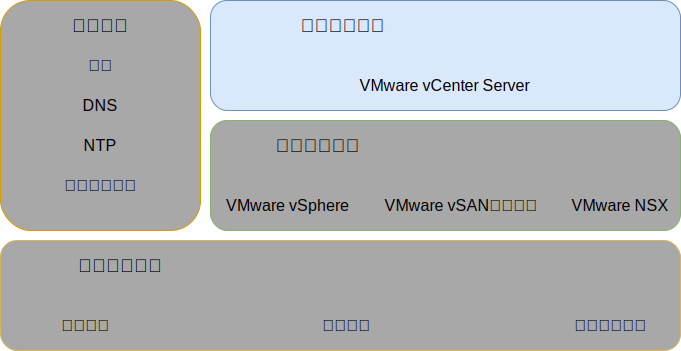

---

copyright:

  years:  2016, 2019

lastupdated: "2019-05-07"

subcollection: vmware-solutions

---

{:tip: .tip}
{:note: .note}
{:important: .important}

# 基礎架構管理設計
{: #design_infrastructuremgmt}

基礎架構管理是指管理 VMware 基礎架構的元件。
* 內嵌 Platform Services Controller (PSC) 的 vCenter Server 是用於管理 vSphere 環境的集中化平台，並且是此解決方案中的其中一個基礎元件。
* 此解決方案中使用 PSC 來提供一組基礎架構服務，其中包括 VMware vCenter Single Sign On、授權服務、查閱服務及 VMware 憑證管理中心。

此設計使用整合至 vCenter Server 實例的 PSC 功能。PSC 及 vCenter Server 位於相同的虛擬機器 (VM) 內。

{: caption="圖 1. 基礎架構管理" caption-side="bottom"}

位於主要實例的 PSC 會獲指派預設 SSO 網域 `vsphere.local`。

## vCenter Server 設計
{: #design_infrastructuremgmt-vcenter}

內嵌 PSC 的 vCenter Server 是安裝在與管理 VM 相關聯之專用 VLAN 的可攜式子網路上。其預設閘道設為該特定子網路之 BCR 上所指派的 IP 位址。虛擬應用裝置已配置下表中的規格。

表 1. vCenter Server Appliance 規格

| 屬性                         | 規格                                |
|------------------------------|-------------------------------------|
|vCenter Server | 虛擬應用裝置                   |
| 應用裝置安裝大小             | 大型（最多 1,000 部主機及 10,000 部 VM）|
|Platform Services Controller    | 整合式                            |
| vCPU 數目                    |16 |
|記憶體|32 GB|
| 磁碟                         | 本端資料儲存庫上有 990 GB（大型磁碟部署）|
| 磁碟類型                     | 精簡佈建                            |

### vCenter Server 資料庫
{: #design_infrastructuremgmt-vcenter-db}

vCenter Server 配置會使用應用裝置隨附的本端內嵌 PostgreSQL 資料庫。內嵌資料庫用來移除任何與外部資料庫及授權的相依關係。

### vCenter Server 叢集規格
{: #design_infrastructuremgmt-vcenter-cluster}

此設計可讓您將佈建在整個解決方案中的 vSphere ESXi 主機進行叢集處理。不過，建立叢集之前，會先建立資料中心物件，用於表示 vSphere ESXi 主機的位置以及資料中心內的 Pod。建立資料中心物件之後，會建立叢集。叢集已部署啟用「VMware vSphere 高可用性 (HA)」及「VMware vSphere 分散式資源排程器 (DRS)」。

### vSphere 分散式資源排程器
{: #design_infrastructuremgmt-vsphere-drs}

此設計使用起始叢集裡的「vSphere 分散式資源排程 (DRS)」來放置 VM，並在其他叢集裡使用 DRS 動態移轉 VM，以達到平衡的叢集。自動化層次設為完全自動化，以由 vSphere 自動執行起始放置及移轉建議。此外，移轉臨界值設為 moderate，因此 vCenter 會在叢集的負載平衡中套用優先順序 1、2、3 建議，以達到至少適當的改善。

在此設計中，不使用透過**分散式電源管理**特性的電源管理。
{:note}

### vSphere 高可用性
{: #design_infrastructuremgmt-vsphere-ha}

此設計使用起始叢集及額外叢集中的「vSphere 高可用性 (HA)」來偵測運算失敗，以及回復在叢集內執行的 VM。此設計中的 vSphere HA 特性配置為在叢集中啟用**主機監視**和**許可控制**選項。此外，起始叢集會保留其中一個節點的資源，作為許可控制原則的備用容量。

叢集稍後展開或收合時，您要負責調整許可控制原則。
{:note}

依預設，**VM 重新啟動優先順序**選項設為 medium，並停用**主機隔離回應**選項。此外，還會停用 **VM 監視**，而且**資料儲存庫活動訊號**特性配置成包括任何叢集資料儲存庫。此方式會使用 NAS 資料儲存庫（如果它們已存在）。

### 加強型 vMotion 相容性
{: #design_infrastructuremgmt-evc}

為了在可能具有不同 CPU 功能的叢集節點之間簡化 vMotion 相容性，會在 Skylake 層次啟用「加強型 vMotion 相容性 (EVC)」模式，以在較新的處理器送達 {{site.data.keyword.cloud_notm}} 庫存時，確保叢集節點之間的 vMotion 相容性，且未來如果 Skylake 處理器伺服器不在庫存中，即容許擴展叢集。

## IBM CloudDriver
{: #design_infrastructuremgmt-cloud-driver}

這些解決方案的基礎是自動化。自動化可減少部署的複雜性、大幅縮短部署時間，並確保以一致的方式部署 VMware 實例。

IBM CloudBuilder 是暫時的 {{site.data.keyword.cloud_notm}} VM 虛擬伺服器實例 (VSI)，其可用來啟動新的 VMware 實例並執行生命週期管理功能。需要整體 vCenter Server 實例管理時，即會部署它，而在處理程序完成時，即會將其破壞。

IBM CloudDriver 是暫時的 {{site.data.keyword.cloud_notm}} VM 虛擬伺服器實例 (VSI)，其會視需要針對第 2 天作業而部署，例如將主機、叢集或附加程式服務新增至 VMware 實例。

CloudBuilder 和 CloudDriver 只會部署在透過專用訊息佇列連接至 IBM 管理平面的專用網路上。它們是 IBM 開發的元件、使用者無法存取，而且具有下列屬性及功能：
* 在使用者帳戶內部署及配置 vCenter Server 實例。
* 新增及移除 vCenter Server 叢集中的主機。
* 新增及移除 vCenter Server 實例中的叢集。
* 新增及移除 vCenter Server 實例中的附加服務或功能。

### 自動化流程
{: #design_infrastructuremgmt-auto-flow}

下列說明使用 {{site.data.keyword.vmwaresolutions_short}} 主控台來訂購 VMware 實例時的事件次序：
1. 從 {{site.data.keyword.cloud_notm}} 訂購 VLAN 及子網路來連接網路。
2. 訂購已安裝 vSphere Hypervisor 的 {{site.data.keyword.cloud_notm}} {{site.data.keyword.baremetal_short}}。
3. 訂購 Microsoft Windows VSI，以作為 Active Directory 網域控制站。
4. 部署 Cloud Driver VSI。
5. 驗證網路及已部署的硬體。
6. 單一節點 vSAN 的起始配置（適用時）。
7. 部署及配置 vCenter（內嵌 PSC）和 NSX。
8. 叢集處理剩餘的 ESXi 節點、擴充 vSAN（適用時），以及配置 NSX 元件 (VTEP)。
9. 驗證環境的安裝及配置。
10. 部署選用服務（例如備份伺服器及儲存空間）。
11. 移除 Cloud Driver VSI。

## ID 和 密碼
{: #design_infrastructuremgmt-ids-pwd}

IC4V 管理基礎架構會儲存所有 vCenter Server 包含的 ID 和密碼，而這些 ID 和密碼已在 {{site.data.keyword.cloud_notm}} 管理平面內加密。使用者對這些密碼所做的任何變更，可能會干擾 vCenter Server 內的自動化功能。

您可以在 IC4V 解決方案入口網站中提供變更的密碼，讓自動化可以在不中斷的情況下處理功能。解決方案入口網站可選擇性地容許驗證所輸入的密碼。

## 相關鏈結
{: #design_infrastructuremgmt-related}

* [實體基礎架構設計](/docs/services/vmwaresolutions/archiref/solution?topic=vmware-solutions-design_physicalinfrastructure)
* [虛擬基礎架構設計](/docs/services/vmwaresolutions/archiref/solution?topic=vmware-solutions-design_virtualinfrastructure)
* [共用服務設計](/docs/services/vmwaresolutions/archiref/solution?topic=vmware-solutions-design_commonservice)
