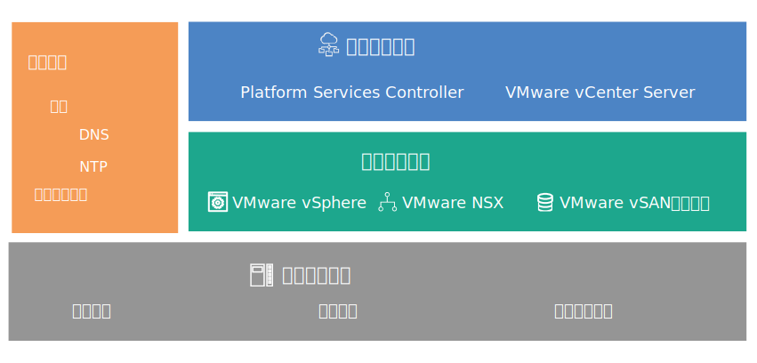

---

copyright:

  years:  2016, 2019

lastupdated: "2019-02-15"

---
# 設計概觀
{: #design_overview}

{{site.data.keyword.vmwaresolutions_full}} 提供自動化，以將 VMware 技術元件部署至全球的 {{site.data.keyword.CloudDataCents_notm}}。

## 解決方案供應項目
{: #design_overview-offerings}

解決方案供應項目包括自動部署及配置的叢集內的下列 VMware vSphere 產品：
* VMware Cloud Foundation：vSphere ESXi、Platform Services Controller (PSC)、VMware vCenter Server Appliance、SDDC Manager、VMware NSX 及 VMware vSAN。
* VMware vCenter Server：vSphere ESXi、Platform Services Controller (PSC)、vCenter Server Appliance、NSX 及選用的 vSAN。

在此設計中，實例會以起始順序部署在 {{site.data.keyword.CloudDataCent_notm}} 的單一 Pod 中。起始部署之後，您可以將虛擬環境擴充至相同資料中心或其他資料中心內的其他 Pod。

此設計也容許在 Cloud Foundation 或 vCenter Server 實例內自動擴充及縮減虛擬容量。

## VMware on IBM Cloud 元件
{: #design_overview-comp}

圖 1. VMware on {{site.data.keyword.cloud_notm}} 的元件

## 相關鏈結
{: #design_overview-related}

* [實體基礎架構設計](/docs/services/vmwaresolutions/archiref/solution?topic=vmware-solutions-design_physicalinfrastructure)
* [虛擬基礎架構設計](/docs/services/vmwaresolutions/archiref/solution?topic=vmware-solutions-design_virtualinfrastructure)
* [共用服務設計](/docs/services/vmwaresolutions/archiref/solution?topic=vmware-solutions-design_commonservice)
* [基礎架構管理設計](/docs/services/vmwaresolutions/archiref/solution?topic=vmware-solutions-design_infrastructuremgmt)
