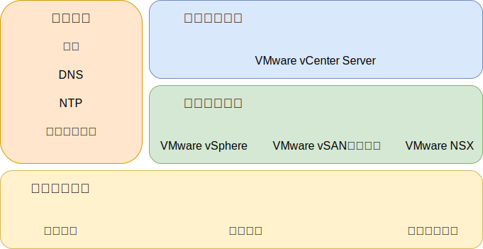

---

copyright:

  years:  2016, 2019

lastupdated: "2019-03-15"

subcollection: vmwaresolutions

---
# IBM Cloud for VMware Solutions 元件
{: #design_overview}

{{site.data.keyword.vmwaresolutions_full}} 提供自動化，以將 VMware 技術元件部署至全球的 {{site.data.keyword.CloudDataCents_notm}}。

此解決方案組合中的供應項目包括自動部署及配置之叢集內的 VMware vSphere 產品：VMware vSphere ESXi、VMware vCenter Server Appliance（內嵌 Platform Services Controller (PSC)）、VMware NSX-V 或 NSX-T，以及選用的 VMware vSAN。

架構由單一雲端地區組成，可支援延伸至位於另一個地理位置的其他雲端地區，以及延伸至相同資料中心內的另一個 {{site.data.keyword.cloud_notm}} Pod。地區定義為唯一的 vCenter Server 實例。此設計也容許在 vCenter Server 實例內自動擴充及縮減虛擬容量。

圖 1. {{site.data.keyword.vmwaresolutions_short}} 的解決方案元件

## 相關鏈結
{: #design_overview-related}

* [實體基礎架構設計](/docs/services/vmwaresolutions/archiref/solution?topic=vmware-solutions-design_physicalinfrastructure)
* [虛擬基礎架構設計](/docs/services/vmwaresolutions/archiref/solution?topic=vmware-solutions-design_virtualinfrastructure)
* [共用服務設計](/docs/services/vmwaresolutions/archiref/solution?topic=vmware-solutions-design_commonservice)
* [基礎架構管理設計](/docs/services/vmwaresolutions/archiref/solution?topic=vmware-solutions-design_infrastructuremgmt)
