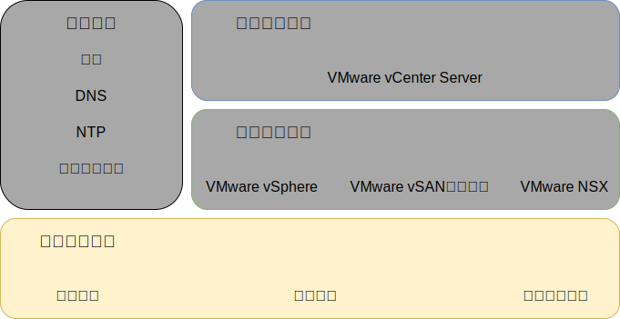
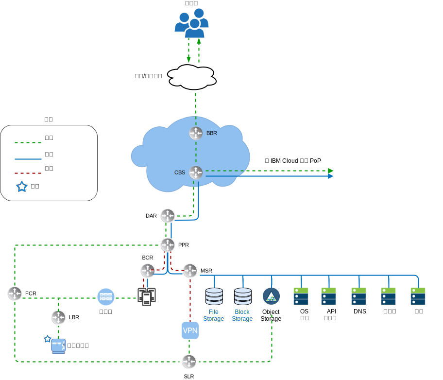
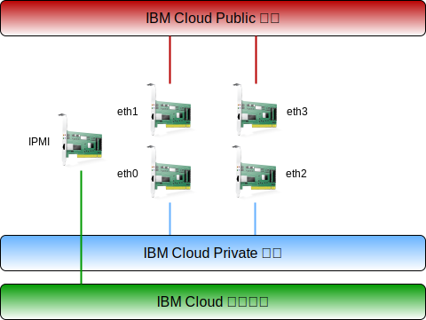
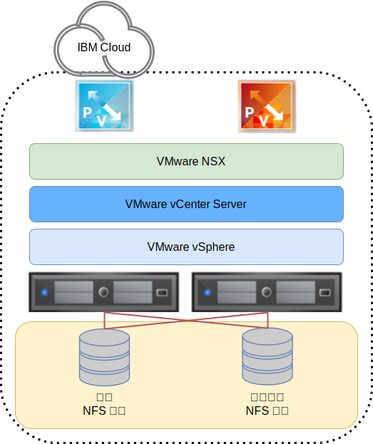

---

copyright:

  years:  2016, 2019

lastupdated: "2019-03-28"

subcollection: vmware-solutions

---

{:tip: .tip}
{:note: .note}
{:important: .important}

# 實體基礎架構設計
{: #design_physicalinfrastructure}

實體基礎架構由下列元件組成：

<dl class="dl">
  <dt class="dt dlterm">實體運算</dt>
  <dd class="dd">實體運算提供虛擬化基礎架構所使用的實體處理及記憶體。在此設計中，運算元件由 {{site.data.keyword.baremetal_long}} 提供，並列在 [VMware Hardware Compatibility Guide (HCG)](https://www.vmware.com/resources/compatibility/search.php) 中。</dd>
  <dt class="dt dlterm">實體儲存空間</dt>
  <dd class="dd">實體儲存空間提供虛擬化基礎架構所使用的原始儲存空間容量。儲存空間元件是由 {{site.data.keyword.baremetal_short}} 提供，或是由使用 NFS 第 3 版或 iSCSI 的共用「網路連接儲存空間 (NAS)」陣列所提供。</dd>
  <dt class="dt dlterm">實體網路</dt>
  <dd class="dd">實體網路會提供與環境的網路連線功能，而之後網路虛擬化會使用該環境。網路由 {{site.data.keyword.cloud_notm}} 服務網路提供，並包含額外服務（例如 DNS 及 NTP）。</dd>
</dl>

如需實體元件的相關資訊，請參閱 [vCenter Server 資料清單](/docs/services/vmwaresolutions/vcenter?topic=vmware-solutions-vc_bom)。

如需儲存空間的相關資訊，請參閱[共用儲存空間架構](/docs/services/vmwaresolutions/archiref/attached-storage?topic=vmware-solutions-storage-benefits#storage-benefits)。

圖 1. 實體基礎架構 

## 實體運算設計
{: #design_physicalinfrastructure-host-design}

解決方案中可用的伺服器配置符合或超出安裝、配置及管理 vSphere ESXi 的最低需求。有各種配置可用來滿足不同的需求。如需用於 VMware on {{site.data.keyword.cloud_notm}} 解決方案的確切規格詳細清單，請參閱 [vCenter Server 實例](/docs/services/vmwaresolutions/vcenter?topic=vmware-solutions-vc_bom)的「資料清單」。

{{site.data.keyword.baremetal_short}} 位於 {{site.data.keyword.cloud_notm}}。
{:note}

每個 vCenter Server 實例都是從 3 或 4 部主機的部署開始，視所選擇的儲存空間解決方案而定。

實體主機採用兩個配置給 vSphere ESXi Hypervisor 的本端連接磁碟。您可以使用 vSAN（如_實體儲存空間設計_ 小節所述）或使用 NetApp ONTAP（如 [NetApp ONTAP Select 架構](https://www.ibm.com/cloud/garage/files/IBM_Cloud_for_VMware_Solutions_NetApp_Architecture.pdf)所述）來配置更多磁碟。每部實體主機都具有備用的 10 Gbps 網路連線，以進行公用及專用網路存取。

Bare Metal Server 的規格如下：
* CPU：雙重或四重 Intel Xeon，各種核心及速度配置
* 記憶體：各種配置，64 GB 或更大
* 網路：4 x 10 Gbps
* 磁碟機數目：2 台以上

## 實體網路設計
{: #design_physicalinfrastructure-net-design}

實體網路是由 {{site.data.keyword.cloud_notm}} 處理。請檢閱下列說明，它指出 IBM Cloud 所提供的實體網路，以及與實體主機相關聯的實體主機連線（VLAN、MTU）。

### IBM Cloud 網路概觀
{: #design_physicalinfrastructure-ibm-cloud-network}

{{site.data.keyword.cloud_notm}} 的實體網路分成兩個不同的網路：公用和專用。專用網路也包含實體伺服器的管理「智慧型平台管理介面 (IPMI)」資料流量。

圖 2. {{site.data.keyword.cloud_notm}} 高階網路

#### 公用網路
{: #design_physicalinfrastructure-public-net}

{{site.data.keyword.CloudDataCents_notm}} 及網路存在點 (PoP) 具有多個 1 Gbps 或 10 Gbps 最上層傳輸及對等網路營運商連線。世界各地的網路資料流量都會連接至最近的網路 PoP，並直接透過網路傳送到其資料中心，以讓提供者之間的網路中繼站數目及遞交次數減到最少。

在資料中心內，{{site.data.keyword.cloud_notm}} 透過一對個別的對等節點聚集前端客戶交換器 (FCS)，提供個別伺服器之 1 Gbps 或 10 Gbps 的網路頻寬。這些聚集的交換器會連接至一對個別的路由器 (FCR)，以連接 L3 網路。

這種多層式的設計，容許網路在 {{site.data.keyword.CloudDataCent_notm}} 內的機架、列及 Pod 之間進行調整。

#### 專用網路
{: #design_physicalinfrastructure-private-net}

所有 {{site.data.keyword.CloudDataCents_notm}} 及 PoP 都是藉由專用網路骨幹進行連接。此專用網路與公用網路分開，而且可以啟用全球各地之 {{site.data.keyword.CloudDataCents_notm}} 中服務的連線功能。透過多個 10 Gbps 或 40 Gbps 專用網路連線，可以在 {{site.data.keyword.CloudDataCents_notm}} 之間移動資料。

與公用網路類似，專用網路在該伺服器中為多層式，而其他基礎架構元件則連接至聚集的後端客戶交換器 (BCS)。這些聚集的交換器會連接至一對個別的後端客戶路由器 (BCR)，以連接 L3 網路。專用網路也支援使用巨大訊框 (MTU 9000) 來進行實體主機連線的功能。

#### 管理網路
{: #design_physicalinfrastructure-mgmt-net}

除了公用和專用網路之外，每部 {{site.data.keyword.cloud_notm}} 伺服器還會連接至專用主要網路子網路，以進行管理。此連線容許「智慧型平台管理介面 (IPMI)」存取伺服器以進行維護及管理，而不論其 CPU、韌體及作業系統為何。

#### 主要及可攜式 IP 區塊
{: #design_physicalinfrastructure-ip-blocks}

{{site.data.keyword.cloud_notm}} 配置兩種類型的 IP 位址，以在 {{site.data.keyword.cloud_notm}} 基礎架構內使用：
* 主要 IP 位址會被指派給 {{site.data.keyword.cloud_notm}} 所佈建的裝置、Bare Metal Server 及虛擬伺服器。不要指派這些區塊中的任何 IP 位址。
* 我們提供了可攜式 IP 位址，供您視需要指派及管理。vCenter Server 會佈建數個可攜式 IP 範圍，以供其使用。僅使用指派給特定 NSX-T 或 NSX-V 元件的可攜式範圍，而這些元件是為了供客戶使用所指定的。例如，**客戶 EDGE**。

當帳戶配置為**虛擬遞送及轉遞 (VRF)** 帳戶時，可以將主要或可攜式 IP 位址變成可遞送給您帳戶內的任何 VLAN。

#### 虛擬遞送及轉遞
{: #design_physicalinfrastructure-vrf}

{{site.data.keyword.slportal}} 帳戶必須配置為「虛擬遞送及轉遞 (VRF)」帳戶，以啟用子網路 IP 區塊之間的自動廣域遞送。所有具有 Direct Link 連線的帳戶都必須轉換或建立為 VRF 帳戶。

因為有各種連線選項及網路遞送選項需要 {{site.data.keyword.cloud_notm}} 帳戶處於 VRF 模式，所以建議在佈建 vCenter Server 之前，先讓此帳戶處於 VRF 模式。

#### 實體主機連線
{: #design_physicalinfrastructure-host-connect}

此設計中的每部實體主機都會有兩對備用的 10 Gbps 乙太網路連線，以連接至每台 {{site.data.keyword.cloud_notm}} Top of Rack (ToR) 交換器（公用和專用）。配接卡會設定為總共 4 個 10 Gbps 連線的個別連線（未結合）。這樣可讓網路介面卡 (NIC) 連線彼此獨立地運作。

無法針對 vCenter Server 供應項目內使用的裸機伺服器，移除公用或專用網路的實體網路連線功能。可以停用裸機內部 NIC 上的實體埠，但不支援拔除纜線。

圖 3. 實體主機連線 

#### VLAN 與基礎至層疊遞送
{: #design_physicalinfrastructure-vlans}

{{site.data.keyword.vmwaresolutions_short}} 供應項目設計成在部署時指派 3 個 VLAN（一個公用及兩個專用）。如前一個圖中所示，公用 VLAN 會指派給 `eth1` 及 `eth3`，而專用 VLAN 會指派給 `eth0` 及 `eth2`。

依預設，在此設計中，{{site.data.keyword.cloud_notm}} 內建立及指派的公用 VLAN 及第一個專用 VLAN 不會加上標籤。然後，額外的專用 VLAN 會成為實體交換器埠的主幹，並在使用這些子網路的 VMware 埠群組內加上標籤。

在此設計中，專用網路由兩個 VLAN 組成。會將三個子網路配置給這些 VLAN 中的第一個 VLAN（這裡會指定為「專用 VLAN A」）：
* 第一個子網路是 {{site.data.keyword.cloud_notm}} 指派給實體主機的主要專用 IP 子網路範圍。
* 第二個子網路用於管理虛擬機器（例如 vCenter Server Appliance 及 Platform Services Controller）。
* 第三個子網路用於透過 NSX Manager 指派給每部主機的封裝層疊網路「通道端點 (VTEP)」。

除了「專用 VLAN A」之外，還有第二個專用 VLAN（這裡指定為「專用 VLAN B」）存在，可以支援 VMware 特性（例如 vSAN、vMotion、NFS 及 iSCSI）。因此，VLAN 分為兩個、三個或四個可攜式子網路：
* 第一個子網路會指派給 vMotion 資料流量用的核心埠群組。
* 剩餘的子網路用於儲存空間資料流量：
   * 使用 vSAN 時，會將子網路指派給用於 vSAN 資料流量的核心埠群組。
   * 使用 NAS 連接的 NAS 時，會將子網路指派給 NFS 資料流量專用的埠群組。
   * 對於 iSCSI 連接，會建立兩個埠群組，以容許在兩個專用 NIC 埠之間有多個主動-主動路徑，因為根據 VMware iSCSI 文件，一次只能有一個 NIC 埠作用中。

在 vCenter Server 自動化部署過程中配置的所有子網路，都會使用 {{site.data.keyword.cloud_notm}} 管理的範圍。這是要確保，在您現在或未來需要連線時，任何 IP 位址都可以遞送給 {{site.data.keyword.cloud_notm}} 帳戶內的任何資料中心。

檢閱下列表格以取得摘要。

表 1. VLAN 及子網路摘要

|VLAN      |類型      |說明              |
|:---- |:---- |:----------- |
| 公用 | 主要     | 指派給實體主機，以進行公用網路存取。在起始部署時不會使用。|
| 專用 A    | 主要     | 指派給 {{site.data.keyword.cloud_notm}} 所指派之實體主機的單一子網路。由管理介面用於 vSphere 管理資料流量。|
| 專用 A    | 可攜式   | 指派給充當管理元件之虛擬機器的單一子網路 |
| 專用 A    | 可攜式   | 指派給 NSX-V 或 NSX-T VTEP 的單一子網路 |
| 專用 B    | 可攜式   | 為 vSAN 指派的單一子網路（如果使用的話）|
| 專用 B    | 可攜式   | 為 NAS 指派的單一子網路（如果使用的話）|
| 專用 B    | 可攜式   | 為 iSCSI NAS 指派的兩個子網路（如果使用的話，每個實體 NIC 埠各一個）|
| 專用 B    | 可攜式   | 為 vMotion 指派的單一子網路 |

在此設計中，所有 VLAN 支援的主機及虛擬機器都會配置成指向 {{site.data.keyword.cloud_notm}} 後端「專用網路」客戶路由器 (BCR)，以作為預設路徑。雖然 vCenter Server 實例允許使用「軟體定義網路 (SDN)」，但是 {{site.data.keyword.cloud_notm}} 管理的路由器並無法辨識在 VMware 實例內所建立並且包含對內部子網路之遞送的網路層疊。

如果您想要在層疊與基礎之間遞送，則必須在部署 vCenter Server 實例時，為特定的預設專用 VLAN 部署 IBM 防火牆裝置。此裝置容許插入與層疊網路裝置對等的靜態路徑及動態遞送通訊協定，以容許在基礎與層疊之間遞送。

專用網路連線配置成使用巨大訊框 MTU 大小 9000，以改善大型資料傳送（例如儲存空間及 vMotion）的效能。這是 VMware 內及 {{site.data.keyword.cloud_notm}} 容許的最大 MTU。公用網路連線使用標準乙太網路 MTU 1500。必須維護此值，因為任何變更都可能導致透過網際網路傳送時發生封包片段化。

## 實體儲存空間設計
{: #design_physicalinfrastructure-storage-design}

實體儲存空間設計包含實體主機中所安裝實體磁碟的配置，以及共用的網路連結儲存空間的配置。這包括作業系統磁碟 (vSphere ESXi)，以及用於虛擬機器 (VM) 儲存空間的磁碟。VM 的儲存空間可以包含 VMware vSAN 所虛擬化的本端磁碟、共用檔案層次儲存空間，或共用區塊層次儲存空間。

### 作業系統磁碟
{: #design_physicalinfrastructure-os-disks}

vSphere ESXi Hypervisor 會安裝在持續性位置中。因此，實體主機在 RAID–1 配置中包含兩個磁碟，以支援 vSphere ESXi Hypervisor 的備援。

### vSAN 磁碟
{: #design_physicalinfrastructure-vsan-disks}

此設計容許選擇使用 VMware vSAN 或共用的網路連結儲存空間作為虛擬機器的主要資料儲存庫。若為 VMware vSAN，它是使用全快閃記憶體配置所配置的。此設計容許數個配置選項（包括 2U 和 4U 機箱）、各種磁碟數量，以及各種磁碟大小。所有配置都會使用兩個 vSAN 磁碟群組，搭配一個固態硬碟 (SSD) 用於快取，和一個以上的 SSD 用於容量。所有配置供 vSAN 耗用的磁碟機，都以單一磁碟 RAID-0 進行配置。

如需支援之配置的相關資訊，請參閱 [vCenter Server 資料清單](/docs/services/vmwaresolutions/vcenter?topic=vmware-solutions-vc_bom)。

### 跨主機的共用檔案層次儲存空間
{: #design_physicalinfrastructure-shared-storage}

使用共用檔案層次儲存空間時，會將一個 2 TB 的 NFS 共用連接至構成起始 VMware 叢集的主機。這個共用（稱為管理共用）會用於管理元件（例如 VMware vCenter Server、Platform Services Controller 及 VMware NSX）。

儲存空間是從 IBM Cloud 使用 NFS 第 3 版通訊協定所連接，每個 GB 層次有 2 IOPS。IBM 會將以 16 K 區塊大小佈建的 IOP 層次正規化，讓較大的區塊大小可以看到下限，而較小的區塊大小可以看到上限。

圖 4. 連接至 VMware 部署的 NFS 共用

您可以在購買時或之後在主控台內，針對工作負載在所有主機上配置及裝載更多檔案共用。您可以從對應 {{site.data.keyword.CloudDataCent_notm}} 的可用「{{site.data.keyword.cloud_notm}} 耐久性」檔案儲存空間容量選項及效能層級中進行選取。所有共用都是使用 NFS 第 3 版通訊協定進行連接。此外，套用 NetApp ONTAP Select 供應項目，即可連接 NFS 第 3 版檔案共用。

10 IOPS/GB 的可用性視 IBM Cloud Data Center 而定。提供 10 IOPS/GB 效能層級的 {{site.data.keyword.CloudDataCents_notm}} 也包含由提供者管理的靜態資料加密（AES-256 加密），並且由全快閃記憶體儲存空間加以備份。10 IOPS/GB 效能層級的容量上限為 4 TB。如需此解決方案中使用之共用 NAS 的相關資訊，請參閱[共用儲存空間架構](/docs/services/vmwaresolutions/archiref/attached-storage?topic=vmware-solutions-storage-benefits#storage-benefits)。

### 共用 iSCSI 儲存空間
{: #design_physicalinfrastructure-shared-iscsi}

類似於 NFS，如需共用 iSCSI 儲存空間，會將一個 2 TB iSCSI LUN 連接至構成起始 VMware 叢集的主機。這個 iSCSI LUN 用於管理元件（例如 VMware vCenter Server、Platform Services Controller 及 VMware NSX）。儲存空間是從 IBM Cloud 透過 iSCSI 通訊協定所連接，每個 GB 層次有 2 IOPs。

IBM 會將以 16 K 區塊大小佈建的 IOP 層次正規化，讓較大的區塊大小可以看到下限，而較小的區塊大小可以看到上限。

圖 5. 連接至 VMware 部署的 iSCSI LUN 

也可以在購買時或之後在主控台內，針對工作負載在所有主機上配置及裝載額外的 iSCSI LUN。在對應的 IBM Cloud Data Center 中，從可用的「IBM Cloud 耐久性」區塊儲存空間容量選項及效能層級中進行選取。所有 LUN 都是使用 iSCSI 通訊協定進行連接。此外，可從 NetApp ONTAP Select 供應項目連接 iSCSI LUN。

10 IOPS/GB 的可用性視 IBM Cloud Data Center 而定。提供 10 IOPS/GB 效能層級的資料中心也包括提供者管理的靜態資料加密（AES–256 加密），並由全快閃記憶體儲存空間支援。10 IOPS/GB 效能層級的容量上限為 4 TB。

如需此解決方案中使用之共用 NAS 的相關資訊，請參閱[共用儲存空間架構](/docs/services/vmwaresolutions/archiref/attached-storage?topic=vmware-solutions-storage-benefits#storage-benefits)。

## 相關鏈結
{: #design_physicalinfrastructure-related}

* [vCenter Server 資料清單](/docs/services/vmwaresolutions/vcenter?topic=vmware-solutions-vc_bom)
* [共用儲存空間架構](/docs/services/vmwaresolutions/archiref/attached-storage?topic=vmware-solutions-storage-benefits#storage-benefits)
* [NetApp ONTAP Select 架構](https://www.ibm.com/cloud/garage/files/IBM_Cloud_for_VMware_Solutions_NetApp_Architecture.pdf)
