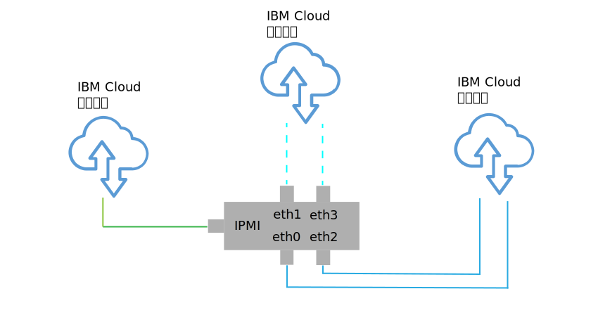
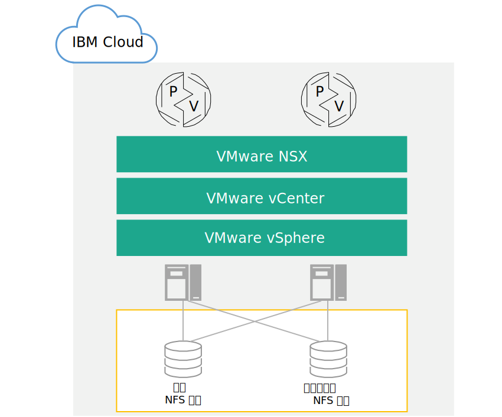

---

copyright:

  years:  2016, 2019

lastupdated: "2019-01-23"

---

{:tip: .tip}
{:note: .note}
{:important: .important}

# 實體基礎架構設計

實體基礎架構包含下列元件：

<dl class="dl">
  <dt class="dt dlterm">實體運算</dt>
  <dd class="dd">實體運算提供虛擬化基礎架構所使用的實體處理及記憶體。在此設計中，運算元件由 {{site.data.keyword.baremetal_long}} 提供，並列在 [VMware Hardware Compatibility Guide (HCG)](https://www.vmware.com/resources/compatibility/search.php) 中。</dd>
  <dt class="dt dlterm">實體儲存空間</dt>
  <dd class="dd">實體儲存空間提供虛擬化基礎架構所使用的原始儲存空間容量。儲存空間元件是由 {{site.data.keyword.baremetal_short}} 提供，或是由使用 NFS 第 3 版的共用「網路連接儲存空間 (NAS)」陣列所提供。</dd>
  <dt class="dt dlterm">實體網路</dt>
  <dd class="dd">實體網路會提供與環境的網路連線功能，而之後網路虛擬化會使用該環境。網路由 {{site.data.keyword.cloud_notm}} 服務網路提供，並包含額外服務（例如 DNS 及 NTP）。</dd>
</dl>

如需實體元件的相關資訊，請參閱 [Cloud Foundation 實例](/docs/services/vmwaresolutions/sddc/sd_bom.html)或 [vCenter Server 實例](/docs/services/vmwaresolutions/vcenter/vc_bom.html)的「資料清單」。

如需儲存空間的相關資訊，請參閱[共用儲存空間架構](https://www.ibm.com/cloud/garage/files/AttachedStorageSolutionArchitecture_v1.0.pdf)。

## 實體主機設計

實體主機是指環境中用來提供運算資源的 {{site.data.keyword.baremetal_short}}。此解決方案中所套用的 {{site.data.keyword.baremetal_short}} 已經過 VMware 認證，並列在 [VMware HCG](http://www.vmware.com/resources/compatibility/search.php) 中。

解決方案中可用的伺服器配置符合或超出安裝、配置及管理 vSphere ESXi 的最低需求。有各種配置可用來滿足不同的需求。如需用於 VMware on {{site.data.keyword.cloud_notm}} 解決方案之確切規格的詳細清單，請參閱 [Cloud Foundation 實例](/docs/services/vmwaresolutions/sddc/sd_bom.html)或 [vCenter Server 實例](/docs/services/vmwaresolutions/vcenter/vc_bom.html)的「資料清單」。

{{site.data.keyword.baremetal_short}} 位於 {{site.data.keyword.cloud_notm}}。
{:note}

每個 Cloud Foundation 實例都是從 4 部主機的部署開始，而每個 vCenter Server 實例都是從 3 或 4 部主機的部署開始，視所選擇的儲存空間解決方案而定。

實體主機採用兩個要配置給 vSphere ESXi Hypervisor 的本端連接磁碟。您可以使用 vSAN（如_實體儲存空間設計_ 小節所述）或使用 NetApp ONTAP（如 [NetApp ONTAP Select 架構](https://www.ibm.com/cloud/garage/files/IBM_Cloud_for_VMware_Solutions_NetApp_Architecture.pdf)所述）來配置更多磁碟。每部實體主機都具有備用的 10 Gbps 網路連線，以進行公用及專用網路存取。

Bare Metal Server 的規格如下：
* CPU：雙 Intel Xeon，各種核心及速度配置
* 記憶體：各種配置，128 GB 或更大
* 網路：4 x 10 Gbps
* 磁碟機數目：2 台以上

## 實體網路設計

本節說明 {{site.data.keyword.cloud_notm}} 所提供的實體網路，以及與實體主機相關聯的實體主機連線（VLAN、MTU）。

{{site.data.keyword.cloud_notm}} 的實體網路分成三個不同的網路：公用、專用和管理。如需這三個網路及其運作方式的圖解，請參閱 [The {{site.data.keyword.cloud_notm}} Network](https://www.ibm.com/cloud-computing/bluemix/our-network)。

### 公用網路

{{site.data.keyword.CloudDataCents_notm}} 及網路存在點 (PoP) 具有多個 1 Gbps 或 10 Gbps 最上層傳輸及對等網路營運商連線。

世界各地的外部網路資料流量都會連接至最近的網路 PoP，並直接透過網路傳送到其資料中心，讓提供者之間的網路中繼站數目及遞交次數減到最少。

在資料中心內，{{site.data.keyword.cloud_notm}} 透過一對個別的對等節點聚集前端客戶交換器 (FCS)，提供個別伺服器之 1 Gbps 或 10 Gbps 的網路頻寬。這些聚集的交換器會連接至一對個別的前端客戶路由器 (FCR)，以連接 L3 網路。

這種多層式的設計，容許網路在 {{site.data.keyword.CloudDataCent_notm}} 內的機架、列及 Pod 之間進行調整。

### 專用網路

所有 {{site.data.keyword.CloudDataCents_notm}} 及 PoP 都是藉由專用網路骨幹進行連接。專用網路與公用網路分開，而且可以啟用全球各地之 {{site.data.keyword.CloudDataCents_notm}} 中服務的連線功能。透過多個 10 Gbps 或 40 Gbps 專用網路連線，可以在 {{site.data.keyword.CloudDataCents_notm}} 之間移動資料。

與公用網路類似，專用網路在該伺服器中為多層式，而其他基礎架構元件則連接至聚集的後端客戶交換器 (BCS)。這些聚集的交換器會連接至一對個別的後端客戶路由器 (BCR)，以連接 L3 網路。專用網路也支援使用巨大訊框 (MTU 9000) 來進行實體主機連線的功能。

### 管理網路

除了公用及專用網路之外，每部 {{site.data.keyword.cloud_notm}} 伺服器都會連接至頻外管理網路。這個可透過 VPN 存取的管理網路，容許「智慧型平台管理介面 (IPMI)」存取伺服器以進行維護及管理，而不論其 CPU、韌體及作業系統為何。

### 主要及可攜式 IP 區塊

{{site.data.keyword.cloud_notm}} 配置兩種類型的 IP 位址，以在 {{site.data.keyword.cloud_notm}} 基礎架構內使用：
* 主要 IP 位址會被指派給 {{site.data.keyword.cloud_notm}} 所佈建的裝置、Bare Metal Server 及虛擬伺服器。不要指派這些區塊中的任何 IP 位址。
* 我們提供了可攜式 IP 位址，供您視需要指派及管理。

若在 {{site.data.keyword.slportal}} 內啟用 **VLAN Spanning**，或將帳戶配置為**虛擬遞送及轉遞 (VRF)** 帳戶，則可以將主要或可攜式 IP 位址變成可遞送給客戶帳戶內的任何 VLAN。

### VLAN Spanning

**VLAN Spanning** 是一種 {{site.data.keyword.slportal}} 帳戶設定，容許將帳戶內所有 VLAN 的主要及可攜式子網路 IP 區塊遞送給彼此。停用 **VLAN Spanning** 設定時，IP 區塊仍然可以遞送給 {{site.data.keyword.cloud_notm}} 服務，但不能遞送給彼此。

若要容許在解決方案元件所在的各種子網路之間進行透通連線，您需要在已部署 Cloud Foundation 及 vCenter Server 實例的 {{site.data.keyword.slportal}} 帳戶中啟用 **VLAN Spanning**。

### 虛擬遞送及轉遞 (VRF)

您也可以將 {{site.data.keyword.slportal}} 帳戶配置為 VRF 帳戶來提供與 VLAN Spanning 類似的功能，以啟用子網路 IP 區塊之間的自動遞送。所有具有 Direct-Link 連線的帳戶都必須轉換或建立為 VRF 帳戶。

{{site.data.keyword.vmwaresolutions_short}} 主控台無法偵測 {{site.data.keyword.slportal}} 中是否已啟用 VRF。您會收到警告，提醒您確定已在 {{site.data.keyword.slportal}} 帳戶中啟用 **VLAN Spanning** 或 VRF。

### 實體主機連線

此設計中的每部實體主機都會有兩對備用的 10 Gbps 乙太網路連線，以連接至每台 {{site.data.keyword.cloud_notm}} Top of Rack (ToR) 交換器（公用及專用）。配接卡會設定為總共 4 個 10 Gbps 連線的個別連線（未結合）。這樣可讓網路介面卡 (NIC) 連線彼此獨立地運作。

圖 1. 實體主機 NIC 連線

### VLAN

{{site.data.keyword.vmwaresolutions_short}} 供應項目設計成在部署時指派 3 個 VLAN（一個公用及兩個專用）。如圖 2 所示，公用 VLAN 會指派給 eth1 及 eth3，而專用 VLAN 會指派給 eth0 及 eth2。

依預設，在此設計中，{{site.data.keyword.cloud_notm}} 內建立及指派的公用 VLAN 及第一個專用 VLAN 不會加上標籤。額外的專用 VLAN 會成為實體交換器埠的主幹，並在使用這些子網路的 VMware 埠群組內加上標籤。

在此設計中，專用網路由兩個 VLAN 組成。會將三個子網路配置給這些 VLAN 中的第一個 VLAN（這裡會指定為「專用 VLAN A」）：
* 第一個子網路是 {{site.data.keyword.cloud_notm}} 指派給實體主機的主要專用 IP 子網路範圍。
* 第二個子網路用於管理虛擬機器（例如 vCenter Server Appliance 及 Platform Services Controller）。
* 第三個子網路用於透過 VMware NSX Manager 指派給每部主機的「VXLAN 通道端點 (VTEP)」。

除了「專用 VLAN A」之外，還有第二個專用 VLAN（這裡指定為「專用 VLAN B」）存在，可以支援 VMware 特性（例如 vSAN 及 vMotion）和網路連接儲存空間 (NAS) 的網路連線功能。因此，VLAN 分為兩個或三個可攜式子網路。

* 第一個子網路會指派給 vMotion 資料流量用的核心埠群組。
* 剩餘的子網路用於儲存空間資料流量：
   * 使用 vSAN 時，會將子網路指派給用於 vSAN 資料流量的核心埠群組。
   * 使用 NAS 時，會將子網路指派給 NFS 資料流量專用的埠群組。

在 vCenter Server 或 Cloud Foundation 自動化部署過程中配置的所有子網路，都會使用 {{site.data.keyword.cloud_notm}} 管理的範圍。這是要確保，在您現在或未來需要連線時，任何 IP 位址都可以遞送給 {{site.data.keyword.cloud_notm}} 帳戶內的任何資料中心。

這全部彙總於表 1。

表 1. VLAN 及子網路摘要

|VLAN      |類型      |說明              |
|:---- |:---- |:----------- |
| 公用 | 主要     | 指派給實體主機，以進行公用網路存取。在起始部署時不會使用。|
| 專用 A    | 主要     | 指派給 {{site.data.keyword.cloud_notm}} 所指派之實體主機的單一子網路。由管理介面用於 vSphere 管理資料流量。|
| 專用 A    | 可攜式   |指派給充當管理元件之虛擬機器的單一子網路|
| 專用 A    | 可攜式   | 指派給 NSX VTEP 的單一子網路 |
| 專用 B    | 可攜式   |為 vSAN 指派的單一子網路（如果使用的話）|
| 專用 B    | 可攜式   |為 NAS 指派的單一子網路（如果使用的話）|
| 專用 B    | 可攜式   | 為 vMotion 指派的單一子網路 |

在此設計中，所有 VLAN 支援的主機及虛擬機器都會配置成指向 {{site.data.keyword.cloud_notm}} 後端「專用網路」客戶路由器，以作為預設路徑。雖然 vCenter Server 及 Cloud Foundation 實例允許使用「軟體定義網路 (SDN)」，但是 {{site.data.keyword.cloud_notm}} 管理的路由器並無法辨識在 VMware 實例內所建立並且包含對內部子網路之遞送的網路層疊。因此，您可能需要在部分或所有管理元件的 VMware 實例內建立靜態路由。

專用網路連線配置成使用巨大訊框 MTU 大小 9000，以改善大型資料傳送（例如儲存空間及 vMotion）的效能。這是 VMware 內及 {{site.data.keyword.cloud_notm}} 容許的最大 MTU。公用網路連線使用標準乙太網路 MTU 1500。必須維護此值，因為任何變更都可能導致透過網際網路傳送時發生封包片段化。

## 實體儲存空間設計

實體儲存空間設計包含實體主機中所安裝實體磁碟的配置，以及共用檔案層次儲存空間的配置。這包括 vSphere ESXi Hypervisor 的作業系統磁碟，以及用於虛擬機器 (VM) 儲存空間的磁碟。VM 的儲存空間可以包含 VMware vSAN 所虛擬化的本端磁碟，或是包含共用檔案層次儲存空間。

### 作業系統磁碟

vSphere ESXi Hypervisor 設計成安裝於持續性位置中。因此，實體主機在 RAID-1 配置中包含兩個 1 TB 的 SATA 磁碟，以支援 vSphere ESXi Hypervisor 的備援。

### 虛擬機器儲存空間

此設計容許使用 VMware vSAN 或共用檔案層次儲存空間作為 VM 之主要資料儲存庫的選項。

### vSAN 磁碟

使用時，會使用全快閃記憶體的配置來配置 VMware vSAN。此設計容許數個配置選項（包括 2U 和 4U 機箱）、各種磁碟數量，以及各種磁碟大小。所有配置都會使用兩個 vSAN 磁碟群組，搭配一個固態硬碟 (SSD) 用於快取，和一個以上的 SSD 用於容量。所有配置供 vSAN 耗用的磁碟機，都以單一磁碟 RAID-0 進行配置。

如需所支援配置的相關資訊，請參閱 [Cloud Foundation 實例](/docs/services/vmwaresolutions/sddc/sd_bom.html)或 [vCenter Server 實例](/docs/services/vmwaresolutions/vcenter/vc_bom.html)的「資料清單」。

### 跨主機的共用檔案層次儲存空間

使用共用檔案層次儲存空間時，會將一個 2 TB 的 NFS 共用連接至構成起始 VMware 叢集的主機。這個共用（稱為管理共用）會用於管理元件（例如 VMware vCenter Server、Platform Services Controller 及 VMware NSX）。儲存空間是使用 NFS 第 3 版通訊協定所連接，而且最多可支援 4000 IOPS。

圖 2. 連接至 VMware 部署的 NFS 共用

您可以在購買時或之後在主控台內，配置及裝載工作負載用的其他檔案共用。您可以從對應 {{site.data.keyword.CloudDataCent_notm}} 的可用「{{site.data.keyword.cloud_notm}} 耐久性」檔案儲存空間容量選項及效能層級中進行選取。所有共用都是使用 NFS 第 3 版通訊協定進行連接。此外，套用 NetApp ONTAP Select 供應項目，即可連接 NFS 第 3 版檔案共用。

提供 10 IOPS/GB 效能層級的 {{site.data.keyword.CloudDataCents_notm}} 也包含由提供者管理的靜態資料加密（AES-256 加密），並且由全快閃記憶體儲存空間加以備份。10 IOPS/GB 效能層級的容量上限為 4 TB。如需此解決方案中使用之共用 NAS 的相關資訊，請參閱[共用儲存空間架構](https://www.ibm.com/cloud/garage/files/AttachedStorageSolutionArchitecture_v1.0.pdf)。

### 相關鏈結

* [Cloud Foundation 資料清單](/docs/services/vmwaresolutions/sddc/sd_bom.html)
* [vCenter Server 資料清單](/docs/services/vmwaresolutions/vcenter/vc_bom.html)
* [共用儲存空間架構](https://www.ibm.com/cloud/garage/files/AttachedStorageSolutionArchitecture_v1.0.pdf)
* [NetApp ONTAP Select 架構](https://www.ibm.com/cloud/garage/files/IBM_Cloud_for_VMware_Solutions_NetApp_Architecture.pdf)
