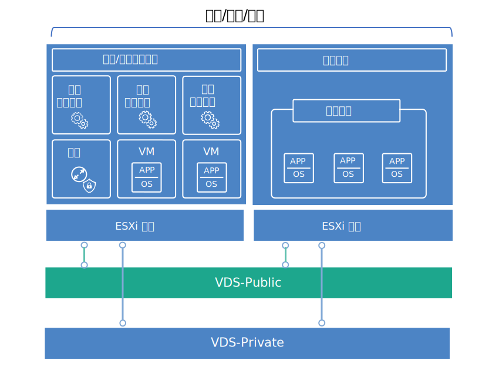

---

copyright:

  years:  2016, 2018

lastupdated: "2018-10-29"

---

{:tip: .tip}
{:note: .note}
{:important: .important}

# 虛擬基礎架構設計

虛擬基礎架構層級包含 VMware 軟體元件，這些元件會將實體基礎架構層級中提供的運算、儲存空間及網路資源虛擬化：VMware vSphere ESXi、VMware NSX 及選用的 VMware vSAN。

## VMware vSphere 設計

vSphere ESXi 配置包含下列層面：
* 開機配置
* 時間同步化
* 主機存取
* 使用者存取
* DNS 配置

表 1 概述每個層面的規格。在配置及安裝 ESXi 之後，會將主機新增至 VMware vCenter Server，且會從該處管理該主機。

此設計可讓您透過「直接主控台使用者介面 (DCUI)」、ESXi Shell 及「安全 Shell (SSH)」來存取虛擬主機。

依預設，唯一可以直接登入的使用者就是主機實體機器的 _root_ 及 _ibmvmadmin_ 使用者。管理者可以從 Microsoft Active Directory (MSAD) 網域新增使用者，讓使用者能夠存取主機。vCenter Server 解決方案設計中的所有主機都會配置為與中央 NTP 伺服器同步化。

表 1. vSphere ESXi 配置

| 屬性                   | 配置參數                |
|:---------------------- |:----------------------- |
| ESXi 開機位置          | 使用 RAID-1 中配置的本端磁碟 |
| 時間同步化             | 使用 {{site.data.keyword.cloud}} NTP 伺服器 |
| 主機存取               | 支援 DCUI、ESXi Shell 或 SSH |
| 使用者存取             | 本端鑑別及 MSAD |
| 網域名稱解析 | 使用 DNS（如[常見服務設計](design_commonservice.html)所述）。|

vSphere 叢集可存放虛擬機器 (VM)，它們會管理用於使用者工作負載的中央雲端及運算資源。

對於 Cloud Foundation 實例：
* 在起始部署時，實例包含 4 部 ESXi 主機。
* 您可以在部署後擴增為最多 32 部 ESXi 主機。

對於 vCenter Server 實例：
* 當實例僅使用 NFS 時，起始部署時的 ESXi 主機數目下限是 2，但對於 HA 的建議是 3。您可以在起始部署期間或起始部署後，擴增為最多 59 部 ESXi 主機。
* 實例使用 vSAN 時，起始部署時的 ESXi 主機數目下限是 4。您可以在起始部署期間或起始部署後，擴增為最多 59 部 ESXi 主機。

若要支援更多使用者工作負載，您可以執行下列動作來調整環境：  
* 部署現有叢集的其他運算主機
* 部署相同 vCenter Server Appliance 所管理的其他叢集
* 使用自己的 vCenter Server Appliance 部署新的 vCenter Server 或 Cloud Foundation 實例

如需叢集的相關資訊，請參閱[執行 VMware Clusters 解決方案架構文件的	{{site.data.keyword.cloud_notm}}](https://www.ibm.com/cloud/garage/files/IBM-Cloud-for-VMware-Solutions-Multicluster-Architecture.pdf)。

## VMware vSAN 設計

在此設計中，VMware vSAN 儲存空間會用於 Cloud Foundation 實例中，並可選擇性地用於 vCenter Server 實例中，以提供 vSphere 主機的共用儲存空間。

如圖 1 所示，vSAN 會將本端儲存空間聚集在 vSphere 叢集內的多部 ESXi 主機，並將聚集的儲存空間當成單一 VM 資料儲存庫來管理。在此設計內，運算節點包含 ESXi OS 及 vSAN 資料儲存庫的本端磁碟機。不論節點屬於哪一個叢集，每個節點都會包含兩個 1-TB SATA 磁碟機，以存放 ESXi 安裝。

圖 1. vSAN 概念

vSAN 會採用下列元件：
* 兩個磁碟群組的 vSAN 設計；每個磁碟群組各有兩個以上的磁碟。群組裡大小最小的一個 SSD 會充當快取層級，而其餘的 SSD 則充當容量層級。
* 針對兩個 OS 磁碟機除外的每個磁碟機，會配置 RAID-0 層次的機載 RAID 控制器。
* 會從所有儲存空間建立單一 vSAN 資料儲存庫。

可用的 vSAN 特性取決於您在訂購實例時所選取的授權版本。如需相關資訊，請參閱 [VMware vSAN 版本比較](appendix.html#vmware-vsan-edition-comparison)。

### vSAN 的虛擬網路設定

在此設計中，vSAN 資料流量會在專用的專用 VLAN 上，在 ESXi 主機之間遍訪。連接至專用網路交換器的兩張網路配接卡，在 vSphere 內配置為 vSphere Distributed Switch (vDS)，且兩張網路配接卡都作為上行鏈路。配置給 vSAN VLAN 的專用 vSAN 核心埠群組位於 vDS 內。針對專用 vDS 已啟用巨大訊框 (MTU 9000)。

vSAN 不會跨越上行鏈路來進行資料流量的負載平衡。因此，其中一張配接卡處於作用中狀態時，另一張配接卡會處於待命狀態，以支援高可用性 (HA)。vSAN 的網路失效接手原則，會配置為實體網路埠之間的**明確失效接手**。

如需實體 NIC 連線的相關資訊，請參閱[實體基礎架構設計](design_physicalinfrastructure.html)中的「圖 2. 實體主機 NIC 連線」。

### 儲存空間原則設計

啟用並配置 vSAN 時，會配置儲存空間原則以定義 VM 儲存空間性質。儲存空間性質會針對不同的 VM 指定不同的服務水準。

此設計中的預設儲存空間原則能容忍單一失敗。預設原則已配置 RAID 5 消除編碼，並將**失敗容錯方法**設為 **RAID-5/6（消除編碼）- 容量**、將**主要失敗層次**設為 1。

RAID 5 配置至少需要 4 部主機。或者，您也可以選擇 RAID 6 配置，並將**失敗容錯方法**設為 **RAID-5/6（消除編碼）- 容量**、將**主要失敗層次**設為 2。

RAID 6 配置至少需要 6 部主機。在預設儲存空間原則中，也會啟用**複製**及**壓縮**。

除非從 vSphere 主控台另有指定，否則實例會使用預設原則。配置自訂原則時，vSAN 將盡可能提供保證。不過，如果無法保證原則，則除非已啟用強制佈建，否則無法佈建使用該原則的 VM。

在新增 ESXi 主機或修補 ESXi 主機之後，必須重新套用儲存空間原則。

### vSAN 設定

vSAN 設定是根據在 {{site.data.keyword.cloud_notm}} 內部署 VMware 解決方案的最佳作法而設定。vSAN 設定包含 SIOC 設定、明確失效接手設定埠群組及磁碟快取設定。
* SSD 快取原則設定：無**先讀**、**寫入**、**直接** (NRWTD)
* 網路 I/O 控制設定
   * 管理 - 20 個共用
   * 虛擬機器 - 30 個共用
   * vMotion - 50 個共用
   * vSAN - 100 個共用
* vSAN 核心埠：**明確失效接手**

## VMware NSX 設計

網路虛擬化提供存在於虛擬層內的網路套版。網路虛擬化提供具有快速佈建、部署、重新配置及毀損隨需應變虛擬網路這類特性的架構。此設計使用 vDS 及 VMware NSX for vSphere 來實作虛擬網路。

在此設計中，NSX Manager 部署於起始叢集裡。NSX Manager 會獲指派專用可攜式位址區塊中的 VLAN 支援 IP 位址，這是指定給管理元件並已配置[常見服務設計](design_commonservice.html)中所顯示的 DNS 及 NTP 伺服器。NSX Manager 會使用表 2 所列的規格進行安裝。

表 2. NSX Manager 屬性

| 屬性            | 規格          |
|:--------------- |:------------- |
| NSX Manager     | 虛擬應用裝置 |
| vCPU 數目       |4 |
|記憶體| 16 GB |
| 磁碟            | 管理 NFS 共用上 60 GB |
| 磁碟類型        | 精簡佈建 |
|網路| 指定給管理元件的**專用 A** 可攜式 |

下圖顯示與架構中其他元件相對的 NSX Manager 放置。

圖 2. NSX Manager 網路概觀

在起始部署之後，{{site.data.keyword.cloud_notm}} 自動化會在起始叢集內部署三個 NSX Controller。每個控制器都會獲指派**專用 A** 可攜式子網路中的 VLAN 支援 IP 位址（這個子網路是指定給管理元件）。此外，此設計還會建立 VM-VM 反親緣性規則，以在叢集的主機之間區隔控制器。起始叢集必須至少包含三個節點，以確保控制器具有高可用性。

除了控制器之外，{{site.data.keyword.cloud_notm}} 自動化還會準備具有 NSX VIBS 的已部署 vSphere 主機，以便可以透過「VXLAN 通道端點 (VTEP)」來使用虛擬化網路。VTEP 會獲指派**專用 A** 可攜式 IP 位址範圍中的 VLAN 支援 IP 位址（這個 IP 位址範圍是指定給[實體基礎架構設計](design_physicalinfrastructure.html)的*表 1. VLAN 及子網路摘要* 中所列的 VTEP）。VXLAN 資料流量位於未加上標籤的 VLAN，並且會指派給專用 vDS。

然後，會指派區段 ID 儲存區，並將叢集裡的主機新增至傳輸區域。傳輸區域中只會使用單點播送，因為 {{site.data.keyword.cloud_notm}} 內未配置「網際網路群組管理通訊協定 (IGMP)」探查。

之後，即會部署 NSX Edge Services Gateway 配對。無論如何，都會將一個閘道配對用於來自位於專用網路之自動化元件的出埠資料流量。對於 vCenter Server，會部署稱為客戶管理邊緣的第二個閘道，並為其配置公用網路的上行鏈路，以及指派給專用網路的介面。如需已部署為解決方案一部分之 NSX Edge Services Gateway 的相關資訊，請參閱 [NSX Edge on 	{{site.data.keyword.cloud_notm}} 解決方案架構](https://www.ibm.com/cloud/garage/files/IBM_Cloud_for_VMware_Solutions_NSX_Edge_Services_Gateway.pdf)。

雲端管理者可以配置任何必要的 NSX 元件（例如「分散式邏輯路由器 (DLR)」、邏輯交換器及防火牆）。可用的 NSX 特性取決於您在訂購實例時所選擇的 NSX 授權版本。如需相關資訊，請參閱 [VMware NSX 版本比較](appendix.html#vmware-nsx-edition-comparison)。對於 vCenter Server 實例，{{site.data.keyword.cloud_notm}} 自動化會將 vCenter Server Appliance 及 Platform Services Controller (PSC) 新增至 NSX Manager 分散式防火牆排除清單。

### 分散式交換器設計

此設計使用最少數目的「vDS 交換器」。叢集裡的主機已連接至公用及專用網路。主機已配置兩台分散式虛擬交換器。兩台交換器的使用遵循區隔公用與專用網路的 {{site.data.keyword.cloud_notm}} 網路作法。下圖顯示 vDS 設計。

圖 3. 分散式交換器設計

如圖所示，將一個 vDS 配置給公用網路連線功能 (SDDC-Dswitch-Public)，並將另一個 vDS 配置給專用網路連線功能 (SDDC-Dswitch-Private)。

需要區隔不同類型的資料流量，以降低競用及延遲並提高安全。VLAN 用來區隔實體網路功能。

此設計使用三個 VLAN：兩個用於專用網路資料流量，一個用於公用網路資料流量。下表顯示資料流量區隔。

表 3. VLAN 與資料流量類型的對映

|VLAN      | 指定        | 資料流量類型 |
|:----- |:----------- |:------------ |
|VLAN1     | 公用        | 可用於網際網路存取 |
|VLAN2     | 專用 A      | ESXi 管理、管理、VXLAN (VTEP) |
|VLAN3     | 專用 B      | vSAN、NFS、vMotion |

工作負載中的資料流量將會在 VXLAN 支援的邏輯交換器上流動。

vSphere 叢集使用兩個如下列各表所配置的 vSphere Distributed Switch。

表 4. 聚合的叢集分散式交換器

| vSphere Distributed Switch 名稱 |功能                          |網路 I/O 控制 | 負載平衡 模式 | 實體 NIC 埠 | MTU |
|:------------- |:------------- |:------------- |:------------- |:------------- |:------------- |
| SDDC-Dswitch-Private | ESXi 管理、vSAN、vSphere vMotion、VXLAN 通道端點、NFS (VTEP) | 啟用 |根據明確失效接手 (vSAN、vMotion) 來源虛擬埠遞送（所有其他項目）|2 | 9,000 （巨大訊框）|
| SDDC-Dswitch-Public |外部管理資料流量（垂直通訊）| 啟用 |根據來源虛擬埠遞送|2 | 1,500 （預設值）|

取決於 {{site.data.keyword.CloudDataCent_notm}} 及您選取的主機硬體，主機 NIC 的名稱、數目及順序可能會不同。{:note}

表 5. 聚合的叢集分散式交換器埠群組配置設定

| 參數               | 設定          |
|:------------------ |:------------- |
| 負載平衡           |根據來源虛擬埠遞送 \*|
| 失效接手偵測       | 僅限鏈結狀態 |
| 通知交換器         | 啟用 |
| 失效回復           | 否              |
| 失效接手順序       | 作用中的上行鏈路：Uplink1、Uplink2 \* |

\* vSAN 埠群組會使用作用中或待命的明確失效接手，因為它不支援進行 vSAN 儲存空間資料流量的負載平衡。{:note}

表 6. 聚合的叢集虛擬交換器埠群組及 VLAN

| vSphere Distributed Switch | 埠群組名稱 | 小組 | 上行鏈路 | VLAN ID |
|:------------- |:------------- |:------------- |:------------- |:---------- |
| SDDC-Dswitch-Private | SDDC-DPortGroup-Mgmt |來源虛擬埠| 作用中：0、1 |VLAN1     |
| SDDC-Dswitch-Private | SDDC-DPortGroup-vMotion |來源虛擬埠| 作用中：0、1 |VLAN2     |
| SDDC-Dswitch-Private | SDDC-DPortGroup-VSAN | 明確失效接手 | 作用中：0 待命：1 |VLAN2     |
| SDDC-Dswitch-Private | SDDC-DPortGroup-NFS |來源虛擬埠| 作用中：0、1 |VLAN2     |
| SDDC-Dswitch-Private | 由 NSX 自動產生 |來源虛擬埠| 作用中：0、1 |VLAN1     |
| SDDC-Dswitch-Public | SDDC-DPortGroup-External |來源虛擬埠| 作用中：0、1 |VLAN3     |

表 7. 聚合的叢集 VM 核心配接卡

| vSphere Distributed Switch | 用途 | 連接的埠群組 | 啟用的服務 | MTU |
|:-------------------------- |:------- |:-------------------- |:---------------- |:--- |
| SDDC-Dswitch-Private | 管理 | SDDC-DPortGroup-Mgmt | 管理資料流量 | 1,500 （預設值）|
| SDDC-Dswitch-Private | vMotion | SDDC-DPortGroup-vMotion | vMotion 資料流量 | 9,000 |
| SDDC-Dswitch-Private | VTEP | *由 NSX 自動產生* | \- | 9,000 |
| SDDC-Dswitch-Private | VSAN | SDDC-DPortGroup-VSAN |vSAN                | 9,000 |
| SDDC-Dswitch-Private | NAS | SDDC-DPortGroup-NFS | \-  | 9,000 |

### NSX 配置

此設計指定 NSX 元件的配置，但不會套用任何網路套版元件配置。您可以根據需求來設計網路套版。已預先配置下列層面：

* 管理伺服器及控制器已安裝並整合至 vCenter Web 使用者介面
* 已安裝 ESXi 代理程式，並配置每部 ESXi 主機的 VTEP IP 位址
* VTEP 配置、控制器配置及 VXLAN 配置（傳輸區域）
* 供管理元件使用的 NSX Edge Services Gateway 應用裝置
* 僅適用於 vCenter Server 實例：供客戶使用的 NSX Edge Services Gateway 應用裝置

未配置下列層面：
* 虛擬分散式路由器
* 微分段
* VXLAN
* 將「NSX 管理」鏈結至其他 VMware 實例

### 相關鏈結

* [{{site.data.keyword.cloud_notm}} running VMware clusters solution architecture](https://www.ibm.com/cloud/garage/files/IBM-Cloud-for-VMware-Solutions-Multicluster-Architecture.pdf)
* [NSX Edge on {{site.data.keyword.cloud_notm}} solution architecture](https://www.ibm.com/cloud/garage/files/IBM_Cloud_for_VMware_Solutions_NSX_Edge_Services_Gateway.pdf)
