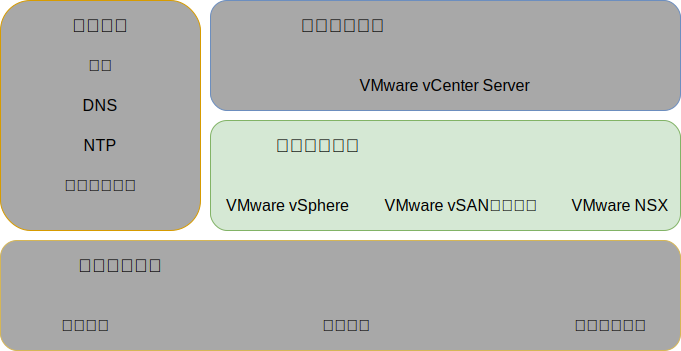
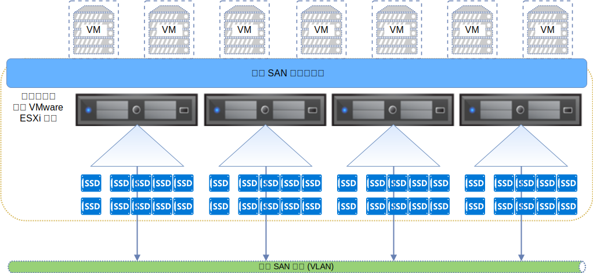
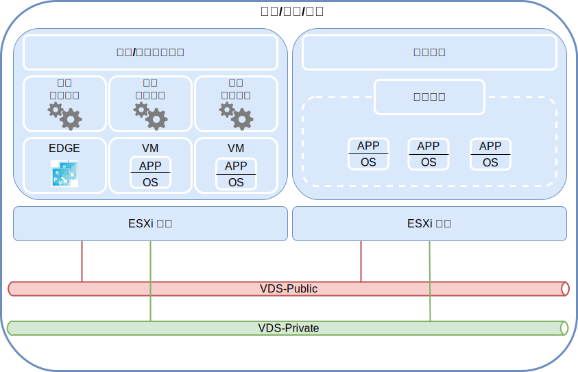

---

copyright:

  years:  2016, 2019

lastupdated: "2019-06-21"

subcollection: vmware-solutions

---

{:tip: .tip}
{:note: .note}
{:important: .important}

# 虛擬基礎架構設計
{: #design_virtualinfrastructure}

虛擬基礎架構層級包含 VMware 軟體元件，這些元件會將實體基礎架構層級中提供的運算、儲存空間及網路資源虛擬化：VMware vSphere ESXi、VMware NSX-V 或 NSX-T，以及選用的 VMware vSAN。

## VMware vSphere 設計
{: #design_virtualinfrastructure-vsphere-design}

vSphere ESXi 配置包含下列層面：
* 開機配置
* 時間同步化
* 主機存取
* 使用者存取
* DNS 配置

下表概述每個層面的規格。在配置及安裝 ESXi 之後，會將主機新增至 VMware vCenter Server，且會從該處管理該主機。

此設計可讓您透過「直接主控台使用者介面 (DCUI)」及 vSphere Web Client 來存取虛擬主機。「安全 Shell (SSH)」及 ESXi Shell 會在佈建為最佳作法之後停用。

依預設，唯一可以直接登入的使用者就是主機實體機器的 _root_ 及 _ibmvmadmin_ 使用者。管理者可以從 Microsoft Active Directory (MSAD) 網域新增使用者，讓使用者能夠存取主機。vCenter Server 解決方案設計中的所有主機都會配置為與中央 NTP 伺服器同步化。

表 1. vSphere ESXi 配置

| 屬性                   | 配置參數                |
|:---------------------- |:----------------------- |
| ESXi 開機位置          | 使用 RAID-1 中配置的本端磁碟 |
| 時間同步化             | 使用 {{site.data.keyword.cloud}} NTP 伺服器 |
| 主機存取               | 支援 DCUI。支援 SSH 及 ESXi Shell，但依預設不會啟用 |
| 使用者存取             | 本端鑑別及 MSAD |
| 網域名稱解析 |使用 DNS（如[共用服務設計](/docs/services/vmwaresolutions/archiref/solution?topic=vmware-solutions-design_commonservice)所述）。|
| EVC 模式 | Skylake（僅適用於“greenfield”vSphere 6.7 部署）|

vSphere 叢集可存放虛擬機器 (VM)，它們會管理 vCenter Server 實例，以及用於使用者工作負載的運算資源。

* 當 vCenter Server 實例使用 vSAN 時，起始部署時的 ESXi 主機數目下限是 4。
* 當 vCenter Server 實例使用共用檔案層次或區塊層次儲存空間時，起始部署時的 ESXi 主機數目下限是 3。

您可以在起始部署期間或起始部署後，擴增為最多 59 部 ESXi 主機。

若要支援更多使用者工作負載，您可以執行下列動作來調整環境：  
* 在現有叢集中部署其他運算主機
* 部署相同 vCenter Server Appliance 所管理的其他叢集
* 部署新的 vCenter Server 實例，搭配它們自己的 vCenter Server Appliance

如需叢集的相關資訊，請參閱[{{site.data.keyword.cloud_notm}}執行 VMware 叢集解決方案架構](https://www.ibm.com/cloud/garage/files/IBM-Cloud-for-VMware-Solutions-Multicluster-Architecture.pdf)。

## VMware vSAN 設計
{: #design_virtualinfrastructure-vsan-design}

在此設計中，VMware vSAN 儲存空間會用於 Cloud Foundation 實例中，以提供 vSphere 主機的共用儲存空間。

如下圖所示，vSAN 會將多部 ESXi 主機間的本端儲存空間聚集在 vSphere 叢集內，並將聚集的儲存空間當成單一 VM 資料儲存庫來管理。在此設計中，運算節點包含「ESXi 作業系統」的本端磁碟機，以及 vSAN 資料儲存庫。不論節點屬於哪一個叢集，每個節點都會包含兩個作業系統磁碟機，以存放 ESXi 安裝。

vSAN 會採用下列元件：
* 兩個磁碟群組的 vSAN 設計；每個磁碟群組各有兩個以上的磁碟。群組裡大小最小的一個 SSD 或 NVMe 會充當快取層級，而其餘的 SSD 則充當容量層級。
* 針對兩個 OS 磁碟機除外的每個磁碟機，在 RAID-0 陣列中配置機載 RAID 控制器。
* 會從所有儲存空間建立單一 vSAN 資料儲存庫。

可用的 vSAN 特性取決於您在訂購實例時所選取的授權版本。如需相關資訊，請參閱 [VMware vSAN 版本比較](/docs/services/vmwaresolutions/archiref/solution?topic=vmware-solutions-solution-appendix#vmware-vsan-edition-comparison)。

### vSAN 的虛擬網路設定
{: #design_virtualinfrastructure-net-setup}

在此設計中，vSAN 資料流量會在專用 VLAN 上，在 ESXi 主機之間遍訪。連接至專用網路交換器的兩張網路配接卡，在 vSphere 內配置為 vSphere Distributed Switch (vDS)，且兩張網路配接卡都作為上行鏈路。配置給 vSAN VLAN 的專用 vSAN 核心埠群組位於 vDS 內。針對專用 vDS 已啟用巨大訊框 (MTU 9000)。

vSAN 不會跨越上行鏈路來進行資料流量的負載平衡。因此，其中一張配接卡處於作用中狀態時，另一張配接卡會處於待命狀態，以支援高可用性 (HA)。vSAN 的網路失效接手原則，會配置為實體網路埠之間的**明確失效接手**。

如需實體 NIC 連線的相關資訊，請參閱[實體主機 NIC 連線](/docs/services/vmwaresolutions/services?topic=vmware-solutions-design_physicalinfrastructure#design_physicalinfrastructure-host-connect)。

### vSAN 原則設計
{: #design_virtualinfrastructure-storage-policy}

已啟用並配置 vSAN 時，會配置儲存空間原則以定義 VM 儲存空間性質。儲存空間性質會針對不同的 VM 指定不同的服務水準。

此設計中的預設儲存空間原則能容忍單一失敗。預設原則已配置消除編碼，並將**失敗容錯方法**設為 **RAID-5/6（消除編碼）- 容量**、將**主要失敗層次**設為 1。RAID 5 配置至少需要四部主機。

或者，您也可以選擇 RAID 6 配置，並將**失敗容錯方法**設為 **RAID-5/6（消除編碼）- 容量**、將**主要失敗層次**設為 2。RAID 6 配置至少需要六部主機。在預設儲存空間原則中，也會啟用**複製**及**壓縮**。

除非從 vSphere 主控台另行指定，否則實例會使用預設原則。配置自訂原則時，vSAN 將盡可能提供保證。不過，如果無法保證原則，則除非已啟用強制佈建，否則無法佈建使用該原則的 VM。

在新增 ESXi 主機或修補 ESXi 主機之後，必須重新套用儲存空間原則。

### vSAN 設定
{: #design_virtualinfrastructure-vsan-sett}

vSAN 設定是根據在 {{site.data.keyword.cloud_notm}} 內部署 VMware 解決方案的最佳作法而配置。vSAN 設定包含 SIOC 設定、明確失效接手設定埠群組及磁碟快取設定。
* SSD 快取原則設定：無**先讀**、**寫入**、**直接** (NRWTD)
* 網路 I/O 控制設定
   * 管理 - 20 個共用
   * 虛擬機器 - 30 個共用
   * vMotion - 50 個共用
   * vSAN - 100 個共用
* vSAN 核心埠：**明確失效接手**

## NFS 連接儲存空間
{: #design_virtualinfrastructure-nfs-storage}

使用 NFS 網路連接儲存空間時，此架構規定使用 NFS 第 3 版而不是 NFS 4.1 版，因為使用後者時 NFS 伺服器 LIF 移轉可能會導致延遲過長。每個 vSphere 主機使用其主機名稱連接至 NFS 儲存空間。

一個 2 TB NFS 資料儲存庫連接到叢集，以供管理元件將其與效能層級 4 IOPS/GB 配合使用。可以將更多資料儲存庫連接到叢集以供工作負載使用，實現各種大小和效能層級。

此外，此架構要求所有主機都為 NFS 儲存空間所在的子網路建立了子網路路徑。此子網路路徑的目的是指示所有 NFS 資料流量使用此設計指定用於 NFS 資料流量的埠群組、子網路和 VLAN。如果連接了多個 NFS 資料儲存庫，可能需要配置多個路徑，因為這些資料儲存庫可能位於不同的遠端子網路中。

管理虛擬機器可能位於 NFS 資料儲存庫上。這會產生引導問題，因為某些管理機器可能負責用於解析 NFS 主機名稱的 DNS 服務。因此，此架構指定管理資料儲存庫的至少一個 IP 位址要寫在每部主機上的 `/etc/hosts`。

## VMware NSX-V 設計
{: #design_virtualinfrastructure-nsx-design}

網路虛擬化提供存在於虛擬層內的網路層疊。網路虛擬化提供具有諸如快速佈建、部署、重新配置及毀損隨需應變虛擬網路等特性的架構。此設計使用 vDS 及 VMware NSX for vSphere 來實作虛擬網路。

在此設計中，NSX Manager 部署於起始叢集裡。NSX Manager 會獲指派專用可攜式位址區塊中的 VLAN 支援 IP 位址，這個區塊已指定給管理元件並已配置[共用服務設計](/docs/services/vmwaresolutions/archiref/solution?topic=vmware-solutions-design_commonservice)中所呈現的 DNS 及 NTP 伺服器。

下圖顯示與架構中其他元件相對的 NSX Manager 放置。

在起始部署之後，{{site.data.keyword.cloud_notm}} 自動化會在起始叢集內部署三個 NSX Controller。每個控制器都會獲指派**專用 A** 可攜式子網路中的 VLAN 支援 IP 位址（這個子網路是指定給管理元件）。此外，此設計還會建立 VM-VM 反親緣性規則，以在叢集的主機之間區隔控制器。起始叢集必須至少包含三個節點，以確保控制器具有高可用性。

除了控制器之外，{{site.data.keyword.cloud_notm}} 自動化還會準備具有 NSX VIBS 的已部署 vSphere 主機，以便可以透過「VXLAN 通道端點 (VTEP)」來使用虛擬化網路。VTEP 會獲指派**專用 A** 可攜式 IP 位址範圍中的 VLAN 支援 IP 位址，而這個 IP 位址範圍是指定給 [VLAN](/docs/services/vmwaresolutions/services?topic=vmware-solutions-design_physicalinfrastructure#design_physicalinfrastructure-vlans) 中列出的 VTEP。VXLAN 資料流量位於未加上標籤的 VLAN，並且會指派給專用 vDS。

然後，會指派區段 ID 儲存區，並將叢集裡的主機新增至傳輸區域。傳輸區域中只會使用單點播送，因為 {{site.data.keyword.cloud_notm}} 內未配置「網際網路群組管理通訊協定 (IGMP)」探查。根據 VMW 最佳作法，每部主機會在相同的 VTEP 專用子網路上配置兩個 VTEP 核心埠。

之後，如果實例具有公用網路介面，則會部署兩個 NSX Edge Services Gateway 配對。一個閘道配對用於來自位於專用網路之自動化元件的出埠資料流量。系統會部署稱為客戶管理邊緣的第二個閘道，並為其配置連往公用網路的上行鏈路，以及指派給專用網路的介面。如需已部署為解決方案一部分之 NSX Edge Services Gateway 的相關資訊，請參閱 [NSX Edge Services Gateway 解決方案架構](/docs/services/vmwaresolutions/services?topic=vmware-solutions-nsx_overview#nsx_overview)。

雲端管理者可以配置任何必要的 NSX 元件，例如「分散式邏輯路由器 (DLR)」、邏輯交換器及防火牆。可用的 NSX 特性取決於您在訂購實例時所選擇的 NSX 授權版本。如需相關資訊，請參閱 [VMware NSX 版本比較](/docs/services/vmwaresolutions/archiref/solution?topic=vmware-solutions-solution-appendix#vmware-nsx-edition-comparison)。

NSX Manager 會使用下表所列的規格進行安裝。

表 3. NSX Manager 需求

| 屬性            | 規格          |
|:--------------- |:------------- |
| NSX Manager     | 虛擬應用裝置 |
| vCPU 數目       |4 |
|記憶體| 16 GB |
| 磁碟            | 管理 NFS 共用上 60 GB |
| 磁碟類型        | 精簡佈建 |
|網路| 指定給管理元件的**專用 A** 可攜式 |

### 分散式交換器設計
{: #design_virtualinfrastructure-distr-switch}

此設計使用最少數目的「vDS 交換器」。叢集裡的主機已連接至公用及專用網路。主機已配置兩台分散式虛擬交換器。兩台交換器的使用遵循區隔公用與專用網路的 {{site.data.keyword.cloud_notm}} 網路作法。下圖顯示 vDS 設計。

如上圖所示，一個 vDS 已配置給公用網路連線功能 (SDDC-Dswitch-Public)，另一個 vDS 則配置給專用網路連線功能 (SDDC-Dswitch-Private)。需要區隔不同類型的資料流量，以降低競用及延遲並提高安全。

VLAN 用來區隔實體網路功能。此設計使用三個 VLAN：兩個用於專用網路資料流量，一個用於公用網路資料流量。下表顯示資料流量區隔。

表 4. VLAN 與資料流量類型的對映

|VLAN      | 指定        | 資料流量類型 |
|:----- |:----------- |:------------ |
|VLAN 1| 專用 A      | ESXi 管理、管理、VXLAN (VTEP) |
|VLAN 2| 專用 B      |vSAN、NFS 和 vMotion|
|VLAN 3| 公用        | 可用於網際網路存取 |

工作負載中的資料流量將會在 VXLAN 支援的邏輯交換器上流動。

vSphere 叢集使用兩台如下列各表所配置的 vSphere Distributed Switch。

表 5. 聚合叢集分散式交換器

| vSphere Distributed Switch 名稱 |功能                          |網路 I/O 控制 | 負載平衡 模式 | 實體 NIC 埠 | MTU |
|:------------- |:------------- |:------------- |:------------- |:------------- |:------------- |
| SDDC-Dswitch-Private | ESXi 管理、vSAN、vSphere vMotion、VXLAN 通道端點、NFS (VTEP) | 啟用 |根據明確失效接手 (vSAN、vMotion) 來源虛擬埠遞送（所有其他項目）|2 | 9,000 （巨大訊框）|
| SDDC-Dswitch-Public |外部管理資料流量（垂直通訊）| 啟用 |根據來源虛擬埠遞送|2 | 1,500 （預設值）|

取決於 {{site.data.keyword.CloudDataCent_notm}} 及您選取的主機硬體，主機 NIC 的名稱、數目及順序可能會不同。
{:note}

表 6. 聚合的叢集分散式交換器埠群組配置設定

| 參數               | 設定          |
|:------------------ |:------------- |
| 負載平衡           |根據來源虛擬埠遞送 \*|
| 失效接手偵測       | 僅限鏈結狀態 |
| 通知交換器         | 啟用 |
| 失效回復           | 否              |
| 失效接手順序       | 作用中的上行鏈路：Uplink1、Uplink2 \* |

\* vSAN 埠群組會使用作用中或待命的明確失效接手，因為它不支援進行 vSAN 儲存空間資料流量的負載平衡。
{:note}

表 7. 聚合的叢集虛擬交換器埠群組及 VLAN、分散式交換器 **SDDC-Dswitch-Private**

埠群組| 小組 | 上行鏈路 | VLAN ID 
---|---|---|--
 SDDC-DPortGroup-Mgmt |來源虛擬埠| 作用中：0、1 |VLAN 1
 SDDC-DPortGroup-vMotion |來源虛擬埠| 作用中：0、1 |VLAN 2
 SDDC-DPortGroup-VSAN | 明確失效接手 |作用中：0、待命：1|VLAN 2
 SDDC-DPortGroup-NFS |來源虛擬埠| 作用中：0、1 |VLAN 2
NSX 產生的|來源虛擬埠| 作用中：0、1 |VLAN 1
 SDDC-DPortGroup-External |來源虛擬埠| 作用中：0、1 |VLAN 3

表 8. 聚合的叢集 VMkernel 配接卡、分散式交換器 **SDDC-Dswitch-Private**

 用途 | 連接的埠群組 | 啟用的服務 | MTU 
--|---|---|---|--
管理| SDDC-DPortGroup-Mgmt |管理資料流量|1500（預設值）
 vMotion | SDDC-DPortGroup-vMotion |vMotion 資料流量|9000
 VTEP |NSX 產生的|-|9000
vSAN| SDDC-DPortGroup-VSAN |vSAN|9000
 NAS | SDDC-DPortGroup-NFS | NAS |9000

### NSX 配置
{: #design_virtualinfrastructure-nsx-config}

此設計指定 NSX 元件的配置，但不會套用任何網路層疊元件配置。您可以根據需求來設計網路層疊。

已預先配置下列層面：
* 管理伺服器及控制器已安裝並整合至 vCenter Web 使用者介面
* 已安裝 ESXi 代理程式，並配置每部 ESXi 主機的 VTEP IP 位址
* VTEP 配置、控制器配置及 VXLAN 配置（傳輸區域）
* 供管理元件使用的 NSX Edge Services Gateway 應用裝置
* 供客戶使用的 NSX Edge Services Gateway 應用裝置
* 連接至分散式本端路由器 (DLR) 的 NSX VXLAN 工作客戶工作負載，在 DLR 與客戶 ESG 之間有一個傳輸 VXLAN。
* 用於 VXLANs 及 IBM Cloud 專用和公用可攜式 IP 空間的 RFC 1918 位址空間，以用作客戶 ESG 上的 Egress 網路

未配置下列層面：
* 微分段
* 將「NSX 管理」鏈結至其他 VMware 實例

## 公用網路連線功能

有多種原因可能需要將公用網路連線功能用於實例。這可能包括存取公用更新服務或其他公用服務以處理工作負載，例如地理位置資料庫或天氣資料。此外，虛擬化管理和附加程式服務也可能需要或受益於公用連線功能。例如，vCenter 可以更新其 HCL 資料庫，並透過公用網路取得 [VMware Update Manager (VUM)](/docs/services/vmwaresolutions/archiref/vum?topic=vmware-solutions-vum-intro) 更新項目。Zerto、Veeam、VMware HCX、F5 BIG-IP 及 FortiGate-VM 全都將公用網路連線功能用於其產品授權、啟動或用量報告的某一部分。除此之外，您可能基於抄寫目的使用公用網路上的通道，連線至內部部署資料中心。

通常，透過管理或客戶 Edge Services Gateway (ESG)，選擇性地將這些通訊遞送及 NAT 至公用網路。但是，您可能有更多安全需求，或者可能更願意使用 Proxy 來簡化通訊路徑。此外，如果您已在公用介面停用的情況下部署實例，則將無法使用 ESG 來遞送至公用網路。

此架構容許使用下列選項將資料流量遞送或 Proxy 至公用網路：

方法|說明       |限制
--|--|--
虛擬化閘道|跨專用和公用網路部署虛擬化閘道（例如，NSX ESG、F5 BIG-IP、FortiGate-VM 或您選擇的虛擬應用裝置）。在來源系統上配置遞送（例如，vCenter、Zerto、您的工作負載），僅將公用網路資料流量導向至閘道，並根據您的需求配置閘道。|僅適用於已啟用公用介面的實例。此配置同時容許出埠及入埠資料流量型樣。
搭配 Proxy 的虛擬化閘道|如上所述部署虛擬化閘道。在此閘道後面，[部署 Proxy 伺服器](/docs/services/vmwaresolutions/archiref/vum?topic=vmware-solutions-vum-init-config#vum-init-config)，並配置您的服務及應用程式，以透過此 Proxy 連接至公用網路。|僅適用於已啟用公用介面的實例。出埠資料流量型樣可以使用 Proxy，但必須在閘道上管理入埠資料流量型樣。
硬體閘道|將[硬體閘道應用裝置](https://cloud.ibm.com/catalog/infrastructure/gateway-appliance)部署至您的管理 VLAN。根據您的需求，將閘道配置為以 NAT 出埠連接至公用網路。|適用於所有已啟用或未啟用公用介面的實例。此配置同時容許出埠及入埠資料流量型樣。
搭配 Proxy 的硬體閘道|如上所述部署閘道應用裝置。在此閘道後面，[部署 Proxy 伺服器](/docs/services/vmwaresolutions/archiref/vum?topic=vmware-solutions-vum-init-config#vum-init-config)，並配置您的服務及應用程式，以透過此 Proxy 連接至公用網路。|適用於所有已啟用或未啟用公用介面的實例。出埠資料流量型樣可以使用 Proxy，但入埠資料流量型樣必須由閘道管理。
負載平衡器|IBM Cloud 會提供數個[負載平衡器服務](https://cloud.ibm.com/catalog/infrastructure/load-balancer-group)，您可以用來提供對應用程式的入埠網路存取權。|適用於所有實例，但限制為入埠資料流量型樣。

## 相關鏈結
{: #design_virtualinfrastructure-related}

* [{{site.data.keyword.cloud_notm}} running VMware clusters solution architecture](https://www.ibm.com/cloud/garage/files/IBM-Cloud-for-VMware-Solutions-Multicluster-Architecture.pdf)
* [NSX Edge Services Gateway 解決方案架構](/docs/services/vmwaresolutions/services?topic=vmware-solutions-nsx_overview#nsx_overview)
