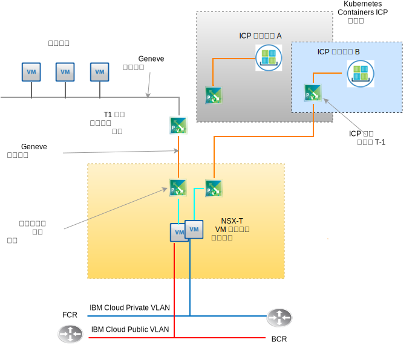

---

copyright:

  years:  2016, 2019

lastupdated: "2019-06-03"

subcollection: vmware-solutions

---

# VMware NSX-T 設計
{: #nsx-t-design}

與 NSX-V（vSphere 上的 NSX）不同，VMware NSX-T 設計成處理具有異質端點及技術堆疊的應用程式架構。除了 vSphere 之外，這些環境還可以包括其他 Hypervisor、KVM、容器及裸機。NSX 的設計是要跨距各平台的軟體定義網路和安全基礎架構，而不只是 vSphere。雖然可以在不需要 vSphere 的情況下部署 NSX-T 元件，但此設計著重在 NSX-T 上，且其整合主要在 vCenter Server vSphere 自動化部署內。

NSX-T 內有許多進階特性，例如防火牆原則、在防火牆原則內併入來賓內部檢查，以及進階網路流程追蹤。說明這些特性不在本文件的範圍內。請參閱 NSX-T 的 VMware 文件。在此設計中，「NSX-T 管理基礎架構」是在起始 vCenter Server 叢集部署期間部署的，用來取代 NSX-V。

## NSX-T 與 NSX-V
{: #nsx-t-design-nsx-t-nsx-v}

對於 vSphere 原生 NSX (NSX-V)，請檢閱下列其他已知的 NSX-T 物件，其中具有與其 NSX-V 對應項目類似的功能。也會討論 vSphere 環境內的限制及差異。下表列出 T 與 V 之間對應的常用功能。

表 1. NSX-V 與 NSX-T 術語

NSX-V 或 vSphere 原生 |NSX-T
--|:---|:--
**虛擬分散式交換器** | 網路虛擬分散式交換器 (N-VDS)
**NSX 傳輸區域** | 傳輸區域（層疊或 VLAN 支援）
**埠群組 (vDS)** | 邏輯交換器
**VXLAN（L2 封裝）** | GENEVE（L2 封裝）
**Edge 閘道** | T0 閘道（自 2.4 版起變更）
**分散式邏輯路由器** | T1 閘道（自 2.4 版起變更）
**ESXi 伺服器 (vTEP)** | 傳輸節點（ESXi、KVM 祼機 T0 閘道）

由於此設計的 NSX-T 實作，有一些重要的 NSX-T 概念，並未對應於需要瞭解的 NSX-V 功能。

如下所示：
- 邊緣叢集是參與 NSX-T 虛擬光纖的一部以上 VM 或實體機器。它們是層疊網路傳輸區域和 VLAN 支援之傳輸區域的端點。邊緣叢集可以支援多個 T-0 閘道實例。
- T-0 閘道是虛擬路由器實例，但不是 VM。邊緣叢集內可執行多個 T-0 閘道實例，每個實例都具有自己的遞送表和功能。這表示，邊緣叢集必須存在，您才能建立 T-0 路由器實例。
- 傳輸區域可以跨越不同平台及多個 vSphere vCenter 實例之間的端點。不需要任何交叉 vCenter 鏈結的 NSX。可以排除特定端點中的傳輸區域。N-VDS 會直接與傳輸區域產生關聯，並在建立傳輸區域時建立。
- 系統會建立與特定邏輯交換器無關的上行鏈路失效接手順序，因為這些邏輯交換器會在設定檔中建立為「上行鏈路設定檔」，並根據 VLAN 套用至特定邏輯交換器。因為可能需要不同的失效接手順序，或需要為相同 VLAN 進行實體上行鏈路的負載平衡，所以特定 VLAN 的上行鏈路設定檔可以包含多個「團隊」項目，其中具有不同的失效接手順序和負載平衡。將上行鏈路設定檔指派給邏輯交換器後，接著就會選擇特定的團隊設定檔。

- 從 NSDX-T 2.4 開始，管理程式 VM 和控制器 VM 功能結合在一起。此情況導致會部署三個控制器管理程式 VM。如果在相同的子網路上，則它們會使用內部網路負載平衡器。如果分散在不同的子網路，則需要外部負載平衡器。

## 資源需求
{: #nsx-t-design-resource-req}

在此設計中，NSX-T Manager 控制器 VM 會部署在起始叢集上。此外，每個控制器管理程式會獲指派專用可攜式位址區塊中的 VLAN 支援 IP 位址（這個區塊已指定給管理元件，並已配置第 0 節中討論的 DNS 和 NTP 伺服器）。下表顯示 NSX Manager 安裝的摘要。

表 2. NSX-T Manager - 控制器規格

 屬性            | 規格                           
--|--
**NSX Manager / 控制器** | 3 個虛擬應用裝置
**vCPU 數目** |4 
**記憶體** | 16 GB 
**磁碟** |60 GB
**磁碟類型** | 精簡佈建                     
**NetworkPrivate A** | 專用 A      

下圖顯示 NSX Manager 控制器相對於此架構中其他元件的放置位置。

## 部署考量
{: #nsx-t-design-deployment}

使用 vSphere 上的 NSX-T 時，N-VDS 必須獲指派主機內的實體配接卡。由於只能在 NSX-T Manager 內配置 N-VDS，這意味，若要維護備援，則在存放 NSX-T 元件和關聯的層疊網路元件的叢集中，沒有任何實體配接卡可用於原生本端交換器或 vDS 指派。

因此，在安裝及配置 NSX-T 期間，必須仍將一個配接卡上的一個實體 NIC 埠指派給本端 vSphere vSwitch 或虛擬分散式交換器 (vDS)。在部署 NSX-T 之後，需要將所有 ESX 核心埠移轉至 N-VDS，並關閉任何本端 vSwitch 或 VDS。在移除核心埠之後，剩餘的實體 NIC 埠可以指派為 N-VDS 上行鏈路，以到達備援 N-VDS。

在起始部署之後，{{site.data.keyword.cloud_notm}} 自動化會在起始叢集內部署三個「NSX-T Manager/控制器」虛擬應用裝置。控制器會獲指派「專用 A」可攜式子網路中的 VLAN 支援 IP 位址（這個子網路已指定給管理元件）。此外，還會建立 VM-VM 反親緣性規則，以在叢集中的各主機間區隔控制器。

您必須部署至少有三個節點的起始叢集，以確保「管理程式/控制器」的高可用性。除了管理程式/控制器之外，{{site.data.keyword.cloud_notm}} 自動化還會準備已部署的 vSphere 主機，作為 NSX-T 傳輸節點。ESXi 傳輸節點會獲指派「專用 A」可攜式 IP 位址範圍中的 VLAN 支援 IP 位址，而這個 IP 位址範圍是由衍生自「VLAN 及子網路摘要」的 NSX IP 儲存區範圍所指定。傳輸節點資料流量位於未加上標籤的 VLAN，並且會指派給專用 NSX-T 虛擬分散式交換器 (N-VDS)。

根據客戶選擇要部署的 NSX-T 拓蹼，「NSX-T 邊緣叢集」不是部署為一對 VM，就是部署為裸機叢集節點上部署的軟體。不論叢集配對是虛擬還是實體，上行鏈路都會配置成 {{site.data.keyword.cloud_notm}} 公用和專用網路的 N-VDS 交換器。

下表彙總中型環境的需求。

表 3. NSX-T 元件規格

 資源 | 管理程式控制器 x3 | 邊緣叢集 x2 | 裸機邊緣
-----------|:---------|:-------|:---------
**中型** | 虛擬應用裝置 | 虛擬應用裝置 | 實體伺服器
**vCPU 數目** |4 |4 | 8                                   
**記憶體** | 16 GB | 8 GB          |32 GB
**磁碟** |120 GB VSAN/管理 NFS| 120 GB VSAN/管理 NFS |200 GB
**磁碟類型** | 精簡佈建                            | 精簡佈建                            |實體
**網路** | 專用 A    | 專用 A    | 專用 A      

## 傳輸區域及 N-VDS
{: #nsx-t-design-transport-zones}

傳輸區域指出哪些主機和 VM 可以參與特定網路的使用。傳輸區域會藉由限制哪些主機可以「看到」邏輯交換器來執行此動作，因此，也看到哪些 VM 可以連接至邏輯交換器。傳輸區域可以跨越一個以上的主機叢集。此設計要求建立傳輸區域，如下所示：

表 4. NSX-T 傳輸區域及 N-VDS

傳輸區域名稱 | VLAN/VXLAN | N-VDS 名稱 | 上行鏈路團隊原則
--|:-------|:------|:-----
**Private-Overlay** |VXLAN| SDDC-Overlay | 預設
**Public-VLAN** |VLAN      | SDDC-Public | 預設
**Private-VLAN** |VLAN      | SDDC-Private | NFS、vSAN、SCSI-A&B 預設

## 傳輸節點
{: #nsx-t-design-transport-nodes}

傳輸節點定義參與虛擬網路光纖的實體伺服器物件或 VM。請檢閱下表以瞭解設計。

表 5. NSX-T 傳輸節點

傳輸節點類型 |N-VDS|上行鏈路設定檔 | IP 指派 | 實體 NIC
--|:--------|:--------|:---
**ESXi** | SDDC-Private | SDDC-Private-uplink | IP 儲存區 | vmnic0、vmnic2
**邊緣叢集** | SDDC-Overlay | SDDC-Overlay-uplink | IP 儲存區 |N/A
**實體邊緣** | SDDC-Private | SDDC-Private-uplink | IP 儲存區 | eth0、eth2

## 上行鏈路設定檔
{: #nsx-t-design-uplink-profiles}

上行鏈路設定檔可為從 Hypervisor 主機至 NSX-T 邏輯交換器的鏈結，或從 NSX Edge 節點至框架頂端交換器的鏈結定義原則。

表 6. NSX-T 上行鏈路設定檔

上行鏈路設定檔名稱 |VLAN      | 包括的團隊 | MTU 
--|:-----|:---|:---
**SDDC-Private-Uplink** | 預設 | 預設、管理 |9000
**SDDC-Public-Uplink** | 預設 | 預設 | 1500
**SDDC-Storage-Uplink** | 儲存空間 VLAN | vSAN、iSCSI-A&B、NFS |9000

##  小組 
{: #nsx-t-design-teaming}

表 7. NSX-T NIC 埠團隊規格

團隊名稱 | 失效接手或負載平衡 | 作用中 NIC | 待命 NIC
--|:----|:---|:---
**預設** | 負載平衡來源 | 上行鏈路 1、2 |N/A
**管理** | 失效接手| 上行鏈路 1 | 上行鏈路 2
**TEP** | 失效接手| 上行鏈路 1 | 上行鏈路 1 
**vSAN** | 失效接手| 上行鏈路 2 | 上行鏈路 1
**iSCSI-A** | 失效接手| 上行鏈路 1 |N/A
**iSCSI-B** | 失效接手| 上行鏈路 2 |N/A
**NFS** | 負載平衡來源 | 上行鏈路 1、2 | 上行鏈路 1
**vMotion** | 失效接手| 上行鏈路 2 | 上行鏈路 1

## VNI 儲存區
{: #nsx-t-design-vni-pools}

「虛擬網路 ID (VNI)」類似於實體網路的 VLAN。從儲存區或 ID 範圍建立邏輯交換器時，會自動建立它們。此設計會使用以 NSX-T 部署的預設 VNI 儲存區。

## 邏輯交換器
{: #nsx-t-design-logical-switches}

NSX-T 邏輯交換器會在與基礎硬體完全取消連結的虛擬環境中，重新產生切換功能、播送、不明的單點播送、多重播送 (BUM) 資料流量。

表 8. NSX-T 邏輯交換器

邏輯交換器名稱 |VLAN      | 傳輸區域 | 上行鏈路團隊原則
--|:---|:----|:---
**SDDC-LS-Mgmt** | 預設 | Private-VLAN |管理
**SDDC-LS-NFS** | 預設 | Private-VLAN |NFS
**SDDC-LS-vMotion** | 預設 | Private-VLAN | vMotion 
**SDDC-LS-VSAN** | 加上標籤的儲存空間 vlan | Private-VLAN |vSAN
**SDDC-LS-iSCSI-A** | 加上標籤的儲存空間 vlan | Private-VLAN| iSCSI-A
**SDDC-LS-iSCSi-B** | 加上標籤的儲存空間 vlan | Private-VLAN| iSCSi-B
**SDDC-LS-TEP** | 預設 | Private-VLAN| TEP
**SDDC-LS-External** | 預設 | Public-VLAN | 預設

### 邊緣叢集
{: #nsx-t-design-edge-cluster}

在此設計內，會佈建單一虛擬邊緣叢集，以供管理及客戶工作負載使用。虛擬邊緣叢集可以存放多個「T0 閘道」實例。如先前所述，可以在單一邊緣叢集上實例化多個 T0 Edge 閘道實例，每個實例都有自己的遞送表。請參閱下圖，其圖示 NSX-T 邊緣叢集的功能元件。

#### 層級 0 邏輯閘道
{: #nsx-t-design-tier-0}

「NSX-T 層級 0」邏輯路由器提供邏輯與實體網路之間的開啟及關閉閘道服務。對於此設計，會針對管理的需求、附加產品，以及選擇性地針對客戶選擇的拓蹼，部署多個 T-0 閘道。

#### 層級 1 邏輯閘道
{: #nsx-t-design-tier-1}

「NSX-T 層級 1」邏輯閘道具有下行鏈路埠，以連接至「NSX-T 資料中心」邏輯交換器，以及具有上行鏈路埠，僅連接至「NSX-T 資料中心」層級 0 邏輯路由器。它們會在為其配置的 Hypervisor 核心層次中執行，而不是作為虛擬機器或實體機器。對於此設計，會針對客戶所選擇拓蹼的需求建立一個以上的 T-1 邏輯閘道。

#### 層級 1 至層級 0 路徑公告
{: #nsx-t-design-tier-1-tier-0}

若要在連接至邏輯交換器的 VM 之間提供「第三層」連線功能，而這些邏輯交換器會連接至不同的層級 1 邏輯閘道，必須對層級 0 啟用層級 1 路徑公告。不需要在層級 1 與層級 0 邏輯路由器之間配置遞送通訊協定或靜態路徑。當您啟用路徑公告時，NSX-T 會自動建立靜態路徑。對於此設計，一律會對任何 IC4V 自動化建立的 T-1 閘道啟用路徑公告。

### 預先配置的拓蹼
{: #nsx-t-design-preconfig-topo}

T1 至 T0 閘道的工作負載 – 虛擬邊緣叢集

IC4V 部署的「拓蹼 1」基本上是以 NSX-V DLR 和 Edge 閘道部署的相同拓蹼。使用 NSX-T 時，在 T1 與 T0 之間沒有任何動態遞送通訊協定配置。RFC-1891 IP 位址空間用於工作負載層疊網路和傳輸層疊網路。會指派客戶專用和公用可攜式 IP 空間，以供客戶使用。將客戶指定的 {{site.data.keyword.cloud_notm}} 專用和公用可攜式 IP 空間指派給 T0，以供客戶使用。

根據此設計，如果 vCenter Server 實例已解除任務並遭刪除，則您可以選擇不刪除這些 IP 範圍。

T1 至 T0 閘道的工作負載 – 實體邊緣叢集：

部署的「拓蹼 2」具有與上述類似的功能，但會將 VM 型邊緣叢集取代為一對執行 Red Hat Server 的裸機伺服器。將客戶指定的 {{site.data.keyword.cloud_notm}} 專用和公用可攜式 IP 空間指派給 T0，以供客戶使用。根據此設計，如果 vCenter Server 實例已解除任務並遭刪除，則您可以選擇不刪除這些 IP 範圍。

請參閱個別文件或鏈結，以取得關於硬體及作業系統規格的資料清單。

ICP 至 T0 閘道的工作負載 – 虛擬邊緣叢集：

部署的「拓蹼 3」包含「拓蹼 1」的功能，並新增了 ICP 部署，特色為用來取代 Calico 的 NSX-T 整合，這是 ICP 部署內的預設網路堆疊。客戶可以佈建 ICP 內的其他容器名稱空間，這會根據每個名稱空間自動建立邏輯交換器、IP 子網路及「T1 閘道」實例。

如需全盤瞭解 ICP 如何在 vCenter Server 上運作，請參閱 vCenter Server 架構文件上的 ICP。將客戶指定的 {{site.data.keyword.cloud_notm}} 專用和公用可攜式 IP 空間指派給每個 T0，以供客戶使用。

根據此設計，如果 vCenter Server 實例已解除任務並遭刪除，則您可以選擇不刪除這些 IP 範圍。

## 相關鏈結
{: #nsx-t-design-related}

* [vCenter Server on {{site.data.keyword.cloud_notm}} with Hybridity Bundle 概觀](/docs/services/vmwaresolutions/archiref/vcs?topic=vmware-solutions-vcs-hybridity-intro)
