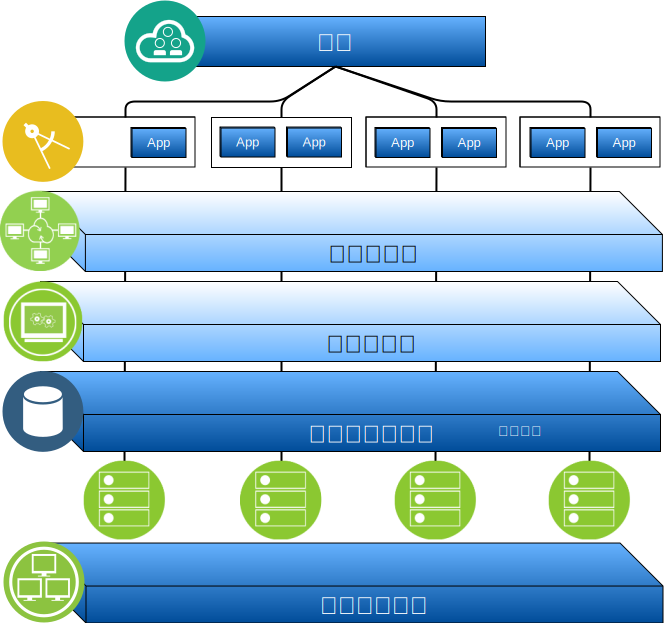

---

copyright:

  years:  2016, 2019

lastupdated: "2019-05-07"

subcollection: vmware-solutions

---

# IBM Cloud for VMware Solutions 概觀
{: #solution_overview}

{{site.data.keyword.vmwaresolutions_full}} 供應項目可讓您將現有 VMware 虛擬化資料中心擴充至 {{site.data.keyword.cloud_notm}} 或存放雲端原生應用程式。

此解決方案支援將容量擴充至雲端（並在不需要時縮減）、移轉至雲端、災難回復至雲端以及備份至雲端這類使用案例。使用此解決方案，您可以針對開發、測試、訓練、實驗室或正式作業建立專用雲端環境。

請檢閱此資訊，以瞭解 {{site.data.keyword.vmwaresolutions_short}} vCenter Server 的設計，而其目標工作負載需要高階的可用性及可調整性。

此設計作為基準線架構，用於提供要針對特定使用案例新增之其他內部或供應商特定元件的基礎。

## IBM Cloud for VMware Solutions 的重要好處
{: #solution_overview-benefits}

VMware vCenter Server on {{site.data.keyword.cloud_notm}} 提供基礎構成要素，包括 VMware vSphere、vCenter Server、NSX 及共用儲存空間選項（例如 vSAN）。需要有這些元件，才能彈性設計最適合您工作負載的 VMware 軟體定義資料中心解決方案。

藉由套用進階自動化及單一承租戶裸機基礎架構，您可以在幾個小時內快速將整個 VMware 環境部署至 {{site.data.keyword.cloud_notm}}。然後，您可以透過原生 VMware 用戶端、「指令行介面 (CLI)」、現有 Script 或其他熟悉的 vSphere API 相容工具，來存取及管理 IBM 代管環境。

在部署後，可以新增至實例的 ESXi 伺服器（以及從中移除）、新增及移除叢集、將其他 vCenter Server 實例加入現有實例，以及使用 {{site.data.keyword.vmwaresolutions_short}} 主控台來新增產品及服務。您必須負責監視及管理 vCenter Server 實例。

您的責任包括備份、修補、配置及監視 VMware 軟體，以及基礎 Hypervisor 硬體。{{site.data.keyword.vmwaresolutions_short}} 提供自動化解決方案來協助持續管理及監視 vCenter Server 實例。

此外，{{site.data.keyword.cloud_notm}} Professional Services 及 Managed Services 也可以藉由像是移轉、實作及上線服務的供應項目，協助您加速邁向雲端。

與受管理服務供應項目不同，vCenter Server 可讓您完全存取所有元件，因此其容許的彈性超過受管理服務可能提供的彈性。不過，在部署 vCenter Server 後，需要套用一些特定限制，才能容許 IBM Cloud for VMware Solutions 自動化運作。

VMware on {{site.data.keyword.cloud_notm}} 供應項目具有下列優點：

* **加速交付**開發人員及事業單位的 IT 專案，方法是將採購、架構、實作及部署資源所需的時間從數週甚至數個月減少為幾個小時。
* **加強安全**，利用受管理專用雲端中的專用「裸機伺服器」（包括靜態資料加密）。若為 vSAN 儲存空間，靜態資料加密可選擇使用 vSAN 或 vSphere 加密。若為共用檔案層次或區塊儲存空間，依預設可在精選資料中心使用服務提供者管理的靜態加密，或可以選擇使用 vSphere 加密。您必須管理必要的加密金鑰。
* **啟用一致管理及控管**已部署的混合式雲端，方法是提供虛擬化管理的完整管理存取權，進而保留您現有的 VMware 工具、Script 及訓練投資。
* **使用全球規模的 VMware 專門知識**，搭配遍佈全球 30 個以上 {{site.data.keyword.CloudDataCents_notm}} 的 IBM Professional and Managed Services。

## 相關鏈結
{: #solution_overview-related}

* [設計概觀](/docs/services/vmwaresolutions/archiref/solution?topic=vmware-solutions-design_overview)
* [調整容量](/docs/services/vmwaresolutions/archiref/solution?topic=vmware-solutions-solution_scaling)
* [備份元件](/docs/services/vmwaresolutions/archiref/solution?topic=vmware-solutions-solution_backingup)
