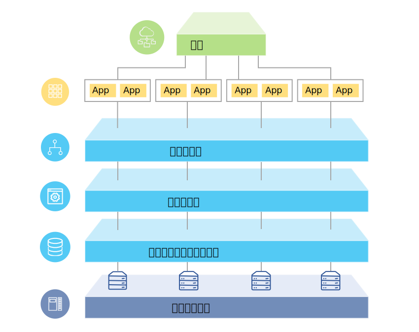

---

copyright:

  years:  2016, 2018

lastupdated: "2018-08-14"

---

# 解決方案概觀

{{site.data.keyword.vmwaresolutions_full}} 供應項目可讓您將現有 VMware 虛擬化資料中心擴充至 {{site.data.keyword.cloud_notm}} 或存放雲端原生應用程式。

此解決方案支援將容量擴充至雲端（並在不需要時縮減）、移轉至雲端、災難回復至雲端以及備份至雲端這類使用案例。使用此解決方案，您可以針對開發、測試、訓練、實驗室或正式作業建立專用雲端環境。

請檢閱此資訊，以瞭解 {{site.data.keyword.vmwaresolutions_short}} 供應項目（包括 VMware Cloud Foundation 及 VMware vCenter Server）的設計，而其目標工作負載需要高層次的可用性及可調整性。

此設計作為基準線架構，用於提供要針對特定使用案例新增之其他內部或供應商特定元件的基礎。

## VMware on IBM Cloud 概觀

圖 1. VMware on {{site.data.keyword.cloud_notm}} 概觀

## 主要優點

VMware Cloud Foundation 及 vCenter Server on {{site.data.keyword.cloud_notm}} 提供基本構成要素，包括 VMware vSphere、vCenter Server、NSX 及共用儲存空間選項（包括 vSAN)。需要有這些元件，才能彈性架構最適合您工作負載的 VMware 軟體定義資料中心解決方案。 

藉由套用進階自動化及單一承租戶裸機基礎架構，您可以在幾個小時內快速將整個 VMware 環境部署至 {{site.data.keyword.cloud_notm}}。然後，您可以透過原生 VMware 用戶端、「指令行介面 (CLI)」、現有 Script 或其他熟悉的 vSphere API 相容工具，來存取及管理 IBM 代管環境。

部署後，您可以新增 ESXi 主機節點，並管理某些管理元件的備份及修補。同時提供 {{site.data.keyword.cloud_notm}} 專業及受管理服務，協助您透過移轉、實作及上線服務這類供應項目來加速移到雲端。

VMware on {{site.data.keyword.cloud_notm}} 供應項目具有下列優點：

* **加速交付**開發人員及事業單位的 IT 專案，方法是將採購、架構、實作及部署資源所需的時間從數週甚至數個月減少為幾個小時。
* **加強安全**，利用受管理專用雲端中的專用 Bare Metal Server（包括靜止中資料加密）。
* **啟用一致管理及控管**已部署的混合式雲端，方法是提供虛擬化管理的完整管理存取權，進而保留您現有的 VMware 工具、Script 及訓練投資。
* **運用全球規模的 VMware 專門知識**，利用跨全球 30+ {{site.data.keyword.CloudDataCents_notm}} 的 IBM Professional and Managed Services。

### 相關鏈結

* [設計概觀](design_overview.html)
* [調整容量](solution_scaling.html)
* [備份元件](solution_backingup.html)
