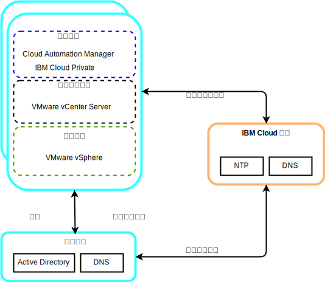

---

copyright:

  years:  2016, 2019

lastupdated: "2019-01-23"

---

# VMware 和 Skate Advisor 概念車的共用服務元件

共用服務提供雲端管理平台中其他服務所使用的服務。共用服務包括身分及存取服務、網域名稱服務及 NTP 服務。

圖 1. {{site.data.keyword.icpfull_notm}} 共用服務

## 身分及存取服務

在 VMware vCenter Server on {{site.data.keyword.cloud_notm}} 自動化過程中，採用 Microsoft Active Directory (AD) 來進行身分管理。已部署單一 AD 虛擬伺服器實例 (VSI)。vCenter 配置為使用 AD 鑑別，而且您也可以配置 {{site.data.keyword.icpfull_notm}} 進行「LDAP 鑑別」。

## 網域名稱服務

此部署會將已部署的 AD VSI 用作實例的「網域名稱系統 (DNS)」伺服器。所有已部署的元件都會配置成指向 AD，以作為其預設 DNS。已部署的元件範例包括 vCenter、PSC、NSX 及 ESXi 主機。

## 網路時間通訊協定服務

vCenter Server 部署使用 {{site.data.keyword.cloud_notm}} 基礎架構「網路時間通訊協定 (NTP)」伺服器。所有已部署的元件都已配置成使用這些 NTP 伺服器。為了讓憑證和 AD 鑑別正常運作，使所有元件都使用相同的 NTP 伺服器十分重要。

### 相關鏈結

* [vCenter Server on {{site.data.keyword.cloud_notm}} with Hybridity Bundle 概觀](/docs/services/vmwaresolutions/archiref/vcs/vcs-hybridity-intro.html)
