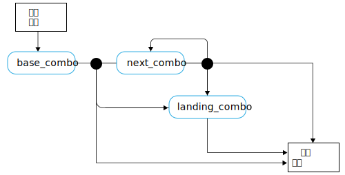

---

copyright:

  years:  2016, 2019

lastupdated: "2019-05-07"

subcollection: vmware-solutions


---

# 滑板運動語言概念
{: #vcscar-concepts}

## 滑板玩家語言
{: #vcscar-concepts-skater}

Skate Advisor 的主要層面是與 Watson 驅動之聊天機器人間的可能交談。下節詳述定義與 Skate Advisor 聊天機器人之人機互動的交談式規則。

「滑板玩家語言」是系統的核心，並以下列方式使用：
* 技巧辨識：Watson Discovery 用來汲取來自線上來源的資料，以辨識現有的技巧並對映至來源資料。
* 滑板交談：聊天機器人用來與系統使用者進行有意義的交談。
* 技巧分類：根據技巧的文字說明來儲存及分類技巧。以此方式分類的技巧可以附加 meta 資料，例如位置及視訊參照。

## 語言元素
{: #vcscar-concepts-lang-elem}

### 核心元素
{: #vcscar-concepts-core-elem}

下列是建構「技巧」的核心語言元素。

表 1. 核心語言元素

元素類型 | 語言文字
---|---|---
方向 | 正腳倒滑<br>反豚跳<br>反腳正滑
旋轉 | 反豚跳正面轉180度<br>反豚跳正面轉<br>180<br>360<br>540
 基本 | 腳尖翻板<br>腳跟翻板<br>板子側翻加直翻<br>大轉<br>倒板<br>不可能
落地 | 滑後輪（後 2 輪）<br>滑前輪（前 2 輪）<br>5-0（輪架卡竿）<br>前橋滑行<br>滑板尾<br>滑板頭<br>歪滑行<br>斯密斯滑行<br>騎肋<br>坡道上沿騎肋<br>

### 元素修飾元
{: #vcscar-concepts-elem-modifiers}

元素修飾元是特殊語言元素，可將環境定義提供給語言的特定層面。

表 2. 語言修飾元

元素類型 | 語言文字 |注意事項
---|---|---
轉動字首| 正面<br>背面 | 與轉動方向相關的「轉動字首」
倒板 | 向內<br>向外 |

## 語言規則
{: #vcscar-concepts-lang-rules}

下列規則集建構該語言。技巧劃分為一個以上的元素組合，稱為「組合」。除非另有指定，否則第一個「組合」與該場景中的下列「組合」之間有其差異，而且方向假設與基礎「組合」相同。

對於下列規則，請參閱「核心元素」和「元素修飾元」，作為使用它們來建構語言的參照。

### 技巧規則集
{: #vcscar-concepts-trick-ruleset}

```
base_combo = 'direction \+ \[varial | turn_prefix\] \+ \[rotation\] \+ \[base_trick\]'
next_combo = ''\[varial | turn_prefix\] \+ \[rotation\] \+ \[base_trick\]'
landing_combo = ''\[varial | turn_prefix\] \+ landing'
trick = 'combo \+ \[“to” + combo\] \+ \[“to” \+ landing_combo\]'
```

### 技巧規則引擎
{: #vcscar-concepts-trick-rule-engine}

下圖是規則引擎的視覺化摘要。



## 範例技巧語言
{: #vcscar-concepts-sample-trick}

下列範例是範例技巧清單：

```
fakie-kickflip
fakie-kickflip to fakie-5-0 to fronside-halfcab (out)
fakie-heeflip
fakie-heeflip to fakie-maual to fakie-hardflip
fakie-inward (varial) heeflip to fakie-backside tailslide to fakie
switch-heeflip to fakie-maual to fakie-hardflip
switch-hardflip to fakie-manual
fakie-hardflp to fakie-nosegrind
nollie-hardflip-to-tailslide
nollie-inward-heelflip to frontside noseslide
kickflip-frontside to crooked grind
halfcab-heelflip to crooked grind
frontside-shuvit to nosegrind to nollie-flip (out)
kickflip to nosegrind to nollie-impossilbe (out)
nollie-kickflip to noseslide to nollieflip
nollie-kickflip to frontside-lipslide
nollie-impossible to manual
nollie-impossible to 5-0
nollie-kickflip to crooked grind
nollie-kickflip to crooked grind to nollie-halfcab-kickflip (out)
frontside-nollie-halfcab-heelflip to fakie-nosegrind
backside-nollie-halfcab-kickflip to backside-tailslide to backside-180-out
frontside-nollie-cab-kicflip halfcab to backside-smithgrind
halfcab to backside-smithgrind to backside-180-bigspin (out)
kickflip-backside-tailslide to backside-180-kickflip
kickflip-backside-tailslide to backside-backside-bigspin
360-kicflip to nosemanual to nollie-360-kickflip
360-kicflip to frontside-lipslide
harflip to backside-lipslide
kicflip to frontside-boardslidev
nollie-heelflip to frontside-boardslide
```

## 相關性
{: #vcscar-concepts-relevance}

「技巧語言」是主要建構，用來訓練 Watson 辨識及汲取滑板運動文件和媒體，也可以形成與使用者的交談基準。

## 相關鏈結
{: #vcscar-concepts-related}

* [vCenter Server on {{site.data.keyword.cloud}} with Hybridity Bundle 概觀](/docs/services/vmwaresolutions/archiref/vcs?topic=vmware-solutions-vcs-hybridity-intro)  
