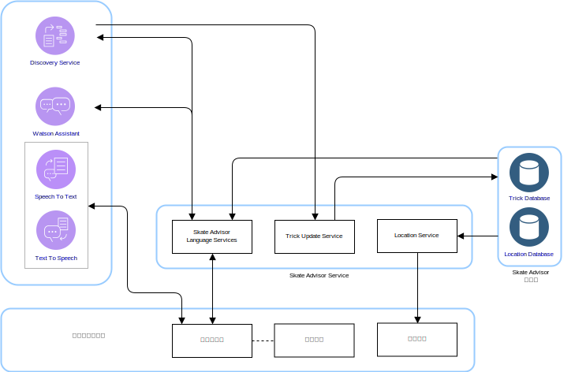

---

copyright:

  years:  2016, 2019

lastupdated: "2019-02-15"

---

# Skate Advisor 邏輯設計
{: #vcscar-logical}

下列資訊詳述構成系統邏輯設計的應用程式元素。

## 系統元件
{: #vcscar-logical-sys-comp}

圖 1. Skate Advisor 元件

Skate Advisor 主要包含可接受文字或語音辨識以透過結構化方式與系統互動的聊天機器人。

## 技巧
{: #vcscar-logical-tricks}

Skate Advisor 的核心資料元素就是技巧。此技巧語言可唯一定義技巧。此語言可以用來完成下列作業：
- 與聊天機器人進行有關技巧的交談。
- 透過 Watson Discovery 搜尋技巧。
- 從來源文章訓練 Watson Discovery 時，識別及分類技巧。
- 基於位置及媒體顯示目的，識別技巧。

### 技巧定義
{: #vcscar-logical-trick-def}

技巧是透過說明它的語言建構來唯一定義。如需完整定義，請參閱「追蹤規則引擎」。

### 技巧清單
{: #vcscar-logical-list-tricks}

技巧清單是透過語言元素中所定義之「基礎技巧」或「落地」的查詢所傳回。

### 技巧資料
{: #vcscar-logical-trick-data}

技巧在傳回之後可以具有下列資訊：
- 技巧說明
- 一個以上的媒體構件
- 位置資訊

## 交談式串流
{: #vcscar-logical-conv-streams}

聊天機器人具有預先定義且有限數目的可能交談。這些交談是由下列資訊所定義：
- 技巧發現項目：根據代表「基礎技巧」或「落地」的查詢參數，來尋找一組有效的技巧。
- 位置發現項目：尋找附近位置的技巧。
- 媒體顯示：顯示媒體項目，例如已從中分類及找到技巧的線上視訊。

表 1. 交談

交談 | 結構 | 結果
---|---|---
技巧發現項目 | 說明技巧 | 技巧清單
位置發現項目 | 我應該在哪裡執行此技巧？| 特定技巧的位置清單
媒體顯示 | 顯示技巧視訊 | 媒體結果清單

## 使用者介面元件
{: #vcscar-logical-ui-comp}

### 聊天機器人
{: #vcscar-logical-chatbot}

聊天機器人是與使用者交談的 Web 元件。聊天機器人可以接受文字或語音。清單這類結果會以文字呈現，並且可能隨附語音來代表結果。

聊天機器人以下列方式與系統互動：

圖 2. 一般聊天機器人查詢

表 2. 聊天機器人互動

步驟 |說明       
---|---
1 | 起始有效的交談，請參閱有關「交談串流」的小節。
2 | 聊天機器人會將語音傳送至 Speech to Text 服務。
3 | Speech to Text 服務會將文字傳送至聊天機器人。
4 | 聊天機器人會將「文字查詢」傳送至 Skate Advisor。
5 | Skate Advisor 會評估要求，並傳送至 Watson Assistant。
6 | Watson Assistant 會分類要求，並以要採取的動作回覆 Skate Advisor。
7 | Skate Advisor 會從 Discovery Service 要求資料集。
8 | Discovery Service 會評估查詢，並傳送回應。
9 | Skate Advisor 會形成回應，並以文字形式傳送至聊天機器人。
10 | 聊天機器人會將文字回覆傳送至 Text To Speech 服務。
11 | 結果會透過聊天機器人傳送給使用者。

### 視訊呈現
{: #vcscar-logical-video-render}

視訊呈現元件會播放視訊或顯示文件。這些構件代表從中探索到技巧的來源構件。

視訊呈現元件是 Web 介面中用來顯示視訊的內嵌小組件。從系統使用者查詢之後，會在聊天機器人中顯示視訊。產生的視訊鏈結在選取之後會觸發視訊呈現。

### 位置介面
{: #vcscar-logical-location-interface}

Skate Advisor 包括一個介面，供系統使用者記錄特定技巧的位置。Web 介面元件具有兩個主要元素：
1. 接受系統使用者的位置作為執行特定技巧的最佳位置。
2. 顯示建議用於特定技巧的一個以上位置。

## Watson 元件
{: #vcscar-logical-watson-comp}

此架構包括下列 Watson 元件。
* Knowledge Studio - Watson Studio 是一種工具，可用來設計系統的「滑板運動語言」，並使用此語言從實作「滑板運動語言」的 Web 中辨識文件。Knowledge Studio 提供一個模型供 Watson Discovery 使用。
* Speech to Text - 將語音轉錄為文字。此元件可接受來自正在執行聊天機器人之裝置的音訊，並將其轉換為文字，供 Watson 處理。
* Text to Speech - 將文字合成為語音。此元件接受來自 Skate Advisor 應用程式的文字，並將其轉換為語音，供正在執行聊天機器人的裝置播放。
* Discovery Service - 系統使用 Watson Discovery Service 來擷取符合所要求參數的「滑板運動」相關內容。範例可能是「列出 Casper 技巧的所有記錄」。Watson Discovery 使用進階機器學習技術顯現來自所汲取內容的最相關通道。
* Watson Assistant - Watson Assistant 是一種工具，可設計使用者與機器（聊天機器人）之間的互動。它必須採用領域特定語言（例如滑板運動）來進行訓練，並使用 Assistant 用來辨識及建置適當回應的一系列文法。

## Skate Advisor Service
{: #vcscar-logical-skate-advisor-services}

Skate Advisor Service 是一個應用程式元件，提供一組 API 服務來呈現要求。所公開的服務具有與先前所說明之交談式串流的直接相關性。所公開的 API 具有下列一般種類：
* get_tricks - 根據向 Discovery Service 呈現之自然語言中的 <query\>，來傳回技巧清單。
* show_tricks - 傳回特定技巧的媒體清單。
* find_trick - 傳回特定技巧。
* accept_command - 接受來自聊天機器人的文字指令，並處理該要求。

## Discovery Service 訓練
{: #vcscar-logical-disc-service-training}

Watson Discovery 必須透過機器學習模型來進行訓練，而此模型由主題專家使用 Watson Knowledge Studio 以反覆運算方式所建立。

圖 3. Discovery Service 訓練

對於 Skate Advisor，此模型包含實體類型與規則型訓練及字典型訓練組合之間的關係來建立模型。此模型可讓 Discovery Service 辨識及分類技巧，這些技巧是從用來作為訓練集的文章及視訊說明中所汲取。

訓練之後，Discovery Service 可以回應查詢，例如：
- 顯示所有技巧與腳跟翻板基礎技巧。
- 顯示所有技巧。
- 顯示所有技巧與多個組合。

## 相關鏈結
{: #vcscar-logical-related}

* [vCenter Server on {{site.data.keyword.cloud}} with Hybridity Bundle 概觀](/docs/services/vmwaresolutions/archiref/vcs?topic=vmware-solutions-vcs-hybridity-intro)
