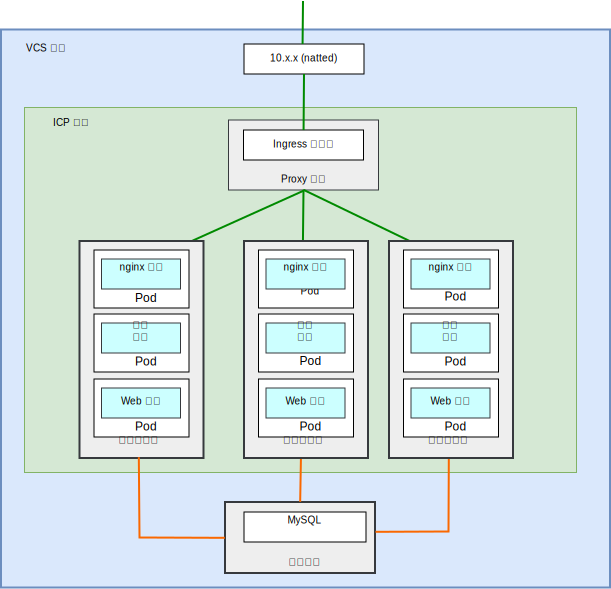
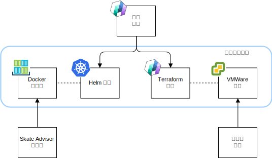
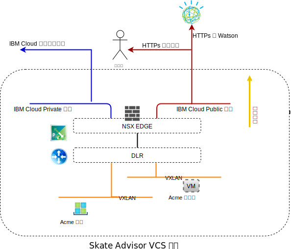

---

copyright:

  years:  2016, 2019

lastupdated: "2019-08-05"

subcollection: vmware-solutions

---

# Skate Advisor 元件
{: #vcscar-physical}

{{site.data.keyword.vmwaresolutions_full}} 提供自動化，以在全球的 {{site.data.keyword.CloudDataCents_notm}} 中部署 VMware 技術元件。架構由單一雲端地區組成，可支援延伸至位於下列其中一個選項的其他雲端地區：

1. 另一個地理位置。
2. 相同資料中心內的另一個 {{site.data.keyword.cloud_notm}} Pod。
3. 另一個地理位置及相同資料中心內的另一個 {{site.data.keyword.cloud_notm}} Pod。

{{site.data.keyword.icpfull_notm}} 及 Cloud Automation Manager (CAM) 產品可以手動部署至內部部署的虛擬化平台，因而能夠從內部部署位置進行雲端管理。或者，{{site.data.keyword.icpfull_notm}} 及 CAM 也可以當作服務延伸提供給現有或新的 VMware vCenter Server on {{site.data.keyword.cloud_notm}} 部署，透過自動化功能，從 {{site.data.keyword.cloud_notm}} 進行雲端管理。

{{site.data.keyword.icpfull_notm}} 是一個應用程式平台，用於開發及管理內部部署容器化應用程式。它是用來管理容器的整合環境，其中包括容器編排程式 Kubernetes、專用映像檔儲存庫、管理主控台和監視架構。

IBM Multi-Cluster Manager 提供使用者可見性、以應用程式為中心的管理（原則、部署、性能、作業），以及雲端與叢集之間的原則型法規遵循。透過 IBM Multi-Cluster Manager，您可以控制 Kubernetes 叢集。您可以確保叢集安全、有效率地運作，並且提供應用程式所預期的服務水準。

{{site.data.keyword.cloud_notm}} Automation Manager 是在 {{site.data.keyword.cloud_notm}} Private 上執行的多重雲端自助式管理平台，讓開發人員與管理者能夠滿足商業需求。Cloud Automation Manager 服務編製器可讓您在 {{site.data.keyword.icpfull_notm}} 型錄中公開混合式雲端服務。

## Skate Advisor 實體元件
{: #vcscar-physical-skate-comp}

下圖說明應用程式現代化基礎架構實作中 ACME Skate Advisor 應用程式的參照實作。

{: caption="圖 1. Skate Advisor 實體元件" caption-side="bottom"}

Skate Advisor 應用程式使用與 Watson 互動的微服務型元件以及 nginx 容器來延伸現有的 Acme Web 應用程式，以對 Web 及微服務容器的要求進行 Proxy 處理。

Skate Advisor 應用程式利用應用程式現代化平台來提供必要的管理基礎架構。

### 應用程式包裝及部署
{: #vcscar-physical-app-pack-depl}

應用程式部署為「CAM 編排」，其包含下列元素：
* 服務編排 - CAM 服務編排是一種工作流程資源，可說明要部署為服務資料類型的 Terraform 範本及 Helm 圖表。可以發佈服務，而且服務是可從中編排整個部署的控制構件。
* Helm 圖表 - Helm 圖表位於本端「{{site.data.keyword.icpfull_notm}} 儲存庫」中，並將容器及其他資源部署至 {{site.data.keyword.icpfull_notm}}。Helm 圖表是包括下列項目之 Kubernetes 資源的說明：
  - 容器部署
  - 服務
  - Ingress
  - 規則
  - 端點

* Docker 映像檔 - Docker 映像檔包含作業系統 (ubuntu)、中介軟體（WebSphere Liberty、nginx）以及 Skate Advisor 和 Skate Store 程式碼。Docker 映像檔是部署至執行中容器的靜態物件。
* Terraform 範本 - Terraform 範本是說明要部署之雲端資源的檔案。對於 Skate Advisor，會說明與 mysql 及資料庫綱目一起預先安裝的 Ubuntu 範本。
* VMWare 範本 - VMWare 範本是已預先安裝 mysql 及資料庫綱目的 Ubuntu 範本。

{: caption="圖 2. CAM 編排" caption-side="bottom"}

### 負載平衡與 Proxy 處理
{: #vcscar-physical-load-balance-proxy}

負載平衡與 Proxy 處理是透過 {{site.data.keyword.icpfull_notm}} Ingress Controller 元件所實作。此元件以無縫方式處理容器調整及失效接手。

應用程式 Proxy 處理是由以下列方式負載平衡的 nginx 容器所提供。

表 1. Skate Advisor 反向 Proxy 規則

URL	|端點
---|---
/acme	|Acme Web Container Service
/acme/api	|Skate Advisor Service
/acme/api/explorer	|Skate Advisor Service

容器具有可能依系統需求橫向縮減及橫向擴充的無法預期 IP 位址。為了克服此問題，請使用 {{site.data.keyword.icpfull_notm}} 服務，在系統內執行即時 IP 位址解析。

### Acme Skate Web 應用程式
{: #vcscar-physical-acme-skate-web-app}

Acme Skate Web 應用程式是以 Spring Framework 為基礎的 Java Platform Enterprise Edition 應用程式。此應用程式部署在 WebSphere Liberty 容器上。

### ACME Skate Advisor 應用程式
{: #vcscar-physical-acme-skate-advisor-app}

ACME Skate Advisor 應用程式是部署在 WebSphere Liberty 容器上的微服務型應用程式。nginx Web 伺服器提供微服務的前端。

### Acme Skate 資料庫
{: #vcscar-physical-acme-skate-db}

Acme Skate 資料庫是部署在 vSphere 受管理虛擬機器上的 MySQL 資料庫。

### 通訊概觀
{: #vcscar-physical-comm-overview}

Skate Advisor 需要下列通訊：
-	從 Web 容器到系統使用者。
-	從 Advisor 及 Web 容器到 Watson 服務。
-	在實作的容器與虛擬機器層面之間。

應用程式現代化平台已設計提供下列元件，來

{: caption="圖 3. 公用網路存取" caption-side="bottom"}

{{site.data.keyword.cloud_notm}} 有兩個網路。公用網路容許從網際網路連接伺服器，而專用網路容許伺服器透過高速骨幹在所有 {{site.data.keyword.CloudDataCents_notm}} 中彼此通訊。

「虛擬遞送應用裝置 (VRA)」可讓客戶透過將 VLAN 與應用裝置相關聯，以遞送專用及公用網路資料流量。vCenter Server NSX Edge 及 {{site.data.keyword.containerlong_notm}} 基礎架構都已配置公用網路的預設路徑，以及專用網路的標準 10.0.0.0/8 路徑。

針對已定義任何 NSX VXLAN 的 VRA 應用裝置，{{site.data.keyword.containerlong_notm}} 基礎架構需要靜態路徑。透過 NSX Edge，我們使用 VRA 透過專用網路配置 BGP 對等作業，以啟用 NSX VXLAN 的路徑公告及插播。此對等作業容許 NSX VXLAN 層疊網路與 {{site.data.keyword.cloud_notm}} 骨幹通訊，反之亦然。

### 軟體元件對映
{: #vcscar-physical-soft-comp-mapping}

Skate Advisor 應用程式使用下列軟體元件。

{: caption="圖 4. Skate Advisor 軟體對映" caption-side="bottom"}

會使用下列軟體元件：

* nginx	- 將反向 Proxy 服務提供給應用程式。微服務及應用程式要求會分佈至正確的容器端點。
* WebSphere Liberty - 管理 Acme 應用程式，這是 Spring 型 Java Platform Enterprise Edition 應用程式。
* Node.js - 將微服務架構提供給聊天機器人。此應用程式使用來自 Watson 的服務。
* mysql - 此應用程式資料庫由 Oracle Mysql 所提供。
* JavaScript - 聊天機器人是在用戶端「瀏覽器」中管理的 JavaScript 型應用程式。聊天機器人透過 Node.js 型微服務與 Watson 通訊。

## 管理概觀
{: #vcscar-physical-mgmt-ovw}

Acme Skate Advisor 位於 {{site.data.keyword.cloud_notm}}，因此是「架構」的重要層面。{{site.data.keyword.cloud_notm}} 具有下列架構。

{: caption="圖 5. 雲端管理" caption-side="bottom"}

此圖代表 vCenter Server 實例上所部署的 {{site.data.keyword.icpfull_notm}} 及 CAM，以及與內部部署 vCenter 及 {{site.data.keyword.containerlong_notm}} 服務的連線。使用 CAM，系統管理者及開發人員可以將虛擬機器部署至內部部署或 vCenter Server 實例，以及將容器部署至 {{site.data.keyword.icpfull_notm}} 及 {{site.data.keyword.containerlong_notm}} 叢集。

在圖表中，CAM 邏輯地建立與 vCenter、雲端提供者以及 {{site.data.keyword.icpfull_notm}} 和 {{site.data.keyword.containerlong_notm}} 環境的雲端連線。「{{site.data.keyword.icpfull_notm}} 叢集」部署至每個資料中心或雲端環境，並由 MCM 提供將 {{site.data.keyword.icpfull_notm}} 叢集連接至單一管理視圖的機制。
